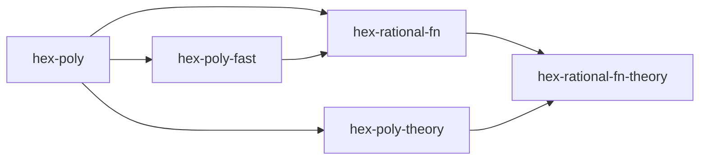

# Libraries

- **hex-basic**: small Mathlib-free standard-library shims, including kernel-reducible array and vector operations
- **hex-arith**: extended GCD, Barrett/Montgomery reduction, binomial coefficients, Fermat's little theorem
- **hex-primality**: Miller-Rabin compositeness witnesses, Pocklington certificates, a kernel-reducible sieve and stored initial segment, the `primality` tactic
- **[hex-ecpp](../../HexECPP/SPEC/hex-ecpp.md)** (active): elliptic-curve primality certificate checking with affine inverse witnesses and supplied-certificate conversion
- **hex-int-factor**: integer factorization with complete prime-exponent certificates, the divisor-function API, multiplicative order and primitive roots
- **hex-poly**: dense `Array`-backed polynomial representation
- **hex-rational-fn**: canonical univariate rational functions, field arithmetic, partial evaluation, formal differentiation and normalization certificates
- **[hex-ordered-fn](hex-ordered-fn.md)**: user-supplied real-constant and infinitesimal orders on rational functions, with conditional total field adapters
- **hex-sparse-poly**: canonical sparse univariate polynomials as a sorted exponent/coefficient term array, with explicit conversions to and from the dense representation
- **hex-mv-poly**: canonical distributed multivariate polynomials at fixed arity with explicit monomial orders
- **hex-reflect**: shared `Lean.Meta.Sym.Arith` sessions, batch variable sealing, direct `Hex.MvPoly` conversion, provider results, conditions and budgets
- **hex-kronecker**: deterministic kernel-checked polynomial identities by Kronecker substitution, for expression trees, term lists and polynomial-matrix products
- **hex-mv-gcd**: multivariate gcd with cofactors, content and primitive part, exact division, squarefree decomposition
- **hex-mv-hensel**: multivariate Hensel lifting against an evaluation ideal, with the coprimality witness, leading-coefficient contract, and reconstruction that Wang's EEZ factorization needs
- **hex-mv-factor**: factorization of `Z[x_1, ..., x_n]` by Wang's EEZ algorithm, with a checked product decomposition and a separate irreducibility certificate
- **hex-truncated-series**: power series truncated at a precision fixed in the type, with Newton inversion, square root, `exp`, `log`, composition, and reversion
- **hex-poly-fast**: explicit lawful multiplication plans, Karatsuba and clipped products, Newton division, half-gcd, multipoint evaluation/interpolation, and Padé approximation
- **hex-matrix**: dense matrices, matrix/vector arithmetic, elementary row and column operations, submatrix slicing, the Gram matrix
- **hex-row-reduce**: row reduction (RREF), rank, span, nullspace
- **hex-determinant**: the Leibniz determinant and its cofactor/Cauchy-Binet/Plücker theory
- **hex-bareiss**: the fraction-free Bareiss determinant algorithm
- **hex-det**: production determinant dispatch with carrier policies, measured crossovers, and the completed algorithm reported for tactics
- **[hex-rank](../../HexRank/SPEC/hex-rank.md)**: matrix rank over any integral domain with a two-sided certificate (a nonsingular minor with its adjugate, and the identity expressing every column over the selected ones), the rectangular fraction-free producer, and the row and column rank profiles
- **hex-generic-rank**: the rank of a multivariate polynomial matrix over its fraction field, as hex-rank's certificate at `MvPoly`, with the fixture families and benches that make polynomial-entry rank a supported operation
- **hex-poly-det**: the determinant of a multivariate polynomial matrix, as hex-bareiss's polynomial determinant certificate instantiated at `MvPoly` with hex-mv-gcd's exact quotient
- **[hex-determinantal-ideal](../../HexDeterminantalIdeal/SPEC/hex-determinantal-ideal.md)**: executable minors and determinantal-ideal generators of a matrix over a commutative ring, and the theorem that the rank over a field is below `r` exactly when every `r × r` minor vanishes
- **hex-char-poly**: the characteristic polynomial by the division-free Samuelson-Berkowitz algorithm, over any commutative ring
- **matrix tactics** are not a library: `rank`, `det` and `char_poly` live with their algorithm libraries per [SPEC/matrix-tactics.md](../matrix-tactics.md)
- **hex-min-poly**: the matrix minimal polynomial over a field, from Krylov sequences, with a certificate proving annihilation and minimality
- **hex-hermite**: Hermite normal form over `Int`, unimodular transforms, integer lattice membership, integer kernel bases
- **hex-smith**: Smith normal form over `Int`, invariant factors, and the structure of a finitely generated abelian group
- **hex-poly-smith**: Smith normal form over `F[x]`, monic pivot normalization, unimodular transforms with inverses, and the structure of a finitely generated `F[x]`-module
- **hex-invariant-factors**: the ordered invariant factors of a square matrix from the polynomial Smith form of `xI - A`, including unit factors and the dimension-zero conventions
- **hex-gram-schmidt**: Gram-Schmidt orthogonalization, GS coefficients, Gram determinants, update formulas under row operations
- **hex-graph**: immutable finite simple directed and undirected graphs, checked construction, maps, subgraphs, traversal, and executable adjacency
- **hex-graph-iso**: nauty-compatible canonical forms, canonical labels, checked transporters, and positive and negative `graph_iso` proofs for finite ordered-coloured simple graphs
- **hex-perm-group** (planned): checked permutation groups, finite actions, complete subgroup search, block systems, normal and derived subgroups, ranking, and direct/wreath products
- **hex-mod-arith**: `ZMod64 p`, `UInt64`-backed arithmetic in `Z/pZ`
- **hex-modular**: integer CRT, rational reconstruction, symmetric representatives, and the modulus supply
- **hex-padics**: fixed-precision approximations to `Z_p` and `Q_p`, with the valuation reported as a bound when that is all the data supports, precision-aware arithmetic, partial inversion and division, and exactification by rational reconstruction
- **hex-modular-matrix**: multi-modular determinant, certified rank, and Dixon p-adic linear solving over `Q`
- **hex-finite-field**: the Mathlib-free `F_q` interface (characteristic, degree, Frobenius, indexing), the generic `q`-power Frobenius and Frobenius matrix
- **hex-poly-fp**: polynomials over `F_p`, Frobenius map, square-free decomposition, packed/NTT/CRT-NTT multiplication, lazy reduction for small p
- **hex-gf2**: packed bitwise polynomials over `F_2` (XOR + CLMUL), `GF(2^n)` elements
- **hex-poly-z**: polynomials over `Z`, content/primitive part, Mignotte bound, multipoint Kronecker and CRT-NTT multiplication
- **hex-poly-z-gcd**: modular gcd for `Z[x]` with cofactors, a coprimality witness, and exact division
- **hex-cyclotomic**: dense integer cyclotomic polynomials from a checked factorization of the index, the divisor family, and the factorization of `x^n - 1`
- **hex-roots**: certified complex root isolation for `Z[x]` via dyadic squares, Pellet tests, and speculative Newton iteration
- **hex-real-roots**: certified real root isolation for `Z[x]`: Sturm-count witnesses, a Descartes bisection search with a proven-complete Sturm fallback
- **[hex-sturm](hex-sturm.md)** (planned): ordered-field Sturm–Tarski queries, coefficient evidence and root counts
- **[hex-sign-det](hex-sign-det.md)** (planned): complete BKR sign tables, certified support reduction and Thom root descriptors
- **hex-interval**: exact open, closed, empty, and unbounded dyadic intervals; a shared expression program; and a budgeted scheduler for propagation, refinement, and subdivision
- **hex-interval-algebraic**: planned Mathlib-facing integration of interval facts with certified real and complex polynomial root isolation; `mathlib: true`
- **[hex-real-formula](hex-real-formula.md)** (planned): shared multivariate real-arithmetic syntax, semantics, and reification; companion specified in the same file
- **[hex-virtual-subst](hex-virtual-subst.md)** (planned): quadratic virtual substitution, exact QE and refutation certificates; theory companion and tactic specified in the same file
- **[hex-coverings](hex-coverings.md)** (planned): real-arithmetic satisfiability by cylindrical cell explanations and checked LRAT or covering refutations; Mathlib/Tau Ceti companion specified in the same file
- **hex-rcf**: the `rcf` tactic for Boolean combinations of univariate polynomial comparisons under one `∀`/`∃` over `ℝ`, with integer/rational coefficients; `mathlib: true`, soundness in the same library. The [planned optional coefficient extension](../../HexRCF/SPEC/hex-rcf.md#planned-real-coefficient-extension) adds fixed real algebraic embeddings and authenticated caller-supplied constants, with conditional completeness for constant towers
- **hex-resultant**: polynomial resultant and discriminant via the subresultant pseudo-remainder sequence
- **hex-number-field**: fixed fields `QAdjoin p x`, factorization-lazy `AlgebraicRoot`, canonical `AlgebraicNumber`, and roots of polynomials with algebraic coefficients
- **[hex-real-algebraic](hex-real-algebraic.md)**: the real subtype of canonical algebraic numbers, exact ordered-field arithmetic, real roots, rounding, and dyadic approximation
- **[hex-real-closure](hex-real-closure.md)** (planned): selected-root algebraic towers, dynamic splitting, complete real roots and shared samples
- **hex-number-field-tower**: successive number-field extensions, Trager factorization, adjoining roots, splitting fields, and primitive-element flattening
- **hex-berlekamp**: Berlekamp factoring, distinct-degree and equal-degree factorization (Cantor-Zassenhaus), and the Rabin irreducibility test over any `F_q`; the `factor_poly` / `irreducibility` tactic drivers (native `FpPoly p` arms plus extensions for other input types)
- **hex-hensel**: Hensel lifting from `mod p` to `mod p^k`
- **hex-lll**: LLL lattice basis reduction
- **hex-lattice-enum**: exact closed-ball enumeration, all shortest and closest vectors, and checked completeness certificates
- **hex-berlekamp-zassenhaus**: complete factoring of `Z[x]`; the `Hex.ZPoly` extension for `factor_poly` / `irreducibility`
- **hex-summation**: certificate-checked hypergeometric summation: Gosper, Zeilberger, and Petkovšek's Hyper, as untrusted searches whose certificates are verified by `MvPoly` identity checkers
- **hex-conway**: Conway polynomial database
- **hex-gfq-ring**: canonical quotient ring `F_p[x]/(f)` by a nonconstant modulus
- **hex-gfq-field**: field structure on top of `hex-gfq-ring` when `f` is irreducible
- **hex-gfq**: convenience wrapper, canonical `GFq p n` plus optimized `GF2q n` using Conway polynomials
- **hex-discrete-log** (planned): certified finite-field logarithms by baby-step giant-step, Pohlig-Hellman and bounded Pollard rho

**Theory companion libraries** (each depends on a computational library and
Mathlib, and supplies correspondence proofs or Mathlib-facing APIs):

- **hex-mod-arith-theory**: `ZMod64 p ≃+* ZMod p`
- **hex-modular-theory**: CRT agreement with `ZMod.chineseRemainder`, and the rational-reconstruction statements over `ℚ`
- **hex-padics-theory**: an approximation as a ball in `ℤ_[p]` or `ℚ_[p]`, the fibres of `PadicInt.toZModPow`, the valuation correspondence in `WithTop ℤ`, and the sharpness of each operation
- **hex-modular-matrix-theory**: Hadamard's inequality discharged, `det` = `Matrix.det`, rank = `Matrix.rank`, and the solve and kernel correspondences
- **hex-poly-z-gcd-theory**: gcd divisibility and maximality in `Polynomial ℤ`, and `Decidable (a ∣ b)`
- **hex-cyclotomic-theory**: agreement with `Polynomial.cyclotomic n ℤ`, the degree `Nat.totient n`, irreducibility over `ℤ` and `ℚ`, and the divisor product
- **hex-primality-theory**: `Hex.Nat.Prime ↔ Nat.Prime`, the explicit opt-in `norm_num` policy, and segment statements over `Finset.filter Nat.Prime`
- **[hex-ecpp-theory](../../HexECPPTheory/SPEC/hex-ecpp-theory.md)** (active): prime-field replay, Hasse-bound infrastructure, unconditional ECPP soundness, and explicit certificate elaboration
- **hex-int-factor-theory**: agreement with `Nat.factorization`, `Decidable (Squarefree n)`, and `orderOf` in `(ZMod n)ˣ`
- **hex-finite-field-theory**: `Fintype K` and `Fintype.card K = card K` for any `LawfulFiniteField`, and `frob = frobenius`
- **hex-poly-theory**: `DensePoly R ≃+* Polynomial R`
- **hex-rational-fn-theory**: equivalence with `RatFunc K`, canonical numerator/denominator agreement and partial-evaluation semantics
- **[hex-ordered-fn-theory](hex-ordered-fn-theory.md)**: real evaluation, Hahn-series infinitesimal semantics, arithmetic correspondence and total-order laws
- **hex-sparse-poly-theory**: `SparsePoly R ≃+* Polynomial R`, and the identification of the stored term array with `Polynomial.support`
- **hex-mv-poly-theory**: `MvPoly n R cmp ≃+* MvPolynomial (Fin n) R`, `aeval`, and operation correspondence
- **hex-reflect-theory**: Mathlib carrier translations and the `MvPolynomial` correspondence for reflected batches
- **hex-kronecker-theory**: bounded-box soundness and the `kronecker` tactic over any commutative ring
- **hex-mv-gcd-theory**: gcd maximality transported to `MvPolynomial (Fin n) R`, and decidable divisibility and squarefreeness
- **hex-mv-hensel-theory**: the evaluation ideal and its residue ring as Mathlib objects, the lifted identities transported to `MvPolynomial (Fin (n+1)) ℤ`, and the factor-coefficient bound
- **hex-mv-factor-theory**: discharge of the univariate irreducibility obligations, factorization correctness and uniqueness in `MvPolynomial (Fin n) ℤ`, and `Decidable (Irreducible p)`
- **hex-truncated-series-theory**: `TSeries R n ≃+* PowerSeries R ⧸ (X ^ n)`, and agreement with `PowerSeries.invOfUnit`, `subst`, `substInvOfIsUnit`, `exp`, and `logOf`
- **hex-matrix-theory**: matrix equivalence, row operations as transvections, and the Mathlib algebra tower transported onto our matrix type
- **hex-row-reduce-theory**: rank = `Matrix.rank`, nullspace = `LinearMap.ker`, span agreement
- **hex-determinant-theory**: `det` agreement with `Matrix.det`, plus the Plücker / Desnanot-Jacobi assembly
- **hex-bareiss-theory**: Bareiss determinant = `Matrix.det`, via the bordered-minor invariant
- **hex-det-theory**: determinant dispatch correctness and correspondence, including policy and fallback route laws
- **[hex-rank-theory](../../HexRankTheory/SPEC/hex-rank-theory.md)**: certificate soundness for `Matrix.rank` over any domain, rank invariance under `IsFractionRing` scalar extension, producer correctness, and the conversions to and from Mathlib's `Echelon.Decomposition`
- **hex-generic-rank-theory**: the symbolic arm of the `rank` tactic as a handler on hex-rank-theory's syntax kind, with its three outputs (generic rank, conditional rank under the certificate's nonvanishing condition, handoff to the rank locus) and their soundness
- **hex-poly-det-theory**: the symbolic arm of the `det` tactic as a handler on hex-bareiss-theory's syntax kind, over any commutative ring, with closed forms for small dimensions and an opt-in simproc
- **[hex-determinantal-ideal-theory](../../HexDeterminantalIdealTheory/SPEC/hex-determinantal-ideal-theory.md)**: minors as `Matrix.det` of a `submatrix`, the rank-versus-minors theorem for `Matrix.rank` under any ring homomorphism into a field, rank-drop loci as zero sets, and invariance of `I_r(A)` under invertible row and column operations
- **hex-char-poly-theory**: agreement with `Matrix.charpoly`, Cayley-Hamilton, the trace and determinant coefficients, transpose and similarity invariance
- **hex-min-poly-theory**: agreement with `minpoly`, the annihilator-generator statement for the vector order polynomial, divisibility into the characteristic polynomial, and the degree bound
- **hex-hermite-theory**: row lattice = `Submodule.span ℤ`, integer rank = `Matrix.rank`, and an executable basis of the kernel submodule
- **hex-smith-theory**: the executable output as `Module.Basis.SmithNormalForm`, the divisibility chain Mathlib's structure omits, and the quotient structure theorem
- **hex-poly-smith-theory**: the executable polynomial matrix over `Polynomial F`, `Module.Basis.SmithNormalForm` from the executable output, monic as Mathlib's `normalize`, and the quotient structure theorem
- **hex-invariant-factors-theory**: the characteristic-matrix module correspondence, product agreement with the independently computed characteristic polynomial, and largest-factor agreement with the independently computed minimal polynomial
- **hex-gram-schmidt-theory**: `GramSchmidt.Int.basis` = Mathlib's `gramSchmidt`
- **hex-poly-z-theory**: `DensePoly Int ≃+* Polynomial ℤ`, Mignotte bound (via Mathlib's Mahler measure)
- **hex-roots-theory**: Pellet's test on circles (built from `circleIntegral`), the Mahler separation bound, soundness of refinement and `ZPoly.isolateComplexRoots?`
- **hex-real-roots-theory**: Sturm's theorem (counting form over `Polynomial ℝ`), chain correspondence, soundness and completeness of `ZPoly.isolateRealRoots?`
- **[hex-sign-det-theory](hex-sign-det-theory.md)** (planned): exact sign-table replay, complete support and Thom root identity/order correspondence
- **hex-interval-theory**: real semantics, verified arithmetic and elementary-function propagators, certificate replay, and the `interval` tactic
- **hex-resultant-theory**: executable resultant agreement with `Polynomial.resultant`, specialization, root-product, and discriminant theorems
- **hex-number-field-theory**: fixed-field correspondence, exactification, lazy arithmetic, and algebraic-coefficient root completeness
- **[hex-real-algebraic-theory](hex-real-algebraic.md#companion-and-proof-inventory)**: ordered-field structure, the embedding into the algebraic reals, operation correspondence, and `IsRealClosed`
- **[hex-real-closure-theory](hex-real-closure-theory.md)** (planned): selected-root field semantics, splitting transport, complete roots, compatible algebraic union and finite-sign realization
- **hex-number-field-tower-theory**: tower embeddings, Trager correctness, splitting fields, and primitive-element equivalence
- **hex-poly-fp-theory**: `FpPoly p ≃+* Polynomial (ZMod p)`, and transport of coefficients, degree, leading coefficients, ring operations, coefficient-sum evaluation, composition, and divisibility
- **hex-berlekamp-theory**: `Decidable (Irreducible f)` for `Polynomial (ZMod p)`; the `Polynomial (ZMod p)` extension for `factor_poly` / `irreducibility`
- **hex-hensel-theory**: Hensel correctness, uniqueness, `coprime_mod_p_lifts`
- **hex-lll-theory**: lattice = `Submodule ℤ`, short vector bound
- **hex-lattice-enum-theory**: preparation, search and certificate correctness proofs, integer-span and Euclidean-distance correspondence, packing radius and kissing number
- **hex-gf2-theory**: `GF2Poly ≃+* FpPoly 2`, `GF2n`/`GF2nPoly ≃+* FiniteField 2 f hf hirr`, packed-field finiteness/cardinality
- **hex-gfq-theory**: finiteness/cardinality for quotient fields, and `GFq p n ≃+* GaloisField p n`
- **hex-discrete-log-theory** (planned): exact generator order, canonical logarithms and complete subgroup-membership decisions
- **hex-berlekamp-zassenhaus-theory**: unconditional factoring correctness, `Decidable (Irreducible f)` for `Polynomial ℤ`; the `Polynomial ℤ` and strong `Hex.ZPoly` extensions for `factor_poly` / `irreducibility`
- **hex-summation-theory**: `Finset.sum` semantics over characteristic-zero fields, the `Nat.choose` / `Nat.factorial` / `ascPochhammer` ratio kit, the summand recognizer, and the `gosper`, `zeilberger`, and `hyper` tactics
- **hex-graph-iso-theory**: correspondence with finite `SimpleGraph`, ordered-colour isomorphisms, and the `SimpleGraph` extension of `graph_iso`
- **hex-perm-group-theory** (planned): correspondence for permutation groups, finite actions, subgroup search, block systems, normal structure, sampling and products
- **[hex-real-formula-theory](hex-real-formula.md)** (planned): real semantics, formula normalization, and shared reification
- **[hex-virtual-subst-theory](hex-virtual-subst.md)** (planned): elimination-set and substitution proofs, certificate soundness, and the `virtual_subst` tactic

## Implementation dependencies

Each library with its immediate dependencies:

- **hex-basic**: (none)
- **hex-arith**: (none)
- **hex-primality**: hex-arith, hex-basic
- **hex-ecpp** (active): hex-primality, hex-arith
- **hex-int-factor**: hex-primality, hex-arith, hex-basic
- **hex-poly**: (none)
- **hex-rational-fn**: hex-poly, hex-poly-fast
- **hex-ordered-fn**: hex-rational-fn, hex-poly, hex-poly-fast
- **hex-ordered-fn-theory**: hex-ordered-fn, hex-rational-fn-theory, hex-poly-theory, Mathlib
- **hex-sparse-poly**: hex-poly, hex-basic
- **hex-mv-poly**: hex-poly, hex-basic
- **hex-reflect**: hex-mv-poly, hex-basic
- **hex-kronecker**: hex-mv-poly, hex-matrix
- **hex-mv-gcd**: hex-mv-poly, hex-poly, hex-poly-fp, hex-resultant, hex-arith, hex-mod-arith
- **hex-mv-hensel**: hex-mv-gcd, hex-mv-poly, hex-poly, hex-poly-z, hex-poly-fp, hex-mod-arith, hex-modular, hex-arith, hex-basic
- **hex-mv-factor**: hex-mv-hensel, hex-mv-gcd, hex-mv-poly, hex-berlekamp-zassenhaus, hex-poly, hex-poly-z, hex-poly-z-gcd, hex-poly-fp, hex-mod-arith, hex-modular, hex-arith, hex-basic
- **hex-truncated-series**: hex-basic
- **hex-poly-fast**: hex-poly, hex-truncated-series
- **hex-matrix**: hex-basic
- **hex-row-reduce**: hex-matrix
- **hex-determinant**: hex-matrix
- **hex-bareiss**: hex-determinant, hex-matrix
- **hex-det** (planned): hex-bareiss, hex-char-poly, hex-row-reduce, hex-poly-fp, hex-resultant, hex-mv-gcd (plus hex-modular-matrix when implemented)
- **hex-rank**: hex-bareiss, hex-determinant, hex-matrix, hex-arith, hex-basic
- **hex-generic-rank** (planned): hex-rank, hex-mv-gcd, hex-bareiss, hex-determinant, hex-matrix, hex-basic
- **hex-poly-det** (planned): hex-bareiss, hex-mv-gcd, hex-determinant, hex-matrix, hex-basic
- **hex-determinantal-ideal**: hex-basic, hex-arith, hex-matrix, hex-determinant, hex-row-reduce, hex-mv-poly
- **hex-char-poly**: hex-matrix, hex-poly
- **hex-min-poly**: hex-matrix, hex-row-reduce, hex-poly
- **hex-hermite**: hex-row-reduce, hex-arith, hex-determinant
- **hex-smith**: hex-hermite
- **hex-poly-smith**: hex-poly, hex-matrix, hex-determinant
- **hex-invariant-factors**: hex-poly-smith
- **hex-graph-iso**: hex-basic, hex-matrix (the `HexGraph` graph representation is folded into this library)
- **hex-perm-group** (planned): hex-basic
- **hex-mod-arith**: hex-arith
- **hex-modular**: hex-arith
- **hex-padics**: hex-arith, hex-modular, hex-primality, hex-basic
- **hex-modular-matrix**: hex-modular, hex-matrix, hex-row-reduce, hex-determinant, hex-bareiss, hex-mod-arith, hex-arith, hex-basic
- **hex-finite-field**: hex-arith, hex-mod-arith, hex-poly, hex-poly-fp, hex-matrix, hex-basic
- **hex-gram-schmidt**: hex-row-reduce, hex-determinant, hex-bareiss
- **hex-lll**: hex-gram-schmidt, hex-matrix, hex-basic
- **hex-lattice-enum**: hex-lll, hex-gram-schmidt, hex-matrix, hex-basic
- **hex-poly-fp**: hex-poly, hex-mod-arith, hex-poly-fast, hex-modular
- **hex-poly-z**: hex-poly, hex-arith, hex-basic, hex-poly-fast, hex-mod-arith, hex-modular
- **hex-poly-z-gcd**: hex-poly-z, hex-poly-fp, hex-poly, hex-modular, hex-mod-arith, hex-arith, hex-resultant
- **hex-cyclotomic**: hex-poly-z, hex-int-factor, hex-poly
- **hex-roots**: hex-poly-z
- **hex-real-roots**: hex-poly-z
- **hex-sturm** (planned): hex-poly, hex-real-roots
- **hex-sign-det** (planned): hex-sturm, hex-poly, hex-matrix, hex-row-reduce, hex-rank
- **hex-sign-det-theory** (planned): hex-sign-det, hex-sturm-theory, hex-poly-theory, hex-matrix-theory, hex-row-reduce-theory, hex-rank-theory; Tau Ceti foundations (mathlib: true)
- **hex-interval**: (none)
- **hex-interval-algebraic**: hex-interval-theory, hex-real-roots-theory, hex-roots-theory (mathlib: true)
- **hex-real-formula** (planned): hex-mv-poly
- **hex-virtual-subst** (planned): hex-real-formula, hex-mv-poly
- **hex-rcf**: hex-real-roots, hex-real-roots-theory, hex-poly-z, hex-poly-z-theory (mathlib: true); the planned shared formula adapter additionally depends on hex-real-formula-theory. The optional real-coefficient adapter also consumes hex-real-closure and its companion (with ordered-fn, sturm, sign-det and real-algebraic evidence transitively); these are planned implementation dependencies, not base imports
- **hex-resultant**: hex-poly
- **hex-number-field**: hex-poly-z, hex-roots, hex-resultant, hex-berlekamp-zassenhaus, hex-matrix, hex-row-reduce
- **hex-real-algebraic**: hex-number-field
- **hex-real-closure** (planned): hex-poly, hex-sturm, hex-sign-det, hex-ordered-fn, hex-real-algebraic
- **hex-real-closure-theory** (planned): hex-real-closure, hex-poly-theory, hex-sturm-theory, hex-sign-det-theory, hex-ordered-fn-theory, hex-real-algebraic-theory; Tau Ceti ordered real-closure existence (mathlib: true)
- **hex-number-field-tower**: hex-number-field, hex-resultant, hex-berlekamp-zassenhaus, hex-row-reduce
- **hex-berlekamp**: hex-poly-fp, hex-matrix, hex-row-reduce, hex-gfq-ring, hex-basic, hex-finite-field
- **hex-hensel**: hex-poly-fp, hex-poly-z, hex-basic
- **hex-conway**: hex-berlekamp
- **hex-gfq-ring**: hex-poly-fp
- **hex-gfq-field**: hex-gfq-ring, hex-berlekamp, hex-finite-field
- **hex-gfq**: hex-gfq-field, hex-conway, hex-gf2
- **hex-discrete-log** (planned): hex-basic, hex-gfq, hex-int-factor, hex-modular
- **hex-gf2**: hex-basic, hex-finite-field
- **hex-berlekamp-zassenhaus**: hex-berlekamp, hex-hensel, hex-lll
- **hex-summation**: hex-poly, hex-mv-poly, hex-resultant, hex-matrix, hex-row-reduce, hex-berlekamp-zassenhaus, hex-basic

Theory companion libraries (each also depends on Mathlib):

- **hex-real-formula-theory** (planned): hex-real-formula, hex-mv-poly-theory, hex-reflect-theory
- **hex-virtual-subst-theory** (planned): hex-virtual-subst, hex-real-formula-theory, hex-mv-poly-theory, hex-rcf
- **hex-mod-arith-theory**: hex-mod-arith
- **hex-modular-theory**: hex-modular, hex-mod-arith-theory
- **hex-padics-theory**: hex-padics, hex-primality-theory
- **hex-modular-matrix-theory**: hex-modular-matrix, hex-matrix-theory, hex-determinant-theory, hex-row-reduce-theory, hex-modular-theory
- **hex-primality-theory**: hex-primality
- **hex-ecpp-theory** (active): hex-ecpp, hex-primality-theory, Mathlib
- **hex-int-factor-theory**: hex-int-factor, hex-primality-theory
- **hex-finite-field-theory**: hex-finite-field, hex-mod-arith-theory, hex-poly-theory
- **hex-poly-theory**: hex-poly
- **hex-rational-fn-theory**: hex-rational-fn, hex-poly-theory
- **hex-sparse-poly-theory**: hex-sparse-poly, hex-poly-theory, hex-poly
- **hex-mv-poly-theory**: hex-mv-poly, hex-poly-theory
- **hex-reflect-theory**: hex-reflect, hex-mv-poly-theory
- **hex-kronecker-theory**: hex-kronecker, hex-mv-poly-theory, hex-reflect, hex-reflect-theory, hex-matrix-theory
- **hex-mv-gcd-theory**: hex-mv-gcd, hex-mv-poly-theory, hex-resultant-theory, hex-poly-theory
- **hex-mv-hensel-theory**: hex-mv-hensel, hex-mv-poly-theory, hex-poly-theory, hex-poly-z-theory
- **hex-mv-factor-theory**: hex-mv-factor, hex-mv-hensel-theory, hex-mv-gcd-theory, hex-mv-poly-theory, hex-berlekamp-zassenhaus-theory, hex-poly-z-theory, hex-reflect-theory
- **hex-truncated-series-theory**: hex-truncated-series
- **hex-poly-z-theory**: hex-poly-z, hex-poly-theory
- **hex-poly-z-gcd-theory**: hex-poly-z-gcd, hex-poly-z-theory, hex-poly-theory
- **hex-cyclotomic-theory**: hex-cyclotomic, hex-poly-z-theory, hex-poly-theory, hex-int-factor-theory
- **hex-roots-theory**: hex-roots, hex-poly-z-theory
- **hex-real-roots-theory**: hex-real-roots, hex-poly-z-theory
- **hex-interval-theory**: hex-interval
- **hex-resultant-theory**: hex-resultant, hex-poly-theory
- **hex-number-field-theory**: hex-number-field, hex-resultant-theory, hex-berlekamp-zassenhaus-theory, hex-roots-theory, hex-poly-z-theory
- **hex-real-algebraic-theory**: hex-real-algebraic, hex-number-field-theory, Mathlib
- **hex-number-field-tower-theory**: hex-number-field-tower, hex-number-field-theory, hex-resultant-theory, hex-berlekamp-zassenhaus-theory, hex-row-reduce-theory
- **hex-matrix-theory**: hex-matrix
- **hex-row-reduce-theory**: hex-row-reduce, hex-matrix-theory
- **hex-determinant-theory**: hex-determinant, hex-bareiss, hex-matrix-theory
- **hex-bareiss-theory**: hex-determinant-theory
- **hex-det-theory** (planned): hex-det, hex-bareiss-theory, hex-char-poly-theory, hex-determinant-theory, hex-poly-theory, hex-poly-fp-theory, hex-mv-poly-theory, Mathlib (plus hex-modular-matrix-theory when implemented)
- **hex-rank-theory**: hex-rank, hex-bareiss-theory, hex-determinant-theory, hex-matrix-theory
- **hex-determinantal-ideal-theory**: hex-determinantal-ideal, hex-determinant-theory, hex-row-reduce-theory, hex-mv-poly-theory
- **hex-char-poly-theory**: hex-char-poly, hex-matrix-theory, hex-poly-theory, hex-determinant-theory
- **hex-min-poly-theory**: hex-min-poly, hex-matrix-theory, hex-poly-theory, hex-char-poly-theory
- **hex-hermite-theory**: hex-hermite, hex-row-reduce-theory, hex-determinant-theory
- **hex-smith-theory**: hex-smith, hex-hermite-theory
- **hex-poly-smith-theory**: hex-poly-smith, hex-poly-theory, hex-matrix-theory, hex-determinant-theory
- **hex-invariant-factors-theory**: hex-invariant-factors, hex-poly-smith-theory, hex-char-poly-theory, hex-min-poly-theory
- **hex-gram-schmidt-theory**: hex-gram-schmidt, hex-bareiss-theory
- **hex-lll-theory**: hex-lll, hex-gram-schmidt-theory, hex-row-reduce-theory
- **hex-lattice-enum-theory**: hex-lattice-enum, hex-lll-theory, hex-gram-schmidt-theory, hex-matrix-theory
- **hex-poly-fp-theory**: hex-poly-fp, hex-poly-theory, hex-mod-arith-theory
- **hex-berlekamp-theory**: hex-berlekamp, hex-poly-theory, hex-mod-arith-theory, hex-poly-fp-theory
- **hex-hensel-theory**: hex-hensel, hex-poly-theory
- **hex-gf2-theory**: hex-gf2, hex-poly-fp, hex-gfq-field, hex-poly-fp-theory
- **hex-gfq-theory**: hex-gfq, hex-gf2-theory
- **hex-discrete-log-theory** (planned): hex-discrete-log, hex-gfq-theory, hex-int-factor-theory
- **hex-berlekamp-zassenhaus-theory**: hex-berlekamp-zassenhaus, hex-poly-z-theory
- **hex-summation-theory**: hex-summation
- **hex-graph-iso-theory**: hex-graph-iso
- **hex-perm-group-theory** (planned): hex-perm-group

LLL is the recombination primitive used by Berlekamp-Zassenhaus: BZ
encodes its lifted local factors as a lattice basis and calls
`hex-lll`'s reduced-basis and short-vector functions. The two
libraries can still be developed in parallel until BZ recombination is
implemented, but the dependency of `hex-berlekamp-zassenhaus` on
`hex-lll` is part of the production graph, not an optional
optimisation.

The modular libraries split along their dependency seams. `hex-modular`
holds the reconstruction arithmetic that a matrix consumer and a
polynomial consumer both need, so it sits below both. `hex-modular-matrix`
and `hex-poly-z-gcd` each sit above it beside the type they compute with,
and neither depends on the other. `hex-mv-gcd` gains a dependency on
`hex-poly-z-gcd`, which is its arity-one case, once that library exists.
The reasoning is in [hex-modular §Why not inside hex-arith](../../HexModular/SPEC/hex-modular.md)
and [hex-poly-z-gcd §Why this is not hex-mv-gcd at arity one](../../HexPolyZGcd/SPEC/hex-poly-z-gcd.md).

## Library DAG

`hex-rational-fn` uses dense polynomial arithmetic and the explicit fast
multiplication plans. Its planned theory companion identifies canonical
fractions with `RatFunc`. Function fields and rational-expression tactics may
depend on this pair, without adding dependencies in the reverse direction.



The matrix family splits internally. `hex-matrix` is the dense base.
`hex-row-reduce`, `hex-determinant`, and `hex-bareiss` build on it
(`hex-bareiss` also on `hex-determinant`), `hex-gram-schmidt` uses all
three, and `hex-lll` builds on `hex-gram-schmidt`. `hex-hermite` reuses
the row-echelon and determinant layers and depends on `hex-arith` for the
extended GCD; `hex-smith` sits on top of it. `hex-poly-smith` is the other
member with a dependency outside the family, on `hex-poly` for the
polynomial Euclidean operations. Each has a matching `*-theory` companion
of the same shape. In the diagram below, `hex-matrix` stands for that whole
family.

`hex-lattice-enum` adds exact shortest- and closest-vector search to the
integer lattice APIs. It uses `hex-lll` only for optional preprocessing and
`hex-gram-schmidt` for exact branch bounds. The theory companion proves
preparation validity, complete search and certificate correctness, and interprets
the results through the integer span in Euclidean space.

The integer normal forms within it:

```text
hex-row-reduce ───┐
hex-arith ─────────┼── hex-hermite ── hex-smith
hex-determinant ───┘
```

`hex-determinantal-ideal` enumerates the minors of a matrix over any
commutative ring and proves that the rank over a field is below `r` exactly
when every `r × r` minor vanishes. Its proof uses the row-reduced echelon
certificate from `hex-row-reduce` and Cauchy-Binet from `hex-determinant`,
so both are computational dependencies, and `hex-mv-poly` supplies the
polynomial matrices whose rank-drop loci are the intended application. It
does not depend on `hex-bareiss`, on `hex-poly-smith`, or on the planned
`hex-rank`: those compute a rank and only choose a default `r`. The
reasoning is in
[hex-determinantal-ideal §Scope and dependencies](../../HexDeterminantalIdeal/SPEC/hex-determinantal-ideal.md#scope-and-dependencies).

```text
hex-matrix ──────────────┐
hex-determinant ─────────┤
hex-row-reduce ──────────┼── hex-determinantal-ideal ──┐
hex-mv-poly ─────────────┘                             │
                                                       │
hex-determinant-theory ─┐                             │
hex-row-reduce-theory ──┼─────────────────────────────┴── hex-determinantal-ideal-theory
hex-mv-poly-theory ─────┘
```

`hex-char-poly` sits on the matrix family too, with `hex-poly` rather
than `hex-arith` as its dependency outside it, as `hex-poly-smith` below
also does. The Samuelson-Berkowitz
algorithm computes no determinant, so `hex-determinant` is not among its
computational dependencies. Its companion does depend on
`hex-determinant-theory`, because the correspondence with
`Matrix.charpoly` is a statement about a determinant. The reasoning is in
[hex-char-poly §What the Mathlib-free layer does not establish](hex-char-poly.md).

```text
hex-matrix ──────────────┐
                         ├── hex-char-poly ──┐
hex-poly ────────────────┘                   │
                                             │
hex-matrix-theory ──────┐                   │
hex-poly-theory ────────┼───────────────────┴── hex-char-poly-theory
hex-determinant-theory ─┘
```

`hex-min-poly` is a sibling rather than a descendant. The Krylov
algorithm computes no characteristic polynomial, so `hex-char-poly` is
not among its computational dependencies; it reaches `hex-row-reduce`
instead, for the rank and span solves the first Krylov dependency needs,
and `hex-poly` for the Euclidean gcd its lcm is built from. The two
facts that do go through the characteristic polynomial, `m_A ∣ χ_A` and
`deg m_A ≤ n`, are theorems of the companion, which is why
`hex-char-poly-theory` appears on the Mathlib side of the diagram and
nowhere on the computational side. The reasoning is in
[hex-min-poly §What the Mathlib-free layer does not establish](hex-min-poly.md).

```text
hex-matrix ──────────────┐
hex-row-reduce ──────────┼── hex-min-poly ──┐
hex-poly ────────────────┘                  │
                                            │
hex-matrix-theory ──────┐                  │
hex-poly-theory ────────┼──────────────────┴── hex-min-poly-theory
hex-char-poly-theory ───┘
```

The polynomial normal form is a sibling rather than a descendant. It
shares the subject with `hex-smith` and none of the code: the base ring
is `F[x]`, the units are the nonzero constants, and there is no
polynomial Hermite normal form underneath it. The comparison is drawn
row by row in [hex-poly-smith.md](../../HexPolySmith/SPEC/hex-poly-smith.md).

```text
hex-poly ────────┐
hex-matrix ──────┼── hex-poly-smith
hex-determinant ─┘
```

`hex-invariant-factors` applies that reusable normal form to `xI - A`.
Its computational dependency is only `hex-poly-smith`. The characteristic
and minimal polynomial algorithms remain independent and enter through the
Theory companion, where their outputs are compared with the product and last
invariant factor. The row-presentation versus column-action detail and the
one-way dependency argument are in
[hex-invariant-factors §Dependencies and the one-way graph](hex-invariant-factors.md#dependencies-and-the-one-way-graph).

```text
hex-poly-smith ─────────────── hex-invariant-factors
       │                               │
       └── hex-poly-smith-theory ─────┤
                                       ├── hex-invariant-factors-theory
hex-char-poly ── hex-char-poly-theory ┤
hex-min-poly ─── hex-min-poly-theory ─┘
```

The algebraic graph has three independent roots: hex-poly, hex-arith,
and hex-matrix. The module-boundary helpers in hex-basic are an
additional utility root used across the graph.

The graph-isomorphism pair is independent of the algebraic libraries.
`hex-graph-iso` keeps private dense execution data but exposes only
`hex-graph` values. Its theory companion contains the finite `SimpleGraph`
correspondence until another graph algorithm needs that conversion. The
complete contracts are in
[hex-graph-iso](../../HexGraphIso/SPEC/hex-graph-iso.md) and
[hex-graph-iso-theory](../../HexGraphIsoTheory/SPEC/hex-graph-iso-theory.md).

The planned [hex-perm-group](hex-perm-group.md) and
[hex-perm-group-theory](hex-perm-group-theory.md) pair extracts the shared
permutation type and adds checked Schreier-Sims chains, finite actions and
complete subgroup search. On activation, graph isomorphism will depend on
this Mathlib-free group library; its companion
will reuse the general permutation correspondence. The current dependency
registry remains unchanged for graph isomorphism until that migration.

```
hex-basic -- hex-graph -- hex-graph-iso -- hex-graph-iso-theory
                                                |
                                             Mathlib
```

```
      hex-poly     hex-arith      hex-matrix
       /     \          |           /       \
      /       \     hex-mod-arith  /  hex-gram-schmidt
     /         \       /          /         |
hex-poly-z  hex-poly-fp          /       hex-lll
     \        /       |         /         /
     hex-hensel  hex-gfq-ring  /         /
               \       |      /         /
                \  hex-berlekamp       /
                 \      |             /
                  hex-berlekamp-zassenhaus
```

Additional libraries (finite field construction, GF(2)):
```
hex-poly ── hex-gf2

hex-gfq-ring
     |
hex-gfq-field   hex-conway   hex-gf2
       \        /           /
        \      /           /
         \    /           /
            hex-gfq
```

`hex-finite-field` holds the `F_q` interface class and the prime-field
instance; the extension-field and packed-`GF(2^n)` instances live at
their own types, in `hex-gfq-field` and `hex-gf2`. Splitting class from
instance is what keeps the graph acyclic: `hex-gfq-field` sits above
`hex-berlekamp` (through the conformance and bench drivers that build
its irreducibility witnesses), so a library holding both the class and
the extension-field instance could not be written against by
`hex-berlekamp`. The reasoning is in
[hex-finite-field §Placement in the DAG](hex-finite-field.md).

```text
hex-arith ─── hex-mod-arith ─── hex-poly-fp ───┐
hex-poly ──────────────────────────────────────┼── hex-finite-field
hex-matrix ────────────────────────────────────┘        │
                                                        ├── hex-berlekamp
                                                        ├── hex-gfq-field (instance)
                                                        └── hex-gf2       (instance)
```

Number-field extensions:

```text
hex-resultant ───────────────┐
hex-number-field ────────────┼── hex-number-field-tower
hex-berlekamp-zassenhaus ────┤
hex-row-reduce ──────────────┘
```

The computational interval pair is independent. Its planned algebraic adapter
joins the Mathlib-facing interval layer to the existing root-isolation graph:

```text
hex-interval ── hex-interval-theory ──┐
hex-real-roots-theory ────────────────┼── hex-interval-algebraic
hex-roots-theory ─────────────────────┘
```

Multivariate polynomials extend the univariate polynomial library and
use `hex-basic` for the current module-boundary reduction shims:

```text
hex-basic ─────────────────┐
                           ├── hex-mv-poly ──────────────┐
hex-poly ──────────────────┘                             ├── hex-mv-poly-theory
     └──────────────────────── hex-poly-theory ─────────┘
```

`hex-kronecker` is the complementary dense-box identity form above
`hex-mv-poly` and `hex-matrix`.  Its companion proves the `MvPolynomial`
interpretation and owns reification and the `kronecker` tactic; certificate
consumers depend on the pair, never conversely.

```text
hex-mv-poly ────┐
hex-matrix ─────┴── hex-kronecker ──────────┐
                                             ├── hex-kronecker-theory
hex-mv-poly-theory ─────────────────────────┤
hex-reflect ─────────────────────────────────┤
hex-reflect-theory ─────────────────────────┤
hex-matrix-theory ──────────────────────────┘
```

`hex-sparse-poly` is the second univariate representation. It sits on
`hex-poly` at the `toDense` / `ofDense` conversion boundary and on
`hex-basic` for the `List.foldl` algebra its canonicalisation proof
uses. There is no interface over the two representations: callers name
the one they hold and convert explicitly, for the reasons in
[hex-sparse-poly §No swappable polynomial abstraction](../../HexSparsePoly/SPEC/hex-sparse-poly.md).
Its companion is defined by composing `toDense` with hex-poly-theory's
equivalence, so it depends on that library rather than reproving the
ring structure.

```text
hex-basic ─────────────┐
                       ├── hex-sparse-poly ──────┐
hex-poly ──────────────┘                         ├── hex-sparse-poly-theory
     └───────────────── hex-poly-theory ────────┘
```

`hex-mv-gcd` sits on `hex-mv-poly` and pulls in three further libraries:
`hex-poly-fp` and `hex-mod-arith` for the univariate images over `F_p`
that its modular routes compute, `hex-resultant` for the subresultant
fallback, and `hex-arith` for the integer extended GCD.

```text
hex-mv-poly ──── hex-mv-gcd ──── hex-mv-gcd-theory
```

`hex-mv-hensel` sits above `hex-mv-gcd` and is the last piece below
multivariate factorization. It reaches `hex-poly-z` for `ZPoly` and the
Mignotte bound its factor-coefficient bound is computed from, and
`hex-poly-fp` with `hex-mod-arith` for the `F_p` extended gcd behind its
coprimality witness. It does **not** depend on `hex-hensel`: the prime
there is both the residue field and the lifting direction, while here the
lifting direction is the evaluation ideal and the prime only makes the
univariate coefficient arithmetic invertible, so no hex-hensel entry
point has a parameter in the position this library needs one. The
reasoning is in
[hex-mv-hensel §Why hex-hensel is a design model](../../HexMvHensel/SPEC/hex-mv-hensel.md).

```text
hex-mv-gcd ────┐
hex-poly-z ────┼── hex-mv-hensel ──── hex-mv-hensel-theory
hex-poly-fp ───┘
```

`hex-mv-factor` is the top of that chain and the library the other
three were built for. It joins the multivariate graph to the univariate
factorization graph, because Wang's EEZ algorithm factors the
univariate image of its input: it depends on `hex-mv-hensel` for the
lift, on `hex-mv-gcd` for content, exact division, squarefree
decomposition, and the content certificates its irreducibility checker
replays, on `hex-berlekamp-zassenhaus` for `ZPoly.factorize`, and on
`hex-poly-z-gcd` for the squarefree test on the univariate image. It
does **not** depend on `hex-int-factor`: the integer content is
returned unfactored, following the same convention as
`hex-berlekamp-zassenhaus` and `sqfDecomp`, and a caller who wants the
constant primes composes the two answers. The boundary with the lifting
engine is drawn in
[hex-mv-hensel §What stays in the downstream consumer](../../HexMvHensel/SPEC/hex-mv-hensel.md),
and what the product check does and does not prove is in
[hex-mv-factor §The two claims, and why they have separate types](../../HexMvFactor/SPEC/hex-mv-factor.md#the-two-claims-and-why-they-have-separate-types).

```text
hex-mv-hensel ─────────────┐
hex-mv-gcd ────────────────┤
hex-berlekamp-zassenhaus ──┼── hex-mv-factor ──── hex-mv-factor-theory
hex-poly-z-gcd ────────────┘
```

`hex-truncated-series` sits directly on `hex-basic` and names no
polynomial type. That is what keeps the fast-arithmetic corner acyclic.
Newton inversion of a truncated series is the primitive under fast
polynomial division, and fast polynomial division is a fact about
`DensePoly`, so the two meet in the planned `hex-poly-fast`, which
depends on both. Putting the `DensePoly` conversion inside
`hex-truncated-series` instead would make hex-poly's own fast division
depend on it and hex-truncated-series depend on hex-poly, which has no
valid publication order in
[`scripts/release/released.yml`](../../scripts/release/released.yml).

```text
hex-basic ── hex-truncated-series ── hex-truncated-series-theory

hex-truncated-series ──┐
                       ├── hex-poly-fast
hex-poly ──────────────┘
```

The coefficient-specific fast kernels point back down to the arithmetic
owners rather than moving those representations into hex-poly-fast:

```text
hex-arith ── hex-mod-arith ─────────┐
hex-arith ── hex-modular ───────────┼── hex-poly-fp / hex-poly-z
hex-poly-fast ───────────────────────┘
```

hex-mod-arith owns reusable word-modular NTT plans, hex-modular owns balanced
batch CRT, hex-poly-fp owns direct and auxiliary-prime NTT adapters, and
hex-poly-z owns multipoint Kronecker and integer CRT-NTT dispatch. The complete
boundary and staged dependency change are specified in
[hex-poly-fast](../../HexPolyFast/SPEC/hex-poly-fast.md).

`hex-primality` sits directly on `hex-arith`, which owns the
`Hex.Nat.Prime` predicate, Fermat's little theorem, and the modular
exponentiation its checkers replay. The predicate stays there rather
than moving up, because `hex-mod-arith` builds `ZMod64.PrimeModulus`
on it and depends only on `hex-arith`.

The [hex-ecpp](../../HexECPP/SPEC/hex-ecpp.md) verifier also depends on
`hex-primality` and `hex-arith`. Its separate theory companion depends on
`hex-primality-theory` and owns the required Hasse-bound infrastructure and
unconditional primality theorem. Existing primality does not depend on ECPP;
its certificates provide ECPP's terminal proofs.

`hex-int-factor` sits on `hex-primality` in turn, and that direction is
forced: a factorization certificate has to prove each listed factor
prime, while a certificate search needs no proof at all, so the
primality library owns the small untrusted partial factorization its
own search needs and the factorization library owns the rest.

```text
hex-arith ──── hex-primality ──── hex-int-factor
                    │                   │
      hex-primality-theory   hex-int-factor-theory
```

`hex-padics` sits above all three of hex-arith, hex-modular, and
hex-primality, and below hex-hensel, hex-berlekamp-zassenhaus, and
hex-modular-matrix. It takes the extended GCD and exact division from
hex-arith, `symMod` and `ratRecon?` from hex-modular, and a checked
`CheckedPrimeCert p` from hex-primality. It names no polynomial type,
so lifting a factorization stays hex-hensel's subject and the
placement lets those consumers adopt the approximation type without a
cycle. Its companion depends on hex-primality-theory because Mathlib's
`ℤ_[p]` requires `Fact p.Prime`, which is what `prime_iff` supplies.
The reasoning is in [hex-padics §Placement in the DAG](hex-padics.md).

```text
hex-arith ──────┐
hex-modular ────┼── hex-padics ──┬── hex-padics-theory
hex-primality ──┘                │
                                 ├── hex-hensel (adapter)
                                 └── hex-modular-matrix (adapter)
```

`hex-cyclotomic` is the one library that joins the polynomial graph to
the factorization graph. It builds `Φₙ` as a `ZPoly`, so it sits on
hex-poly-z and on hex-poly for the dense division and the substitution
of `x^k`, and every one of its entry points is indexed by a
`CheckedFactorization`, so it sits on hex-int-factor for the certificate
and the divisor, radical, and totient functions. It does **not** depend
on hex-sparse-poly: dense output is the default and the sparse form is
an adapter at a consumer, for the reasons in
[hex-cyclotomic §Sparse output is an adapter, not a dependency](hex-cyclotomic.md).
The relationship with hex-int-factor's own `cyclotomicSplit?`, which
computes the *values* `Φ_d(b)` in `Nat` without a polynomial, is a
conformance boundary rather than a dependency in either direction.

```text
hex-poly-z ──────┐
hex-poly ────────┼── hex-cyclotomic ──┐
hex-int-factor ──┘                    │
                                      ├── hex-cyclotomic-theory
hex-poly-z-theory ───────────────────┤
hex-poly-theory ─────────────────────┤
hex-int-factor-theory ───────────────┘
```

`hex-summation` sits high in the graph. Its checkers need only the
polynomial arithmetic, but its searches use the resultant for the
dispersion computation, row reduction over `ℚ` for undetermined
coefficients, and complete `ℤ[x]` factoring for Hyper's candidate
enumeration, and the searches ship in the same library as the
checkers. Its companion depends on Mathlib alone beyond it: the
certificate identities are checked on the Hex side and never
transported to `Polynomial` or `MvPolynomial`.

```text
hex-poly ────────────────┐
hex-mv-poly ─────────────┤
hex-resultant ───────────┼── hex-summation ── hex-summation-theory
hex-row-reduce ──────────┤
hex-berlekamp-zassenhaus ┘
```

## Index


Libraries marked **(released)** are published as standalone
repositories; see
[PLAN/Releases.md §Published libraries](../../PLAN/Releases.md#published-libraries).
SPEC files for libraries already under development live with the
library source (`HexFoo/SPEC/hex-foo.md`) when they have moved there. This
directory also contains centralized specifications for planned libraries and
for developments whose source-local move has not happened yet.

- [hex-basic](https://github.com/leanprover/hex-basic) (released): small Mathlib-free standard-library shims, including kernel-reducible array and vector operations
- [hex-arith](../../HexArith/SPEC/hex-arith.md): extended GCD, Barrett/Montgomery reduction, binomial coefficients, Fermat's little theorem
- [hex-primality.md](../../HexPrimality/SPEC/hex-primality.md): Miller-Rabin compositeness witnesses, Pocklington certificates, a kernel-reducible sieve and stored initial segment, and the Mathlib-free `primality` tactic
- [hex-primality-theory.md](../../HexPrimalityTheory/SPEC/hex-primality-theory.md): `Nat.Prime` correspondence and segment transports, bare-tactic registration, and the opt-in `norm_num` proof policy
- [hex-ecpp](../../HexECPP/SPEC/hex-ecpp.md) and [hex-ecpp-theory](../../HexECPPTheory/SPEC/hex-ecpp-theory.md): certificate checker and primality bridge
- [hex-int-factor.md](../../HexIntFactor/SPEC/hex-int-factor.md): integer factorization with complete prime-exponent certificates, the divisor-function API, multiplicative order and primitive roots (the theory companion is specified in the same file)
- [hex-matrix](https://github.com/leanprover/hex-matrix/blob/main/SPEC/hex-matrix.md) (released): dense matrices, arithmetic, elementary row/column operations, submatrix slicing, the Gram matrix
- [hex-row-reduce](https://github.com/leanprover/hex-row-reduce/blob/main/SPEC/hex-row-reduce.md) (released): row reduction, rank, span, nullspace
- [hex-determinant](https://github.com/leanprover/hex-determinant/blob/main/SPEC/hex-determinant.md) (released): Leibniz determinant and cofactor/Cauchy-Binet/Plücker theory
- [hex-bareiss](https://github.com/leanprover/hex-bareiss/blob/main/SPEC/hex-bareiss.md) (released): fraction-free Bareiss determinant algorithm
- [hex-matrix-theory](https://github.com/leanprover/hex-matrix-theory/blob/main/SPEC/hex-matrix-theory.md) (released): matrix equivalence, row operations as transvections, transported algebra tower
- [hex-row-reduce-theory](https://github.com/leanprover/hex-row-reduce-theory/blob/main/SPEC/hex-row-reduce-theory.md) (released): rank/nullspace/span correspondence
- [hex-determinant-theory](https://github.com/leanprover/hex-determinant-theory/blob/main/SPEC/hex-determinant-theory.md) (released): `det` agreement with `Matrix.det`
- [hex-bareiss-theory](https://github.com/leanprover/hex-bareiss-theory/blob/main/SPEC/hex-bareiss-theory.md) (released): Bareiss determinant correctness
- [hex-rank](../../HexRank/SPEC/hex-rank.md): rank over any integral domain with an adjugate-and-column-expression certificate, the rectangular fraction-free producer, and the rank profiles
- [hex-rank-theory](../../HexRankTheory/SPEC/hex-rank-theory.md): `Matrix.rank` soundness over any domain, `IsFractionRing` scalar extension, producer correctness, and `Echelon.Decomposition` conversions
- [hex-determinantal-ideal](../../HexDeterminantalIdeal/SPEC/hex-determinantal-ideal.md): executable minors, determinantal-ideal generators, and the rank-versus-minors theorem with a Mathlib-free proof
- [hex-determinantal-ideal-theory](../../HexDeterminantalIdealTheory/SPEC/hex-determinantal-ideal-theory.md): `Matrix.rank` versus minors under any ring homomorphism into a field, rank-drop loci, and invariance of determinantal ideals
- [hex-char-poly.md](hex-char-poly.md): the characteristic polynomial by the division-free Samuelson-Berkowitz algorithm, with Cayley-Hamilton and the `Matrix.charpoly` correspondence (the theory companion is specified in the same file)
- [hex-min-poly.md](hex-min-poly.md): the matrix minimal polynomial from Krylov sequences, the vector order polynomial, the lcm over the standard basis, and a certificate carrying an independence witness for minimality (the theory companion is specified in the same file)
- [hex-hermite.md](hex-hermite.md): Hermite normal form over `Int`, unimodular transforms, integer lattice membership and kernel bases (the theory companion is specified in the same file)
- [hex-smith.md](hex-smith.md): Smith normal form over `Int`, invariant factors, and abelian group structure (the theory companion is specified in the same file)
- [hex-poly-smith.md](../../HexPolySmith/SPEC/hex-poly-smith.md): Smith normal form over `F[x]`, monic pivot normalization, unimodular transforms with inverses, and `F[x]`-module structure (the theory companion is specified in the same file)
- [hex-invariant-factors.md](hex-invariant-factors.md): matrix invariant factors from the polynomial Smith form of `xI - A`, with independent characteristic- and minimal-polynomial comparisons (the theory companion is specified in the same file)
- [hex-mod-arith](../../HexModArith/SPEC/hex-mod-arith.md): `ZMod64 p`, `UInt64`-backed arithmetic in `Z/pZ`
- [hex-finite-field.md](hex-finite-field.md): the Mathlib-free `F_q` interface, the generic `q`-power Frobenius, and the equal-degree stage (Cantor-Zassenhaus) it makes worthwhile, specified as hex-berlekamp amendments
- [hex-mod-arith-theory](../../HexModArithTheory/SPEC/hex-mod-arith-theory.md): `ZMod64 p ≃+* ZMod p`
- [hex-modular.md](../../HexModular/SPEC/hex-modular.md): integer CRT, rational reconstruction, symmetric representatives, and the modulus supply (the theory companion is specified in the same file)
- [hex-padics.md](hex-padics.md): fixed-precision `ZpApprox` and `QpApprox` approximations, the valuation and approximate zero, precision-aware arithmetic with exact loss formulas, partial inversion and division, and exactification (the theory companion is specified in the same file)
- [hex-modular-matrix.md](hex-modular-matrix.md): multi-modular determinant, certified rank, and Dixon p-adic linear solving (the theory companion is specified in the same file)
- [hex-poly](../../HexPoly/SPEC/hex-poly.md): dense polynomial library, operations, GCD, CRT
- [hex-poly-theory](../../HexPolyTheory/SPEC/hex-poly-theory.md): `DensePoly R ≃+* Polynomial R`
- [hex-rational-fn](../../HexRationalFn/SPEC/hex-rational-fn.md): canonical univariate fractions, cancellation algorithms, evaluation and certificate replay
- [hex-rational-fn-theory](../../HexRationalFnTheory/SPEC/hex-rational-fn-theory.md): equivalence with `RatFunc`, canonical components and operation correspondence
- [hex-ordered-fn](hex-ordered-fn.md): ordinary rational-function arithmetic, caller approximation functions with separate width/containment proofs, infinitesimal signs and total-search contracts
- [hex-ordered-fn-theory](hex-ordered-fn-theory.md): real and Hahn-model correspondence, enclosure soundness/progress and order laws
- [hex-sparse-poly](../../HexSparsePoly/SPEC/hex-sparse-poly.md): canonical sparse univariate polynomials, the operations that keep sparsity, and the dense conversions (the theory companion is specified in the same file)
- [hex-mv-poly](../../HexMvPoly/SPEC/hex-mv-poly.md): canonical distributed multivariate polynomials with explicit monomial orders
- [hex-mv-poly-theory](../../HexMvPolyTheory/SPEC/hex-mv-poly-theory.md): `MvPoly n R cmp ≃+* MvPolynomial (Fin n) R`, `aeval`, and operation correspondence
- [hex-reflect](../../HexReflect/SPEC/hex-reflect.md): the `Lean.Meta.Sym.Arith` adapter, batch variable sealing, direct `Hex.MvPoly` conversion, provider protocol, conditions and budgets
- [hex-reflect-theory](../../HexReflectTheory/SPEC/hex-reflect-theory.md): Mathlib carrier translations and the `MvPolynomial` correspondence for reflected batches
- [hex-kronecker](../../HexKronecker/SPEC/hex-kronecker.md): deterministic dense-box polynomial identity checks by Kronecker substitution
- [hex-kronecker-theory](../../HexKroneckerTheory/SPEC/hex-kronecker-theory.md): bounded-box soundness and the `kronecker` tactic over any commutative ring
- [hex-mv-gcd](../../HexMvGcd/SPEC/hex-mv-gcd.md): multivariate gcd with cofactors, content and primitive part, exact division, squarefree decomposition
- [hex-mv-hensel.md](../../HexMvHensel/SPEC/hex-mv-hensel.md): multivariate Hensel lifting against an evaluation ideal, its coprimality witness and leading-coefficient contract, reconstruction, and the checked-decomposition certificate (the theory companion is specified in the same file)
- [hex-mv-factor.md](../../HexMvFactor/SPEC/hex-mv-factor.md): factorization of `Z[x_1, ..., x_n]` by Wang's EEZ algorithm, the evaluation-point and leading-coefficient search, the checked product decomposition, and the separate irreducibility certificate (the theory companion is specified in the same file)
- [hex-truncated-series](../../HexTruncatedSeries/SPEC/hex-truncated-series.md): power series truncated at a precision fixed in the type, Newton inversion, square root, `exp`, `log`, composition, and reversion
- [hex-truncated-series-theory](../../HexTruncatedSeriesTheory/SPEC/hex-truncated-series-theory.md): quotient-by-`X ^ n` equivalence and operation correspondence
- [hex-poly-fast.md](../../HexPolyFast/SPEC/hex-poly-fast.md): explicit lawful multiplication plans, Karatsuba and clipped products, Newton division, half-gcd, multipoint evaluation/interpolation, and Padé approximation
- [hex-poly-fp](../../HexPolyFp/SPEC/hex-poly-fp.md): polynomials over `F_p`, Frobenius, square-free decomposition, and packed/direct-NTT/CRT-NTT multiplication
- [hex-gf2](../../HexGF2/SPEC/hex-gf2.md): packed bitwise polynomials over `F_2`, `GF(2^n)` elements
- [hex-gf2-theory](../../HexGF2Theory/SPEC/hex-gf2-theory.md): `GF2Poly ≃+* FpPoly 2`, `GF2n`/`GF2nPoly ≃+* FiniteField 2 f hf hirr`, packed-field finiteness/cardinality
- [hex-poly-fp-theory](../../HexPolyFpTheory/SPEC/hex-poly-fp-theory.md): `FpPoly p ≃+* Polynomial (ZMod p)`, the crossing point to Mathlib's polynomial type
- [hex-poly-z](../../HexPolyZ/SPEC/hex-poly-z.md): polynomials over `Z`, content/primitive part, Mignotte bound, multipoint Kronecker, and CRT-NTT multiplication
- [hex-poly-z-theory](../../HexPolyZTheory/SPEC/hex-poly-z-theory.md): Mignotte bound proof via Mathlib's Mahler measure
- [hex-poly-z-gcd.md](../../HexPolyZGcd/SPEC/hex-poly-z-gcd.md): modular gcd for `Z[x]` with cofactors, a coprimality witness, and exact division (the theory companion is specified in the same file)
- [hex-cyclotomic.md](hex-cyclotomic.md): dense integer cyclotomic polynomials indexed by a checked factorization, the squarefree-kernel and divisor-recursion routes, the divisor family, and the factorization of `x^n - 1` (the theory companion is specified in the same file)
- [hex-roots.md](../../HexRoots/SPEC/hex-roots.md): certified complex root isolation for `Z[x]`
- [hex-roots-theory](../../HexRootsTheory/SPEC/hex-roots-theory.md): Pellet's test on circles, the Mahler separation bound, soundness of refinement and `ZPoly.isolateComplexRoots?`
- [hex-real-roots.md](../../HexRealRoots/SPEC/hex-real-roots.md): certified real root isolation for `Z[x]`, Sturm-count witnesses, Descartes search with Sturm fallback
- [hex-real-roots-theory.md](../../HexRealRootsTheory/SPEC/hex-real-roots-theory.md): Sturm's theorem, chain correspondence, soundness and completeness of `ZPoly.isolateRealRoots?`
- [hex-sturm](hex-sturm.md) (planned): ordered-field Sturm–Tarski frontend, coefficient evidence and root counts using the shared hex-real-roots query/replay kernel
- [hex-sturm-theory](hex-sturm-theory.md) (planned): abstract ordered-field query correspondence, endpoint guards and coefficient-evidence composition using shared real-roots-mathlib replay soundness
- [hex-sign-det](hex-sign-det.md) (planned): complete BKR sign tables, certified support reduction and Thom root descriptors; companion specified separately below
- [hex-sign-det-theory](hex-sign-det-theory.md) (planned): certified exact counts and omitted-condition unrealizability, partial Thom completion, root identity/order and re-encoding correspondence
- [hex-interval.md](../../HexInterval/SPEC/hex-interval.md): exact interval data, shared programs, and budgeted propagation search
- [hex-interval-theory.md](hex-interval-theory.md): real semantics, verified propagators, proof replay, and the `interval` tactic
- **hex-interval-algebraic** (planned): Mathlib-facing interval providers backed by certified real and complex polynomial root isolation; its provider contract is specified in [hex-interval.md](../../HexInterval/SPEC/hex-interval.md#specialized-algebraic-solvers-before-generic-propagation)
- [hex-real-formula](hex-real-formula.md) (planned): shared real-arithmetic syntax, semantics, and reifier; theory companion specified in the same file
- [hex-virtual-subst](hex-virtual-subst.md) (planned): quadratic QE and certificates; theory companion and tactic specified in the same file
- [hex-rcf.md](../../HexRCF/SPEC/hex-rcf.md): the `rcf` tactic for univariate real-closed-field sentences; [planned real coefficients](../../HexRCF/SPEC/hex-rcf.md#planned-real-coefficient-extension), shared frontend, certified replay and realization contracts
- [hex-resultant](../../HexResultant/SPEC/hex-resultant.md): polynomial resultant and discriminant via the subresultant pseudo-remainder sequence
- [hex-resultant-theory](../../HexResultantTheory/SPEC/hex-resultant-theory.md): executable resultant agreement, specialization, root-product, and discriminant theorems
- [hex-number-field](../../HexNumberField/SPEC/hex-number-field.md): `QAdjoin`, factorization-lazy `AlgebraicRoot`, canonical `AlgebraicNumber`, conjugation, principal radicals, common-field coordinates, and algebraic-coefficient roots
- [hex-number-field-theory](../../HexNumberFieldTheory/SPEC/hex-number-field-theory.md): fixed-field correspondence, exactification, complex partial order, principal radicals, and algebraic closedness
- [hex-real-algebraic](hex-real-algebraic.md): exact ordered real algebraic numbers, real roots, rounding, and approximation (the theory companion is specified in the same file)
- [hex-real-closure](hex-real-closure.md) (planned): selected-root algebraic towers, splitting and transport, characteristic-zero Yun decomposition, complete root isolation and shared samples
- [hex-real-closure-theory](hex-real-closure-theory.md) (planned): selected-root correspondence, complete roots and multiplicities, compatible-union real-closedness, finite-sign realization and reconstruction
- [hex-number-field-tower](../../HexNumberFieldTower/SPEC/hex-number-field-tower.md): successive extensions, Trager factorization, splitting fields, and flattening
- [hex-number-field-tower-theory.md](../../HexNumberFieldTowerTheory/SPEC/hex-number-field-tower-theory.md): semantic towers, factorization correctness, splitting, and primitive-element equivalence
- [hex-berlekamp](../../HexBerlekamp/SPEC/hex-berlekamp.md): Berlekamp factoring, Rabin irreducibility test, and the `factor_poly` / `irreducibility` tactic drivers
- [hex-berlekamp-theory](../../HexBerlekampTheory/SPEC/hex-berlekamp-theory.md): Berlekamp/Rabin correctness proofs via Euclidean domain theory, and the `Polynomial (ZMod p)` tactic extension
- [hex-hensel](../../HexHensel/SPEC/hex-hensel.md): Hensel lifting algorithms
- [hex-hensel-theory](../../HexHenselTheory/SPEC/hex-hensel-theory.md): Hensel correctness, uniqueness, coprimality lifting
- [hex-conway](../../HexConway/SPEC/hex-conway.md): Conway polynomial database
- [hex-gfq-ring](../../HexGFqRing/SPEC/hex-gfq-ring.md): canonical quotient ring `F_p[x]/(f)`
- [hex-gfq-field](../../HexGFqField/SPEC/hex-gfq-field.md): field structure on top of the quotient ring when `f` is irreducible
- [hex-gfq](../../HexGFq/SPEC/hex-gfq.md): convenience wrapper `GFq p n` and optimized `GF2q n` using Conway polynomials
- [hex-gfq-theory](../../HexGFqTheory/SPEC/hex-gfq-theory.md): finiteness/cardinality for quotient fields and `GFq p n ≃+* GaloisField p n`
- [hex-discrete-log](hex-discrete-log.md) (planned): exact-order logarithms, complete BSGS/PH, bounded rho and replay certificates
- [hex-discrete-log-theory](hex-discrete-log-theory.md) (planned): finite-field subgroup and canonical-exponent correspondence
- [hex-gram-schmidt](https://github.com/leanprover/hex-gram-schmidt/blob/main/SPEC/hex-gram-schmidt.md) (released): Gram-Schmidt orthogonalization, coefficients, Gram determinants
- [hex-gram-schmidt-theory](https://github.com/leanprover/hex-gram-schmidt-theory/blob/main/SPEC/hex-gram-schmidt-theory.md) (released): correspondence with Mathlib's `gramSchmidt`
- [hex-lll](https://github.com/leanprover/hex-lll/blob/main/SPEC/hex-lll.md) (released): LLL lattice basis reduction algorithm and proofs
- [hex-lll-theory](https://github.com/leanprover/hex-lll-theory/blob/main/SPEC/hex-lll-theory.md) (released): lattice = `Submodule Z`, short vector bound
- [hex-lattice-enum](../../HexLatticeEnum/SPEC/hex-lattice-enum.md): exact lattice enumeration, shortest and closest vectors, completeness certificates and geometric consequences
- [hex-lattice-enum-theory](../../HexLatticeEnumTheory/SPEC/hex-lattice-enum-theory.md): correctness proofs for preparation, search and certificates, and integer-span and Euclidean-distance correspondence
- [hex-berlekamp-zassenhaus](../../HexBerlekampZassenhaus/SPEC/hex-berlekamp-zassenhaus.md): complete factoring of `Z[x]`, and the `Hex.ZPoly` tactic extension
- [hex-berlekamp-zassenhaus-theory](../../HexBerlekampZassenhausTheory/SPEC/hex-berlekamp-zassenhaus-theory.md): unconditional factoring correctness, and the `Polynomial ℤ` tactic extension
- [hex-summation.md](hex-summation.md): certificate-checked hypergeometric summation (Gosper, Zeilberger, Hyper) and the `gosper` / `zeilberger` / `hyper` tactics (the theory companion is specified in the same file)
