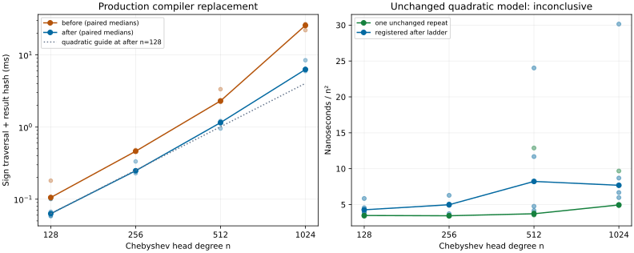

# Production integer-sign comparison

`HexRealRoots.Sign` supplies `Hex.signInt`, using comparisons with zero, and
the ordinary-kernel equality `Hex.sign_eq` registers it as the compiled
implementation of `Int.sign`. Importing `HexRealRoots.Basic` makes this
replacement available to the production root-query paths and their consumers.
The logical public operations and their correspondence statements are unchanged.
The equality uses only `propext` and `Quot.sound`.

The retained generated C and exact-binary disassembly in [code/](code/)
show comparisons with zero without converting or copying the input magnitude.
The GMP comparison with zero returns from the signed-size comparison. This
removes the positive multiprecision copies diagnosed in the
[earlier toolchain report](../sturm-sign-runtime-diagnostic/metadata.json).
It does not establish the fraction of total runtime attributable to those copies.

## Frozen sources and protocol

The before source is clean `949e48e26a68026ddff543b2ddabf1b4c77cebde`; the
after source is clean `75fbfa04550ae0f76df074176f44bf0f2533334a`.
Both were built with `lake build hexsturm_bench` on Lean 4.35.0-rc3.
The compressed [before](capture/before-source.json.gz) and
[after](capture/after-source.json.gz) manifests hash every tracked local Lean
source and JSON configuration outside reports/fixtures, the toolchain selection,
and the local lean-bench Lean sources: 5233 and 5234 files respectively.
The only differing Lean files are the new `HexRealRoots/Sign.lean`, its import
in `Basic.lean`, and the regression/axiom tests in `TarskiTests.lean`.
Dependency pins are retained in the root Lake manifest. External package sources
other than lean-bench and installed toolchain artifacts are not independently
hashed; this is not a hermetic rebuild claim.

Exact binaries remain in persistent storage at the paths and SHA-256 values in
[binary-retention.json](binary-retention.json). The measurement source and
executable were frozen before collection. Both original source manifests and
command logs also remain in that persistent directory. Committed source
manifests are gzip-compressed; their manifest references reflect that storage
transformation, with no measurement changes.

The [collector](../../../scripts/bench/sturm_sign_paired.py) delegates to
LeanBench throughout. It retains the unmodified registered after ladder
(`128, 256, 512, 1024`, four trial-major trials, warm cache, 100 ms tuning
target, `n²` model and ±0.15 residual tolerance), then measures 32 adjacent
before/after child arms in trial-major alternating AB/BA order. The paired
observations use the same fixture and tuning target, and are speed comparisons
without a separate complexity verdict. Every arm agrees with the ordinary
ladder's actual result hash at its degree. Two separate sign verifications pass
with panic rejection; these are correctness checks, not performance evidence.

Collection uses automatically leased CPUs on the shared host (CPU 1 for the
first capture, the repeat's CPU is in its metadata). Every completed sample and
the observed loads are retained. No quiet-core rule, load exclusion, trial
trimming, exponent fitting or retry-until-pass rule is applied. The ordinary
first run has 16 successful points, with no budget truncation or verdict
exclusion. Its residual is **+0.326483**, hence **inconclusive**.

The single identical [repeat](rerun/results.json) has another 16 successful
points, no truncation or verdict exclusion, and residual **+0.164190**, also
**inconclusive**. No further unchanged scientific repeat is permitted by the
current policy. The original failed measurements remain retained in their
existing directories; this implementation change does not reinterpret them.

## Observed improvement

| Head degree | Before median ms | After median ms | Ratio of paired-arm medians |
| --- | ---: | ---: | ---: |
| 128 | 0.10565 | 0.06309 | 1.675× |
| 256 | 0.46233 | 0.24798 | 1.864× |
| 512 | 2.30678 | 1.15337 | 2.000× |
| 1024 | 25.68087 | 6.29316 | 4.081× |

[summary.json](capture/summary.json) also retains all four individual paired
ratios at each degree; the ratio of medians above is not their median.
Raw observations, tuning counts, output hashes and child stdout/stderr are in
[capture/](capture/). The large first-run spreads remain visible rather than
being removed. The ordinary ladder and the adjacent comparison are different
sample schedules and must not be combined into a new verdict.

The left panel shows every paired observation and the two arm medians; the
quadratic guide is anchored at the first after median and is not fitted.
The right panel shows every ordinary-ladder observation, including the repeat,
normalized by `n²`. Generate the plots from retained data with the Python
script in [plot.py.txt](plot.py.txt), passing the `capture` directory; it requires
Matplotlib. [collector.py.txt](collector.py.txt) and
[rerun.py.txt](rerun.py.txt) retain the exact collection scripts.

This is a proved production improvement with measured benefit, **not a passing
quadratic characterization** or Phase-4 attestation. The remaining residual
has not been causally explained. The benchmark still includes coefficient
traversal, output allocation and result hashing. The high-level query and
FLINT/Z3 comparisons retain their separate recorded scopes; this sign pass
is not a common-domain external comparison or an end-to-end query speedup.
All four libraries assigned to #10577 remain at Phase 3.

## Local correctness checks

The [verification record](verification.json) retains Lake and oracle logs. All
four assigned libraries and both companion test targets build (9991 Lake jobs),
as do the ordinary root replay and Sturm conformance modules. All 93 Sturm
benchmarks verify with panic rejection. The root oracle checks 39 isolation,
2 rejection and 22 exact Tarski cases with zero failures; the real-algebraic
oracle checks 83 exact cases with zero unavailable-component skips. The
real-algebraic conformance executable exits successfully with panic rejection.
An early oracle invocation read the fixture stream before the emitter finished;
its empty-stream failure is retained separately from the completed 83-case run.
Admission, Mathlib-free and changed-registration checks pass. Full required CI
remains an additional merge requirement on the final PR head.
