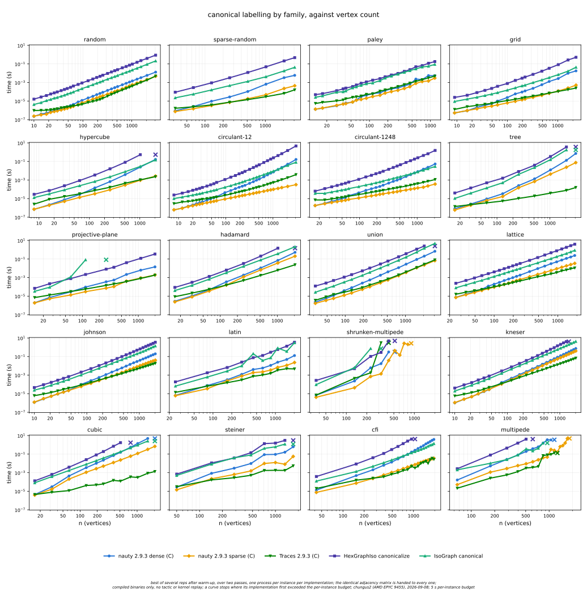
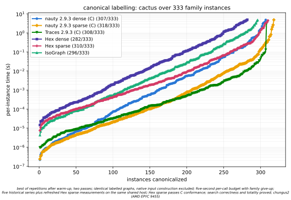

# Six-way graph canonical-labelling comparison

The comparison uses C dense nauty, C sparse nauty, Traces, Hex dense,
Hex sparse, and Alex Meiburg's IsoGraph on the same 333 labelled graphs
from 20 families, through 3,072 vertices. The C engines use vendored
nauty 2.9.3. Historical IsoGraph measurements use
[Timeroot/IsoGraph at 7cfa2370](https://github.com/Timeroot/IsoGraph/tree/7cfa23706dd70245805ec157686049851c8372f1).

**The optimized Hex sparse search now has correctness and totality proofs.**
The total public API, complete automorphism generation, exact orbits and group
order, certificate production and literal checking, public sparse
`graph_iso`, and Mathlib correspondence are integrated. See the
[validation report](sparse-nauty-validation.md) and
[proof plan](sparse-nauty-plan.md).

Hex sparse solves **310/333** instances within the five-second
per-call budget. The retained comparison series solve 282 for Hex dense,
296 for IsoGraph, 307 for C dense, 318 for C sparse and 308 for Traces.
On 282 shared cases, Hex sparse's median per-instance time is
**0.25×** Hex dense's; on 296 shared cases it is
**0.73×** IsoGraph's. These ratios use different solved subsets and
measurements from different sessions.





## Scope and protocol

All four Hex sparse columns—native construction, prepared search,
checked canonicalization and relabelling—were refreshed in two passes.
The other five implementations' observations are retained from the
[preceding comparison](bench-results/hexgraphiso-comparison-cutover-chungus2.jsonl).
All 333 regenerated input hashes exactly match the historical full corpus.
There is no minimum-order cutoff.

The main figures time native canonical entrypoints. Hex dense uses
`Hex.GraphIso.canonicalize`; Hex sparse uses
`Hex.GraphIso.Nauty.Sparse.searchResult?`, including checked label
construction and normalized sparse canonical output. The latter runs the
proved optimized sparse search directly. Input parsing and native graph
construction are outside the canonicalization timers. C sparse retains its
native unsorted working rows during search.

The [search and conversion figure](figures/hexgraphiso-comparison-search-families.svg)
retains each comparator's input boundary: C and IsoGraph include
matrix-to-native conversion, Hex dense includes packed-row conversion,
and Hex sparse starts from compressed adjacency. These are separate cost
boundaries. The [tables](figures/hexgraphiso-comparison-table.md) report native
sparse construction and output costs independently.

The protocol is unchanged: two passes, one warmup followed by five timed calls
(or one when warmup exceeds one second), and the minimum completed timed call
across passes. A reported call above five seconds stops that implementation's
column on the family. The process timeout is `20 + 15 * n / 1000` seconds,
including preparation, warmup and diagnostics. Later sizes of a stopped family
are not attempted, and its column is not revisited on the second pass.
A cross marks where a curve stops; missing values are never replaced by the
budget. Host activity is recorded and does not reject completed samples.

## Evidence

The [merged data](bench-results/hexgraphiso-comparison-release-chungus2.jsonl)
is reconstructed exactly from 2,486 retained
[process outcomes](bench-results/hexgraphiso-comparison-release-chungus2.runs.jsonl),
including 12,224 completed timed calls and every failure. All historical
measurement cells remain unchanged. Every fresh minimum agrees with its raw
calls, and every solved sparse canonicalization has the same visited-node
count as C sparse nauty. The
[metadata](bench-results/hexgraphiso-sparse-release.meta.json) records commands,
input, source and executable hashes, and validation results.

The [sparse per-node fit](bench-results/hexgraphiso-sparse-pernode-release.md)
passes the existing 0.2 exponent tolerance against C sparse on every family
with at least five matched sizes. The separate dense cactus refresh also
passes its freshness and per-node checks.

The [adjacent AB/BA comparison](bench-results/hexgraphiso-sparse-release-pairs.jsonl)
compares the integrated executable with the preserved optimized binary on
eight fixed cases. All result digests agree; median ratios range from
0.973 to 1.023. This shows no substantial regression from proof integration,
rather than an additional optimization. The
[optimization report](graphiso-sparse-performance.md),
[further optimization report](graphiso-sparse-performance-2.md), and
[cutoff report](graphiso-sparse-cutover.md) retain the measurements supporting
the algorithm's representation choices.

Automorphism computation, certificate production and certificate replay are
measured separately on 38 native inputs in seven families, through 128 vertices.
[Their archive](bench-results/hexgraphiso-sparse-release-supplement.jsonl) and
[raw outcomes](bench-results/hexgraphiso-sparse-release-supplement.runs.jsonl)
preserve those costs separately. Replay prepares its candidate outside the
timer. These native timings are distinct from
[imported kernel proof measurements](bench-results/hexgraphiso-sparse-replay-unlimited.jsonl).

Native path construction also passes the lean-bench linear scaling check
through 65,536 vertices. Its
[measurements](bench-results/hexgraphiso-sparse-build-release-batched.json)
and the earlier [large native-input archive](bench-results/hexgraphiso-sparse-native-chungus2.runs.jsonl)
exercise edge inputs without a dense intermediate; the earlier archive
extends through 131,072 vertices. This does not claim linear canonical search.

## Reproduction

Build and run the conformance gate:

```sh
lake build hexgraphiso_sparse_probe hexgraphiso_emit_sparse hexgraphiso_sparse_bench
python3 scripts/oracle/graphiso_sparse_check.py --trace-corpus
.lake/build/bin/hexgraphiso_emit_sparse | python3 scripts/oracle/graphiso_nauty.py
```

Generate the corpus with
`python3 scripts/bench/graphiso_corpus.py --split CORPUS --max-n 3072 --max-hard-n 2048`.
The sweep invocation, selected CPU, refreshed columns and preserved baseline
are recorded in the metadata. Corpus paths may be replaced by regenerated
files with the recorded hashes.

Render both SVG and PNG figures with:

```sh
uv run --no-project --with matplotlib==3.11.1 python scripts/plots/hexgraphiso-comparison.py \
  --data reports/bench-results/hexgraphiso-comparison-release-chungus2.jsonl \
  --machine 'chungus2 (AMD EPYC 9455)' --sparse-refresh
```

Historical archives and the
[first-pass preview](bench-results/hexgraphiso-comparison-release-first-pass.jsonl)
remain available. Traces remains a comparator; this work does not implement
a Lean Traces engine.
