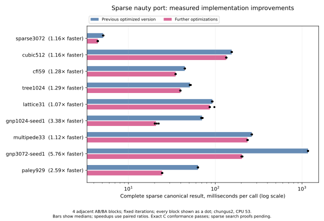

# Sparse nauty: further implementation optimizations

The [minimum-order cutoff removal](graphiso-sparse-cutover.md) supplies the
additional measurements below 128 vertices used in the current plots.

The executable keeps sparse nauty 2.9.3's refinement, target, traversal,
pruning, and canonical-label choices. Against the
[previous optimized executable](graphiso-sparse-performance.md), the complete
checked canonical result improves on all nine selected cases. Output-heavy
cases improve by 2.59–5.76×; the other six improve by 1.07–1.29×.
These are adjacent before/after measurements, separate from the
[six-way corpus comparison](graphiso-comparison.md). The completed two-pass
corpus sweep solves 310/333 instances, compared with 307 for the preceding
sparse executable; all 310 visited-node counts match C sparse exactly.
The additional coverage is `multipede48`, `multipede53`, and `multipede58`.
Passing the earlier cutoff allows the two later cases to be offered; the
preceding sweep did not measure them after stopping at `multipede48`.



| Case | Previous ms | Current ms | Paired speedup | All four current/previous ratios |
|---|---:|---:|---:|---:|
| sparse3072 | 5.121 | 4.439 | 1.16× | 0.863–0.874 |
| cubic512 | 154.891 | 134.202 | 1.16× | 0.863–0.869 |
| cfi59 | 44.655 | 34.964 | 1.28× | 0.780–0.785 |
| tree1024 | 51.138 | 39.690 | 1.29× | 0.761–0.781 |
| lattice31 | 92.595 | 86.620 | 1.07× | 0.928–1.066 |
| gnp1024-seed1 | 70.418 | 20.733 | 3.38× | 0.282–0.320 |
| multipede33 | 263.774 | 235.142 | 1.12× | 0.887–0.899 |
| gnp3072-seed1 | 1172.126 | 203.658 | 5.76× | 0.171–0.175 |
| paley929 | 63.353 | 24.451 | 2.59× | 0.384–0.388 |

Times are medians of four block means. Speedups are reciprocals of median
paired time ratios; they need not equal ratios of the displayed medians.
The last column gives the range, retaining the slower lattice block as well
as the three faster blocks. It is not a confidence interval. CFI and multipede
names encode generator parameters: these cases have 826 and 726 vertices.

## Profiling and implementation

A short initial sampling round identified two useful targets. On dense random
output, list merge consumed 30.86% of flat sampled self-time, comparator
application 16.10%, reversal 8.80%, and splitting 5.92%. Tree search spent
22.08% in target-cell indexing and another 17.09% in cell-end scans; CFI also
spent substantial time in these operations. Cubic search emphasized splitter
loops, allocation, and cell-end scans. These exploratory whole-process
profiles guided the experiments; isolated timings establish the improvements.

**Reuse scratch and partition data.** Refinement carries counts, marks, vertex
marks, and their generation stamp across search nodes. It rebuilds vertex-to-cell
indices and endpoints into existing arrays at entry, maintains endpoints at each
split, and supplies both to target selection. Target selection no longer builds
its own full vertex index and sizes array; it borrows the count array, initializing
the entries it uses. The combined cache/reuse change improves isolated search by
1.10–1.27× across its five measured cases.

Only current cell starts have meaningful endpoint entries. Individualization
and recovery invalidate the cache; empty-active refinement uses the independent
target scan. First-touch initialization prevents stale counts being observed,
including after target selection, and generation stamps increase across nodes.
The distance branch retains its BFS counts and walks each original cell once.
Ownership is detached before mutation so the retained arrays can be updated in
place. The independent target implementation remains available, and refinement
conformance also compares its answer with cached selection whenever a
nontrivial target exists.

**Normalize output with membership arrays where bounded by row length.** For
row length `d` satisfying `n ≤ 8d`, mapped vertices are marked and
emitted in increasing order. Other rows retain merge sort. The extra vertex
scan is bounded by eight times the row length, avoiding an unconditional
quadratic scan on sparse graphs. `countRow_eq` and the compiler simplification
theorem prove equality with the original normalization for every input,
including duplicates. On the 1024-vertex dense random case, this change alone
makes output 2.93× faster and complete canonicalization 2.69× faster.
The original experiment also required `n ≥ 128`; the additional cutoff is
removed in the [small-graph comparison](graphiso-sparse-cutover.md).

**Pack canonical rows directly into their final arrays.** A single fold appends
each row into the neighbour array and records its offset, replacing a flattened
intermediate list and separate length scans. `pack_eq` and `ofRows_eq_fast`
prove equality with the existing graph constructor. In output-only timings,
packing adds a further 1.30× improvement on dense random and 1.16× on sparse
random. Per-row lists remain; this is not a completely list-free pipeline.
Both output replacements run after search has chosen its label. The raw
canonical store and its comparisons retain nauty's unsorted row order.

**Share the native input arrays.** The search input view holds the original
offsets and `Fin n` neighbour array. Reading an entry uses its erased value,
avoiding a full adjacency copy to `Array Nat`. Initial colour buckets likewise
read the original typed colouring array. Generated C confirms that graph
conversion retains the arrays without traversing neighbours. Isolated search
improves by 1.10× and 1.16× on the two dense random inputs; tree improves by
1.01×, while CFI is 1.5% slower in this isolated experiment. That regression
is retained; the complete implementation is faster on CFI.

**Inline direct comparisons for tiny touched-cell sets.** Arrays of at most
three cell starts use fixed comparisons; larger arrays retain the existing
list merge sort. `sortCells_eq_fast` proves identical output for all arrays,
including repeats. Inlining the replacement removes its extra helper call.
Against the otherwise identical list-sort version, search improves by 5.0%
on cubic, 2.7% on CFI, 2.2% on tree, and 1.3% on sparse random, expressed as
speedup minus one. The separate nauty indirect count sort and its ties are
unchanged.

## Rejected experiments and remaining opportunities

The archives retain unsuccessful alternatives as well as the selected path:

| Experiment | Measurement that ruled out selecting it unchanged |
|---|---|
| Standard `Array.mergeSort` for canonical output | Dense random output 43% slower; sparse random canonicalization 28% slower |
| Scratch reuse without the endpoint/target cache | Tree search 28% slower; extra singleton indexing outweighed saved allocation |
| General `Array.qsort` for touched-cell starts | Cubic improved, but tree search was 2.7% slower; the selected tiny replacement has a direct equality proof |
| Tiny comparisons without inlining | Tree search was 2.9% slower; the selected inlined version removes that penalty |

Some residual work remains possible: list-free row emission, a specialized
proved sort for larger touched sets, reuse of temporary touched/target/hit
arrays, and reduction of remaining search-state allocations. None has an
established additional speedup. Extending storage reuse also adds ownership
and validity obligations, so it should follow evidence from a specific
remaining bottleneck. Packed integer buffers are still unjustified: ordinary
small `Nat` values are immediate, while `Array UInt64` would box elements on
this runtime. A packed rewrite would require bounds and representation proofs.

## Validation and evidence

The selected executable passes **45,491 exact sparse searches, 220 refinements,
and 130 indirect-sort comparisons** against C. Checks include labels, canonical
edges, statistics, emitted generators, orbits, and exact group order. Both
6,233-record fixture streams remain byte-identical and pass their respective
C oracles. All 39,032 dense trace records match after accounting for the
archive's sorted record order. The dense correctness and Mathlib correspondence
build passes, as do 40 Python tests and the published trust-surface check.
The separate dense cactus, pair, and tactic sweep is refreshed for source
fingerprint `8019e6bc2310`.

Representation and compiler-replacement equalities have Lean proofs. Sparse
search correctness, totality, and the cache invariants remain proof work;
conformance is not substituted for them. The
[SPEC](../HexGraphIso/SPEC/hex-graph-iso.md#sparse-graphs-and-sparse-nauty) and
[proof dependency plan](sparse-nauty-plan.md#proof-dependencies-after-the-performance-pass)
describe the current operations and obligations.

Measurements use chungus2, AMD EPYC 9455, Lean 4.34.0-rc2. Each comparison pins
one automatically selected CPU and uses four fixed adjacent AB/BA blocks with
fixed iteration counts. Every completed sample and host-load observation is
retained; there are no load-based exclusions or unchanged reruns. Each sample
times a repeated compiled stage and records its loop mean. These are separate
from the individual timed repetitions retained by the full comparison sweep.
Output-only timers exclude label preparation; search timers exclude output.

The [evidence directory](bench-results/sparse-optimization-2/) contains all
paired experiments, initial profile commands and flat symbol summaries, source
and executable hashes, checkpoint patches, and regression results. Profiles
use `perf record -e cycles:u -F 999`; their repeated stage loops last roughly
three seconds. The recording also includes startup and input preparation, so
these are exploratory profiles, not filtered lean-bench Phase-4 attribution
or allocation-count measurements. No additional per-change profiles were used.

The selected runtime can be reconstructed from the recorded baseline with
`cache.patch`, `counts.patch`, `direct.patch`, `lists.patch`, `tiny.patch`, and
`selected.patch`, in that order. `array.patch` and `scratch.patch` instead
branch from the baseline. The selected source hashes and conformance output
hash are in `selected-context.json`; raw paired records also identify both
executable hashes and every input hash. Checkpoint patches describe runtime
code; conformance-driver hashes separately identify the validation harness.

To reproduce the combined comparison with saved or rebuilt checkpoint binaries:

```sh
python3 scripts/bench/graphiso_sparse_pairs.py \
  --before BEFORE --after AFTER --corpus CORPUS --out NEW-RESULT.jsonl \
  --case sparse3072:canon:200 --case cubic512:canon:20 \
  --case cfi59:canon:70 --case tree1024:canon:60 --case lattice31:canon:35 \
  --case gnp1024-seed1:canon:45 --case multipede33:canon:12 \
  --case gnp3072-seed1:canon:3 --case paley929:canon:50
```
