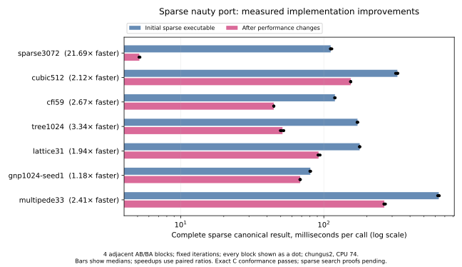

# Sparse nauty performance: initial optimizations

The [further optimization report](graphiso-sparse-performance-2.md) describes
the current executable and the additional measured improvements. This report
retains the initial before/after evidence.

The sparse executable keeps nauty 2.9.3's algorithmic decisions while
improving array ownership, partition iteration, and checked permutation
construction. The complete canonical result is faster on all seven selected
before/after cases. These measurements precede the sparse search proofs;
the compressed representation and the replacement permutation checker have
Lean proofs.

| Case | Initial ms | Optimized ms | Paired speedup |
|---|---:|---:|---:|
| Sparse random, 3072 vertices | 111.596 | 5.148 | 21.69× |
| Cubic, 512 vertices | 326.493 | 154.194 | 2.12× |
| CFI, 826 vertices | 119.547 | 44.735 | 2.67× |
| Tree, 1024 vertices | 171.902 | 51.457 | 3.34× |
| Lattice, 961 vertices | 178.009 | 91.854 | 1.94× |
| Dense random, 1024 vertices | 80.501 | 68.337 | 1.18× |
| Multipede, 726 vertices | 635.479 | 264.386 | 2.41× |

Times are medians of the four block means for each arm. Speedup is the
reciprocal of the median paired optimized/initial ratio, so it need not
equal the ratio of the two displayed medians. The initial arm is the
executable used for the first six-way comparison, with the same profiling
loop added to both arms. This selected-case experiment measures changes;
the [full comparison](graphiso-comparison.md) measures coverage across
the original 333-instance corpus.

## Profiling and selected changes

**Release mutable scratch-array aliases before entering splitter loops.**
`splitSingleton` borrowed the refinement state to read cell indices while
mutating local aliases of its marks and vertex marks. `splitNontrivial` did
the same for marks and counts. The generated C retained the state throughout
the loop, forcing a full array copy on the first write to each local array.
Replacing just those fields in the borrowed state with empty arrays releases
the aliases. The arrays retain their contents, and the loops visit precisely
the same neighbours and cells. No reset or algorithmic shortcut is added.

The isolated ownership experiment reduces sparse-random search from 8.402 ms
to 2.778 ms, cubic search from 324.971 ms to 155.365 ms, and CFI search from
110.962 ms to 90.853 ms. Its tree result changes little. Across the complete
change, `lean_copy_expand_array` drops from 21.88% to 0.77% of the
sparse-random profile and from 16.49% to 0.50% of the cubic profile. These
shares describe separate recordings; the paired timings establish the
speedup.

**Walk cells and active bits directly.** Cell-index construction, distance
refinement, and sparse target selection scan the existing partition arrays
instead of allocating lists of cell-boundary pairs. Initial active entries
come from the existing ascending packed-set iterator, replacing construction
and filtering of `List.range n`. The distance branch still scans the original
partition, even as it changes the working partition. Initial active order,
the first-ten singleton preference, swap-pop order, and subsequent fragment
activation are unchanged.

This isolated change reduces CFI search from 91.445 ms to 44.490 ms, tree
search from 159.838 ms to 50.910 ms, and lattice search from 108.821 ms to
87.169 ms. Sparse-random time changes from 2.830 ms to 2.850 ms; the small
regression is retained. The profile had identified list allocation,
deallocation, and full-vertex active filtering as substantial CFI costs.

**Validate a permutation by checking a scattered inverse.** The original
`Perm.ofVector?` decides list pairwise distinctness and membership of every
vertex. Besides quadratic comparisons, compiled completeness checking
repeatedly constructs the list representation. `Perm.check` scatters a
candidate inverse and checks both inverse identities in linear time and
linear auxiliary space. `ofVector?_eq_check` proves equality on all inputs,
including invalid arrays, and installs the replacement with `@[csimp]`.
The original mathematical definition and its downstream proofs are retained.
The surrounding raw-array constructor still checks length and bounds.

Isolated label validation at 3072 vertices decreases from 98.850 ms to
0.139 ms. This shared helper also benefits dense canonicalization and other
permutation users. Both Hex variants are therefore remeasured in the full
comparison. Tests include empty, valid, and duplicate-image arrays; the
permutation-group fixture output remains byte-identical.

## Further optimization work

The [additional implementation and measurements](graphiso-sparse-performance-2.md)
cover the deferred canonical-output work, reuse of scratch arrays across nodes,
cached cell endpoints and indices, native input-array sharing, and touched-cell
sorting. That report records both the selected changes and rejected experiments,
and distinguishes remaining opportunities from established speedups.

## Evidence and limits

The host is chungus2, AMD EPYC 9455, with Lean 4.34.0-rc2. Measurements use
one automatically selected CPU per comparison. The schedule has four fixed
blocks, with adjacent arms in AB, BA, AB, BA order and fixed iteration counts.
Every completed result and load observation is retained; load does not
exclude samples. No unchanged rerun or load-based retry was used. The
paired script records executable and corpus hashes and refuses to overwrite
an existing result file.

The [raw evidence directory](bench-results/sparse-optimization/) includes
isolated ownership, label, and iteration comparisons; the combined comparison;
source and executable hashes; and patches that restore each measured source
checkpoint from the selected implementation. Prepared inputs and the opaque
IO sink keep repeated calls observable. The measurements are compiled code,
not interpreted `#eval` timings.

CPU sampling uses `perf record -e cycles:u -F 999`, with repeated isolated
stages lasting roughly 2.5–4 seconds. The recorded process includes parsing,
preparation, and startup, although the stage loop excludes them. These are
exploratory process profiles, not filtered lean-bench Phase-4 profiles or
allocation-count measurements. Requested DWARF unwinding did not yield useful
Lean caller stacks; only flat self-time attribution is used. Generated C
inspection supplies the ownership explanation. Original recordings remain
outside git; commands and symbol summaries are retained.

The selected executable passes 45,491 sparse search comparisons, 220
refinement comparisons, and 130 exact indirect-sort comparisons against C.
Dense and sparse fixture output is unchanged, and all 39,032 dense trace
records match the committed archive. The dense correctness,
`HexGraphIsoMathlib`, and `HexPermGroupMathlib` builds pass. The separate
dense cactus, pair, and tactic sweep is refreshed for source fingerprint
`b31b4f508c3f`, and its source-freshness check passes. No sparse search proof
is inferred from conformance, timing, or a profile. Splitter order,
indirect-sort ties, target selection, pruning,
labels, statistics, generators, orbits, and exact group order remain the
compatibility gate for any subsequent optimization.
