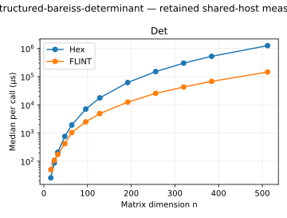
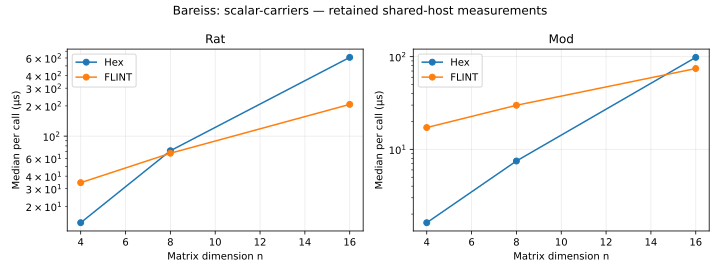
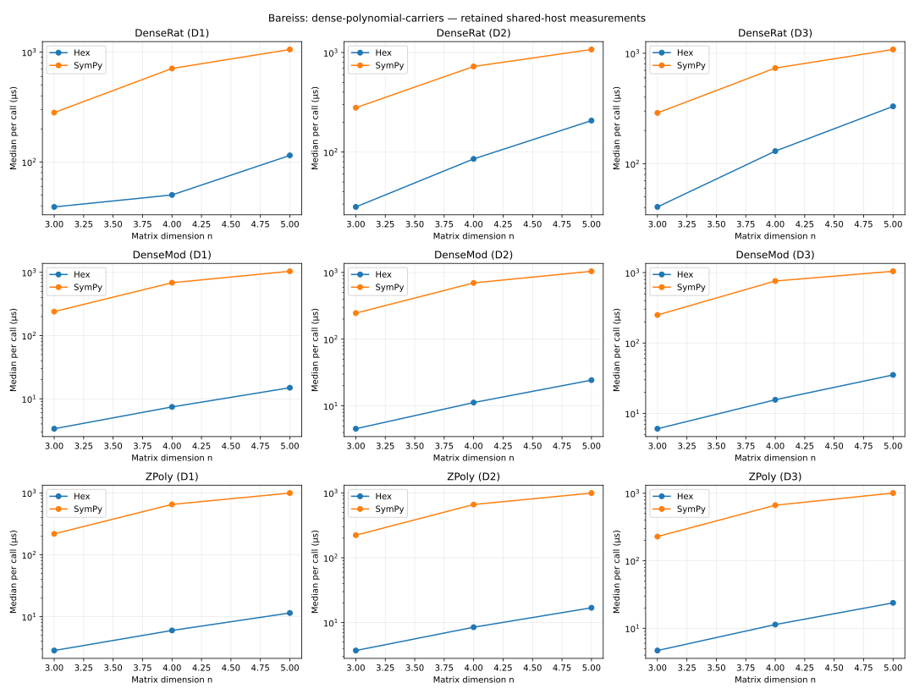
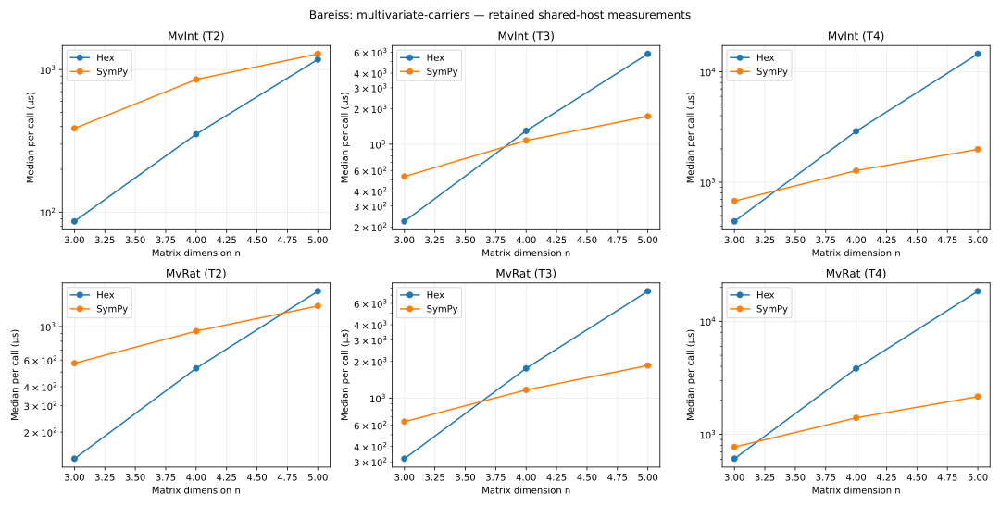

# HexBareiss Performance Report

`HexBareiss` provides the row-pivoted fraction-free determinant over `Int`
and generic coefficient carriers through `Hex.Matrix.bareissWith`. The
comparisons cover integer, rational, prime-field, dense-polynomial and
multivariate-polynomial determinants against FLINT and SymPy.

## Bench Targets

- `Hex.BareissBench.runBareissDet`: `n * n * n`, two-sided parametric complexity.
- `runBareissRat`, `runBareissMod`: dimensions 4, 8, 16.
- `runBareissDenseRat`, `runBareissDenseMod`, `runBareissZPoly`: dimensions
  3, 4, 5 crossed with degrees 1, 2, 3.
- `runBareissMvInt`, `runBareissMvRat`: dimensions 3, 4, 5 crossed with
  2, 3, 4 nonconstant terms at arity three and total degree two.

The new carrier fixed registrations are comparator endpoints and expected-hash
anchors, as required by the carrier SPEC. They make no asymptotic or absolute
performance-budget claim. The existing integer registration supplies the
Bareiss elimination complexity check; polynomial operand costs vary with
degree, support and coefficient growth.

Paired Hex/FLINT informational comparator fixed registrations:
`runBareissDet{16,24,32,48,64,96,128,192,256,320,384,512}` ↔
`runFlintBareissDet{…}` (`fmpz_mat.det` via the shared persistent-subprocess
python-flint driver, per `HexBareiss/SPEC/hex-bareiss.md §"External comparators"`
and `SPEC/benchmarking.md §"External comparators" §"Process call"`). The named
comparator is `FLINT fmpz_mat_det via python-flint` (matching
`libraries.yml: HexBareiss.phase4.comparators[0].tool`).

## Verdicts

Measured on `carica` (Apple M2 Ultra, macOS 14.6.1). The
`structured-bareiss-determinant` figures below were captured under the
pre-split consolidated `hexmatrix_bench` driver and are unchanged by the
library split (the timed `Hex.Matrix.bareiss` surface is identical).

- `Hex.BareissBench.runBareissDet`
  - Command: `lake exe hexbareiss_bench run Hex.BareissBench.runBareissDet`
  - Input family: `structured-bareiss-determinant`; deterministic salt `71`;
    parameters `8, 12, 16`.
  - Per-call times: `9.136 µs`, `28.275 µs`, `72.236 µs`.
  - Verdict: consistent with declared complexity (`cMin=16.363`,
    `cMax=17.846`, `β=—`).

The 24 paired Hex / FLINT fixed-comparator registrations passed — each Hex
target and its paired FLINT call returned the same observed hash at every rung,
covering both the magnitude and the sign of the determinant (Hex's row-pivoted
Bareiss tracks the swap permutation parity; FLINT's multimodular CRT returns the
signed determinant in the same convention).

### Generic-coefficient regression gate

The generic coefficient implementation retains `bareiss` as an `Int`
specialization of `bareissWith`. The specialization annotations propagate the
fixed exact quotient into the inner loop: generated C for the benchmark calls
`lean_int_div_exact` directly and contains no closure application at the
division site.

Five-repeat medians on the same deterministic
`structured-bareiss-determinant` inputs compared this branch with
`origin/main` (`32ac5850a`). The observed determinant hashes agreed.

| n | `origin/main` | generic branch | branch/base | limit |
|---:|---:|---:|---:|---:|
| 256 | 263.939 ms | 148.041 ms | 0.561x | 1.02x |
| 384 | 825.551 ms | 512.178 ms | 0.620x | 1.02x |

Both required rungs pass the no-regression ceiling.

The SPEC's same-binary A/B comparison measures the retained `bareiss` entry
against `bareissWith Hex.exactDiv`. Five repeats were pinned to verified-idle
CPU 2 on `chungus2`; output hashes agreed at both rungs.

| n | direct `Int` specialization | `bareissWith Hex.exactDiv` | generic/direct |
|---:|---:|---:|---:|
| 256 | 150.466 ms | 259.076 ms | 1.722x |
| 384 | 523.082 ms | 919.823 ms | 1.758x |

`Hex.exactDiv` is the guarded quotient derived from ordinary integer division,
whereas the retained specialization reaches `lean_int_div_exact` directly.
The A/B result records the material reason the direct-call code-generation
check is part of the no-regression gate.

## Comparator Ratios

Input family `structured-bareiss-determinant`, declared complexity `n³`. Hex's
row-pivoted Bareiss fraction-free elimination against FLINT's multimodular
reduction + CRT determinant on the same deterministic tridiagonal fixture.

The paired registrations were rerun from clean commit
`f4f013c638460c621728e108c9b77988df8d2836` on `chungus2` (AMD EPYC
9455, Linux x86_64), pinned to CPU 2:

```sh
PATH=/tmp/hex-9804-flint/bin:$PATH
lake exe hexbareiss_bench list | awk '/\[fixed\]/{print $1}' |
  xargs taskset -c 2 lake exe hexbareiss_bench run \
    --export-file reports/bench-results/hex-bareiss-f4f013c-issue9804-warmed.json
```

The export contains 27 fixed registrations and 135 successful outer repeats.
All registrations have internally stable hashes and all 12 Hex/FLINT pairs
agree on their observed hash. Its SHA-256 is
`f3840dc9a2dec0dce85172f72330aa37bddb94eaebadd7ee078b4d55eb6716e1`.

Both arms discard a first warmup call, so one-time interpreter/python-flint
startup is excluded from all timed medians. The registered synchronous
`runFlintOverhead` case measures the steady-state trivial-request round trip at
6.115 µs in the same artifact. Startup and steady-state overhead are therefore
separate: startup is represented only by the discarded warmup, while the
reported overhead is the reusable process-call floor. An adjusted ratio is
shown where this floor exceeds 5% of the FLINT median. Every retained rung is
below the 10 s hard ceiling and the overhead is below 50% of the FLINT median,
so all 12 pairs are eligible.

| n | Hex median | FLINT median | raw ratio | adjusted ratio | eligible |
|---:|---:|---:|---:|---:|:---:|
| 16 | 25.841 µs | 50.393 µs | 1.950x | 1.713x | yes |
| 24 | 87.028 µs | 108.204 µs | 1.243x | 1.173x | yes |
| 32 | 207.809 µs | 173.796 µs | 0.836x | — | yes |
| 48 | 757.016 µs | 417.884 µs | 0.552x | — | yes |
| 64 | 1.927 ms | 1.037 ms | 0.538x | — | yes |
| 96 | 7.061 ms | 2.485 ms | 0.352x | — | yes |
| 128 | 17.611 ms | 4.897 ms | 0.278x | — | yes |
| 192 | 61.683 ms | 12.477 ms | 0.202x | — | yes |
| 256 | 150.128 ms | 25.542 ms | 0.170x | — | yes |
| 320 | 299.955 ms | 42.737 ms | 0.142x | — | yes |
| 384 | 522.987 ms | 67.725 ms | 0.129x | — | yes |
| 512 | 1.252 s | 145.195 ms | 0.116x | — | yes |

The warmed curve crosses unity between `n = 24` and `n = 32`, then the ratio
falls from 0.836x to 0.116x through the remaining ten rungs. This is the
structural gap named in advance by the `informational` rationale (FLINT uses
multimodular reduction + CRT; Hex uses Bareiss fraction-free elimination). The
comparator is
`informational`, so this expected different-complexity-class divergence is
recorded for optimization orientation rather than as a Phase-4 gate or an
evidence defect. HexBareiss claims the specified fraction-free algorithm; a
faster multimodular determinant would be a distinct optional surface, not a
repair required by this report.

### Supported carrier comparisons

The `scalar-carriers` input family (`runBareissRat` and `runBareissMod`) sweeps dimensions
4, 8, 16. Their external comparators are **FLINT fmpq_mat.det via python-flint**
and **FLINT nmod_mat.det via python-flint**, respectively, with prime 101.
The `dense-polynomial-carriers` family (`runBareissDenseRat`,
`runBareissDenseMod`, and `runBareissZPoly`) crosses dimensions
3, 4, 5 with degrees 1, 2, 3 and two nonzero entry coefficients.
The `multivariate-carriers` family (`runBareissMvInt` and `runBareissMvRat`) crosses dimensions 3, 4, 5 with 2, 3, 4
nonconstant terms plus a constant at arity three and total degree two. The
polynomial comparator is **SymPy Berkowitz exact-domain determinant** over
QQ[x], GF(101)[x], ZZ[x], ZZ[x0,x1,x2], and QQ[x0,x1,x2].

The tridiagonal matrices have a nonconstant diagonal polynomial, superdiagonal
1 and subdiagonal -1. Their leading principal minors grow in degree, and every
step after the first divides by a nonconstant previous pivot. Full canonical
answers are hashed by both arms. Input construction and request serialization
precede the closure in the source; canonical output serialization is included.
The compiler can move pure preparation: the rational profile attributes 0.68%
to `carrierMatrix`, so these timings do not claim to exclude every compiled
preparation instruction.

External carrier registrations carry `scheduled-hardware`; ordinary `verify`
checks all Hex registrations and explicitly named `verify` can select external
ones. These comparisons are informational, including their different algorithm
and Python exact-domain construction costs. Field timings are conformance
evidence and do not recommend Bareiss as the preferred field determinant.


The carrier sweep at source `571e797e3` ran on `chungus2` (AMD EPYC 9455,
Linux x86_64, Lean 4.34.0-rc2), pinned to automatically selected CPU 27.
Python 3.14.6 used python-flint 0.9.0 and SymPy 1.14.0. Host load was
recorded (initial load averages 26.92/27.06/15.37); no activity-based samples were discarded.
The five default fixed repeats were retained at each point, with adjacent
Hex/oracle pairs alternating AB/BA across the sweep. All 51 pairs agree on
full-answer hashes, and all 515 measured repeats succeeded. Ordinary benchmark
verification, including all Hex carrier points, took 5 seconds on this host.

The [raw export](bench-results/hex-bareiss-carriers-571e797e3.json) contains every
sample, command, source hash and host observation, plus the separate unpinned
functional comparator check. The recorded benchmark and oracle source hashes identify the measured
version at that commit. Later changes add headers, error reporting, golden
hashes, fixture metadata, transport recovery and the disjoint determinant
dispatch handler; the successful determinant
calculation and serialization path is unchanged. The collector now emits
package and source metadata directly; `--pilot` retains an existing functional
export when one is supplied.
The retained export SHA-256 is
`67d5edfa026fe0a4db79955559c43f09f54432a041485bee47ec5d189d960be5`.
To reproduce the registered sweep after building `hexbareiss_bench`:

```sh
HEX_CARRIER_BENCH_PYTHON=/path/to/python-with-flint-and-sympy \
  python3 scripts/bench/bareiss_carriers.py /tmp/bareiss-carriers.json
```

The trivial persistent request measured 8.502 µs. Ratios below are
**oracle / Hex**; adjusted ratios are **(oracle − trivial overhead) / Hex**.
This subtracts the constant framing floor, not matrix decoding, exact-domain
construction, or answer serialization. Those costs and the different algorithms
remain in the comparison. Each arm discards its first call before timing,
excluding interpreter and library startup. All ratios are informational.
At `Mod, n=16` the determinant is zero modulo 101. The first fifteen
leading minors are nonzero, so the full elimination runs; this is a valid
final singularity, not an early-return timing. Its zero hash coincides with
the trivial-request result, while the smaller modular points have distinct
golden hashes.
`d` is univariate degree; `t` counts nonconstant monomials (the diagonal also
has one constant term).

| Carrier | n | d / t | Hex µs | Oracle µs | Raw ratio | Adjusted ratio |
|---|---:|---:|---:|---:|---:|---:|
| Rat | 4 | — | 13.766 | 34.457 | 2.503× | 1.885× |
| Rat | 8 | — | 71.599 | 67.621 | 0.944× | 0.826× |
| Rat | 16 | — | 608.012 | 207.080 | 0.341× | 0.327× |
| Mod | 4 | — | 1.614 | 17.179 | 10.644× | 5.376× |
| Mod | 8 | — | 7.480 | 29.887 | 3.996× | 2.859× |
| Mod | 16 | — | 98.291 | 74.475 | 0.758× | 0.671× |
| DenseRat | 3 | d=1 | 39.023 | 281.673 | 7.218× | 7.000× |
| DenseRat | 3 | d=2 | 28.080 | 279.054 | 9.938× | 9.635× |
| DenseRat | 3 | d=3 | 40.634 | 288.328 | 7.096× | 6.886× |
| DenseRat | 4 | d=1 | 50.175 | 710.188 | 14.154× | 13.985× |
| DenseRat | 4 | d=2 | 85.317 | 724.889 | 8.496× | 8.397× |
| DenseRat | 4 | d=3 | 130.074 | 734.369 | 5.646× | 5.580× |
| DenseRat | 5 | d=1 | 114.871 | 1056.930 | 9.201× | 9.127× |
| DenseRat | 5 | d=2 | 207.071 | 1073.876 | 5.186× | 5.145× |
| DenseRat | 5 | d=3 | 330.516 | 1081.715 | 3.273× | 3.247× |
| DenseMod | 3 | d=1 | 3.360 | 239.439 | 71.262× | 68.731× |
| DenseMod | 3 | d=2 | 4.545 | 245.850 | 54.092× | 52.222× |
| DenseMod | 3 | d=3 | 6.058 | 249.806 | 41.236× | 39.832× |
| DenseMod | 4 | d=1 | 7.434 | 685.467 | 92.207× | 91.063× |
| DenseMod | 4 | d=2 | 11.223 | 697.494 | 62.149× | 61.391× |
| DenseMod | 4 | d=3 | 15.616 | 759.925 | 48.663× | 48.119× |
| DenseMod | 5 | d=1 | 14.947 | 1039.756 | 69.563× | 68.994× |
| DenseMod | 5 | d=2 | 24.314 | 1042.239 | 42.866× | 42.516× |
| DenseMod | 5 | d=3 | 35.197 | 1044.603 | 29.679× | 29.437× |
| ZPoly | 3 | d=1 | 2.840 | 218.076 | 76.787× | 73.794× |
| ZPoly | 3 | d=2 | 3.714 | 222.704 | 59.963× | 57.674× |
| ZPoly | 3 | d=3 | 4.679 | 228.087 | 48.747× | 46.930× |
| ZPoly | 4 | d=1 | 5.997 | 652.649 | 108.829× | 107.412× |
| ZPoly | 4 | d=2 | 8.491 | 660.993 | 77.846× | 76.845× |
| ZPoly | 4 | d=3 | 11.340 | 664.364 | 58.586× | 57.836× |
| ZPoly | 5 | d=1 | 11.476 | 994.338 | 86.645× | 85.904× |
| ZPoly | 5 | d=2 | 16.921 | 992.588 | 58.660× | 58.158× |
| ZPoly | 5 | d=3 | 23.789 | 1005.610 | 42.272× | 41.915× |
| MvInt | 3 | t=2 | 86.255 | 387.092 | 4.488× | 4.389× |
| MvInt | 3 | t=3 | 222.643 | 533.253 | 2.395× | 2.357× |
| MvInt | 3 | t=4 | 442.889 | 676.456 | 1.527× | 1.508× |
| MvInt | 4 | t=2 | 352.399 | 851.982 | 2.418× | 2.394× |
| MvInt | 4 | t=3 | 1297.623 | 1075.312 | 0.829× | 0.822× |
| MvInt | 4 | t=4 | 2895.513 | 1274.535 | 0.440× | 0.437× |
| MvInt | 5 | t=2 | 1177.562 | 1288.319 | 1.094× | 1.087× |
| MvInt | 5 | t=3 | 5810.381 | 1720.758 | 0.296× | 0.295× |
| MvInt | 5 | t=4 | 14522.649 | 1987.367 | 0.137× | 0.136× |
| MvRat | 3 | t=2 | 133.415 | 571.080 | 4.280× | 4.217× |
| MvRat | 3 | t=3 | 317.954 | 640.403 | 2.014× | 1.987× |
| MvRat | 3 | t=4 | 609.842 | 773.320 | 1.268× | 1.254× |
| MvRat | 4 | t=2 | 528.870 | 932.623 | 1.763× | 1.747× |
| MvRat | 4 | t=3 | 1753.774 | 1168.143 | 0.666× | 0.661× |
| MvRat | 4 | t=4 | 3825.669 | 1400.393 | 0.366× | 0.364× |
| MvRat | 5 | t=2 | 1713.332 | 1368.575 | 0.799× | 0.794× |
| MvRat | 5 | t=3 | 7550.184 | 1852.027 | 0.245× | 0.244× |
| MvRat | 5 | t=4 | 18444.814 | 2157.717 | 0.117× | 0.117× |


Scalar oracle/Hex ratios fall from 2.503× to 0.341× for Rat and from
10.644× to 0.758× for Mod as n grows from 4 to 16. The rational profile
shows normalization and allocation dominating; field-aware FLINT determinants
are informational alternatives to fraction-free elimination. In the dense
families, increasing degree at fixed n generally lowers the ratio: at n=5,
d=1→3 changes DenseRat from 9.201× to 3.273×, DenseMod from 69.563× to
29.679× and ZPoly from 86.645× to 42.272×. The dense profile exposes
polynomial multiplication, division and coefficient-array handling.

Multivariate ratios fall faster: at t=4, n=3→5 changes MvInt from 1.527×
to 0.137× and MvRat from 1.268× to 0.117×. The profile attributes this
work to ordered term maps, grevlex comparisons and polynomial exact division.
Bareiss's cubic count of ring operations does not bound those operations by
constant wall time: intermediate support and degree grow, and Berkowitz has
no polynomial exact divisions. These small symbolic sweeps make no common
bit-complexity claim for the two algorithms. The divergence is recorded for
these informational comparisons, with no gating speed goal or failed
complexity verdict inferred from it. All points meet the 10 s operational
ceiling; trivial overhead stays below 50% of the oracle median.

The plots use the same retained medians as the tables, with separate panels
for carriers and fixed degree/support. Only the applicable comparator is drawn
on each panel (scalar fields use their respective FLINT matrix domain;
polynomial carriers use SymPy). Reproduce each with
`.venv-oracles/bin/python scripts/plots/hex-bareiss-comparator.py --family FAMILY`
using Matplotlib 3.11.1; this plotting dependency is local, not added to CI.






## Profile

Profile captured on `carica` through the bench-timed-region filtering wrapper.

- `structured-bareiss-determinant`
  - Command: `scripts/profile/run_profile.sh ./.lake/build/bin/hexbareiss_bench Hex.BareissBench.runBareissDet 16 5000000000`
  - Leaf cost: Lean runtime and harness 57.8%, Lean own code 22.6%,
    allocation/free 13.5%, GMP big-integer arithmetic 5.5%, other system
    samples 0.6%.
  - Inclusive ranking: `Hex.Matrix.bareiss` covered 95.8% of retained samples,
    `bareissArrayState` 95.6%, `pivotLoop` 92.5%, `stepMatrix` 42.9% boxed /
    36.5% unboxed, `exactDiv` 8.1%. These dominant entries are the row-pivoted
    Bareiss determinant path measured by the registered `runBareissDet` target.

The dominant inclusive costs all map to the registered `HexBareiss.Bench`
target. No unattributed dominant cost was observed.


### Carrier attribution

The [profile summaries and capture manifests](bench-results/hex-bareiss-carrier-profiles.json)
retain the commands, executable/source/artifact hashes, CPU assignments, host
load, full inclusive rankings and filter diagnostics. These are attribution
captures of the registered Hex arms, separate from the unprofiled comparator
measurements. The first `samply record` attempt contained no samples; its
failure diagnostics and raw location are retained. The subsequent `perf record`
captures use `cycles:u`, 999 Hz and DWARF call stacks, then `samply import`.
The existing `normalize_perf.py` verifies the entire raw/imported timestamp
sequence before correcting the shared clock origin. `filter_samply.py` uses
only the exact `kernel` regions emitted by `LEAN_BENCH_PROFILE_KERNEL=1`;
post-call hashing and disposal are excluded. ELF symbolization uses bounded
symbol intervals from the captured executable. Raw files remain at the
manifest's `/tmp/10170-perf-*` locations; only analytical summaries are committed.

All three ran on automatically leased CPUs on the same AMD EPYC 9455 host,
Lean 4.34.0-rc2, samply 0.13.1. Each passed calibration, retained-sample
confidence and ±5 ms sensitivity with no other-thread samples inside the
windows. No completed capture was discarded based on host activity.

| Family / representative | Retained samples | Timed ms | Calibration residual ms |
|---|---:|---:|---:|
| Scalar / Rat N16 | 1175 | 1180.854 | 0.628 |
| Dense / ZPoly N5 D3 | 784 | 789.872 | 0.066 |
| Multivariate / MvRat N5 T4 | 1210 | 1211.734 | 0.983 |

Leaf shares use the shared summary tool's categories (own code means Hex
symbols; runtime includes Lean helpers). Inclusive shares below overlap.

| Representative | Hex own | GMP | Allocation/free | Lean runtime | Other | Unresolved leaf |
|---|---:|---:|---:|---:|---:|---:|
| Rat N16 | 0.51% | 37.19% | 39.49% | 16.77% | 6.04% | 0.68% |
| ZPoly N5 D3 | 17.73% | 0.00% | 40.18% | 38.14% | 3.95% | 0.13% |
| MvRat N5 T4 | 2.98% | 8.76% | 39.42% | 47.44% | 1.40% | 0.00% |

- Rat: `bareissArrayStateWith` 98.98%, `stepMatrixWithImpl` 98.64%,
  `lean_nat_gcd` 78.64%, `Rat.mul` 78.38%. Canonical rational multiplication
  spends much of its time reducing fractions and allocating integer storage.
- ZPoly: `bareissArrayStateWith` 86.73%, `DensePoly.mulImpl` 41.20%,
  `exactDiv` 29.08%, `DensePoly.divMod` 28.32%, `trimTrailingZerosGo` 18.88%.
  Array normalization, arithmetic and exact polynomial division are exercised;
  these coefficients remain small enough that no GMP leaf cost was sampled.
- MvRat: `bareissArrayStateWith` 99.09%, term-map `foldlM` 94.55%,
  term-map `alter` 79.83%, `Mono.grevlex` 59.67%, `exactDiv` 54.55%,
  `MvPoly.divExactAux` 54.13%. Ordered sparse arithmetic repeatedly traverses
  and updates term maps while comparing exponent vectors; this directly
  attributes the dominant costs to the registered polynomial determinant.

## Concerns

No unresolved audit findings. Comparators are scoped to the carriers they
support; there is no FLINT scalar curve on a polynomial panel or SymPy curve
on an integer/scalar panel. Each applicable curve has at least three points.
