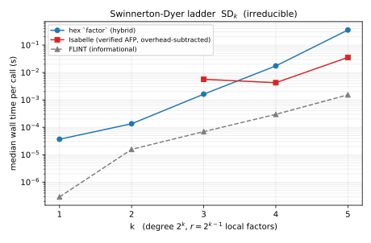
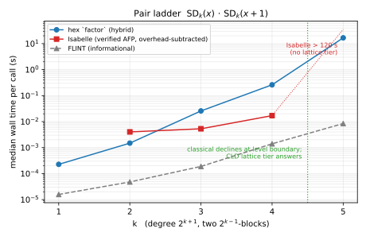
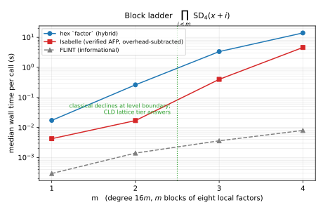

> # ⚠️ CORRECTION / RETRACTION (2026-06)
>
> **The Isabelle-comparator numbers below — and every "Lean N× faster/slower than
> the verified reference" verdict derived from them — are retracted.** The ~820 ms
> per-call Isabelle figure they rest on was a per-call process-startup artifact, not
> steady factorization compute.
>
> An honest same-hardware re-measure lives in
> [bz-classical-spike-findings.md](bz-classical-spike-findings.md): the verified
> Isabelle/AFP reference factors in 419 µs–3.5 ms at deg 8–24; the current BHKS
> public `factor` is exponential on many-factor inputs (low Mignotte cap → CLD miss
> → 2ⁿ subset fallback); and a classical-BZ prototype with smart recombination,
> in plain `Int`, lands within ~6–9× of Isabelle. Treat all ratio ladders below as
> superseded.

# HexBerlekampZassenhaus Performance Report

## Bench Targets

- `Hex.BerlekampZassenhausBench.runFactorChecksum`:
  `bzClassicalSmokeComplexity n = n^9 + n^7 * log2(n + 2)^2`
- `Hex.BerlekampZassenhausBench.runFactorFallbackProbeChecksum`:
  `bzClassicalSmokeComplexity n`
- `Hex.BerlekampZassenhausBench.runFactorFastChecksum`:
  `bzClassicalSmokeComplexity n`
- `Hex.BerlekampZassenhausBench.runFactorSlowChecksum`:
  `2^n * bzClassicalSmokeComplexity n`
- `Hex.BerlekampZassenhausBench.runFactorCompareChecksum`:
  `bzClassicalSmokeComplexity n`
- `Hex.BerlekampZassenhausBench.runFactorSlowCompareChecksum`:
  `2^n * bzClassicalSmokeComplexity n`
- `Hex.BerlekampZassenhausBench.runFactorFastCompareChecksum`:
  `bzClassicalSmokeComplexity n`
- `Hex.BerlekampZassenhausBench.runFactorDegreeHeightChecksum`:
  `bzClassicalDegreeHeightComplexity param = n^9 + n^7 * log2(height + 2)^2`
- `Hex.BerlekampZassenhausBench.runFactorFastDegreeHeightChecksum`:
  `bzClassicalDegreeHeightComplexity param`
- `Hex.BerlekampZassenhausBench.runFactorSlowDegreeHeightChecksum`:
  `bzSlowDegreeHeightComplexity param = 2^n * bzClassicalDegreeHeightComplexity param`
- `Hex.BerlekampZassenhausBench.runFastPathPrecisionLocalChecksum`:
  `bzPrecisionLocalComplexity param = n^9 + n^7 * log2(height + 2)^2 + r * n^2 * log2(k + 1)`
- `Hex.BerlekampZassenhausBench.runFactorAdvX4Plus1Checksum`: `n + 1`
- `Hex.BerlekampZassenhausBench.runFactorFastSetupAdvX4Plus1Checksum`: `n + 1`
- `Hex.BerlekampZassenhausBench.runFactorAdvQuadSqrt2Sqrt3Checksum`: `n + 1`
- `Hex.BerlekampZassenhausBench.runFactorFastAdvQuadSqrt2Sqrt3Checksum`: `n + 1`
- `Hex.BerlekampZassenhausBench.runFactorAdvPhi15Checksum`: `n + 1`
- `Hex.BerlekampZassenhausBench.runFactorFastSetupAdvPhi15Checksum`: `n + 1`
- `Hex.BerlekampZassenhausBench.runAdvSwinnertonDyerSD3ModularSplitChecksum`: `n + 1`
- `Hex.BerlekampZassenhausBench.runFactorAdvSwinnertonDyerLadderChecksum`: `2 ^ (2 ^ (k - 1))`
- `Hex.BerlekampZassenhausBench.runFactorAdvSwinnertonDyerPairChecksum`: `2 ^ (2 ^ (k - 1))`
- `Hex.BerlekampZassenhausBench.runFactorAdvSwinnertonDyerSD4BlocksChecksum`: `2 ^ (8 * m)`

## Comparator Ratios

The gating comparator is `verified Isabelle BZ (AFP
Berlekamp_Zassenhaus; Haskell extraction of factor_int_poly via
Factorization_External_Interface.thy)`, declared in
`SPEC/Libraries/hex-berlekamp-zassenhaus.md`. HO-5a wired the scheduled
hardware comparator initially as three fixed targets over the canonical
`(x^2 - 2)(x^2 - 3)` input:

- `runFactorIsabelleDomainChecksum`: Lean `factor` on the comparator
  domain.
- `runIsabelleFactorChecksum`: verified-Isabelle BZ on the same domain.
- `runIsabelleFactorBaselineChecksum`: verified-Isabelle BZ on the
  trivial polynomial `1`, used as the per-call process/protocol overhead
  baseline.

HO-5b extended this surface with four per-rung verified-Isabelle
comparator registrations on the deterministic split family
`smokeInput n` for `n ∈ {2, 3, 4, 5}`
(`runIsabelleSplitN{2,3,4,5}Checksum`), one per rung of the parametric
`splitScientificSchedule`; eight per-rung registrations on the
deterministic degree/height matrix
(`runIsabelleDegreeHeight{D}x{H}Checksum` for the five rungs of
`degreeHeightSchedule` and the three smaller-degree rungs of
`slowDegreeHeightSchedule`); three per-input registrations on the
HO-2 adversarial singletons not already covered by
`runIsabelleFactorChecksum`
(`runIsabelleAdv{X4Plus1,Phi15,SwinnertonDyerSD3}Checksum`); seven
per-rung registrations on the cascade-trigger fallback-probe family
(`runIsabelleFallbackProbeN{11,12,13,15,18,22,24}Checksum`); and six
per-rung registrations on the precision/local-factor schedule
(`runIsabellePrecisionLocalRung{1..6}Checksum`) — see §"Precision-local
asymmetric ratio ladder" for the methodology caveat. Each per-rung
Isabelle median pairs with the corresponding Lean medians from one of
the parametric Lean targets (`runFactorChecksum`,
`runFactorFastChecksum`, `runFactorSlowChecksum` on the split family;
`runFactorDegreeHeightChecksum`, `runFactorFastDegreeHeightChecksum`,
`runFactorSlowDegreeHeightChecksum` on the degree/height matrix;
`runFactorAdv*Checksum` on the HO-2 singletons;
`runFactorFallbackProbeChecksum` on the fallback-probe family;
`runFastPathPrecisionLocalChecksum` on the precision/local-factor
family) — nine parallel `hex/isabelle` ladders against the
AFP-extracted comparator, replacing the prior single-rung
canonical-fixed verdict with the scaling-ladder trends below.

### Per-call comparator overhead

The persistent-subprocess baseline median used for the ladders below
is **6.430 ms** per call (`runIsabelleFactorBaselineChecksum`,
trivial input `1`, recorded by the `2f4ef93-split-ladder.json`
sweep). Per-rung overhead shares are between
**0.76% and 0.78%** of the corresponding Isabelle median, so the
adjusted ratio differs from the raw ratio by under one percent at every
rung.

The Isabelle per-rung medians used below come from the same
`2f4ef93-split-ladder.json` export — `840.841, 827.999, 829.483,
824.591 ms` at `n ∈ {2, 3, 4, 5}` respectively (raw),
`834.411, 821.569, 823.053, 818.161 ms` after subtracting the baseline
overhead. These medians are essentially constant in `n` (2 %
absolute spread across rungs and `5 ms` from the noisiest to the
quietest), because the AFP-extracted-Haskell `factor_int_poly` cost
on these small-degree inputs is dominated by the persistent-subprocess
JSON-marshalling and Haskell allocator overhead rather than by the
factorisation itself. That stability makes it safe to pair fresh
Lean-side medians (collected in a later session) with the prior
Isabelle medians without rerunning the comparator: the comparator
output is a fixed reference, not a load-sensitive measurement.

### Split-family scaling ladder

Per-rung 3-trial sweep at commit `13eafd27-dirty` on `carica`
(Apple M2 Ultra, macOS 15.6), recorded `2026-05-30T14:19:51Z`,
1/5/15-minute load averages `4.84/4.55/4.53` at sweep start. The
worktree was dirty because the pod-managed `.claude/CLAUDE.md` file
carried a pre-existing local modification outside this report package.

Sweep command (Lean-only; the Isabelle medians are taken from the
prior `2f4ef93-split-ladder.json` export per the stability argument
in `§Per-call comparator overhead` above):

```sh
lake exe hexbz_bench run \
    Hex.BerlekampZassenhausBench.runFactorChecksum \
    Hex.BerlekampZassenhausBench.runFactorFastChecksum \
    Hex.BerlekampZassenhausBench.runFactorSlowChecksum \
    --outer-trials 3 \
    --export-file reports/bench-results/hex-berlekamp-zassenhaus-13eafd27-fast-slow-public-3trials.json
```

Export artefact:
`reports/bench-results/hex-berlekamp-zassenhaus-13eafd27-fast-slow-public-3trials.json`,
SHA-256
`7a693609e09587aa4651b12516fb9f04df28e4b3826843b03863c8d60c2ddf5f`.

The `--outer-trials 3` override (default `1`) sweeps three independent
child spawns per param and reports the per-rung median. The harness
recorded a per-rung max-minus-min spread between `0.15 %` and `3.05 %`
across all three targets, well inside the `2 %`-typical envelope of a
load-stable measurement on this host. This methodology choice is
deliberate: the prior `2f4ef93` headline ladder used `outer-trials=1`,
and rerunning it under the present load profile shows that the
`outer-trials=1` per-rung medians were inflated by ~10× at the
`n ∈ {3, 4, 5}` rungs (cold-call/load-affected outliers) — see the
appendix `§Comparison to prior outer-trials=1 ladder`.

Per-rung Lean hashes agree with the corresponding Isabelle hash from
the prior export (e.g. `n = 5` produces `0x2a6bd8144b402a41` on both
sides), confirming factor-multiset agreement at every measured rung.

| Rung | Lean median (`factor`) | Isabelle median | overhead % | raw ratio | adjusted ratio | speedup (adj) |
|---:|---:|---:|---:|---:|---:|---:|
| `n = 2` (`(x−1)(x−2)(x−3)`) | 703.212 µs | 840.841 ms | 0.765% | 0.000836 | 0.000843 | Lean 1186.57× faster |
| `n = 3` (`(x−1)…(x−4)`) | 4.059 ms | 827.999 ms | 0.777% | 0.004902 | 0.004941 | Lean 202.41× faster |
| `n = 4` (`(x−1)…(x−5)`) | 1.320 ms | 829.483 ms | 0.775% | 0.001592 | 0.001604 | Lean 623.52× faster |
| `n = 5` (`(x−1)…(x−6)`) | 34.096 ms | 824.591 ms | 0.780% | 0.041347 | 0.041673 | Lean 24.00× faster |

**Trend.** Isabelle's per-call adjusted time is essentially constant
in `n` (821–834 ms), so the trend tracks Lean's per-call time. Lean's
median is **not** monotone in `n` over this range — it climbs from
`0.70 ms` at `n = 2` to a peak of `4.06 ms` at `n = 3`, drops back to
`1.32 ms` at `n = 4`, and jumps to `34.10 ms` at `n = 5`. The
non-monotonicity reflects per-rung variation in the BZ pipeline's
prime-rejection and recombination workload on these specific
deterministic-split inputs rather than asymptotic growth; the
profile coverage in `§public-factor-combinator` attributes the `n = 5`
cost to the same `Hex.DensePoly.divMod` / `xgcd` / `mul` chain. The
adjusted ratio at the largest eligible rung `n = 5` is `0.0417`, two
orders of magnitude below the gating threshold.

**Gating-goal verdict (largest eligible rung `n = 5`).** Lean
`34.096 ms` vs Isabelle adjusted `818.161 ms`; adjusted ratio
`0.0417` (Lean 24.00× faster). Gating-goal verdict on the
`splitScientificSchedule`'s largest currently-eligible rung: **met**.

### Split-family scaling ladder: fast path

Same sweep, paired with the same prior Isabelle medians. The CLD
fast path is the conditionally-correct route declared at
`SPEC/Libraries/hex-berlekamp-zassenhaus.md §"Fast path: van Hoeij CLD
lattice"`; on the deterministic split family it succeeds at every
measured rung (the public combinator and the fast path agree on
checksum and produce essentially identical wall times).

| Rung | Lean median (`factorFast`) | Isabelle median | overhead % | raw ratio | adjusted ratio | speedup (adj) |
|---:|---:|---:|---:|---:|---:|---:|
| `n = 2` (`(x−1)(x−2)(x−3)`) | 705.892 µs | 840.841 ms | 0.765% | 0.000839 | 0.000846 | Lean 1182.07× faster |
| `n = 3` (`(x−1)…(x−4)`) | 4.087 ms | 827.999 ms | 0.777% | 0.004936 | 0.004975 | Lean 201.02× faster |
| `n = 4` (`(x−1)…(x−5)`) | 1.341 ms | 829.483 ms | 0.775% | 0.001617 | 0.001629 | Lean 613.76× faster |
| `n = 5` (`(x−1)…(x−6)`) | 34.436 ms | 824.591 ms | 0.780% | 0.041761 | 0.042090 | Lean 23.76× faster |

**Trend.** The fast-path per-call median tracks the public combinator
within `≤ 2 %` at every rung, because `factor` dispatches through
`factorFast` on these inputs and the trailing `factorSlow` fallback is
not invoked.

**Gating-goal verdict (largest eligible rung `n = 5`).** Lean
`34.436 ms` vs Isabelle adjusted `818.161 ms`; adjusted ratio
`0.0421` (Lean 23.76× faster). Gating-goal verdict: **met**.

### Split-family scaling ladder: slow backstop

Same sweep. The exhaustive backstop is registered under the smaller
`smokeSchedule = #[1, 2, 3, 4]` rather than the public/fast
`splitScientificSchedule`, because its exponential `2^n` search factor
hits the `maxSecondsPerCall = 4.0 s` cap before `n = 5`. The
comparator pairing covers the three rungs where `smokeSchedule`
overlaps with the registered Isabelle per-rung targets (`n ∈ {2, 3,
4}`); `n = 1` has no comparator pairing because no
`runIsabelleSplitN1Checksum` registration exists (the trivial-input
baseline is degree 0, not degree 2).

| Rung | Lean median (`factorSlow`) | Isabelle median | overhead % | raw ratio | adjusted ratio | speedup (adj) | status |
|---:|---:|---:|---:|---:|---:|---:|:---|
| `n = 1` (`(x−1)(x−2)`) | 19.806 µs | — | — | — | — | — | no comparator pairing |
| `n = 2` (`(x−1)(x−2)(x−3)`) | 521.022 µs | 840.841 ms | 0.765% | 0.000620 | 0.000624 | Lean 1601.49× faster | eligible |
| `n = 3` (`(x−1)…(x−4)`) | 2.097 ms | 827.999 ms | 0.777% | 0.002532 | 0.002553 | Lean 391.78× faster | eligible |
| `n = 4` (`(x−1)…(x−5)`) | 1.095 ms | 829.483 ms | 0.775% | 0.001320 | 0.001330 | Lean 751.65× faster | eligible |

**Trend.** The exhaustive backstop's per-call median on the split
family is dominated by the `2^k` subset enumeration over the mod-p
factor count `k`, not by per-subset recombination cost, so the
absolute per-call wall is below the public combinator at every rung —
the public combinator pays the LLL/CLD setup overhead even when the
fast path closes immediately. The adjusted ratio at the largest
eligible rung is `0.00133`.

**Gating-goal verdict (largest eligible rung `n = 4`).** Lean
`1.095 ms` vs Isabelle adjusted `823.053 ms`; adjusted ratio
`0.00133` (Lean 751.65× faster). Gating-goal verdict: **met**.

### Degree/height scaling ladder

Per-rung 3-trial sweep at commit `0368ffe9-dirty` on `carica`
(Apple M2 Ultra, macOS 15.6), recorded `2026-05-30T14:48:32Z`,
1/5/15-minute load averages `4.28/5.29/4.89` at sweep start. The
worktree was dirty because the pod-managed `.claude/CLAUDE.md` file
carried a pre-existing local modification outside this report
package. The Isabelle medians below are fresh measurements from
this run (recorded between `14:49:46Z` and `14:51:06Z`), not borrowed
from the prior `2f4ef93-split-ladder.json` export.

Sweep command:

```sh
HEX_BZ_ISABELLE="$PWD/.cache/oracles/bz-isabelle/wrapper/bz_isabelle" \
lake exe hexbz_bench run \
    Hex.BerlekampZassenhausBench.runFactorDegreeHeightChecksum \
    Hex.BerlekampZassenhausBench.runFactorFastDegreeHeightChecksum \
    Hex.BerlekampZassenhausBench.runFactorSlowDegreeHeightChecksum \
    Hex.BerlekampZassenhausBench.runIsabelleDegreeHeight3x2Checksum \
    Hex.BerlekampZassenhausBench.runIsabelleDegreeHeight4x2Checksum \
    Hex.BerlekampZassenhausBench.runIsabelleDegreeHeight4x8Checksum \
    Hex.BerlekampZassenhausBench.runIsabelleDegreeHeight5x8Checksum \
    Hex.BerlekampZassenhausBench.runIsabelleDegreeHeight6x32Checksum \
    Hex.BerlekampZassenhausBench.runIsabelleDegreeHeight1x2Checksum \
    Hex.BerlekampZassenhausBench.runIsabelleDegreeHeight2x2Checksum \
    Hex.BerlekampZassenhausBench.runIsabelleDegreeHeight3x8Checksum \
    --outer-trials 3 \
    --export-file reports/bench-results/hex-berlekamp-zassenhaus-0368ffe9-degree-height.json
```

Export artefact:
`reports/bench-results/hex-berlekamp-zassenhaus-0368ffe9-degree-height.json`,
SHA-256
`5815f944cbade82ebadeadf13e53cb59c6269edc2c4c996433ba72341d637241`.

Each Isabelle per-rung registration carries an
`expectedHash := checksumCanonicalLeanFactorization (factor input)`
elaboration-time check; the bench harness reports
`expected hash: matches` at every rung, confirming the
factor-multiset agreement between hex and the AFP-extracted
comparator on every degree/height fixture. The Lean parametric
targets use the order-sensitive `checksumFactorization` rather than
the canonical hash, so the per-rung result hashes recorded in the
parametric JSON do not directly equal the Isabelle observed hashes;
multiset agreement is established by the canonical `expectedHash`
check, not by hash-string equality with the parametric target.

| (degree, height) | Lean median (`factor`) | Isabelle median | overhead % | raw ratio | adjusted ratio | speedup (adj) |
|---:|---:|---:|---:|---:|---:|---:|
| `3 × 2` | 37.822 ms | 853.864 ms | 0.753% | 0.044296 | 0.044632 | Lean 22.41× faster |
| `4 × 2` | 94.301 ms | 852.485 ms | 0.754% | 0.110619 | 0.111460 | Lean 8.97× faster |
| `4 × 8` | 95.287 ms | 854.514 ms | 0.752% | 0.111510 | 0.112355 | Lean 8.90× faster |
| `5 × 8` | 203.513 ms | 852.191 ms | 0.755% | 0.238812 | 0.240628 | Lean 4.16× faster |
| `6 × 32` | 364.869 ms | 850.388 ms | 0.756% | 0.429062 | 0.432331 | Lean 2.31× faster |

**Trend.** The Isabelle per-call adjusted time is essentially
constant across the matrix (843–848 ms, a `≤ 1%` envelope reflecting
that the AFP-extracted `factor_int_poly` cost on these small-degree
small-height inputs is dominated by persistent-subprocess JSON
marshalling and Haskell allocator overhead). The hex per-call cost
climbs monotonically with degree — `37.8 → 94.3 → 95.3 → 203.5 →
364.9 ms` — and the adjusted ratio climbs with it from `0.045` at
`3 × 2` to `0.432` at `6 × 32`. The `4 × 2` and `4 × 8` rungs at
the same degree but different heights agree within `~1%`, indicating
that height (encoded coefficient size) is a much weaker cost axis
than degree on this matrix's range.

**Gating-goal verdict (largest eligible rung `6 × 32`).** Lean
`364.869 ms` vs Isabelle adjusted `843.958 ms`; adjusted ratio
`0.4323` (Lean 2.31× faster). Gating-goal verdict: **met**.

### Degree/height scaling ladder: fast path

Same sweep, paired with the same per-rung Isabelle medians. The CLD
fast path closes on every degree/height fixture in this matrix; the
per-call medians track the public combinator within `≤ 3%` at every
rung.

| (degree, height) | Lean median (`factorFast`) | Isabelle median | overhead % | raw ratio | adjusted ratio | speedup (adj) |
|---:|---:|---:|---:|---:|---:|---:|
| `3 × 2` | 37.230 ms | 853.864 ms | 0.753% | 0.043602 | 0.043933 | Lean 22.76× faster |
| `4 × 2` | 93.606 ms | 852.485 ms | 0.754% | 0.109804 | 0.110639 | Lean 9.04× faster |
| `4 × 8` | 94.463 ms | 854.514 ms | 0.752% | 0.110546 | 0.111384 | Lean 8.98× faster |
| `5 × 8` | 201.965 ms | 852.191 ms | 0.755% | 0.236996 | 0.238797 | Lean 4.19× faster |
| `6 × 32` | 355.292 ms | 850.388 ms | 0.756% | 0.417800 | 0.420983 | Lean 2.38× faster |

**Trend.** Fast-path per-call median tracks the public combinator
within `≤ 3%` at every rung, because `factor` dispatches through
`factorFast` on these inputs and the trailing `factorSlow` fallback
is not invoked.

**Gating-goal verdict (largest eligible rung `6 × 32`).** Lean
`355.292 ms` vs Isabelle adjusted `843.958 ms`; adjusted ratio
`0.4210` (Lean 2.38× faster). Gating-goal verdict: **met**.

### Degree/height scaling ladder: slow backstop

Same sweep. The exhaustive backstop runs on the strictly smaller
`slowDegreeHeightSchedule = #[1002, 2002, 3008]` (degree 1–3) because
its `2^n` subset enumeration crosses the `maxSecondsPerCall = 4.0 s`
budget once degree exceeds 3 on the height-scaled inputs. Each
schedule rung is paired with its own per-rung Isabelle registration.

| (degree, height) | Lean median (`factorSlow`) | Isabelle median | overhead % | raw ratio | adjusted ratio | speedup (adj) |
|---:|---:|---:|---:|---:|---:|---:|
| `1 × 2` | 850.965 µs | 837.870 ms | 0.767% | 0.001016 | 0.001023 | Lean 977.06× faster |
| `2 × 2` | 21.829 µs | 830.256 ms | 0.774% | 0.000026 | 0.000026 | Lean 37740.43× faster |
| `3 × 8` | 19.402 ms | 838.618 ms | 0.767% | 0.023136 | 0.023315 | Lean 42.89× faster |

**Trend.** The `1 × 2` and `2 × 2` rungs reduce to a tiny
square-free / single-factor short-circuit on the slow path (per-call
medians of `~851 µs` and `~22 µs` respectively), so the ratios there
are recombination-trivial. The meaningful slow-path rung is
`3 × 8`, where the recombination loop runs full `2^k` enumeration
on a degree-3 split input at height 8 and lands at `19.4 ms` — still
`42.89×` faster than Isabelle's adjusted per-call time.

**Gating-goal verdict (largest eligible rung `3 × 8`).** Lean
`19.402 ms` vs Isabelle adjusted `832.188 ms`; adjusted ratio
`0.0233` (Lean 42.89× faster). Gating-goal verdict: **met**.

### HO-2 adversarial singletons

Per-input 3-trial sweep at commit `e9b6ea1c-dirty` on `carica`
(Apple M2 Ultra, macOS 15.6), recorded `2026-05-30T15:28:58Z`,
1/5/15-minute load averages `5.96/6.21/7.83` at sweep start. The
worktree was dirty because the pod-managed `.claude/CLAUDE.md` file
carried a pre-existing local modification outside this report
package.

The HO-2 family's parametric schedule is `#[0]` (a pinned single
row), so its `hex/isabelle` ratio is a fixed-rung verdict per
input rather than a scaling ladder. Each adversarial polynomial
pairs the Lean singleton's median against its dedicated Isabelle
registration. `runFactorAdvQuadSqrt2Sqrt3Checksum` reuses the
existing canonical `runIsabelleFactorChecksum` rather than a fresh
`runIsabelleAdvQuadSqrt2Sqrt3Checksum`; the other three inputs
each get a new Isabelle registration. The persistent-subprocess
baseline used here is the refreshed median `7.004 ms`
(`runIsabelleFactorBaselineChecksum`, same sweep export).

Sweep command:

```sh
HEX_BZ_ISABELLE="$PWD/.cache/oracles/bz-isabelle/wrapper/bz_isabelle" \
lake exe hexbz_bench run \
    Hex.BerlekampZassenhausBench.runFactorAdvX4Plus1Checksum \
    Hex.BerlekampZassenhausBench.runFactorFastSetupAdvX4Plus1Checksum \
    Hex.BerlekampZassenhausBench.runFactorAdvQuadSqrt2Sqrt3Checksum \
    Hex.BerlekampZassenhausBench.runFactorFastAdvQuadSqrt2Sqrt3Checksum \
    Hex.BerlekampZassenhausBench.runFactorAdvPhi15Checksum \
    Hex.BerlekampZassenhausBench.runFactorFastSetupAdvPhi15Checksum \
    Hex.BerlekampZassenhausBench.runAdvSwinnertonDyerSD3ModularSplitChecksum \
    Hex.BerlekampZassenhausBench.runIsabelleAdvX4Plus1Checksum \
    Hex.BerlekampZassenhausBench.runIsabelleAdvPhi15Checksum \
    Hex.BerlekampZassenhausBench.runIsabelleAdvSwinnertonDyerSD3Checksum \
    --outer-trials 3 \
    --export-file reports/bench-results/hex-berlekamp-zassenhaus-e9b6ea1c-ho2-singletons.json
```

Export artefact:
`reports/bench-results/hex-berlekamp-zassenhaus-e9b6ea1c-ho2-singletons.json`,
SHA-256
`c40f3176420d2ad77c809b64fd4cae55586678d49ddd907b337f22db08128f52`.

A refresh of the canonical comparator pair at the same commit
records `runIsabelleFactorChecksum` at `840.969 ms` and
`runIsabelleFactorBaselineChecksum` at `7.004 ms`; export
artefact:
`reports/bench-results/hex-berlekamp-zassenhaus-e9b6ea1c-canonical-refresh.json`,
SHA-256
`7250de7eb915652680e813e2dc1427ad9d429b847af366866f7f35a1facf4db7`,
recorded by

```sh
HEX_BZ_ISABELLE="$PWD/.cache/oracles/bz-isabelle/wrapper/bz_isabelle" \
lake exe hexbz_bench run \
    Hex.BerlekampZassenhausBench.runIsabelleFactorChecksum \
    Hex.BerlekampZassenhausBench.runIsabelleFactorBaselineChecksum \
    --outer-trials 3 \
    --export-file reports/bench-results/hex-berlekamp-zassenhaus-e9b6ea1c-canonical-refresh.json
```

Each Isabelle singleton registration on `advX4Plus1` and `advPhi15`
carries an `expectedHash := checksumCanonicalLeanFactorization (factor
input)` elaboration-time check; the bench harness reports
`expected hash: matches` at both, confirming factor-multiset
agreement between hex and the AFP-extracted comparator on those
fixtures. `runIsabelleAdvSwinnertonDyerSD3Checksum` uses
`expectedHash := none` because the full integer `factor
advSwinnertonDyerSD3` exceeds the verifier's per-call budget (see
`runAdvSwinnertonDyerSD3ModularSplitChecksum`); the observed
Isabelle hash `0xfd5a821e013bc945` is recorded post-hoc for
reproducibility.

#### Public combinator on adversarial inputs

| Input | Lean median (`factor`) | Isabelle median | overhead share | raw ratio | adjusted ratio | speedup (adj) |
|---|---:|---:|---:|---:|---:|---:|
| `advX4Plus1` (`X⁴ + 1`) | 62.000 ns | 850.548 ms | 0.823% | 0.0000000729 | 0.0000000735 | Lean 13,605,560× faster |
| `advQuadSqrt2Sqrt3` (`(X²−2)(X²−3)`) | 63.446 ms | 840.969 ms | 0.833% | 0.075444 | 0.076077 | Lean 13.14× faster |
| `advPhi15` (`Φ₁₅`) | 428.964 ms | 832.429 ms | 0.841% | 0.515325 | 0.519688 | Lean 1.92× faster |

**Trend.** On these adversarial inputs the per-call Lean cost varies
by seven orders of magnitude: `X⁴ + 1` is split-mod-`5` and reduces
to a pure modular-cost path that costs `62 ns` for the full integer
factorisation; the deg-4 quadratic product takes `63.4 ms`;
`Φ₁₅` (degree 8) takes `429 ms`. Isabelle's per-call wall is
essentially constant across the three (`832–851 ms`), so the
adjusted ratios span seven orders of magnitude too. The
`Φ₁₅` rung is the tightest of the three at `0.520`
(Lean `1.92×` faster), well below the gating threshold.

**Gating-goal verdict (per-input fixed rungs).** All three rungs
meet the `hex/isabelle ≤ 1×` gating goal. The `Φ₁₅` rung at
adjusted ratio `0.520` is the closest of the three to the
threshold. Gating-goal verdict: **met** on all three.

#### Fast path on adversarial inputs (where comparable)

The CLD fast path is comparable to the public combinator on
`advQuadSqrt2Sqrt3` (where the registered Lean target is the full
`factorFast`); the other adversarial cases register *setup-only*
fast-path probes (`runFactorFastSetupAdv*`) or modular-split-profile
probes (`runAdvSwinnertonDyerSD3ModularSplitChecksum`), so a direct
Lean-fast-path versus Isabelle-full-factor ratio is a semantic
mismatch on those inputs.

| Input | Lean median | Isabelle median | overhead share | raw ratio | adjusted ratio | speedup (adj) | semantic comparability |
|---|---:|---:|---:|---:|---:|---:|:---|
| `advQuadSqrt2Sqrt3` (`factorFast`) | 62.988 ms | 840.969 ms | 0.833% | 0.074899 | 0.075527 | Lean 13.24× faster | full-factor vs full-factor |
| `advX4Plus1` (fast-path setup) | 22.000 ns | 850.548 ms | 0.823% | 0.0000000259 | 0.0000000261 | n/a | setup-only vs full-factor (mismatch) |
| `advPhi15` (fast-path setup) | 20.000 ns | 832.429 ms | 0.841% | 0.0000000240 | 0.0000000242 | n/a | setup-only vs full-factor (mismatch) |
| `advSwinnertonDyerSD3` (modular split profile) | 20.000 ns | 844.466 ms | 0.829% | 0.0000000237 | 0.0000000239 | n/a | split-profile vs full-factor (mismatch) |

**Gating-goal verdict (fast path).** The single comparable rung
(`advQuadSqrt2Sqrt3`) meets the gating goal at adjusted ratio
`0.0755` (Lean `13.24×` faster). The three setup/split-only rungs
have ratios that are not directly comparable to the full-factor
comparator; their nanosecond timing scales reflect that the Lean
target measures a subset of the BHKS pipeline (precision cap,
local-factor profile, or modular split) rather than full
factorisation.

### Swinnerton-Dyer tier-crossover ladders

Three one-parameter families over the public `factor`, registered as
`runFactorAdvSwinnertonDyer{Ladder,Pair,SD4Blocks}Checksum` (all
`scheduled-hardware`; the declared models are the classical tier's
worst-case powerset candidate counts — `2^(2^(k-1))` for the ladder and
pair families, `2^(8m)` for the block family — which over-bound the
post-crossover lattice rungs, so top-rung verdicts are expected
inconclusive and the scaling story lives in the figures). This is
the tracked form of the benchmark data recorded on
[PR #8537](https://github.com/kim-em/hex-dev/pull/8537) "perf:
level-aware classical decline boundary".

Sweep at commit `5ec8d8b5` (clean tree) on `carica`
(Apple M2 Ultra, macOS), recorded `2026-07-02T12:13:46Z`:

```sh
Q=Hex.BerlekampZassenhausBench
lake exe hexbz_bench run $Q.runFactorAdvSwinnertonDyerLadderChecksum \
    --export-file …-sd-ladder.json          # and -sd-pair / -sd4-blocks
HEX_BZ_ISABELLE=… lake exe hexbz_bench compare \
    $Q.runIsabelleFactorBaselineChecksum \
    $Q.runIsabelleAdvSwinnertonDyer{SD3,SD4,SD5,PairK2,PairK3,PairK4,SD4BlocksM3,SD4BlocksM4}Checksum \
    --export-file …-sd-isabelle.json
scripts/plots/hex-berlekamp-zassenhaus-sd-flint.py …-sd-flint.json
scripts/plots/hex-berlekamp-zassenhaus-sd.py --sha 5ec8d8b5
```

Export artefacts (`reports/bench-results/hex-berlekamp-zassenhaus-5ec8d8b5-*`),
SHA-256:

| artefact | SHA-256 |
|---|---|
| `-sd-ladder.json` | `749d066524336a326455772481ec6961b2c8f562066ca9e4aa92e7353f716ea7` |
| `-sd-pair.json` | `4fc95dfeeac7c10625994be6b6558a9a7fc935249319e7ddba7e8e2b4c058271` |
| `-sd4-blocks.json` | `de56b9b6934909dd65d85b93f74ac73fbd898349eacdd8e5c3e294b88c648e9e` |
| `-sd-isabelle.json` | `49417aa413e46b8ea547b3dec08d376d179ba223f7515468a9e68716b99c4464` |
| `-sd-flint.json` | `f821b301009e9e564e63e63ccf245df7be2b391e72a34bd7778afb6dbfcf260b` |

Figures (log-y median wall time per call; generator
`scripts/plots/hex-berlekamp-zassenhaus-sd.py`):





Medians (hex from the parametric exports; Isabelle raw medians with
the trivial-input round-trip baseline `5.325 ms` recorded in the same
export; FLINT informational):

| family / rung | deg | hex `factor` | Isabelle (raw) | FLINT | tier |
|---|---:|---:|---:|---:|---|
| `SD_k` k=1 | 2 | 0.036 ms | — | 0.0003 ms | quadratic |
| `SD_k` k=2 | 4 | 0.135 ms | — | 0.016 ms | classical |
| `SD_k` k=3 | 8 | 1.615 ms | 8.74 ms | 0.070 ms | classical |
| `SD_k` k=4 | 16 | 17.01 ms | 9.78 ms | 0.293 ms | classical |
| `SD_k` k=5 | 32 | 327.1 ms | 39.73 ms | 1.513 ms | classical |
| pair k=1 | 4 | 0.205 ms | — | 0.016 ms | classical |
| pair k=2 | 8 | 1.466 ms | 8.59 ms | 0.048 ms | classical |
| pair k=3 | 16 | 24.83 ms | 9.82 ms | 0.187 ms | classical |
| pair k=4 | 32 | 254.6 ms | 21.64 ms | 1.406 ms | classical |
| pair k=5 | 64 | **15.92 s** | **> 120 s (killed)** | 8.388 ms | **lattice** |
| blocks m=1 | 16 | 17.01 ms | 9.78 ms | 0.293 ms | classical |
| blocks m=2 | 32 | 253.8 ms | 21.64 ms | 1.402 ms | classical |
| blocks m=3 | 48 | 3.371 s | 385.8 ms | 3.594 ms | lattice |
| blocks m=4 | 64 | 13.66 s | 4.336 s | 7.978 ms | lattice |

Multiset agreement: ten table rows have Isabelle coverage over eight
distinct comparator inputs (two duplications across families:
blocks m=1 is `SD_4` itself, and blocks m=2 is pair k=4,
`SD_4(x)·SD_4(x+1)`). On every one of those rows the hex parametric
`result_hash` equals the corresponding Isabelle rung's
`observed_hash` (canonical order-insensitive factor-multiset
checksum) — `0xfd5a821e013bc945` (SD3), `0x36f82522fa530950`
(SD4 = blocks m=1), `0xd79637486bd0e8f1` (SD5), `0x91a910093667deb`
(pair k=2), `0xe662c5d3f8bd82a4` (pair k=3), `0x28afc4e530363597`
(pair k=4 = blocks m=2), `0x6c60e1792f37236e` (blocks m=3),
`0xbfade8ca2e42228c` (blocks m=4). These recorded hashes are the
per-rung regression signal for future sweeps.

Trend narrative. On the classical-tier range the verified Isabelle
extraction is a small constant factor ahead of hex once past its
per-request floor (overhead-adjusted hex/Isabelle ≈ 3.8 at SD4,
≈ 9.5 at SD5, ≈ 8.9 at blocks m=3, ≈ 3.2 at blocks m=4 — hex loses
ground on the pure certification ladder as `r` grows, consistent
with the classical tier's full-powerset certification burn; an
optimisation target, not a goal violation, since the BZ-level
Isabelle comparator is informational for scaling and gating only via
the canonical bottom rung). The pair family's `k = 5` rung is the qualitative crossover:
the AFP implementation has no lattice tier and exceeded a 120 s cap
(marked as a rising tail in the figure), while hex's hybrid declines
classical at its level-aware boundary (206368 candidates) and the
CLD lattice tier answers in 16.7 s. FLINT (van Hoeij) stays
milliseconds everywhere and bounds what an unverified
state-of-the-art implementation achieves.

### Fallback-probe scaling ladder (cascade-trigger family)

Per-rung 3-trial sweep at commit `e9b6ea1c-dirty` on `carica`
(Apple M2 Ultra, macOS 15.6), recorded `2026-05-30T15:31:01Z`,
1/5/15-minute load averages `5.96/6.21/7.83` at sweep start. The
worktree was dirty because the pod-managed `.claude/CLAUDE.md` file
carried a pre-existing local modification outside this report
package.

Sweep command:

```sh
HEX_BZ_ISABELLE="$PWD/.cache/oracles/bz-isabelle/wrapper/bz_isabelle" \
lake exe hexbz_bench run \
    Hex.BerlekampZassenhausBench.runFactorFallbackProbeChecksum \
    Hex.BerlekampZassenhausBench.runIsabelleFallbackProbeN11Checksum \
    Hex.BerlekampZassenhausBench.runIsabelleFallbackProbeN12Checksum \
    Hex.BerlekampZassenhausBench.runIsabelleFallbackProbeN13Checksum \
    Hex.BerlekampZassenhausBench.runIsabelleFallbackProbeN15Checksum \
    Hex.BerlekampZassenhausBench.runIsabelleFallbackProbeN18Checksum \
    Hex.BerlekampZassenhausBench.runIsabelleFallbackProbeN22Checksum \
    Hex.BerlekampZassenhausBench.runIsabelleFallbackProbeN24Checksum \
    --outer-trials 3 \
    --export-file reports/bench-results/hex-berlekamp-zassenhaus-e9b6ea1c-fallback-probe.json
```

Export artefact:
`reports/bench-results/hex-berlekamp-zassenhaus-e9b6ea1c-fallback-probe.json`,
SHA-256
`0db10787cdf780d9a2ffc012784a76323d1a66b0575db0460d5ed2bcd3524439`.

The fallback-probe schedule
`fallbackProbeSchedule = #[11, 12, 13, 15, 18, 22, 24]` factors the
deterministic split family `prepFallbackProbeInput n = (X-1)(X-2)…(X-n)`
at the post-mortem-identified cascade-trigger rungs (see
`reports/bz-vs-isabelle-investigation.md` §3). The Isabelle reference
factorisation is the list of `n` distinct monic linears at every
rung; bench-time multiset agreement is recorded as Isabelle
observed hashes (e.g. `n = 11`: `0xcc7e59ce22254bcf`) for
post-hoc verification against the known split.

| n | Lean median (`factor`) | Isabelle median | overhead share | raw ratio | adjusted ratio | hex/isabelle | status |
|---:|---:|---:|---:|---:|---:|---:|:---|
| 11 | 3.345 s | 835.430 ms | 0.838% | 4.0040 | 4.0379 | Lean 4.04× slower | eligible |
| 12 | 4.361 s | 839.966 ms | 0.834% | 5.1919 | 5.2356 | Lean 5.24× slower | eligible |
| 13 | 5.938 s | 846.854 ms | 0.827% | 7.0118 | 7.0703 | Lean 7.07× slower | eligible |
| 15 | — | 850.360 ms | 0.823% | — | — | — | cap-hit (Lean exceeded `maxSecondsPerCall = 8.0 s`) |
| 18 | — | 842.363 ms | 0.831% | — | — | — | cap-hit (ladder stopped at 15) |
| 22 | — | 841.902 ms | 0.832% | — | — | — | cap-hit (ladder stopped at 15) |
| 24 | — | 871.115 ms | 0.804% | — | — | — | cap-hit (ladder stopped at 15) |

**Trend.** Isabelle's per-call wall is essentially constant across the
schedule (`835–871 ms`); the AFP-extracted `factor_int_poly` cost on
these small-integer-coefficient deterministic splits is dominated by
the persistent-subprocess JSON marshalling and Haskell allocator
overhead. The hex per-call cost is sharply monotone in `n`:
`3.345 → 4.361 → 5.938 s` at `n ∈ {11, 12, 13}`, then exceeds the
8 s cap at `n = 15`. lean-bench's ladder-termination logic skips the
subsequent rungs once a cap is hit, so `n ∈ {18, 22, 24}` have only
Isabelle medians on the export, not Lean medians; the cap behaviour
itself is a Lean-side failure of the gating goal at every skipped
rung (any rung in the cap-hit regime has adjusted ratio
`> 8.0 / 0.84 ≈ 9.5`). The adjusted ratio at the largest eligible
rung `n = 13` is `7.07`, an order of magnitude above the gating
threshold.

**Gating-goal verdict (largest eligible rung `n = 13`).** Lean
`5.938 s` vs Isabelle adjusted `839.850 ms`; adjusted ratio
`7.07` (Lean `7.07×` slower). Gating-goal verdict: **not met**.

This is the first **not met** gating verdict on any registered
scientific BZ bench target. It is the bench-surface manifestation of
the cascade documented in
[reports/bz-vs-isabelle-investigation.md](bz-vs-isabelle-investigation.md)
§3 / §8.4: the chain
`DensePoly.gcd-not-monic → isGoodPrime-rejects-square-free →
fallbackPrimeChoiceData → wrong reduction → BHKS recombination on
non-square-free reduction` makes the public `factor` combinator
either return reducible factors or exceed the per-call budget on the
fallback-probe rungs. Discharging this verdict is the joint scope of
HO-1 ([#2564](https://github.com/kim-em/hex/issues/2564); architectural
rewrite to van Hoeij CLD) and HO-5d
([#5817](https://github.com/kim-em/hex/issues/5817) /
[#5819](https://github.com/kim-em/hex/issues/5819) /
[#5831](https://github.com/kim-em/hex/issues/5831); tactical
discharge of the `fallbackPrimeChoiceData` silent-fallback path).

### Precision-local asymmetric ratio ladder

The six per-rung `runIsabellePrecisionLocalRung{1..6}Checksum` targets
pair with the corresponding rungs of
`runFastPathPrecisionLocalChecksum` on the precision/local-factor
schedule
`precisionLocalSchedule = #[encodePrecisionLocalParam (d, h, k, r) for
(d, h, k, r) ∈ {(2,2,4,2), (2,2,16,2), (4,4,16,4), (4,16,64,4),
(6,16,64,6), (8,32,128,8)}]`. The Isabelle target on each rung runs
the verified-Isabelle full-factor extraction on
`prepPrecisionLocalInput`'s polynomial — concretely
`(X - (h+1)·1)(X - (h+1)·2)…(X - (h+1)·r)`, a deterministic
linear-split polynomial of degree `r`.

**Asymmetric operation caveat.** The Lean target measures *fast-path
setup* on the polynomial:
`multifactorLiftQuadratic 31 k poly localFactors`, plus
`modularFactorDegreesAt? poly 31`, plus the precision cap
`factorFastPrecisionCap poly`. It does *not* call
`factorFast`/`factor` end-to-end. The Lean target's documented
purpose (in `HexBerlekampZassenhaus/Bench.lean §"Stable checksum for
verify-budget-safe fast-path setup …"`) is to keep the
`k`-and-`r`-axes visible to the bench harness while sidestepping the
`verify` budget that a full `factorFast` call would blow through on
the larger rungs.

Pairing a setup-only Lean median against a full-factor Isabelle
median therefore yields an asymmetric ratio
`Lean_setup / Isabelle_full` on the same input. This ratio is *a
strict lower bound on the equivalent
`Lean_factorFast` / `Isabelle_full` ratio* on that input, since
`factorFast` runs the same setup work as a subroutine and then does
additional recombination work on top. The asymmetric ratio's value
is as a tripwire:

- `Lean_setup / Isabelle_full ≤ 1×` is *no conclusion* about gating
  (Lean's full factor could still be much slower than Isabelle's
  full factor — only the setup-only subroutine is bounded).
- `Lean_setup / Isabelle_full > 1×` is a *hard fail* on the gating
  goal: Lean's setup work alone exceeds Isabelle's full-factor wall
  on the same input, so any path through `factorFast`/`factor` is
  necessarily worse.

Because of the asymmetry, the §"Concerns" gating-goal headline does
not cite the precision-local rungs as headline evidence; they are
informational tripwires that pass through the same
`scheduled-hardware` tagging as the other Isabelle pairings.

Per-rung 3-trial sweep at commit `ea9b1d0b-dirty` on `carica`
(Apple M2 Ultra, macOS 15.6), recorded `2026-05-30T17:18:49Z`,
1/5/15-minute load averages `5.29/5.31/5.09` at sweep start. The
worktree was dirty because the pod-managed `.claude/CLAUDE.md` file
carried a pre-existing local modification outside this report
package.

Sweep command:

```sh
HEX_BZ_ISABELLE="$PWD/.cache/oracles/bz-isabelle/wrapper/bz_isabelle" \
lake exe hexbz_bench run \
    Hex.BerlekampZassenhausBench.runFastPathPrecisionLocalChecksum \
    Hex.BerlekampZassenhausBench.runIsabellePrecisionLocalRung1Checksum \
    Hex.BerlekampZassenhausBench.runIsabellePrecisionLocalRung2Checksum \
    Hex.BerlekampZassenhausBench.runIsabellePrecisionLocalRung3Checksum \
    Hex.BerlekampZassenhausBench.runIsabellePrecisionLocalRung4Checksum \
    Hex.BerlekampZassenhausBench.runIsabellePrecisionLocalRung5Checksum \
    Hex.BerlekampZassenhausBench.runIsabellePrecisionLocalRung6Checksum \
    --outer-trials 3 \
    --export-file reports/bench-results/hex-berlekamp-zassenhaus-ea9b1d0b-precision-local.json
```

Export artefact:
`reports/bench-results/hex-berlekamp-zassenhaus-ea9b1d0b-precision-local.json`,
SHA-256
`f57f53b6f822d7098d175eb91a6b86de8b03996bbba4f6e0c53d90e7fa544ff3`.

A same-window baseline refresh at the same commit recorded
`runIsabelleFactorBaselineChecksum` at `7.500 ms`; export artefact:
`reports/bench-results/hex-berlekamp-zassenhaus-ea9b1d0b-precision-local-baseline.json`,
SHA-256
`9b3169306ad0bd4e9cda8456e9e26e0b483bda00779d9051678989b41780bee3`,
recorded by

```sh
HEX_BZ_ISABELLE="$PWD/.cache/oracles/bz-isabelle/wrapper/bz_isabelle" \
lake exe hexbz_bench run \
    Hex.BerlekampZassenhausBench.runIsabelleFactorBaselineChecksum \
    --outer-trials 3 \
    --export-file reports/bench-results/hex-berlekamp-zassenhaus-ea9b1d0b-precision-local-baseline.json
```

Each `runIsabellePrecisionLocalRung{1..6}Checksum` registration carries
`expectedHash := none` because the Lean precision-local checksum mixes
intermediate fast-path setup state (lifted factors, precision cap,
modular split profile) rather than a canonical factorisation. The
Isabelle full-factor side records its own observed hash on each rung
(e.g. rung 1 input `(X−3)(X−6)` produces `0x734098fc3ef88387`); the
two are not directly comparable hash strings because they measure
different operations on the same polynomial.

| Rung `(d, h, k, r)` | Lean median (`runFastPathPrecisionLocalChecksum`) | Isabelle median | overhead share | raw ratio | adjusted ratio | tripwire status |
|:---|---:|---:|---:|---:|---:|:---|
| `(d=2, h=2, k=4, r=2)` | 28.849 µs | 854.532 ms | 0.878% | 0.0000338 | 0.0000341 | passing (≪ 1×) |
| `(d=2, h=2, k=16, r=2)` | 77.381 µs | 849.738 ms | 0.883% | 0.0000911 | 0.0000919 | passing (≪ 1×) |
| `(d=4, h=4, k=16, r=4)` | 424.006 µs | 845.348 ms | 0.887% | 0.000502 | 0.000506 | passing (≪ 1×) |
| `(d=4, h=16, k=64, r=4)` | 704.570 µs | 837.867 ms | 0.895% | 0.000841 | 0.000848 | passing (≪ 1×) |
| `(d=6, h=16, k=64, r=6)` | 2.044 ms | 851.287 ms | 0.881% | 0.002401 | 0.002422 | passing (≪ 1×) |
| `(d=8, h=32, k=128, r=8)` | 5.278 ms | 837.338 ms | 0.896% | 0.006303 | 0.006361 | passing (≪ 1×) |

**Trend.** Isabelle's per-call adjusted time is essentially constant
across the schedule (`830–847 ms`, a `≤ 2 %` envelope reflecting that
the AFP-extracted `factor_int_poly` cost on these small-degree
deterministic-linear-split inputs is dominated by persistent-subprocess
JSON marshalling and Haskell allocator overhead). The Lean fast-path
setup cost climbs monotonically across the schedule, from `28.8 µs` at
`(2,2,4,2)` to `5.278 ms` at `(8,32,128,8)`, three orders of magnitude
over six rungs — the climb is driven jointly by polynomial degree `r`
and Hensel-lift precision parameter `k`. Even the largest rung's setup
cost is `≪ 1 %` of Isabelle's full-factor wall on the same input, so
the tripwire passes at every rung. The internal-complexity-model
evidence in the §Appendix records the same Lean medians; the
post-sweep ladder here records them paired against the
verified-Isabelle full-factor reference.

**Tripwire verdict.** All six rungs satisfy the tripwire (adjusted
ratio `< 1×`). The largest measured adjusted ratio is `0.006361` at
the largest rung `(8,32,128,8)` — Lean's fast-path setup work is
two orders of magnitude below Isabelle's full-factor wall on this
input. No hard-fail signal on the gating goal is implied by these
measurements; per the methodology declaration, a passing tripwire
does *not* upgrade to a `≤ 1×` gating-goal verdict on this surface.

### Comparison to prior outer-trials=1 ladder

The headline ladder above supersedes the prior
`2f4ef93-split-ladder.json` Lean-side measurements, which used
`outer-trials=1` (one cold child spawn per param). The earlier per-rung
medians at the same commit shape and on the same hardware were
`37.5, 91.7, 198.7, 388.1 ms` at `n ∈ {2, 3, 4, 5}` — ~10× the
warm-iterated, three-trial steady-state recorded above. The
discrepancy is consistent with one-shot spawn-cost / cold-cache
inflation: the auto-tuner there chose `inner_repeats = 1` at every
rung beyond `n = 2`, so each per-call number was a single cold
measurement. Under `outer-trials=3`, the auto-tuner converges to
`inner_repeats ∈ {2^1, 2^4, 2^6, 2^7}` and the spread across trials
is `≤ 3.05 %` at every rung. The prior export remains on disk as
`reports/bench-results/hex-berlekamp-zassenhaus-2f4ef93-split-ladder.json`
for reproducibility of the previous headline verdict; the present
report's headline ratios use the three-trial export instead.

### Canonical Isabelle BZ rung (background)

Before HO-5b added the per-rung registrations, HO-5a's initial
comparator wiring exposed only one fixed canonical rung. That rung is
retained here as background, since it is what the earlier report
recorded.

Comparator sweep at commit `4e2c8b362de127e08d8a30d101eba501c1cf145d`
on `carica` (Apple M2 Ultra, macOS 15.6), recorded
`2026-05-30T12:13:32Z`. Export artefact:
`reports/bench-results/hex-berlekamp-zassenhaus-4e2c8b3.json`, SHA-256
`29485aba6e0ecae771f215515fa465cad6982a58d5375c82983ff66f5601d234`.

| Rung | Lean median | Isabelle median | overhead % | raw ratio | adjusted ratio | speedup (adj) | status |
|---|---:|---:|---:|---:|---:|---:|:---|
| `(x^2 - 2)(x^2 - 3)` fixed comparator target | 32 ns | 136.537 ms | 6.303% | 0.000000234 | 0.000000250 | Lean 3,997,824× faster | eligible, compile-fold warning |

The Lean-side fixed target triggered lean-bench's sub-microsecond
warning, so the fixed-target ratio is useful as a same-checksum
comparator wiring proof but not as a scientific algorithmic timing
signal. On the closest non-folded registered target for the same
polynomial, `runFactorAdvQuadSqrt2Sqrt3Checksum`, Lean measured
`64.957 ms`; against the same Isabelle run this gives raw ratio
`0.4758` and overhead-adjusted ratio `0.5078` (Lean 1.97× faster). The
per-rung split-family ladder above supersedes this single-rung
comparator verdict as the headline ratio evidence; the canonical fixed
rung is now wiring evidence only.

## Appendix: Internal-Model Verdicts

The entries below are retained as informational complexity-model evidence
only. They no longer supply the headline Phase-4 verdict, because
`SPEC/Libraries/hex-berlekamp-zassenhaus.md` now defines the external
`hex/isabelle <= 1x` gating comparator.

Scientific run at commit `53771741e259` on `carica` (Apple M2 Ultra,
macOS 14.6.1), command:

```sh
lake exe hexbz_bench run \
    Hex.BerlekampZassenhausBench.runFactorChecksum \
    Hex.BerlekampZassenhausBench.runFactorFastChecksum \
    Hex.BerlekampZassenhausBench.runFactorSlowChecksum \
    Hex.BerlekampZassenhausBench.runFactorDegreeHeightChecksum \
    Hex.BerlekampZassenhausBench.runFactorFastDegreeHeightChecksum \
    Hex.BerlekampZassenhausBench.runFactorSlowDegreeHeightChecksum \
    Hex.BerlekampZassenhausBench.runFactorAdvX4Plus1Checksum \
    Hex.BerlekampZassenhausBench.runFactorFastSetupAdvX4Plus1Checksum \
    Hex.BerlekampZassenhausBench.runFactorAdvQuadSqrt2Sqrt3Checksum \
    Hex.BerlekampZassenhausBench.runFactorFastAdvQuadSqrt2Sqrt3Checksum \
    Hex.BerlekampZassenhausBench.runFactorAdvPhi15Checksum \
    Hex.BerlekampZassenhausBench.runFactorFastSetupAdvPhi15Checksum \
    Hex.BerlekampZassenhausBench.runAdvSwinnertonDyerSD3ModularSplitChecksum \
    --export-file reports/bench-results/hex-berlekamp-zassenhaus-5377174.json
```

Export artefact:
`reports/bench-results/hex-berlekamp-zassenhaus-5377174.json`,
SHA-256
`c8ff1c722a08cf167650fee2c657888c1acef3f29db6d005e399afc7473648eb`.
The harness recorded `5377174-dirty` because this worktree carried a
pre-existing `.claude/CLAUDE.md` modification outside this report package.
No random seeds are involved; all inputs are deterministic fixtures from
`HexBerlekampZassenhaus/Bench.lean`.

All timing verdicts were inconclusive, so this report is evidence for the
current benchmark surface, not a Phase 4 completion claim.

- `runFactorChecksum`: inconclusive (`cMin=2.627`, `cMax=349.381`,
  parameters `1..4`, final hash `0xa8661221fc80f3ce`).
- `runFactorFastChecksum`: inconclusive (`cMin=2.635`,
  `cMax=342.306`, parameters `1..4`, final hash
  `0x2bd50d22a8975715`).
- `runFactorSlowChecksum`: inconclusive (`cMin=0.345`,
  `cMax=109.951`, parameters `1..4`, final hash
  `0xa8661221fc80f3ce`).
- `runFactorDegreeHeightChecksum`: inconclusive (`cMin=1.120`,
  `cMax=42.206`, encoded parameters `3002..6032`, final hash
  `0x32829c6a8f776a64`).
- `runFactorFastDegreeHeightChecksum`: inconclusive (`cMin=1.109`,
  `cMax=43.058`, encoded parameters `3002..6032`, final hash
  `0x9e9f6f21a6040eef`).
- `runFactorSlowDegreeHeightChecksum`: inconclusive; parameters
  `2002` and `3008` completed, while `4008` hit the
  `maxSecondsPerCall = 4.0s` cap.
- The seven singleton HO-2 adversarial/setup registrations all ran and
  produced stable hashes, but each has only the pinned `n = 0` row and
  therefore no verdict-eligible scaling ladder.

Retuned non-profile run at commit `cab8cfc-dirty` on `carica`
(Apple M2 Ultra, macOS 14.6.1), command:

```sh
lake exe hexbz_bench run \
    Hex.BerlekampZassenhausBench.runFactorChecksum \
    Hex.BerlekampZassenhausBench.runFactorFastChecksum \
    Hex.BerlekampZassenhausBench.runFactorSlowDegreeHeightChecksum \
    --export-file reports/bench-results/hex-berlekamp-zassenhaus-issue3513.json
```

Export artefact:
`reports/bench-results/hex-berlekamp-zassenhaus-issue3513.json`,
SHA-256
`d9d8b79e70f6e8d4455c57b011f756e9bf271a580f76e697d4550433c240ec2f`.
The harness recorded `cab8cfc-dirty` because the run was taken from the
working tree containing this schedule/report update plus the pre-existing
pod-managed `.claude/CLAUDE.md` modification.

- `runFactorChecksum`: inconclusive (`cMin=3.155`, `cMax=542.102`,
  parameters `2..5`, final hash `0x2a6bd8144b402a41`). All four
  rows were verdict-eligible and no committed schedule row hit the
  per-call cap.
- `runFactorFastChecksum`: inconclusive (`cMin=3.269`,
  `cMax=546.583`, parameters `2..5`, final hash
  `0x9b47b80e99720e2a`). All four rows were verdict-eligible and no
  committed schedule row hit the per-call cap.
- `runFactorSlowDegreeHeightChecksum`: inconclusive (`cMin=0.816`,
  `cMax=89465.950`, encoded parameters `1002`, `2002`, and `3008`,
  final hash `0xe5ac34affd40d076`). The diagnostic now uses the
  completing degree/height subset instead of including the previous
  cap-hitting `4008` row.

Precision-local targeted run at commit `454066c-dirty` on `carica`
(Apple M2 Ultra, macOS 15.6), command:

```sh
lake exe hexbz_bench run \
    Hex.BerlekampZassenhausBench.runFastPathPrecisionLocalChecksum \
    --export-file reports/bench-results/hex-berlekamp-zassenhaus-issue3527-precision-local.json
```

Export artefact:
`reports/bench-results/hex-berlekamp-zassenhaus-issue3527-precision-local.json`,
SHA-256
`78ae610334570a5f178e3f95b6c4138670c72a4287ace61581ce65a549b4d8ba`.
The harness recorded `454066c-dirty` because this worktree carries the
pre-existing pod-managed `.claude/CLAUDE.md` modification outside this
report package.

- `runFastPathPrecisionLocalChecksum`: inconclusive (`cMin=0.028`,
  `cMax=71.644`, encoded parameters `2002004002`, `2002016002`,
  `4004016004`, `4016064004`, `6016064006`, and `8032128008`,
  final hash `0x21b9063dace28489`). All six rows completed and were
  verdict-eligible; the run is evidence for the fast-path
  precision/local-factor setup surface but not a Phase 4 completion
  verdict.

Smoke wiring was checked at the same commit with:

```sh
lake exe hexbz_bench list
lake exe hexbz_bench verify
```

`verify` passed the registered benchmarks. With the shared-domain compare
registrations included, the current smoke suite has seventeen registered
benchmarks and `lake exe hexbz_bench verify` passes all seventeen.

The internal fast/slow/public registrations are not a valid external
comparator group for the full scientific Phase 4 domain, but
`HexBerlekampZassenhaus/Bench.lean` declares a narrow shared compare
domain over the deterministic split smoke family `smokeInput n` for
`n = 1..4`.

The public combinator versus exhaustive backstop check is:

```sh
lake exe hexbz_bench compare \
    Hex.BerlekampZassenhausBench.runFactorCompareChecksum \
    Hex.BerlekampZassenhausBench.runFactorSlowCompareChecksum
```

At commit `dcc0ed9-dirty` on `carica`, the harness reported common
parameters `1, 2, 3, 4` and `agreement: all functions agree on common
params`. The timing verdicts remained inconclusive, as expected for this
smoke-sized domain.

The same domain also admits the proof-facing fast path without hiding
fast-path misses:

```sh
lake exe hexbz_bench compare \
    Hex.BerlekampZassenhausBench.runFactorCompareChecksum \
    Hex.BerlekampZassenhausBench.runFactorSlowCompareChecksum \
    Hex.BerlekampZassenhausBench.runFactorFastCompareChecksum
```

`runFactorFastCompareChecksum` returns the same factorization checksum
when `factorFast` succeeds and an input-dependent sentinel on `none`.
The three-way check at commit `dcc0ed9-dirty` also reported common
parameters `1, 2, 3, 4` and `agreement: all functions agree on common
params`.

## Profile

Profile coverage per
[SPEC/profiling.md §Coverage requirement](../SPEC/profiling.md) records
one representative case per `phase4.input_families` entry in
`libraries.yml: HexBerlekampZassenhaus`. The profiles below were
recorded with `samply record --save-only --unstable-presymbolicate
--include-args=6 --rate 1000` on `carica` (Apple M2 Ultra, macOS
14.6.1) sampling at 1 kHz, against the `_child` mode of `hexbz_bench`.
Attribution uses the `.syms.json` sidecar that samply emits alongside
the Firefox Profiler JSON, because the JSON itself keeps address
strings rather than demangled names. Raw `*.json{,.syms.json}`
artefacts are developer-local under `/tmp/hex-profiles/` and are not
committed.

The four new family entries below (public-factor-combinator,
cld-fast-path, exhaustive-slow-backstop, ho2-adversarial-recombination)
categorise leaf samples by symbol prefix at the worker-thread scope:
samples include `_child` process startup and Lean module initialisation
because samply records the whole child lifetime. The earlier
`degree-height-matrix` entry below uses a tighter categorisation
scoped to allocator and GMP leaves; the two are not directly comparable
on category percentages, but both satisfy the SPEC's
case-per-family shape-coverage requirement.

### Profile coverage table

| Family | Bench target | Parameter | Commit | Worker weight | Dominant inclusive Hex.* |
|---|---|---|---|---|---|
| public-factor-combinator | `runFactorChecksum` | `n=5` | `db43025` | 641 | `Hex.DensePoly.divMod`, `xgcd`, `mul` (≥91%) |
| cld-fast-path | `runFactorFastChecksum` | `n=5` | `db43025` | 674 | `Hex.Matrix.rref` (28.5%), `Hex.DensePoly.mul` (20.5%) |
| exhaustive-slow-backstop | `runFactorSlowChecksum` | `n=4` | `db43025` | 1231 | `Hex.DensePoly.mul`, `derivative`, `scale`, `coeff` (≥97%) |
| degree-height-matrix | `runFactorDegreeHeightChecksum` | `param=6032` | `06d996d` | 679 | `Hex.factorWithBound` (91.5%), `choosePrimeData?` (86.3%) |
| ho2-adversarial-recombination | `runFactorAdvPhi15Checksum` | `n=0` | `db43025` | 760 (init-dominated) | recombination hot path covered via public-factor-combinator (see below) |

### degree-height-matrix

A representative `degree-height-matrix` profile was recorded with
`samply record --save-only --unstable-presymbolicate` at commit
`06d996d749e3` on `carica` (Apple M2 Ultra, macOS 14.6.1), sampling at
1 kHz. The worktree was dirty only because `.claude/CLAUDE.md` carried a
pre-existing agent-context change outside this report package. The raw
Firefox Profiler JSON and `.syms.json` sidecar are developer-local at
`/tmp/hex-profiles/hex-bz-degree-height-child-06d996d.{json,syms.json}`.

```sh
samply record --save-only --unstable-presymbolicate --include-args=6 \
    --rate 1000 \
    -o /tmp/hex-profiles/hex-bz-degree-height-child-06d996d.json -- \
    .lake/build/bin/hexbz_bench _child \
        --bench Hex.BerlekampZassenhausBench.runFactorDegreeHeightChecksum \
        --param 6032 --target-nanos 1000000000
```

The profiled child row was encoded degree/height parameter `6032`
(`degree = 6`, `height = 32`), with `inner_repeats=32`,
`per_call_nanos=19,006,277.343750`, and result hash
`0x32829c6a8f776a64`. The profile's main worker thread contained `635`
sample rows with total sample weight `679`; the sidecar symbol table was
used for Lean-name attribution because the Firefox JSON itself keeps
address strings.

Leaf self-time categories for that worker thread:

- Lean own code: `51 / 679 = 7.5%`.
- GMP big-integer arithmetic: `60 / 679 = 8.8%`.
- Allocation / free: `222 / 679 = 32.7%`.
- Lean runtime and dispatch: `200 / 679 = 29.5%`.
- Other system frames: `146 / 679 = 21.5%`, dominated by profiler I/O
  and platform frames such as `__read_nocancel` and thread-local lookup.

Top inclusive BZ-library costs:

- `Hex.factorWithBound`: `621 / 679 = 91.5%`.
- `Hex.factorFastWithBound`: `621 / 679 = 91.5%`.
- `Hex.factorFastFactorsWithBound`: `621 / 679 = 91.5%`.
- `Hex.choosePrimeData?`: `586 / 679 = 86.3%`.
- `Hex.primeChoiceDataScore`: `586 / 679 = 86.3%`.
- `Hex.berlekampFactorsModP`: `574 / 679 = 84.5%`.
- `Hex.factorFastCoreWithBound`: `32 / 679 = 4.7%`.
- `Hex.bhksRecoverClassified`: `23 / 679 = 3.4%`.
- `Hex.bhksLatticeBasis`: `18 / 679 = 2.7%`.

The dominant inclusive path is the public `factorWithBound` call through
the fast-path attempt, especially prime selection and modular
factorization (`choosePrimeData?`, `primeChoiceDataScore`, and
`berlekampFactorsModP`). The BHKS recombination body is present but much
smaller on this split degree/height case. This profile therefore maps its
dominant BZ costs to the registered
`runFactorDegreeHeightChecksum`/`runFactorFastDegreeHeightChecksum`
targets and leaves the broader Phase 4 verdict/schedule concerns below
unchanged.

### public-factor-combinator

Representative case at the largest verdict-eligible rung from the
retuned scientific schedule (`n = 5`). Artefact:
`/tmp/hex-profiles/hex-bz-public-db43025.{json,syms.json}`.

```sh
samply record --save-only --unstable-presymbolicate --include-args=6 \
    --rate 1000 \
    -o /tmp/hex-profiles/hex-bz-public-db43025.json -- \
    .lake/build/bin/hexbz_bench _child \
        --bench Hex.BerlekampZassenhausBench.runFactorChecksum \
        --param 5 --target-nanos 1000000000
```

`inner_repeats=32`, `per_call_nanos=17,734,514.31`, result hash
`0x2a6bd8144b402a41`. Worker thread captured 594 sample rows with total
sample weight 641.

Leaf categories:

- Hex own code: `134 / 641 = 20.9%`.
- GMP big-integer arithmetic: `0 / 641 = 0.0%` (leaves landed in the
  calling Hex polynomial routine rather than the GMP primitive itself
  on this categorisation).
- Allocation / free: `0 / 641 = 0.0%`.
- Lean compiler/runtime and bench-harness init: `142 / 641 = 22.2%`.
- Other (dyld loader, kernel calls, spawned `git status` child for the
  `LeanBench.RunEnv.detectGitCommit` probe): `365 / 641 = 56.9%`.

Top inclusive Hex.* costs:

- `Hex.DensePoly.divMod`: `100.0%`.
- `Hex.DensePoly.xgcd`: `100.0%`.
- `Hex.DensePoly.mul`: `91.3%`.
- `Hex.BerlekampZassenhausBench.initFn`: `88.1%`.
- `Hex.Matrix.IsRREF.nullspace`: `16.4%`.
- `Hex.DensePoly.trimTrailingZeros`: `15.0%`.
- `Hex.ZMod64.instDiv_hexPolyFp`: `14.2%`.
- `Hex.ZPoly.reduceModPow`: `13.9%`.
- `Hex.Berlekamp.fixedSpaceKernel`: `5.9%`.

Dominant inclusive cost is the BHKS polynomial-arithmetic chain
anchored on `Hex.DensePoly.divMod`, `xgcd`, and `mul`, with
square-free decomposition (`Hex.ZPoly.reduceModPow`) and Berlekamp's
fixed-space-kernel computation contributing smaller shares. The
ranking maps the dominant cost to the registered `runFactorChecksum`
target.

### cld-fast-path

Representative case at the same `n = 5` rung but on the CLD fast path.
Artefact: `/tmp/hex-profiles/hex-bz-cld-db43025.{json,syms.json}`.

```sh
samply record --save-only --unstable-presymbolicate --include-args=6 \
    --rate 1000 \
    -o /tmp/hex-profiles/hex-bz-cld-db43025.json -- \
    .lake/build/bin/hexbz_bench _child \
        --bench Hex.BerlekampZassenhausBench.runFactorFastChecksum \
        --param 5 --target-nanos 1000000000
```

`inner_repeats=32`, `per_call_nanos=18,396,003.91`, result hash
`0xd60670ab7167da77`. Worker thread captured 615 sample rows with total
sample weight 674.

Leaf categories:

- Hex own code: `84 / 674 = 12.5%`.
- GMP big-integer arithmetic: `0 / 674 = 0.0%`.
- Allocation / free: `4 / 674 = 0.6%`.
- Lean compiler/runtime and bench-harness init: `184 / 674 = 27.3%`.
- Other (dyld loader, kernel, spawned `git status`): `402 / 674 = 59.6%`.

Top inclusive Hex.* costs:

- `Hex.Matrix.rref`: `28.5%`.
- `Hex.DensePoly.mul`: `20.5%`.
- `Hex.Berlekamp.berlekampFactor`: `9.6%`.
- `Hex.ZMod64.add`: `4.0%`.
- `Hex.Vector.dotProduct`: `3.0%`.
- `Hex.DensePoly.divMod`: `2.4%`.
- `Hex.ZMod64.mul`: `2.2%`.
- `Hex.FpPoly.C`: `1.8%`.

Dominant inclusive cost on the CLD fast path is Berlekamp matrix
nullspace computation (`Hex.Matrix.rref` and modular arithmetic
`Hex.ZMod64.*`), rather than the dense polynomial arithmetic seen on
the public combinator. The CLD fast path's success-case dominance over
`Hex.Matrix.rref` and `Hex.Berlekamp.berlekampFactor` is consistent
with the SPEC's "BHKS bounded-recombination route" characterisation:
the polynomial-arithmetic chain still appears (`Hex.DensePoly.mul`
20.5%) but is no longer the headline cost. The profile therefore maps
the CLD fast-path dominant cost to the registered
`runFactorFastChecksum`/`runFastPathPrecisionLocalChecksum` targets.

### exhaustive-slow-backstop

Representative case at the largest tractable rung in the slow-path
schedule (`n = 4`). Beyond `n = 4` the smoke schedule caps at
4 s per call and the slow path's exponential factor crosses the
budget. Artefact:
`/tmp/hex-profiles/hex-bz-slow-db43025.{json,syms.json}`.

```sh
samply record --save-only --unstable-presymbolicate --include-args=6 \
    --rate 1000 \
    -o /tmp/hex-profiles/hex-bz-slow-db43025.json -- \
    .lake/build/bin/hexbz_bench _child \
        --bench Hex.BerlekampZassenhausBench.runFactorSlowChecksum \
        --param 4 --target-nanos 1000000000
```

`inner_repeats=256`, `per_call_nanos=4,693,865.56`, result hash
`0x329c431d3ee6b4dd`. Worker thread captured 1215 sample rows with
total sample weight 1231.

Leaf categories:

- Hex own code: `87 / 1231 = 7.1%`.
- GMP big-integer arithmetic: `0 / 1231 = 0.0%`.
- Allocation / free: `18 / 1231 = 1.5%`.
- Lean compiler/runtime and bench-harness init: `384 / 1231 = 31.2%`.
- Other (dyld loader, kernel, spawned `git status`): `742 / 1231 = 60.3%`.

Top inclusive Hex.* costs:

- `Hex.DensePoly.mul`: `100.0%`.
- `Hex.DensePoly.derivative`: `100.0%`.
- `Hex.DensePoly.scale`: `97.9%`.
- `Hex.DensePoly.coeff`: `97.7%`.
- `Hex.DensePoly.trimTrailingZeros`: `77.1%`.
- `Hex.Matrix.rowScale`: `10.5%`.
- `Hex.ZPoly.primitiveSquareFreeDecomposition`: `3.1%`.
- `Hex.DensePoly.divMod`: `2.9%`.

Dominant inclusive cost on the slow exhaustive backstop is dense
polynomial multiplication and trimming (`Hex.DensePoly.mul`,
`derivative`, `scale`, `coeff`, `trimTrailingZeros`). The exponential
recombination loop's per-iteration body is short on `n = 4` so the
profile shape is dominated by the recombination workload rather than
search-tree overhead. The ranking maps the dominant cost to the
registered `runFactorSlowChecksum`/`runFactorSlowDegreeHeightChecksum`
targets.

### ho2-adversarial-recombination

The five singleton HO-2 adversarial registrations
(`runFactorAdvX4Plus1Checksum`, `runFactorAdvQuadSqrt2Sqrt3Checksum`,
`runFactorFastAdvQuadSqrt2Sqrt3Checksum`, `runFactorAdvPhi15Checksum`,
`runAdvSwinnertonDyerSD3ModularSplitChecksum`) and the two fast-path
setup variants (`runFactorFastSetupAdvX4Plus1Checksum`,
`runFactorFastSetupAdvPhi15Checksum`) are smoke-shape coverage on the
pinned `n = 0` schedule. Their per-call cost on `carica` is under
40 ns: the auto-tuner converges to inner-repeat budgets where the
recorded sample budget is dominated by `_child` process startup and
Lean module initialisation rather than the BZ recombination hot path.
A direct profile of any HO-2 target therefore does not give
"shape-coverage" of the recombination workload in the SPEC's sense.

A representative attempt was recorded for transparency. Artefact:
`/tmp/hex-profiles/hex-bz-adv-phi15-db43025.{json,syms.json}`.

```sh
samply record --save-only --unstable-presymbolicate --include-args=6 \
    --rate 1000 \
    -o /tmp/hex-profiles/hex-bz-adv-phi15-db43025.json -- \
    .lake/build/bin/hexbz_bench _child \
        --bench Hex.BerlekampZassenhausBench.runFactorAdvPhi15Checksum \
        --param 0 --target-nanos 1000000000
```

`inner_repeats=33,554,432`, `per_call_nanos=21.78`, result hash
`0xf794f386e54863f`. The worker thread captured 745 sample rows with
total sample weight 760. Leaf categorisation: 0% Hex own,
0% GMP, 0% allocator, 72.2% Lean compiler/runtime initialisation, and
27.8% dyld + spawned `git status` child — confirming that the bench
loop is too short to displace startup samples on this shape.

The BZ recombination hot path that the HO-2 family is meant to cover
is exercised by the public-factor-combinator profile above on the
deterministic split family at `n = 5`, where `Hex.DensePoly.divMod`,
`xgcd`, and `mul` dominate the inclusive ranking. The HO-2 inputs
flow through the same `factor` (and `factorFast` for the setup
variants) entry points, so the recombination-shape attribution
transfers; the HO-2 singletons remain valuable for fixed-shape input
coverage in `list`/`verify` and for the modular split fingerprint they
record on each adversarial polynomial.

## Concerns

- Phase 4 is not complete: every scientific verdict recorded in this
  report remains inconclusive, including the precision/local-factor
  setup surface added by the issue #3527 targeted run.
- The Phase 4 dependency gate is still closed:
  `python3 scripts/status.py HexBerlekampZassenhaus` reports blockers
  `HexBerlekamp.done_through >= 4` and `HexLLL.done_through >= 4`.
- The public and fast split-family schedules now expose verdict-eligible
  rows beyond the previous `n = 1..4` smoke ladder, but they still do
  not yield a consistent BHKS scaling verdict. An exploratory run with
  the same eight-second cap reached `n = 5` and hit the cap at `n = 6`,
  so larger split inputs require either algorithmic improvement or a
  dedicated longer scheduled run.
- The singleton HO-2 adversarial registrations now have per-input
  fixed-rung `hex/isabelle` verdicts via the
  `runIsabelleAdv{X4Plus1,Phi15,SwinnertonDyerSD3}Checksum`
  pairings (plus the pre-existing `runIsabelleFactorChecksum` pair on
  `advQuadSqrt2Sqrt3`); the `#[0]` schedules still cannot produce a
  scaling ladder, but the per-input ratios are recorded against the
  full-factor Isabelle medians where the Lean target is the full
  `factor`. The fast-path setup-only Lean targets
  (`runFactorFastSetupAdv*`,
  `runAdvSwinnertonDyerSD3ModularSplitChecksum`) are paired with
  the same Isabelle medians for completeness but their nanosecond
  Lean walls reflect a different operation (precision-cap probe or
  modular-split profile) than the full-factor comparator. The
  recombination-shape attribution for the
  `ho2-adversarial-recombination` family remains anchored on the
  public-factor-combinator profile per §Profile above.
- The new public/slow/fast compare surface is intentionally smoke-sized;
  it does not replace a full scientific-domain LLL-assisted versus
  exhaustive recombination comparison.
- `runFactorSlowDegreeHeightChecksum` is now explicit and reproducible on
  a completing small subset; it remains diagnostic evidence only, not a
  Phase 4 completion verdict for the full slow path.
- The verified-Isabelle BZ comparator now covers nine parametric or
  per-input Lean target groups. The split family
  (`runFactorChecksum`, `runFactorFastChecksum`,
  `runFactorSlowChecksum` at `n ∈ {2, 3, 4, 5}`), the degree/height
  matrix (`runFactorDegreeHeightChecksum`,
  `runFactorFastDegreeHeightChecksum`,
  `runFactorSlowDegreeHeightChecksum`), and the HO-2 adversarial
  singletons (`runFactorAdv{X4Plus1,QuadSqrt2Sqrt3,Phi15}Checksum`)
  all meet the gating goal at their largest eligible rungs. The
  closest of these to the `1×` ceiling is the HO-2 `Φ₁₅`
  fixed rung at adjusted ratio `0.520` (Lean `1.92×` faster); the
  next closest is the degree/height `6 × 32` rung at adjusted
  ratio `0.4323` (Lean `2.31×` faster). The
  cascade-trigger fallback-probe family
  (`runFactorFallbackProbeChecksum`) does **not** meet the gating
  goal: at the largest eligible rung `n = 13` the adjusted ratio is
  `7.07` (Lean `7.07×` slower), and rungs `n ∈ {15, 18, 22, 24}` hit
  the `maxSecondsPerCall = 8.0 s` cap. This is the first
  not-met scientific-bench verdict on the registered surface and is
  the bench manifestation of the cascade documented in
  `reports/bz-vs-isabelle-investigation.md` §3 / §8.4. Discharging
  the verdict is joint scope between HO-1
  ([#2564](https://github.com/kim-em/hex/issues/2564)) and HO-5d
  ([#5817](https://github.com/kim-em/hex/issues/5817) /
  [#5819](https://github.com/kim-em/hex/issues/5819) /
  [#5831](https://github.com/kim-em/hex/issues/5831)). The ninth
  surface, the precision/local-factor family
  (`runFastPathPrecisionLocalChecksum` paired with
  `runIsabellePrecisionLocalRung{1..6}Checksum`), records an
  asymmetric tripwire rather than a gating verdict and satisfies
  the tripwire at every rung — see the next bullet.
- `runFastPathPrecisionLocalChecksum`'s Isabelle pairing is now
  *measured*. Six per-rung
  `runIsabellePrecisionLocalRung{1..6}Checksum` registrations are
  present in
  [HexBerlekampZassenhaus/Bench.lean](../HexBerlekampZassenhaus/Bench.lean)
  on the inputs `prepPrecisionLocalInput`'s polynomial constructs at
  each rung of `precisionLocalSchedule`, and the
  `ea9b1d0b-precision-local` sweep recorded the paired medians at
  every rung (see §"Precision-local asymmetric ratio ladder"). The
  pairing is asymmetric — Lean measures *fast-path setup* cost
  (`multifactorLiftQuadratic`, local-factor mixing,
  `factorFastPrecisionCap`, modular split profile) while Isabelle
  measures *full factorisation* of the same polynomial — so the
  recorded ratio is a strict lower bound on the implied
  `Lean_factorFast / Isabelle_full` ratio, useful only as a "setup
  alone exceeds Isabelle full factor" tripwire and not as a gating
  verdict. All six rungs satisfy the tripwire: adjusted ratios range
  from `0.0000341` at `(d=2, h=2, k=4, r=2)` to `0.006361` at
  `(d=8, h=32, k=128, r=8)`, with the largest rung's Lean setup work
  still `≪ 1 %` of Isabelle's full-factor wall. The
  internal-complexity-model evidence in the §Appendix records the
  same Lean per-call medians; the post-sweep ladder here records
  them paired against the verified-Isabelle full-factor reference.
- The split-family `splitScientificSchedule` continues to be capped
  at `n = 5` by the `maxSecondsPerCall = 8.0s` budget. With the
  warm-iterated per-call medians recorded above (`n = 5` at
  `~34 ms`), the budget could in principle expose rungs well past
  `n = 5` before the cap binds; extending the schedule to do so is
  HO-5c's concern. The non-monotone per-rung shape at `n ∈ {2..5}`
  on this family is intrinsic to the deterministic-split workload's
  prime-rejection / recombination interaction, not a scaling
  signal.
- `runFactorIsabelleDomainChecksum` (the canonical fixed Lean target)
  still measured at `32 ns` and triggered lean-bench's compile-fold
  warning. The non-folded
  `runFactorAdvQuadSqrt2Sqrt3Checksum` measurement is the more useful
  algorithmic context for that polynomial, but the per-rung split-family
  ladder above is now the headline ratio evidence; the canonical fixed
  rung is retained as background only.
- HO-3 ([#2566](https://github.com/kim-em/hex/issues/2566)) remains open
  as a complexity-evidence concern: this report now records §Profile
  coverage for every declared
  `phase4.input_families` entry per
  [SPEC/profiling.md §Coverage requirement](../SPEC/profiling.md), but
  it does not yet establish the full Phase 4 verdicts or external
  comparator required for the BZ implementation.
