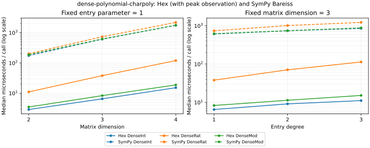
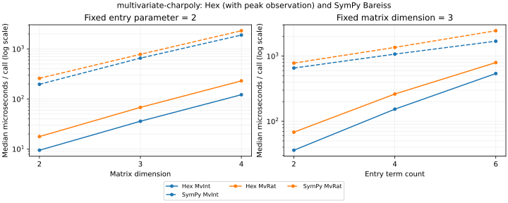
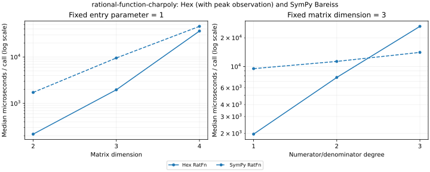

# Characteristic-polynomial carrier performance

## Comparator ratios

The six symbolic carrier families compare Hex's instrumented Berkowitz
recurrence with SymPy 1.14.0 `DomainMatrix.det()` (Bareiss) on the identical
`tI − A`. These ratios are informational. The structured comparator name is
`SymPy DomainMatrix.det (Bareiss) on tI-A`. The measured input families are
`dense-polynomial-charpoly`, `multivariate-charpoly`, and
`rational-function-charpoly`.

The existing `FLINT fmpz_mat.charpoly via python-flint` and
`PARI charpoly flag 3 via cypari2` comparators cover integer random-dense rungs.
Their registrations, and the `random-dense-charpoly`, `tridiagonal-charpoly`,
and `structured-charpoly` families, are outside this carrier measurement.

Measurements used Lean 4.34.0-rc2, lean-bench, Python 3.14.6 and SymPy’s
FLINT ground backend (python-flint 0.9.0) on an AMD EPYC 9455 shared
host, pinned to automatically selected logical CPU 1. Initial load averages
were 1.44, 1.75, 4.57. Every completed sample is retained.

Each point is a separate `setup_fixed_benchmark`, with five measured repeats,
a discarded warmup, and `warmupFirstIter := true`. The harness auto-tunes inner
repeats to its 1 ms fixed-benchmark floor. Hex/SymPy argument order alternates
across consecutive points. The external Python process persists within each
child batch; import and startup happen before measurement.

The trivial persistent request (`carrierNoop`, returning `[]`) took a median
**5.860 µs**. Raw ratios are SymPy/Hex; adjusted ratios are
`(SymPy − 5.860 µs) / Hex`. This subtraction removes the measured
fixed request overhead, not input-dependent JSON encoding, decoding or domain
construction. Both arms construct the same deterministic input during their
calls. Hex timings include observing structural growth in every Toeplitz column
and intermediate coefficient vector, and serializing the full polynomial.
SymPy timings include request serialization, canonical-input checks, exact-domain
construction, the determinant, and response serialization. These are integration
latencies, not isolated arithmetic-kernel timings.

All 30 pairs agree on hashes of the entire canonical coefficient array. The
separate growth run also compares each instrumented recurrence with public
`Matrix.charPoly`, without charging that duplicate computation to the timing.

The parameter is entry degree for DenseInt/DenseRat/DenseMod/RatFn and entry
term count for MvInt/MvRat. Multivariate entries have arity three and fixed
total degree five. Peak is maximum dense array length, multivariate term count,
or sum of reduced numerator and monic denominator array lengths, respectively.

| Carrier | n | Parameter | Peak | Hex µs | SymPy µs | Raw ratio | Adjusted ratio |
|---|---:|---:|---:|---:|---:|---:|---:|
| DenseInt | 2 | 1 | 3 | 2.89 | 174.75 | 60.53 | 58.50 |
| DenseInt | 3 | 1 | 4 | 6.52 | 609.02 | 93.47 | 92.57 |
| DenseInt | 3 | 2 | 7 | 9.15 | 735.97 | 80.44 | 79.80 |
| DenseInt | 3 | 3 | 10 | 11.14 | 852.01 | 76.48 | 75.95 |
| DenseInt | 4 | 1 | 5 | 15.18 | 1752.17 | 115.41 | 115.02 |
| DenseMod | 2 | 1 | 3 | 3.50 | 187.03 | 53.45 | 51.78 |
| DenseMod | 3 | 1 | 4 | 8.31 | 620.03 | 74.57 | 73.86 |
| DenseMod | 3 | 2 | 7 | 11.37 | 740.49 | 65.16 | 64.64 |
| DenseMod | 3 | 3 | 10 | 15.19 | 878.95 | 57.86 | 57.47 |
| DenseMod | 4 | 1 | 5 | 18.80 | 1763.37 | 93.82 | 93.50 |
| DenseRat | 2 | 1 | 3 | 11.04 | 201.49 | 18.25 | 17.72 |
| DenseRat | 3 | 1 | 4 | 38.06 | 735.21 | 19.32 | 19.17 |
| DenseRat | 3 | 2 | 7 | 70.78 | 1010.63 | 14.28 | 14.20 |
| DenseRat | 3 | 3 | 10 | 113.46 | 1219.52 | 10.75 | 10.70 |
| DenseRat | 4 | 1 | 5 | 119.76 | 2184.41 | 18.24 | 18.19 |
| MvInt | 2 | 2 | 3 | 9.47 | 196.63 | 20.76 | 20.14 |
| MvInt | 3 | 2 | 4 | 35.94 | 655.89 | 18.25 | 18.08 |
| MvInt | 3 | 4 | 10 | 153.44 | 1073.24 | 6.99 | 6.96 |
| MvInt | 3 | 6 | 28 | 540.41 | 1693.22 | 3.13 | 3.12 |
| MvInt | 4 | 2 | 5 | 121.80 | 1894.36 | 15.55 | 15.50 |
| MvRat | 2 | 2 | 3 | 17.76 | 259.25 | 14.60 | 14.27 |
| MvRat | 3 | 2 | 4 | 68.02 | 781.58 | 11.49 | 11.40 |
| MvRat | 3 | 4 | 10 | 262.00 | 1360.46 | 5.19 | 5.17 |
| MvRat | 3 | 6 | 28 | 796.19 | 2451.89 | 3.08 | 3.07 |
| MvRat | 4 | 2 | 5 | 230.29 | 2312.28 | 10.04 | 10.02 |
| RatFn | 2 | 1 | 10 | 217.31 | 1721.01 | 7.92 | 7.89 |
| RatFn | 3 | 1 | 20 | 1962.27 | 9510.07 | 4.85 | 4.84 |
| RatFn | 3 | 2 | 38 | 7688.17 | 11314.82 | 1.47 | 1.47 |
| RatFn | 3 | 3 | 56 | 26339.68 | 14067.65 | 0.53 | 0.53 |
| RatFn | 4 | 1 | 34 | 36203.03 | 45685.30 | 1.26 | 1.26 |

At dimension three, increasing rational-function degree reduces SymPy/Hex
from 4.85 at degree one to 1.47 at degree two and 0.53 at degree three;
SymPy is about 1.87 times faster at the last point. At
(n=4, degree=1), the ratio is 1.26. Multivariate ratios also fall
as term count grows: MvInt and MvRat reach 3.13 and 3.08, respectively,
at six terms. These are adverse trends for Hex on the measured ranges,
permitted by the informational classification. Berkowitz's O(n⁴) ring-operation
count and the fraction normalization inside RationalFn arithmetic make the
rational-function trend plausible; no profile was collected to attribute its
precise cause.

The very large ratios for small dense-polynomial inputs describe integration
latency, including the comparator's input-dependent JSON and domain work.
The smallest Hex call is shorter than even the trivial external request.
They do not isolate the relative speed of Berkowitz and Bareiss kernels.

The variation between repeats is shared-host context. Each measurement series
has one run per point, with every completed sample retained. These measurements do not establish a fitted complexity
bound or a Phase-4 gate.

## Reproduction and artifacts

Build with `lake build hexcharpoly_bench`. With SymPy installed, run each pair,
for example:

```sh
HEX_CARRIER_BENCH_PYTHON=python3 .lake/build/bin/hexcharpoly_bench compare \
  Hex.CharPolyBench.DenseInt.n3k2 Hex.CharPolyBench.SympyDenseInt.n3k2 \
  --export-file dense-int-n3k2.json
HEX_CARRIER_BENCH_PYTHON=python3 .lake/build/bin/hexcharpoly_bench run \
  Hex.CharPolyBench.carrierNoop --export-file overhead.json
.lake/build/bin/hexcharpoly_bench carrier-growth
```

Use the shared `scripts/bench/idle_core.py` CPU selection helper and pin the
parent process; children inherit its affinity. Dimension sweeps are 2/3/4 at
degree 1 (two terms for multivariate); degree sweeps are 1/2/3 at dimension 3;
term-count sweeps are 2/4/6 at dimension 3. The degree/term-count one-dimensional
sweeps share their intersection rung. The `hex` tag selects all 30 Hex carrier
registrations; `carrier` also includes the external comparisons and overhead.
`verify-ci` excludes the scheduled-only registrations, and is selected by the
existing CI bench script.

Raw five-repeat timings, result hashes, configurations and environment metadata
are preserved in [measurements.json](hex-char-poly-carriers/measurements.json).
The [overhead samples](hex-char-poly-carriers/noop.json),
[growth observations](hex-char-poly-carriers/growth.jsonl), and
[host/source context](hex-char-poly-carriers/context.json) accompany them.
The context records the benchmark source SHA-256; the run exports identify the
base commit and dirty worktree containing this implementation.

## Concerns

This report supplies the carrier measurements required by the characteristic-
polynomial SPEC; `done_through` remains zero. It does not claim a complete
Phase-4 performance audit. Integer FLINT/PARI ratios and integer-family plots,
full complexity evidence, and profiling remain outside this carrier result.
The carrier plots include Hex and SymPy only: FLINT and PARI have no committed
measurements on these symbolic carrier families.

Growth instrumentation remains inside the carrier timing so every invocation
observes the required peak. The integer growth command instead measures the
public operation separately. These timing methods should not be conflated.
Multivariate counting uses `MvPoly.termCount`, the stored O(1) count, without
materializing an extra term list.

The retained [term-list series](hex-char-poly-carriers/term-list/measurements.json)
counts terms by materializing lists. Each series carries its own source and
host context. The headline table and plots use the stored-term-count series.

## Carrier plots

Generate these from the same raw medians with
`python3 scripts/plots/hex-char-poly-comparator.py --family <family>`.
Each plot separates the dimension and degree/term-count sweeps.






