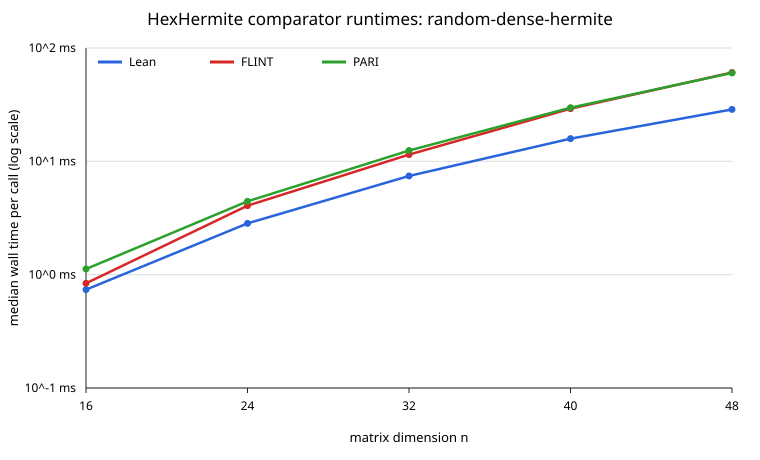
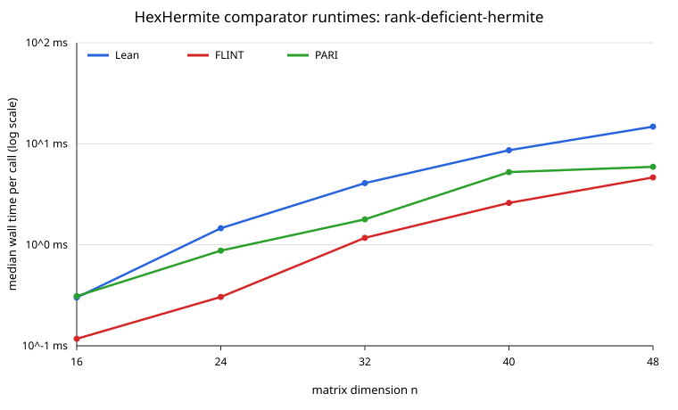
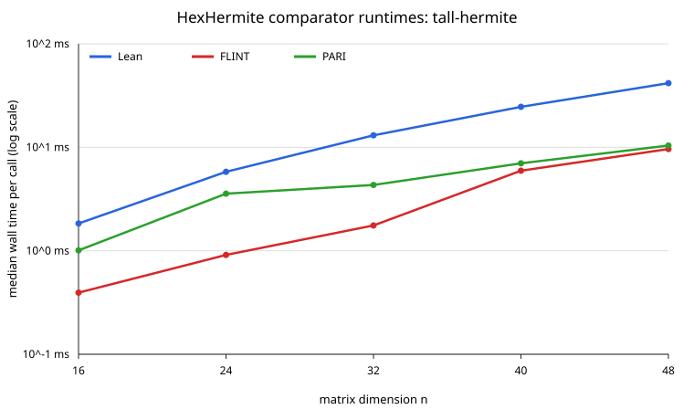
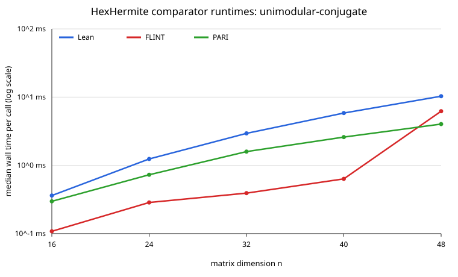

# HexHermite Performance Report

## Bench targets

The compiled Mathlib-free driver is `bench/HexHermite/Bench.lean`. Its four
parametric registrations exercise `Matrix.hnf` on every input family declared
in `libraries.yml`:

| target | input family and shape | declared scientific model |
|---|---|---|
| `runDense` | `random-dense-hermite`, square and nonsingular | `n ^ 3` |
| `runDeficient` | `rank-deficient-hermite`, square with rank `n / 2` | `n ^ 3` |
| `runTall` | `tall-hermite`, `4n × n` with redundant rows | `n ^ 3` |
| `runConjugate` | `unimodular-conjugate`, triangular factor times known diagonal | `n ^ 3` |

These are controlled-family wall-clock models. The SPEC separately retains
the conservative `O(n⁴)` worst-case ceiling obtained by charging every
scheduled reduction check as a nontrivial full-row update. Each registration
has an adjacent family-specific derivation; treating that upper ceiling as the
expected curve made every ladder inconclusive and was corrected before this
accepted evidence was recorded.

The public executable surface that does not naturally vary in dimension has
fixed evidence on the committed dense `8 × 8` input:

| targets | public operations |
|---|---|
| `runIsHNFForm`, `runCert` | HNF shape checking and certificate replay |
| `runRank`, `runBasis`, `runPivots`, `runIndex` | rank, canonical basis, pivots, and lattice index |
| `runData`, `runWithInv` | transform-producing data and inverse accumulation |
| `runCoeffs`, `runContains` | constructive coefficients and membership decision |
| `runKernelBasis` | executable integer kernel basis |

All fixed API targets have committed expected hashes. The external comparison
surface has five rungs, `#[16, 24, 32, 40, 48]`, for every declared family and
registers Lean, FLINT, and PARI separately. `runFlintOverhead` and
`runPariOverhead` measure the persistent-driver request/reply floor. Comparator
hashes cover only the canonical HNF matrix; non-unique transforms and inverses
are checked in Lean by conformance and certificate replay.

The input constructors are deterministic. `entry` uses literal salts `5` and
`17`; tall and conjugate inputs use fixed formulae and have no random seed.

## Verdicts

The scientific run used source commit
`8c0849900691b23c9685497ef5b6e259d75f6e56`, Lean 4.34.0-rc2,
LeanBench 0.1.0, and warm-cache compiled execution from a clean tree
(`git_dirty=false`) on `chungus2` (Linux 6.12.100, x86-64, AMD EPYC 9455
48-Core Processor, 96 logical CPUs). Each target used its committed ladder,
three outer trials, a 100 ms inner target, a 1.0 spawn-floor multiplier, and a
10 s per-call ceiling:

```sh
lake exe hexhermite_bench run \
  Hex.HermiteBench.runDense Hex.HermiteBench.runDeficient \
  Hex.HermiteBench.runTall Hex.HermiteBench.runConjugate \
  --export-file reports/bench-results/hex-hermite-phase4-scientific.json
```

The committed export has SHA-256
`27a0d15ce29c058a263f285b36b306ec15bf98a7f1248d1e97af25c0435bfa56`.
Every target is consistent with its declared complexity:

| target | full measured ladder | verdict window |
|---|---|---|
| `runDense` | 20, 32, 48, 64, 80 | consistent; `cMin=224.510`, `cMax=275.648` |
| `runDeficient` | 20, 32, 48, 64, 80 | consistent; `cMin=123.974`, `cMax=173.528` |
| `runTall` | 8, 12, 16, 20, 24 | consistent; `cMin=475.007`, `cMax=547.642` |
| `runConjugate` | 20, 32, 48, 64, 80 | consistent; `cMin=85.263`, `cMax=93.975` |

The harness excludes the leading 20% warmup rung from each printed verdict,
so each band covers the final four rungs. Trial spread was at most 2.42% at
every rung; all raw trials, inclusion flags, constants, and environment data
are in the export.

The SPEC's untimed growth trigger was reproduced with:

```sh
lake exe hexhermite_bench growth 20 32 48 64 80 \
  > reports/bench-results/hex-hermite-phase4-growth.txt
```

The output has SHA-256
`107f9efff32bdbeca60695c2653c265959c6f64f998525ab073f550adafa3590`.
On the badly conditioned `unimodular-conjugate` ladder, peak/output entry
widths were respectively 7/5, 9/6, 10/6, 11/7, and 11/7 bits. Peak width does
not diverge from output width over the upper half of the ladder, and the
wall-clock curve remains consistent with its cubic declaration. The
predeclared trigger for an LLL-based Havas--Majewski--Matthews follow-up is
therefore not met; adding that algorithm is not justified by this evidence.

## Comparator ratios

The registry's exact informational comparators are
`FLINT fmpz_mat_hnf via python-flint` and `PARI mathnf via cypari2`. The run
used python-flint 0.9.0 / FLINT 3.6.0 and cypari2 2.2.4 / PARI 2.17.3. The
fixed targets were reproduced from a clean tree with five repeats each:

```sh
nix-shell -p python313Packages.cypari2 python313Packages.cysignals pari --run '
  export HEX_FLINT_BENCH_PYTHON=/tmp/hexsmith-py/bin/python
  export HEX_PARI_BENCH_PYTHON=/tmp/hexsmith-py/bin/python
  fixed=$(lake exe hexhermite_bench list | awk '\''/\[fixed\]/ {print $1}'\'')
  lake exe hexhermite_bench run $fixed \
    --export-file reports/bench-results/hex-hermite-phase4-comparators.json
'
```

The committed 73-target export has SHA-256
`56c2eee4aa9a9e6678e25a299b21cb69ca4ab0cab48bd0052b0d8c3ceb985772`;
all expected hashes match. `compare` was also run for all twenty suffixes in
`{Dense,Deficient,Tall,Conjugate}{16,24,32,40,48}`:

```sh
lake exe hexhermite_bench compare \
  Hex.HermiteBench.runHexSUFFIX Hex.HermiteBench.runFlintSUFFIX \
  Hex.HermiteBench.runPariSUFFIX
```

All twenty groups reported output agreement. FLINT's no-work median was
7.041 us and PARI's was 7.377 us. Every external median exceeds twice its
own overhead and every per-call median is below one second, so all rungs are
eligible. Adjusted ratios subtract only the constant request/reply floor;
input encoding and external matrix construction remain charged.

### Random dense Hermite

| n | Hex | FLINT | PARI | canonical hash | FLINT raw / adjusted | PARI raw / adjusted |
|---:|---:|---:|---:|---|---:|---:|
| 16 | 737.914 us | 839.059 us | 1.122 ms | `0xd4c4d30cf11e3902` | 1.137x / 1.128x | 1.521x / 1.511x |
| 24 | 2.836 ms | 4.065 ms | 4.437 ms | `0xc2db6d9cd48562cf` | 1.433x / 1.431x | 1.564x / 1.562x |
| 32 | 7.429 ms | 11.470 ms | 12.458 ms | `0x7dea452eb86f21c4` | 1.544x / 1.543x | 1.677x / 1.676x |
| 40 | 15.858 ms | 29.138 ms | 29.737 ms | `0x3e6a06331c9a70f5` | 1.837x / 1.837x | 1.875x / 1.875x |
| 48 | 28.709 ms | 60.837 ms | 60.264 ms | `0xf0b970d34f3479cf` | 2.119x / 2.119x | 2.099x / 2.099x |



### Rank-deficient Hermite

| n | Hex | FLINT | PARI | canonical hash | FLINT raw / adjusted | PARI raw / adjusted |
|---:|---:|---:|---:|---|---:|---:|
| 16 | 310.425 us | 863.150 us | 1.081 ms | `0x8c3b42aee1b184e` | 2.781x / 2.758x | 3.482x / 3.458x |
| 24 | 1.505 ms | 3.962 ms | 4.313 ms | `0x9a533e7da7244459` | 2.633x / 2.629x | 2.866x / 2.861x |
| 32 | 4.118 ms | 12.064 ms | 12.508 ms | `0xe5df8cb1544b5979` | 2.930x / 2.928x | 3.037x / 3.036x |
| 40 | 8.749 ms | 30.025 ms | 31.594 ms | `0x705d86c1ef31d9c9` | 3.432x / 3.431x | 3.611x / 3.610x |
| 48 | 14.941 ms | 60.242 ms | 61.995 ms | `0x98d873e64dfda3bc` | 4.032x / 4.032x | 4.149x / 4.149x |



### Tall Hermite

| n | Hex | FLINT | PARI | canonical hash | FLINT raw / adjusted | PARI raw / adjusted |
|---:|---:|---:|---:|---|---:|---:|
| 16 | 2.119 ms | 12.029 ms | 11.750 ms | `0x8194afcd561bfd53` | 5.677x / 5.674x | 5.545x / 5.542x |
| 24 | 6.593 ms | 55.912 ms | 59.749 ms | `0x720fca5c6fa3aec1` | 8.480x / 8.479x | 9.062x / 9.061x |
| 32 | 14.970 ms | 180.059 ms | 178.085 ms | `0x418e1a4c9e9d84b3` | 12.028x / 12.028x | 11.896x / 11.896x |
| 40 | 28.448 ms | 442.805 ms | 442.712 ms | `0x39dab28adc1593b5` | 15.566x / 15.565x | 15.562x / 15.562x |
| 48 | 48.903 ms | 902.976 ms | 901.369 ms | `0xb51a4d975bdc6feb` | 18.465x / 18.464x | 18.432x / 18.432x |

The growing external/Hex ratio is an informational result on this redundant
row family, not a gating claim; the external APIs pay their own convention and
matrix-construction costs on the same honest domain.



### Unimodular conjugate

| n | Hex | FLINT | PARI | canonical hash | FLINT raw / adjusted | PARI raw / adjusted |
|---:|---:|---:|---:|---|---:|---:|
| 16 | 347.823 us | 802.304 us | 1.001 ms | `0x1b4006b1f4d4df66` | 2.307x / 2.286x | 2.877x / 2.856x |
| 24 | 1.180 ms | 3.656 ms | 4.005 ms | `0xe47f13aca06b7628` | 3.098x / 3.092x | 3.393x / 3.387x |
| 32 | 2.796 ms | 11.082 ms | 11.873 ms | `0x531c1c24c585ac12` | 3.963x / 3.961x | 4.246x / 4.244x |
| 40 | 5.548 ms | 27.438 ms | 28.050 ms | `0xfc1deb59344974c8` | 4.945x / 4.944x | 5.056x / 5.054x |
| 48 | 9.786 ms | 60.973 ms | 58.351 ms | `0x501203bf9b14db75` | 6.231x / 6.230x | 5.963x / 5.962x |



## Profile

Every `libraries.yml` input family was profiled from the same clean source
commit and host as the scientific run, with samply 0.13.1 at 999 Hz:

```sh
LEAN_BENCH_SAMPLY_HOME=/tmp/lean-bench-samply \
  scripts/profile/run_profile.sh .lake/build/bin/hexhermite_bench TARGET PARAM 5000000000
```

Raw filtered profiles are developer-local under `/tmp`, as required by
`SPEC/profiling.md`. Percentages were produced by
`scripts/profile/summarize_profile.py --thread hexhermite_bench`.

### Random dense Hermite

`TARGET=Hex.HermiteBench.runDense`, `PARAM=80`. The profile retained 4664
samples and rejected 8. Leaf cost was allocation/free 51.18%, GMP 17.75%,
Lean runtime 21.83%, Hex own code 9.22%, and other 0.02% (99.98% classified).

| inclusive Hex function | share |
|---|---:|
| `Hex.HermiteBench.runDense` | 98.22% |
| `Hex.Matrix.hnf` | 98.18% |
| `Hex.Matrix.Hermite.checkedRun` | 98.18% |
| `Hex.Matrix.Hermite.principalCore` | 62.18% |
| `Hex.Matrix.Hermite.clearPrior` | 50.54% |
| `Hex.Matrix.Hermite.reduceStep` | 34.33% |

Calibration residual was 0.735 ms, total timed work 4684.1 ms, and both
the ±5 ms sensitivity and confidence checks passed.

### Rank-deficient Hermite

`TARGET=Hex.HermiteBench.runDeficient`, `PARAM=80`. The profile retained 2968
samples and rejected 8. Leaf cost was allocation/free 62.57%, GMP 14.42%,
Lean runtime 15.03%, Hex own code 7.95%, and other 0.03% (99.97% classified).

| inclusive Hex function | share |
|---|---:|
| `Hex.HermiteBench.runDeficient` | 98.72% |
| `Hex.Matrix.hnf` | 98.35% |
| `Hex.Matrix.Hermite.principalCore` | 66.95% |
| `Hex.Matrix.Hermite.clearPrior` | 59.77% |
| `Hex.Matrix.Hermite.gcdStep` | 46.29% |
| `Hex.Matrix.Hermite.combineRows` | 45.69% |

Calibration residual was 0.734 ms, total timed work 2983.1 ms, and both
sensitivity and confidence checks passed.

### Tall Hermite

`TARGET=Hex.HermiteBench.runTall`, `PARAM=24`. The profile retained 3337
samples and rejected 8. Leaf cost was allocation/free 13.64%, GMP 0.00%,
Lean runtime 58.23%, Hex own code 28.05%, and other 0.09% (99.91% classified).

| inclusive Hex function | share |
|---|---:|
| `Hex.HermiteBench.runTall` | 100.00% |
| `Hex.Matrix.hnf` | 99.43% |
| `Hex.Matrix.Hermite.principalCore` | 69.49% |
| `Hex.Matrix.Hermite.clearPrior` | 67.70% |
| `Hex.Matrix.Hermite.normalizeRow` | 35.63% |
| `Hex.Matrix.Hermite.gcdStep` | 30.87% |

Calibration residual was 1.451 ms, total timed work 3349.1 ms, and both
sensitivity and confidence checks passed.

### Unimodular conjugate

`TARGET=Hex.HermiteBench.runConjugate`, `PARAM=80`. The profile retained 3109
samples and rejected 8. Leaf cost was allocation/free 19.04%, GMP 11.39%,
Lean runtime 46.12%, and Hex own code 23.45% (100.00% classified).

| inclusive Hex function | share |
|---|---:|
| `Hex.HermiteBench.runConjugate` | 98.84% |
| `Hex.Matrix.hnf` | 98.71% |
| `Hex.Matrix.Hermite.profileStep` | 46.41% |
| `Hex.Matrix.ofFn` | 39.95% |
| `Hex.Matrix.Hermite.profileEliminate` | 35.99% |
| `Hex.Matrix.Hermite.principalCore` | 24.83% |

Calibration residual was 0.507 ms, total timed work 3121.5 ms, and both
sensitivity and confidence checks passed. Dominant costs in every family are
attributed to the registered HNF target rather than an unregistered helper.

`HexHermiteMathlib` is a `correspondence-only-layer`: it owns no independent
runtime computation, names `HexHermite` as its performance owner, and therefore
has no synthetic benchmark or separate performance report.

## Concerns

None.
