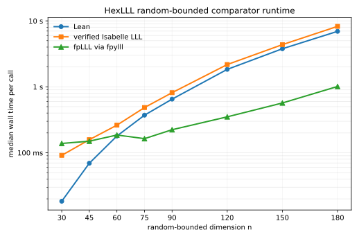

# HexLLL Performance Report

## Bench Targets

- `Hex.LLLBench.runSwapStepChecksum`: `swapStepComplexity n`
- `Hex.LLLBench.runSizeReduceChecksum`: `sizeReduceComplexity n`
- `Hex.LLLBench.runOfBasisRandomBoundedChecksum`: `ofBasisRandomBoundedComplexity n`
- `Hex.LLLBench.runOfBasisBzRecombinationChecksum`: `ofBasisBzRecombinationComplexity n`
- `Hex.LLLBench.runGramSchmidtCoeffChecksum`: `gramSchmidtCoeffComplexity n`
- `Hex.LLLBench.runFirstShortVectorHarshCubicChecksum`: `firstShortVectorHarshCubicComplexity n`
- `Hex.LLLBench.runPotential`: `potentialComplexity n`
- `Hex.LLLBench.runOfBasisHarshCubicChecksum`: `ofBasisHarshCubicComplexity n`
- `Hex.LLLBench.runFirstShortVectorRandomBoundedChecksum`: `firstShortVectorRandomBoundedComplexity n`
- `Hex.LLLBench.runSizeReduceColumnChecksum`: `sizeReduceColumnComplexity n`
- `Hex.LLLBench.runFpylllFirstShortVectorBZRecombinationChecksum`: fixed, repeats `5`
- `Hex.LLLBench.runIsabelleHarshCubicNormSq15`: fixed, repeats `3`
- `Hex.LLLBench.runFirstShortVectorBZRecombinationNormSq`: fixed, repeats `3`
- `Hex.LLLBench.runIsabelleHarshCubicNormSq45`: fixed, repeats `3`
- `Hex.LLLBench.runFirstShortVectorBZRecombinationChecksum`: fixed, repeats `5`
- `Hex.LLLBench.runIsabelleHarshCubicNormSq30`: fixed, repeats `3`
- `Hex.LLLBench.runFirstShortVectorHarshCubic15Checksum`: fixed, repeats `5`
- `Hex.LLLBench.runIsabelleRandomBoundedNormSq120`: fixed, repeats `3`
- `Hex.LLLBench.runFirstShortVectorRandomBoundedNormSq30`: fixed, repeats `3`
- `Hex.LLLBench.runFirstShortVectorRandomBoundedNormSq120`: fixed, repeats `3`
- `Hex.LLLBench.runFirstShortVectorHarshCubicNormSq30`: fixed, repeats `3`
- `Hex.LLLBench.runFirstShortVectorRandomBounded30Checksum`: fixed, repeats `5`
- `Hex.LLLBench.runFirstShortVectorRandomBoundedNormSq45`: fixed, repeats `3`
- `Hex.LLLBench.runFirstShortVectorHarshCubicNormSq45`: fixed, repeats `3`
- `Hex.LLLBench.runFirstShortVectorRandomBoundedNormSq75`: fixed, repeats `3`
- `Hex.LLLBench.runFirstShortVectorRandomBoundedNormSq90`: fixed, repeats `3`
- `Hex.LLLBench.runFirstShortVectorRandomBoundedNormSq150`: fixed, repeats `3`
- `Hex.LLLBench.runFirstShortVectorRandomBoundedNormSq180`: fixed, repeats `3`
- `Hex.LLLBench.runFpylllFirstShortVectorHarshCubic15Checksum`: fixed, repeats `5`
- `Hex.LLLBench.runFirstShortVectorHarshCubicNormSq20`: fixed, repeats `3`
- `Hex.LLLBench.runFirstShortVectorHarshCubicNormSq25`: fixed, repeats `3`
- `Hex.LLLBench.runIsabelleRandomBoundedNormSq30`: fixed, repeats `3`
- `Hex.LLLBench.runIsabelleRandomBoundedNormSq45`: fixed, repeats `3`
- `Hex.LLLBench.runIsabelleRandomBoundedNormSq60`: fixed, repeats `3`
- `Hex.LLLBench.runIsabelleRandomBoundedNormSq75`: fixed, repeats `3`
- `Hex.LLLBench.runIsabelleRandomBoundedNormSq90`: fixed, repeats `3`
- `Hex.LLLBench.runIsabelleRandomBoundedNormSq120`: fixed, repeats `3`
- `Hex.LLLBench.runIsabelleRandomBoundedNormSq150`: fixed, repeats `3`
- `Hex.LLLBench.runIsabelleRandomBoundedNormSq180`: fixed, repeats `3`
- `Hex.LLLBench.runFpylllFirstShortVectorRandomBounded30Checksum`: fixed, repeats `5`
- `Hex.LLLBench.runFirstShortVectorHarshCubicNormSq15`: fixed, repeats `3`
- `Hex.LLLBench.runFirstShortVectorHarshCubicNormSq35`: fixed, repeats `3`
- `Hex.LLLBench.runFirstShortVectorHarshCubicNormSq40`: fixed, repeats `3`
- `Hex.LLLBench.runFirstShortVectorHarshCubicNormSq50`: fixed, repeats `3`
- `Hex.LLLBench.runFirstShortVectorHarshCubicNormSq55`: fixed, repeats `3`
- `Hex.LLLBench.runIsabelleBZRecombinationNormSq`: fixed, repeats `3`
- `Hex.LLLBench.runIsabelleHarshCubicNormSq20`: fixed, repeats `3`
- `Hex.LLLBench.runIsabelleHarshCubicNormSq25`: fixed, repeats `3`
- `Hex.LLLBench.runIsabelleHarshCubicNormSq35`: fixed, repeats `3`
- `Hex.LLLBench.runIsabelleHarshCubicNormSq40`: fixed, repeats `3`
- `Hex.LLLBench.runIsabelleHarshCubicNormSq50`: fixed, repeats `3`
- `Hex.LLLBench.runIsabelleHarshCubicNormSq55`: fixed, repeats `3`
- `Hex.LLLBench.runFirstShortVectorRandomBoundedNormSq60`: fixed, repeats `3`

## Verdicts

Scientific run at commit `885431ee1d594b5f6a480cbcfa8f4389e3e3383d` on
`carica` (Apple M2 Ultra, macOS 14.6.1), command:

```sh
lake exe hexlll_bench run Hex.LLLBench.runSwapStepChecksum Hex.LLLBench.runSizeReduceChecksum Hex.LLLBench.runOfBasisRandomBoundedChecksum Hex.LLLBench.runOfBasisBzRecombinationChecksum Hex.LLLBench.runGramSchmidtCoeffChecksum Hex.LLLBench.runFirstShortVectorHarshCubicChecksum Hex.LLLBench.runPotential Hex.LLLBench.runOfBasisHarshCubicChecksum Hex.LLLBench.runFirstShortVectorRandomBoundedChecksum Hex.LLLBench.runSizeReduceColumnChecksum Hex.LLLBench.runFirstShortVectorBZRecombinationChecksum Hex.LLLBench.runFirstShortVectorHarshCubic15Checksum Hex.LLLBench.runFirstShortVectorRandomBounded30Checksum Hex.LLLBench.runFirstShortVectorBZRecombinationNormSq Hex.LLLBench.runFirstShortVectorRandomBoundedNormSq30 Hex.LLLBench.runFirstShortVectorRandomBoundedNormSq60 Hex.LLLBench.runFirstShortVectorRandomBoundedNormSq120 Hex.LLLBench.runFirstShortVectorRandomBoundedNormSq240 Hex.LLLBench.runFirstShortVectorHarshCubicNormSq15 Hex.LLLBench.runFirstShortVectorHarshCubicNormSq30 Hex.LLLBench.runFirstShortVectorHarshCubicNormSq45 --export-file reports/bench-results/hex-lll-885431e.json
```

The run used deterministic inputs from `HexLLL/Bench.lean`; the
random-bounded family uses committed seed `8`. The harness recorded
`885431e-dirty` because this worktree had an unrelated pre-existing
`.claude/CLAUDE.md` modification. Export artefact:
`reports/bench-results/hex-lll-885431e.json`.

- `Hex.LLLBench.runSwapStepChecksum`: consistent with declared complexity
  (parameters `96..160`, final per-call `521.412 us`).
- `Hex.LLLBench.runSizeReduceChecksum`: consistent with declared complexity
  (parameters `128..160`, final per-call `495.222 us`).
- `Hex.LLLBench.runOfBasisRandomBoundedChecksum`: consistent with declared
  complexity (parameters `48..144`, final verdict-row per-call `190.800 ms`
  at `n = 120`; the `n = 144` row was below the signal floor and excluded).
- `Hex.LLLBench.runOfBasisBzRecombinationChecksum`: consistent with declared
  complexity (parameters `24..72`, final verdict-row per-call `42.606 ms`
  at `n = 60`; the `n = 72` row was below the signal floor and excluded).
- `Hex.LLLBench.runGramSchmidtCoeffChecksum`: consistent with declared
  complexity (parameters `32..128`, final per-call `1.168 us`).
- `Hex.LLLBench.runFirstShortVectorHarshCubicChecksum`: consistent with
  declared complexity (parameters `15..45`, final per-call `178.802 ms`).
- `Hex.LLLBench.runPotential`: consistent with declared complexity
  (parameters `192..216`, final per-call `5.552 ms`).
- `Hex.LLLBench.runOfBasisHarshCubicChecksum`: consistent with declared
  complexity (parameters `12..36`, final per-call `35.258 ms`).
- `Hex.LLLBench.runFirstShortVectorRandomBoundedChecksum`: consistent with
  declared complexity (parameters `30..240`, final per-call `6.060 s`).
- `Hex.LLLBench.runSizeReduceColumnChecksum`: consistent with declared
  complexity (parameters `96..160`, final per-call `439.083 us`).
- `Hex.LLLBench.runFirstShortVectorBZRecombinationChecksum`: median
  `6.334 us`, observed hash `0x3c0064007a0036`, expected hash matches.
- `Hex.LLLBench.runFirstShortVectorHarshCubic15Checksum`: median `1.170 ms`,
  observed hash `0x949fde47fa1fffb4`, expected hash matches.
- `Hex.LLLBench.runFirstShortVectorRandomBounded30Checksum`: median
  `5.602 ms`, observed hash `0xf977db3a0120001a`, expected hash matches.
- `Hex.LLLBench.runFirstShortVectorBZRecombinationNormSq`: median
  `5.500 us`, observed hash `0x4e6`, expected hash matches.
- `Hex.LLLBench.runFirstShortVectorRandomBoundedNormSq30`: median
  `5.425 ms`, observed hash `0x3a52`, expected hash matches.
- `Hex.LLLBench.runFirstShortVectorRandomBoundedNormSq60`: median
  `68.697 ms`, observed hash `0x98cc`, expected hash matches.
- `Hex.LLLBench.runFirstShortVectorRandomBoundedNormSq120`: median
  `800.045 ms`, observed hash `0x11860`, expected hash matches.
- `Hex.LLLBench.runFirstShortVectorRandomBoundedNormSq240`: median
  `11.737 s`, observed hash `0x2454a`, expected hash matches.
- `Hex.LLLBench.runFirstShortVectorHarshCubicNormSq15`: median `1.220 ms`,
  observed hash `0x700000000033a4`, expected hash matches.
- `Hex.LLLBench.runFirstShortVectorHarshCubicNormSq30`: median `24.046 ms`,
  observed hash `0x37cc`, expected hash matches.
- `Hex.LLLBench.runFirstShortVectorHarshCubicNormSq45`: median `186.514 ms`,
  observed hash `0x6d1e`, expected hash matches.

Smoke wiring was also checked with:

```sh
lake exe hexlll_bench list
lake exe hexlll_bench verify
```

At current worktree commit `924910079376c876da2e2fe9d94915505dd477e4`,
the smoke verifier succeeds for all 52 registered HexLLL benchmarks, including
the densified Isabelle ladder added after the scientific run below.

Current scientific rerun for the five formerly inconclusive parametric
registrations at commit `924910079376c876da2e2fe9d94915505dd477e4` on
`carica` (Apple M2 Ultra, macOS), command:

```sh
lake exe hexlll_bench run Hex.LLLBench.runSizeReduceChecksum Hex.LLLBench.runGramSchmidtCoeffChecksum Hex.LLLBench.runFirstShortVectorHarshCubicChecksum Hex.LLLBench.runOfBasisHarshCubicChecksum Hex.LLLBench.runFirstShortVectorRandomBoundedChecksum --export-file reports/bench-results/hex-lll-924910079376c-clean.json
```

The harness recorded `9249100-dirty` because this worktree carried a
pre-existing local `.claude/CLAUDE.md` modification outside this evidence
package. Export artefact:
`reports/bench-results/hex-lll-924910079376c-clean.json`, SHA-256
`9e57bc8c2653e8ce7c8311b7592197068338c7dcdf8e235a6f0f3e1189768e7d`.

- `Hex.LLLBench.runSizeReduceChecksum`: consistent with declared complexity
  (parameters `128..160`, final per-call `220.548 us`).
- `Hex.LLLBench.runGramSchmidtCoeffChecksum`: consistent with declared
  complexity (parameters `32..128`, final per-call `7.363 us`).
- `Hex.LLLBench.runFirstShortVectorHarshCubicChecksum`: consistent with
  declared complexity (parameters `15..55`, final per-call `662.056 ms`).
- `Hex.LLLBench.runOfBasisHarshCubicChecksum`: consistent with declared
  complexity (parameters `12..36`, final per-call `86.523 ms`).
- `Hex.LLLBench.runFirstShortVectorRandomBoundedChecksum`: consistent with
  declared complexity (parameters `30..180`, final per-call `6.178 s`).

The earlier `reports/bench-results/hex-lll-e211854d1435.json` inconclusive
verdicts were measurement/model-registration findings. The current run resolves
the parametric-verdict blocker, but the densified Lean/Isabelle comparator
Concern below still prevents a Phase 4 promotion.

Current-head rerun for the same five formerly inconclusive parametric
registrations at commit `14537a67ebf1bd51b2275c8840562bb33ce813c1` on
`carica` (Apple M2 Ultra, macOS), command:

```sh
lake exe hexlll_bench run Hex.LLLBench.runSizeReduceChecksum Hex.LLLBench.runGramSchmidtCoeffChecksum Hex.LLLBench.runFirstShortVectorHarshCubicChecksum Hex.LLLBench.runOfBasisHarshCubicChecksum Hex.LLLBench.runFirstShortVectorRandomBoundedChecksum --export-file reports/bench-results/hex-lll-14537a67ebf1-parametric-rerun.json
```

The harness recorded `14537a6-dirty` because this worktree carried a
pre-existing local `.claude/CLAUDE.md` modification outside this evidence
package. Export artefact:
`reports/bench-results/hex-lll-14537a67ebf1-parametric-rerun.json`, SHA-256
`694775b6112456dab8e9f099e05a18997fdfd9e01a439e707ebf819c712472bc`.

- `Hex.LLLBench.runSizeReduceChecksum`: consistent with declared complexity
  (parameters `128..160`, final per-call `220.814 us`).
- `Hex.LLLBench.runGramSchmidtCoeffChecksum`: consistent with declared
  complexity (parameters `32..128`, final per-call `7.256 us`).
- `Hex.LLLBench.runFirstShortVectorHarshCubicChecksum`: consistent with
  declared complexity (parameters `15..55`, final per-call `663.375 ms`).
- `Hex.LLLBench.runOfBasisHarshCubicChecksum`: consistent with declared
  complexity (parameters `12..36`, final per-call `86.898 ms`).
- `Hex.LLLBench.runFirstShortVectorRandomBoundedChecksum`: consistent with
  declared complexity (parameters `30..180`, final per-call `6.073 s`).

The current fixed comparator registrations use the post-HO-18 densified
headline ladders:

- `random-bounded`: `n = 30, 45, 60, 75, 90, 120, 150, 180`.
- `harsh-cubic`: `n = 15, 20, 25, 30, 35, 40, 45, 50, 55`.
- `bz-recombination`: one tiny fixed row, retained only as contextual
  comparator evidence because process overhead dominates this family.

No committed artifact currently contains the full densified Lean/Isabelle
comparator sweep for those ladders. Until that artifact exists, the largest
eligible-rung gating verdict required by HO-18 cannot be recomputed from this
report, and `HexLLL.done_through` remains at `3`.

Informational `fpLLL via fpylll` comparator run at commit
`ed9da7537e96cee75f395e46962d41775f615a53` on `carica` (Apple M2 Ultra,
macOS), command:

```sh
PATH="$PWD/.venv-oracles/bin:$PATH" lake exe hexlll_bench run \
  Hex.LLLBench.runFpylllFirstShortVectorBZRecombinationChecksum \
  Hex.LLLBench.runFpylllFirstShortVectorRandomBounded30Checksum \
  Hex.LLLBench.runFpylllFirstShortVectorHarshCubic15Checksum \
  --export-file reports/bench-results/hex-lll-fpylll-ed9da7537e96.json
```

The run used `fpylll 0.6.4`, `python-flint 0.8.0`, and deterministic benchmark
inputs from `HexLLL/Bench.lean`; no random seeds are involved. The harness
recorded `ed9da75-dirty` because this worktree carried a pre-existing local
`.claude/CLAUDE.md` modification outside this evidence package. Export
artefact: `reports/bench-results/hex-lll-fpylll-ed9da7537e96.json`, SHA-256
`9a2d74112dd5581db820854019a4ff9941dfd7b806678b4aae310cadf3e666e9`.

- `Hex.LLLBench.runFpylllFirstShortVectorBZRecombinationChecksum`: median
  `84.919 ms`, min `84.325 ms`, max `94.951 ms`, observed hash
  `0x3c0064007a0036`.
- `Hex.LLLBench.runFpylllFirstShortVectorRandomBounded30Checksum`: median
  `85.203 ms`, min `84.539 ms`, max `98.094 ms`, observed hash
  `0xf977db3a0120001a`.
- `Hex.LLLBench.runFpylllFirstShortVectorHarshCubic15Checksum`: median
  `85.075 ms`, min `83.981 ms`, max `94.704 ms`, observed hash
  `0x949fde47fa1fffb4`.

All three fixed fpLLL registrations matched their expected hashes.

## Comparator Ratios

The gating comparator is `verified Isabelle LLL (AFP LLL_Basis_Reduction; Haskell extraction from Zenodo 2636367)`, declared in `SPEC/Libraries/hex-lll.md`. The persistent-subprocess harness for it was wired in HO-16 (#3676); the matching fpylll persistent driver was wired in HO-17 (#4186). The densified `random-bounded` and `harsh-cubic` ladders are the post-HO-18 fixed-benchmark schedules — `random-bounded` `n ∈ {30, 45, 60, 75, 90, 120, 150, 180}`, `harsh-cubic` `n ∈ {15, 20, 25, 30, 35, 40, 45, 50, 55}` — per the post-#3657 §"Headline reports" densification rule.



### Per-call comparator overhead

Both gating and informational comparators are wired through the persistent-subprocess protocol described at the top of `HexLLL/Bench.lean`. The per-call protocol overhead, measured on the audit host, is:

- `Isabelle` (gating): **~9 µs** per steady-state request after the one-time GHC startup.
- `fpLLL via fpylll` (informational): **~34 µs** per steady-state request after the one-time CPython + `import fpylll` startup.

Both figures are three orders of magnitude below the 5 % overhead-to-measured-time floor that `SPEC/benchmarking.md` requires for honest ratios on any rung where wall time exceeds a few hundred microseconds. Within `setup_fixed_benchmark` shape the GHC / CPython interpreter startup is incurred per measured repeat (the harness spawns one fresh child per repeat); the overhead figures above are protocol-only — they do **not** include interpreter startup, which is itself part of the per-call wall recorded for fixed `runIsabelle*` and `runFpylll*` targets.

### Densified Lean + Isabelle sweep

Combined Lean + Isabelle sweep at commit `6fcd1185cee03cec228194857b3bab0816060158` on `carica` (Apple M2 Ultra, macOS), recorded from `2026-06-01T12:15:13Z` through `2026-06-01T12:51:25Z`. The harness recorded `6fcd118-dirty` because this worktree carried a pre-existing local `.claude/CLAUDE.md` modification outside this evidence package.

Sweep command:

```sh
lake exe hexlll_bench run \
  Hex.LLLBench.runFirstShortVectorRandomBoundedNormSq30 \
  Hex.LLLBench.runIsabelleRandomBoundedNormSq30 \
  Hex.LLLBench.runFirstShortVectorRandomBoundedNormSq45 \
  Hex.LLLBench.runIsabelleRandomBoundedNormSq45 \
  Hex.LLLBench.runFirstShortVectorRandomBoundedNormSq60 \
  Hex.LLLBench.runIsabelleRandomBoundedNormSq60 \
  Hex.LLLBench.runFirstShortVectorRandomBoundedNormSq75 \
  Hex.LLLBench.runIsabelleRandomBoundedNormSq75 \
  Hex.LLLBench.runFirstShortVectorRandomBoundedNormSq90 \
  Hex.LLLBench.runIsabelleRandomBoundedNormSq90 \
  Hex.LLLBench.runFirstShortVectorRandomBoundedNormSq120 \
  Hex.LLLBench.runIsabelleRandomBoundedNormSq120 \
  Hex.LLLBench.runFirstShortVectorRandomBoundedNormSq150 \
  Hex.LLLBench.runIsabelleRandomBoundedNormSq150 \
  Hex.LLLBench.runFirstShortVectorRandomBoundedNormSq180 \
  Hex.LLLBench.runIsabelleRandomBoundedNormSq180 \
  Hex.LLLBench.runFirstShortVectorHarshCubicNormSq15 \
  Hex.LLLBench.runIsabelleHarshCubicNormSq15 \
  Hex.LLLBench.runFirstShortVectorHarshCubicNormSq20 \
  Hex.LLLBench.runIsabelleHarshCubicNormSq20 \
  Hex.LLLBench.runFirstShortVectorHarshCubicNormSq25 \
  Hex.LLLBench.runIsabelleHarshCubicNormSq25 \
  Hex.LLLBench.runFirstShortVectorHarshCubicNormSq30 \
  Hex.LLLBench.runIsabelleHarshCubicNormSq30 \
  Hex.LLLBench.runFirstShortVectorHarshCubicNormSq35 \
  Hex.LLLBench.runIsabelleHarshCubicNormSq35 \
  Hex.LLLBench.runFirstShortVectorHarshCubicNormSq40 \
  Hex.LLLBench.runIsabelleHarshCubicNormSq40 \
  Hex.LLLBench.runFirstShortVectorHarshCubicNormSq45 \
  Hex.LLLBench.runIsabelleHarshCubicNormSq45 \
  Hex.LLLBench.runFirstShortVectorHarshCubicNormSq50 \
  Hex.LLLBench.runIsabelleHarshCubicNormSq50 \
  Hex.LLLBench.runFirstShortVectorHarshCubicNormSq55 \
  Hex.LLLBench.runIsabelleHarshCubicNormSq55 \
  Hex.LLLBench.runFirstShortVectorBZRecombinationNormSq \
  Hex.LLLBench.runIsabelleBZRecombinationNormSq \
  --export-file reports/bench-results/hex-lll-densified-6fcd1185cee0.json
```

Export artefact: `reports/bench-results/hex-lll-densified-6fcd1185cee0.json`, SHA-256 `8917e96a952d7d2e40bdcea21d5399808dcd32fcec37114a06dd884e292effd9`.

Comparator source: `scripts/oracle/setup_lll_isabelle.sh` downloads and verifies Zenodo record `2636367`, archive SHA-256 `5c975aeb2033540b8f9a05d2ffac87dca0f258e887a5807edefbe60178a547e0`, then runs `svp_verified`.

### random-bounded ladder

| `n` | Lean median | Isabelle median | overhead % | raw ratio | adjusted ratio | speedup (adj) | status |
|---:|---:|---:|---:|---:|---:|---:|:---|
| 30 | 17.996 ms | 74.148 ms | 0.012% | 0.2427 | 0.2427 | Lean 4.12× faster | eligible |
| 45 | 67.425 ms | 119.220 ms | 0.008% | 0.5656 | 0.5656 | Lean 1.77× faster | eligible |
| 60 | 172.089 ms | 228.691 ms | 0.004% | 0.7525 | 0.7525 | Lean 1.33× faster | eligible |
| 75 | 360.452 ms | 450.770 ms | 0.002% | 0.7996 | 0.7997 | Lean 1.25× faster | eligible |
| 90 | 609.279 ms | 743.806 ms | 0.001% | 0.8191 | 0.8191 | Lean 1.22× faster | eligible |
| 120 | 1.688 s | 2.088 s | 0.000% | 0.8084 | 0.8084 | Lean 1.24× faster | eligible |
| 150 | 3.643 s | 4.357 s | 0.000% | 0.8361 | 0.8361 | Lean 1.20× faster | eligible |
| 180 | 6.488 s | 8.028 s | 0.000% | 0.8082 | 0.8082 | Lean 1.24× faster | eligible |

**Trend.** Across the eligible range `n = 30..180`, the adjusted Lean/Isabelle ratio moves from `0.2427` to `0.8082` (+233.0%): climbing (Lean's relative cost grows toward Isabelle's).

**Gating-goal verdict (largest eligible rung `n = 180`).** Lean `6.488 s` vs Isabelle adjusted `8.028 s`; adjusted ratio `0.8082` (Lean 1.24× faster). Gating-goal verdict: **met**.

### harsh-cubic ladder

| `n` | Lean median | Isabelle median | overhead % | raw ratio | adjusted ratio | speedup (adj) | status |
|---:|---:|---:|---:|---:|---:|---:|:---|
| 15 | 898.791 us | 61.209 ms | 0.015% | 0.0147 | 0.0147 | Lean 68.09× faster | eligible |
| 20 | 3.191 ms | 59.887 ms | 0.015% | 0.0533 | 0.0533 | Lean 18.77× faster | eligible |
| 25 | 8.331 ms | 82.104 ms | 0.011% | 0.1015 | 0.1015 | Lean 9.85× faster | eligible |
| 30 | 22.022 ms | 75.135 ms | 0.012% | 0.2931 | 0.2931 | Lean 3.41× faster | eligible |
| 35 | 49.134 ms | 81.714 ms | 0.011% | 0.6013 | 0.6014 | Lean 1.66× faster | eligible |
| 40 | 105.251 ms | 124.643 ms | 0.007% | 0.8444 | 0.8445 | Lean 1.18× faster | eligible |
| 45 | 202.061 ms | 173.940 ms | 0.005% | 1.1617 | 1.1617 | Lean 1.16× slower | eligible |
| 50 | 377.282 ms | 260.486 ms | 0.003% | 1.4484 | 1.4484 | Lean 1.45× slower | eligible |
| 55 | 640.050 ms | 404.575 ms | 0.002% | 1.5820 | 1.5821 | Lean 1.58× slower | eligible |

**Trend.** Across the eligible range `n = 15..55`, the adjusted Lean/Isabelle ratio moves from `0.0147` to `1.5821` (+10672.5%): climbing (Lean's relative cost grows toward Isabelle's).

**Gating-goal verdict (largest eligible rung `n = 55`).** Lean `640.050 ms` vs Isabelle adjusted `404.566 ms`; adjusted ratio `1.5821` (Lean 1.58× slower). Gating-goal verdict: **not met**.

Targeted prefix-preserving Bareiss rerun at commit
`4bd0f7482835f8e066f9dcd3f70f8d50345c730d` on `carica` (Apple M2 Ultra,
macOS), command:

```sh
lake exe hexlll_bench run \
  Hex.LLLBench.runFirstShortVectorHarshCubicNormSq45 \
  Hex.LLLBench.runIsabelleHarshCubicNormSq45 \
  Hex.LLLBench.runFirstShortVectorHarshCubicNormSq50 \
  Hex.LLLBench.runIsabelleHarshCubicNormSq50 \
  Hex.LLLBench.runFirstShortVectorHarshCubicNormSq55 \
  Hex.LLLBench.runIsabelleHarshCubicNormSq55 \
  --export-file reports/bench-results/hex-lll-b712abf1-harsh-cubic-rerun.json
```

The harness recorded `4bd0f74-dirty` because this worktree carried a
pre-existing local `.claude/CLAUDE.md` modification outside this evidence
package. Export artefact:
`reports/bench-results/hex-lll-b712abf1-harsh-cubic-rerun.json`, SHA-256
`f8cd183fee929950325303076f92a8b4c39b041e93121adf83f801315de82942`.

| n | Lean median | Isabelle median | raw Lean/Isabelle ratio | verdict |
|---:|---:|---:|---:|---|
| 45 | 205.469 ms | 199.329 ms | 1.0308 | Lean 1.03× slower |
| 50 | 384.772 ms | 284.171 ms | 1.3540 | Lean 1.35× slower |
| 55 | 672.593 ms | 457.830 ms | 1.4691 | Lean 1.47× slower |

This narrows the largest-rung harsh-cubic gap relative to the prior `1.5821`
adjusted ratio, but the gating-goal verdict remains **not met**.

### bz-recombination (context only)

- Lean `runFirstShortVectorBZRecombinationNormSq` median: `3.438 us`; Isabelle `runIsabelleBZRecombinationNormSq` median: `57.702 ms`; raw ratio `5.96e-05`; adjusted ratio `5.96e-05` (Lean 16781.08× faster).

Per the HO-18 issue body, the BZ family is reported for context only: its tiny matrix means per-call wall time on either side is dominated by process and input-marshalling overhead in the Isabelle executable, so the gating-goal verdict relies on `random-bounded` and `harsh-cubic`, not on this rung.

### fpLLL via fpylll (informational)

`SPEC/Libraries/hex-lll.md` classifies the fpLLL comparator as informational. The most recent informational fpLLL sweep is from commit `ed9da7537e96cee75f395e46962d41775f615a53` on `carica` (Apple M2 Ultra, macOS), command:

```sh
PATH="$PWD/.venv-oracles/bin:$PATH" lake exe hexlll_bench run \
  Hex.LLLBench.runFpylllFirstShortVectorBZRecombinationChecksum \
  Hex.LLLBench.runFpylllFirstShortVectorRandomBounded30Checksum \
  Hex.LLLBench.runFpylllFirstShortVectorHarshCubic15Checksum \
  --export-file reports/bench-results/hex-lll-fpylll-ed9da7537e96.json
```

Export artefact: `reports/bench-results/hex-lll-fpylll-ed9da7537e96.json`, SHA-256 `9a2d74112dd5581db820854019a4ff9941dfd7b806678b4aae310cadf3e666e9`.

- `bz-recombination`: Lean median `8.833 us`, fpLLL median `83.531 ms`, fpLLL relative median `9456.748×` (raw); adjusted for ~34 µs protocol overhead, `9452.9×`.
- `random-bounded` `n = 30`: Lean median `5.752 ms`, fpLLL median `86.261 ms`, fpLLL relative median `14.996×` (raw); adjusted `14.991×`.
- `harsh-cubic` `n = 15`: Lean median `1.247 ms`, fpLLL median `84.130 ms`, fpLLL relative median `67.475×` (raw); adjusted `67.448×`.

The fpLLL fixed-mode targets still incur one CPython + `import fpylll` startup per measured child (per the process-call comparator registration), so these figures are useful as traceable external-comparator checks but are not a gating performance signal for HexLLL. A densified fpLLL ladder remains out of scope for HO-18 because fpylll is informational, not gating.

## Profile

Profiles were captured with `samply record --save-only
--unstable-presymbolicate` through the `lean-bench profile` child path at the
same commit on `carica` (Apple M2 Ultra, macOS 14.6.1), sampling at samply's
default 1 kHz rate. Raw Firefox Profiler JSON and symbol sidecars are
developer-local under `/tmp/hex-profiles/` and are not committed.

### `bz-recombination`

Command:

```sh
lake exe hexlll_bench profile Hex.LLLBench.runOfBasisBzRecombinationChecksum --param 72 --profiler "samply record --save-only --unstable-presymbolicate --output /tmp/hex-profiles/hex-lll-bz-ofbasis-e211854d1435.json.gz" --target-inner-nanos 800000000
```

Representative case: rectangular BZ-style `LLLState.ofBasis`, `n = 72`, no
random seed, profile row hash `0xffbe453d356900c9`. Leaf samples in the worker
thread were approximately own compiled Hex/Lean code 56.1%, GMP arithmetic
12.4%, allocation/free 40.2%, and Lean runtime/dispatch 6.8%; categories
overlap because the executable image contains both Hex code and linked GMP.
The inclusive Hex ranking was led by `Hex.LLLBench.runOfBasisChecksum`,
`Hex.GramSchmidt.Int.data`, and its `scaledCoeffRows` loop. The audit finding
that `LLLState.ofBasis` used to run redundant Bareiss-style passes was tracked
by #2689; this snapshot is after #2689 and the inclusive path now reaches the
shared `GramSchmidt.Int.data` package once.

### `random-bounded`

Command:

```sh
lake exe hexlll_bench profile Hex.LLLBench.runFirstShortVectorRandomBoundedChecksum --param 120 --profiler "samply record --save-only --unstable-presymbolicate --output /tmp/hex-profiles/hex-lll-random-bounded-fsv-e211854d1435.json.gz" --target-inner-nanos 800000000
```

Representative case: random-bounded square basis, `n = 120`, seed `8`, profile
row hash `0x8582591a300e012b`. Leaf samples were approximately fixture/own
compiled code 43.4% in `lcgStep`/`lcgIterate`, GMP arithmetic 15.7%,
allocation/free 17.8%, and Lean runtime/refcount 1.4%. Inclusive Hex cost was
led by `Hex.lll.firstShortVector`, `Hex.LLLBench.runFirstShortVectorChecksum`,
and `Hex.GramSchmidt.Int.data`. The prominent LCG fixture-generation cost is
part of this public-entry snapshot; the repaired scientific registration now
declares the committed near-orthogonal fixture path rather than a worst-case
swap-count model.

### `harsh-cubic`

Command:

```sh
lake exe hexlll_bench profile Hex.LLLBench.runFirstShortVectorHarshCubicChecksum --param 45 --profiler "samply record --save-only --unstable-presymbolicate --output /tmp/hex-profiles/hex-lll-harsh-cubic-fsv-e211854d1435.json.gz" --target-inner-nanos 800000000
```

Representative case: harsh-cubic square basis, `n = 45`, no random seed,
profile row hash `0xdf1a1e91dca9fe8e`. Leaf samples were dominated by GMP
big-integer arithmetic, approximately 71.8% across `__gmpn_addmul_1`,
`__gmpn_submul_1`, division, copy, and multiplication helpers. Allocation/free
was about 5.0%; the remaining samples were own compiled Hex/Lean code and
runtime dispatch. Inclusive Hex cost was led by `Hex.lll.firstShortVector`,
`Hex.LLLBench.runFirstShortVectorChecksum`, and
`Hex.GramSchmidt.Int.data`/`scaledCoeffRows`. This matches the family purpose:
entry bit-length grows with `n`, so the dominant constant lands in exact
integer arithmetic.

## Concerns

- [#4334](https://github.com/kim-em/hex/issues/4334) / follow-up
  [#5966](https://github.com/kim-em/hex/issues/5966) (HO-18 §"Comparator
  Ratios" subsidiary): the formerly inconclusive HexLLL parametric verdicts
  have current-head evidence in
  `reports/bench-results/hex-lll-14537a67ebf1-parametric-rerun.json` and are
  all consistent with declared complexity. Current densified Lean/Isabelle
  evidence in `reports/bench-results/hex-lll-densified-6fcd1185cee0.json`
  keeps one comparator Concern open: the `random-bounded` adjusted
  Lean/Isabelle ratio climbs from `0.2427` at `n = 30` to `0.8082` at
  `n = 180` (the verdict is still met but the trend is climbing), and the
  `harsh-cubic` adjusted ratio crosses 1 at `n = 45` and reaches `1.5821`
  at `n = 55` (Lean is `~1.6×` slower than Isabelle at the largest eligible
  rung, so the gating-goal verdict is **not met** for this family). A
  prefix-preserving Bareiss array update narrows the local `n = 55` rerun ratio
  to `1.4691`, but does not clear the comparator Concern. The diagnosis in
  `reports/hex-lll-harsh-cubic-crossover-diagnosis.md` rules out a
  benchmark-registration fix and points at exact-integer operand growth in
  `Hex.GramSchmidt.Int.data` / `scaledCoeffRows`; follow-up
  [#6016](https://github.com/kim-em/hex/issues/6016) tracks the remaining
  optimization work. While this Concern is open, `HexLLL.done_through` remains
  `3`.
