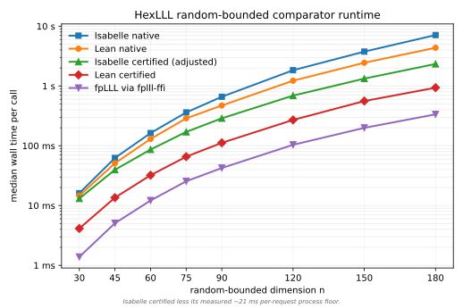
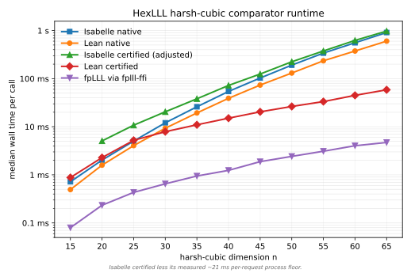

# HexLLL Performance Report

## Bench Targets

- `Hex.LLLBench.runSwapStepChecksum`: `swapStepComplexity n`
- `Hex.LLLBench.runSizeReduceChecksum`: `sizeReduceComplexity n`
- `Hex.LLLBench.runOfBasisRandomBoundedChecksum`: `ofBasisRandomBoundedComplexity n`
- `Hex.LLLBench.runOfBasisBzRecombinationChecksum`: `ofBasisBzRecombinationComplexity n`
- `Hex.LLLBench.runGramSchmidtCoeffChecksum`: `gramSchmidtCoeffComplexity n`
- `Hex.LLLBench.runFirstShortVectorHarshCubicChecksum`: `firstShortVectorHarshCubicComplexity n`
- `Hex.LLLBench.runPotential`: `potentialComplexity n`
- `Hex.LLLBench.runOfBasisHarshCubicChecksum`: `ofBasisHarshCubicComplexity n`
- `Hex.LLLBench.runFirstShortVectorRandomBoundedChecksum`: `firstShortVectorRandomBoundedComplexity n`
- `Hex.LLLBench.runSizeReduceColumnChecksum`: `sizeReduceColumnComplexity n`
- `Hex.LLLBench.runIntervalGramRowsSquareChecksum` (`hexlll_gram_bench`): `intervalGramRowsSquareComplexity n`
- `Hex.LLLBench.runIntervalGramRowsWideChecksum` (`hexlll_gram_bench`): `intervalGramRowsWideComplexity n`
- `Hex.LLLBench.runReducedIntervalSquareChecksum` (`hexlll_gram_bench`): `reducedIntervalSquareComplexity n`
- `Hex.LLLBench.runReducedIntervalWideChecksum` (`hexlll_gram_bench`): `reducedIntervalWideComplexity n`
- `Hex.LLLBench.runFpylllFirstShortVectorBZRecombinationChecksum`: fixed, repeats `5`
- `Hex.LLLBench.runIsabelleHarshCubicNormSq15`: fixed, repeats `3`
- `Hex.LLLBench.runFirstShortVectorBZRecombinationNormSq`: fixed, repeats `3`
- `Hex.LLLBench.runIsabelleHarshCubicNormSq45`: fixed, repeats `3`
- `Hex.LLLBench.runFirstShortVectorBZRecombinationChecksum`: fixed, repeats `5`
- `Hex.LLLBench.runIsabelleHarshCubicNormSq30`: fixed, repeats `3`
- `Hex.LLLBench.runFirstShortVectorHarshCubic15Checksum`: fixed, repeats `5`
- `Hex.LLLBench.runIsabelleRandomBoundedNormSq120`: fixed, repeats `3`
- `Hex.LLLBench.runFirstShortVectorRandomBoundedNormSq30`: fixed, repeats `3`
- `Hex.LLLBench.runFirstShortVectorRandomBoundedNormSq120`: fixed, repeats `3`
- `Hex.LLLBench.runFirstShortVectorHarshCubicNormSq30`: fixed, repeats `3`
- `Hex.LLLBench.runFirstShortVectorRandomBounded30Checksum`: fixed, repeats `5`
- `Hex.LLLBench.runFirstShortVectorRandomBoundedNormSq45`: fixed, repeats `3`
- `Hex.LLLBench.runFirstShortVectorHarshCubicNormSq45`: fixed, repeats `3`
- `Hex.LLLBench.runFirstShortVectorRandomBoundedNormSq75`: fixed, repeats `3`
- `Hex.LLLBench.runFirstShortVectorRandomBoundedNormSq90`: fixed, repeats `3`
- `Hex.LLLBench.runFirstShortVectorRandomBoundedNormSq150`: fixed, repeats `3`
- `Hex.LLLBench.runFirstShortVectorRandomBoundedNormSq180`: fixed, repeats `3`
- `Hex.LLLBench.runFpylllFirstShortVectorHarshCubic15Checksum`: fixed, repeats `5`
- `Hex.LLLBench.runFirstShortVectorHarshCubicNormSq20`: fixed, repeats `3`
- `Hex.LLLBench.runFirstShortVectorHarshCubicNormSq25`: fixed, repeats `3`
- `Hex.LLLBench.runIsabelleRandomBoundedNormSq30`: fixed, repeats `3`
- `Hex.LLLBench.runIsabelleRandomBoundedNormSq45`: fixed, repeats `3`
- `Hex.LLLBench.runIsabelleRandomBoundedNormSq60`: fixed, repeats `3`
- `Hex.LLLBench.runIsabelleRandomBoundedNormSq75`: fixed, repeats `3`
- `Hex.LLLBench.runIsabelleRandomBoundedNormSq90`: fixed, repeats `3`
- `Hex.LLLBench.runIsabelleRandomBoundedNormSq120`: fixed, repeats `3`
- `Hex.LLLBench.runIsabelleRandomBoundedNormSq150`: fixed, repeats `3`
- `Hex.LLLBench.runIsabelleRandomBoundedNormSq180`: fixed, repeats `3`
- `Hex.LLLBench.runFpylllFirstShortVectorRandomBounded30Checksum`: fixed, repeats `5`
- `Hex.LLLBench.runFpylllFirstShortVectorRandomBounded45Checksum`: fixed, repeats `5`
- `Hex.LLLBench.runFpylllFirstShortVectorRandomBounded60Checksum`: fixed, repeats `5`
- `Hex.LLLBench.runFpylllFirstShortVectorRandomBounded75Checksum`: fixed, repeats `5`
- `Hex.LLLBench.runFpylllFirstShortVectorRandomBounded90Checksum`: fixed, repeats `5`
- `Hex.LLLBench.runFpylllFirstShortVectorRandomBounded120Checksum`: fixed, repeats `5`
- `Hex.LLLBench.runFpylllFirstShortVectorRandomBounded150Checksum`: fixed, repeats `5`
- `Hex.LLLBench.runFpylllFirstShortVectorRandomBounded180Checksum`: fixed, repeats `5`
- `Hex.LLLBench.runFpylllFirstShortVectorHarshCubic20Checksum`: fixed, repeats `5`
- `Hex.LLLBench.runFpylllFirstShortVectorHarshCubic25Checksum`: fixed, repeats `5`
- `Hex.LLLBench.runFpylllFirstShortVectorHarshCubic30Checksum`: fixed, repeats `5`
- `Hex.LLLBench.runFpylllFirstShortVectorHarshCubic35Checksum`: fixed, repeats `5`
- `Hex.LLLBench.runFpylllFirstShortVectorHarshCubic40Checksum`: fixed, repeats `5`
- `Hex.LLLBench.runFpylllFirstShortVectorHarshCubic45Checksum`: fixed, repeats `5`
- `Hex.LLLBench.runFpylllFirstShortVectorHarshCubic50Checksum`: fixed, repeats `5`
- `Hex.LLLBench.runFpylllFirstShortVectorHarshCubic55Checksum`: fixed, repeats `5`
- `Hex.LLLBench.runCertifiedFirstShortVectorRandomBounded{30,45,60,75,90,120,150,180}Checksum`: fixed, repeats `3`
- `Hex.LLLBench.runCertifiedCheckerRandomBounded{30,45,60,75,90,120,150,180}Checksum`: fixed, repeats `3`
- `Hex.LLLBench.runCertifiedFirstShortVectorHarshCubic{15,20,25,30,35,40,45,50,55,60,65}Checksum`: fixed, repeats `3`
- `Hex.LLLBench.runCertifiedCheckerHarshCubic{15,20,25,30,35,40,45,50,55,60,65}Checksum`: fixed, repeats `3`
- `Hex.LLLBench.runDispatchedFirstShortVectorRandomBounded30Checksum`: fixed, repeats `3`
- `Hex.LLLBench.runDispatchedFirstShortVectorHarshCubic15Checksum`: fixed, repeats `3`
- `Hex.LLLBench.runFirstShortVectorHarshCubicNormSq15`: fixed, repeats `3`
- `Hex.LLLBench.runFirstShortVectorHarshCubicNormSq35`: fixed, repeats `3`
- `Hex.LLLBench.runFirstShortVectorHarshCubicNormSq40`: fixed, repeats `3`
- `Hex.LLLBench.runFirstShortVectorHarshCubicNormSq50`: fixed, repeats `3`
- `Hex.LLLBench.runFirstShortVectorHarshCubicNormSq55`: fixed, repeats `3`
- `Hex.LLLBench.runIsabelleBZRecombinationNormSq`: fixed, repeats `3`
- `Hex.LLLBench.runIsabelleHarshCubicNormSq20`: fixed, repeats `3`
- `Hex.LLLBench.runIsabelleHarshCubicNormSq25`: fixed, repeats `3`
- `Hex.LLLBench.runIsabelleHarshCubicNormSq35`: fixed, repeats `3`
- `Hex.LLLBench.runIsabelleHarshCubicNormSq40`: fixed, repeats `3`
- `Hex.LLLBench.runIsabelleHarshCubicNormSq50`: fixed, repeats `3`
- `Hex.LLLBench.runIsabelleHarshCubicNormSq55`: fixed, repeats `3`
- `Hex.LLLBench.runFirstShortVectorRandomBoundedNormSq60`: fixed, repeats `3`
- `Hex.LLLBench.runIsabelleCertifiedRandomBoundedNormSq{30,45,60,75,90,120,150,180}`: fixed, repeats `3`
- `Hex.LLLBench.runIsabelleCertifiedHarshCubicNormSq{15,20,25,30,35,40,45,50,55,60,65}`: fixed, repeats `3`

## Verdicts

Scientific run at commit `885431ee1d594b5f6a480cbcfa8f4389e3e3383d` on
`carica` (Apple M2 Ultra, macOS 14.6.1), command:

```sh
lake exe hexlll_bench run Hex.LLLBench.runSwapStepChecksum Hex.LLLBench.runSizeReduceChecksum Hex.LLLBench.runOfBasisRandomBoundedChecksum Hex.LLLBench.runOfBasisBzRecombinationChecksum Hex.LLLBench.runGramSchmidtCoeffChecksum Hex.LLLBench.runFirstShortVectorHarshCubicChecksum Hex.LLLBench.runPotential Hex.LLLBench.runOfBasisHarshCubicChecksum Hex.LLLBench.runFirstShortVectorRandomBoundedChecksum Hex.LLLBench.runSizeReduceColumnChecksum Hex.LLLBench.runFirstShortVectorBZRecombinationChecksum Hex.LLLBench.runFirstShortVectorHarshCubic15Checksum Hex.LLLBench.runFirstShortVectorRandomBounded30Checksum Hex.LLLBench.runFirstShortVectorBZRecombinationNormSq Hex.LLLBench.runFirstShortVectorRandomBoundedNormSq30 Hex.LLLBench.runFirstShortVectorRandomBoundedNormSq60 Hex.LLLBench.runFirstShortVectorRandomBoundedNormSq120 Hex.LLLBench.runFirstShortVectorRandomBoundedNormSq240 Hex.LLLBench.runFirstShortVectorHarshCubicNormSq15 Hex.LLLBench.runFirstShortVectorHarshCubicNormSq30 Hex.LLLBench.runFirstShortVectorHarshCubicNormSq45 --export-file reports/bench-results/hex-lll-885431e.json
```

The run used deterministic inputs from `HexLLL/Bench.lean`; the
random-bounded family uses committed seed `8`. The harness recorded
`885431e-dirty` because this worktree had an unrelated pre-existing
`.claude/CLAUDE.md` modification. Export artefact:
`reports/bench-results/hex-lll-885431e.json`.

- `Hex.LLLBench.runSwapStepChecksum`: consistent with declared complexity
  (parameters `96..160`, final per-call `521.412 us`).
- `Hex.LLLBench.runSizeReduceChecksum`: consistent with declared complexity
  (parameters `128..160`, final per-call `495.222 us`).
- `Hex.LLLBench.runOfBasisRandomBoundedChecksum`: consistent with declared
  complexity (parameters `48..144`, final verdict-row per-call `190.800 ms`
  at `n = 120`; the `n = 144` row was below the signal floor and excluded).
- `Hex.LLLBench.runOfBasisBzRecombinationChecksum`: consistent with declared
  complexity (parameters `24..72`, final verdict-row per-call `42.606 ms`
  at `n = 60`; the `n = 72` row was below the signal floor and excluded).
- `Hex.LLLBench.runGramSchmidtCoeffChecksum`: consistent with declared
  complexity (parameters `32..128`, final per-call `1.168 us`).
- `Hex.LLLBench.runFirstShortVectorHarshCubicChecksum`: consistent with
  declared complexity (parameters `15..45`, final per-call `178.802 ms`).
- `Hex.LLLBench.runPotential`: consistent with declared complexity
  (parameters `192..216`, final per-call `5.552 ms`).
- `Hex.LLLBench.runOfBasisHarshCubicChecksum`: consistent with declared
  complexity (parameters `12..36`, final per-call `35.258 ms`).
- `Hex.LLLBench.runFirstShortVectorRandomBoundedChecksum`: consistent with
  declared complexity (parameters `30..240`, final per-call `6.060 s`).
- `Hex.LLLBench.runSizeReduceColumnChecksum`: consistent with declared
  complexity (parameters `96..160`, final per-call `439.083 us`).
- `Hex.LLLBench.runFirstShortVectorBZRecombinationChecksum`: median
  `6.334 us`, observed hash `0x3c0064007a0036`, expected hash matches.
- `Hex.LLLBench.runFirstShortVectorHarshCubic15Checksum`: median `1.170 ms`,
  observed hash `0x949fde47fa1fffb4`, expected hash matches.
- `Hex.LLLBench.runFirstShortVectorRandomBounded30Checksum`: median
  `5.602 ms`, observed hash `0xf977db3a0120001a`, expected hash matches.
- `Hex.LLLBench.runFirstShortVectorBZRecombinationNormSq`: median
  `5.500 us`, observed hash `0x4e6`, expected hash matches.
- `Hex.LLLBench.runFirstShortVectorRandomBoundedNormSq30`: median
  `5.425 ms`, observed hash `0x3a52`, expected hash matches.
- `Hex.LLLBench.runFirstShortVectorRandomBoundedNormSq60`: median
  `68.697 ms`, observed hash `0x98cc`, expected hash matches.
- `Hex.LLLBench.runFirstShortVectorRandomBoundedNormSq120`: median
  `800.045 ms`, observed hash `0x11860`, expected hash matches.
- `Hex.LLLBench.runFirstShortVectorRandomBoundedNormSq240`: median
  `11.737 s`, observed hash `0x2454a`, expected hash matches.
- `Hex.LLLBench.runFirstShortVectorHarshCubicNormSq15`: median `1.220 ms`,
  observed hash `0x700000000033a4`, expected hash matches.
- `Hex.LLLBench.runFirstShortVectorHarshCubicNormSq30`: median `24.046 ms`,
  observed hash `0x37cc`, expected hash matches.
- `Hex.LLLBench.runFirstShortVectorHarshCubicNormSq45`: median `186.514 ms`,
  observed hash `0x6d1e`, expected hash matches.

Smoke wiring was also checked with:

```sh
lake exe hexlll_bench list
lake exe hexlll_bench verify
```

At current worktree commit `924910079376c876da2e2fe9d94915505dd477e4`,
the bench verify step succeeds for all 52 registered HexLLL benchmarks, including
the densified Isabelle ladder added after the scientific run below.

### Symmetry-aware interval-checker Gram rows

The four focused targets live in `hexlll_gram_bench`, which imports the
production interval checker without initializing the unrelated fixed-result
LLL benchmark fixtures in `hexlll_bench`. They use deterministic integer bases
at square shapes and at wide shapes with eight columns per row. The before and
after runs were recorded on `chungus2` (AMD EPYC 9455, Linux x86-64) with:

```sh
lake exe hexlll_gram_bench run \
  Hex.LLLBench.runIntervalGramRowsSquareChecksum \
  Hex.LLLBench.runReducedIntervalSquareChecksum \
  Hex.LLLBench.runIntervalGramRowsWideChecksum \
  Hex.LLLBench.runReducedIntervalWideChecksum \
  --export-file <artefact>
```

Baseline Gram construction represented 28.08% (`n = 32`) to 47.68%
(`n = 96`) of the square interval checker, and 58.41% (`n = 16`) to 70.81%
(`n = 48`) of the wide checker. Both paths clear the 10% Amdahl-adjusted gate.

| Target | Representative `n` | Before | After | Improvement |
| --- | ---: | ---: | ---: | ---: |
| Gram rows, square | 96 | 36.168 ms | 26.900 ms | 25.63% |
| Interval checker, square | 96 | 75.854 ms | 68.022 ms | 10.33% |
| Gram rows, wide | 48 | 19.102 ms | 10.905 ms | 42.91% |
| Interval checker, wide | 48 | 26.978 ms | 18.884 ms | 30.00% |

The two Gram-row result-hash ladders match and discriminate every matrix. The
two checker ladders also match, but both are the constant Boolean rejection
result `0`, so they are timing observables rather than strong regression
checks; behavior preservation is supplied by `gramRows_eq_impl` and the
checker soundness build. All eight benchmark verdicts are consistent with
their declared complexity models. Artefacts:

- `reports/bench-results/hex-lll-interval-gram-baseline-3d41529f-chungus2.json`,
  SHA-256 `12267b61a8934f6c59198b43fc6fc4a178f785fba67cdba9404bb9cb31ef6f81`.
- `reports/bench-results/hex-lll-interval-gram-after-02e35882-chungus2.json`,
  SHA-256 `53f87841ae3524980a6227a578917cab3464500ff0c45aab91a75c41348472f4`.

The deterministic consumer fixtures exercise the checker reject path after a
complete interval Gram–Schmidt pass; the final size/Lovasz predicates may
short-circuit. Their Amdahl shares are therefore conservative upper bounds for
an accepted certificate's extra tail, which is quadratic beside the measured
cubic pass. Each rung has one outer trial, but unlike the Gram–Schmidt pair the
before/after spawn floors were matched at 23–25 ms. Inputs use bounded
machine-word integers, so the reported construction wins should not be read as
a ceiling for large-coefficient production lattices.

Current scientific rerun for the five formerly inconclusive parametric
registrations at commit `924910079376c876da2e2fe9d94915505dd477e4` on
`carica` (Apple M2 Ultra, macOS), command:

```sh
lake exe hexlll_bench run Hex.LLLBench.runSizeReduceChecksum Hex.LLLBench.runGramSchmidtCoeffChecksum Hex.LLLBench.runFirstShortVectorHarshCubicChecksum Hex.LLLBench.runOfBasisHarshCubicChecksum Hex.LLLBench.runFirstShortVectorRandomBoundedChecksum --export-file reports/bench-results/hex-lll-924910079376c-clean.json
```

The harness recorded `9249100-dirty` because this worktree carried a
pre-existing local `.claude/CLAUDE.md` modification outside this evidence
package. Export artefact:
`reports/bench-results/hex-lll-924910079376c-clean.json`, SHA-256
`9e57bc8c2653e8ce7c8311b7592197068338c7dcdf8e235a6f0f3e1189768e7d`.

- `Hex.LLLBench.runSizeReduceChecksum`: consistent with declared complexity
  (parameters `128..160`, final per-call `220.548 us`).
- `Hex.LLLBench.runGramSchmidtCoeffChecksum`: consistent with declared
  complexity (parameters `32..128`, final per-call `7.363 us`).
- `Hex.LLLBench.runFirstShortVectorHarshCubicChecksum`: consistent with
  declared complexity (parameters `15..55`, final per-call `662.056 ms`).
- `Hex.LLLBench.runOfBasisHarshCubicChecksum`: consistent with declared
  complexity (parameters `12..36`, final per-call `86.523 ms`).
- `Hex.LLLBench.runFirstShortVectorRandomBoundedChecksum`: consistent with
  declared complexity (parameters `30..180`, final per-call `6.178 s`).

The earlier `reports/bench-results/hex-lll-e211854d1435.json` inconclusive
verdicts were measurement/model-registration findings. The current run resolves
the parametric-verdict blocker, but the densified Lean/Isabelle comparator
Concern below still prevents a Phase 4 promotion.

Current-head rerun for the same five formerly inconclusive parametric
registrations at commit `14537a67ebf1bd51b2275c8840562bb33ce813c1` on
`carica` (Apple M2 Ultra, macOS), command:

```sh
lake exe hexlll_bench run Hex.LLLBench.runSizeReduceChecksum Hex.LLLBench.runGramSchmidtCoeffChecksum Hex.LLLBench.runFirstShortVectorHarshCubicChecksum Hex.LLLBench.runOfBasisHarshCubicChecksum Hex.LLLBench.runFirstShortVectorRandomBoundedChecksum --export-file reports/bench-results/hex-lll-14537a67ebf1-parametric-rerun.json
```

The harness recorded `14537a6-dirty` because this worktree carried a
pre-existing local `.claude/CLAUDE.md` modification outside this evidence
package. Export artefact:
`reports/bench-results/hex-lll-14537a67ebf1-parametric-rerun.json`, SHA-256
`694775b6112456dab8e9f099e05a18997fdfd9e01a439e707ebf819c712472bc`.

- `Hex.LLLBench.runSizeReduceChecksum`: consistent with declared complexity
  (parameters `128..160`, final per-call `220.814 us`).
- `Hex.LLLBench.runGramSchmidtCoeffChecksum`: consistent with declared
  complexity (parameters `32..128`, final per-call `7.256 us`).
- `Hex.LLLBench.runFirstShortVectorHarshCubicChecksum`: consistent with
  declared complexity (parameters `15..55`, final per-call `663.375 ms`).
- `Hex.LLLBench.runOfBasisHarshCubicChecksum`: consistent with declared
  complexity (parameters `12..36`, final per-call `86.898 ms`).
- `Hex.LLLBench.runFirstShortVectorRandomBoundedChecksum`: consistent with
  declared complexity (parameters `30..180`, final per-call `6.073 s`).

Row-mutating `scaledCoeffRows` fixed harsh-cubic comparator check at commit
`af2d0a7dd05342c4a0f965cad83c54e86bb8afa5` on `carica` (Apple M2 Ultra,
macOS), command:

```sh
lake exe hexlll_bench run Hex.LLLBench.runFirstShortVectorHarshCubicNormSq45 Hex.LLLBench.runFirstShortVectorHarshCubicNormSq50 Hex.LLLBench.runFirstShortVectorHarshCubicNormSq55 Hex.LLLBench.runIsabelleHarshCubicNormSq45 Hex.LLLBench.runIsabelleHarshCubicNormSq50 Hex.LLLBench.runIsabelleHarshCubicNormSq55 --export-file reports/bench-results/hex-lll-c4d43eee-step-scaled-rows-harsh-cubic.json
```

The harness recorded `af2d0a7-dirty` because this worktree carried local
changes while measuring this patch. Export artefact:
`reports/bench-results/hex-lll-c4d43eee-step-scaled-rows-harsh-cubic.json`,
SHA-256 `55e347a67a2e16a86e522eb35a744ecafcaf0e9efe87908bc5229b0c1bacfae8`.

- `Hex.LLLBench.runFirstShortVectorHarshCubicNormSq45`: median
  `201.127 ms`, observed hash `0x6a96`, expected hash matches.
- `Hex.LLLBench.runFirstShortVectorHarshCubicNormSq50`: median
  `366.172 ms`, observed hash `0x72c6`, expected hash matches.
- `Hex.LLLBench.runFirstShortVectorHarshCubicNormSq55`: median
  `664.246 ms`, observed hash `0x7776`, expected hash matches.
- `Hex.LLLBench.runIsabelleHarshCubicNormSq45`: median `170.060 ms`,
  observed hash `0x6a96`, expected hash matches.
- `Hex.LLLBench.runIsabelleHarshCubicNormSq50`: median `285.118 ms`,
  observed hash `0x72c6`, expected hash matches.
- `Hex.LLLBench.runIsabelleHarshCubicNormSq55`: median `419.417 ms`,
  observed hash `0x7776`, expected hash matches.

The current fixed comparator registrations use the post-HO-18 densified
headline ladders:

- `random-bounded`: `n = 30, 45, 60, 75, 90, 120, 150, 180`.
- `harsh-cubic`: `n = 15, 20, 25, 30, 35, 40, 45, 50, 55, 60, 65`.
- `bz-recombination`: one tiny fixed row, retained only as contextual
  comparator evidence because process overhead dominates this family.

The committed densified Lean/Isabelle comparator sweep below covers the full
`random-bounded` and `harsh-cubic` ladders. Both native comparator
largest-rung verdicts are now met.

Informational `fpLLL via fpylll` random-bounded ladder run at worktree
commit `594364a5d86cc9daaf26c53a8b6a137998b38a6e` on `carica`
(Apple M2 Ultra, macOS), command:

```sh
PATH="$PWD/.venv-oracles/bin:$PATH" lake exe hexlll_bench run \
  Hex.LLLBench.runFpylllFirstShortVectorRandomBounded30Checksum \
  Hex.LLLBench.runFpylllFirstShortVectorRandomBounded45Checksum \
  Hex.LLLBench.runFpylllFirstShortVectorRandomBounded60Checksum \
  Hex.LLLBench.runFpylllFirstShortVectorRandomBounded75Checksum \
  Hex.LLLBench.runFpylllFirstShortVectorRandomBounded90Checksum \
  Hex.LLLBench.runFpylllFirstShortVectorRandomBounded120Checksum \
  Hex.LLLBench.runFpylllFirstShortVectorRandomBounded150Checksum \
  Hex.LLLBench.runFpylllFirstShortVectorRandomBounded180Checksum \
  --export-file reports/bench-results/hex-lll-fpylll-0c2d9a9e2d0a.json
```

The run used `fpylll 0.6.4`, `python-flint 0.8.0`, and deterministic benchmark
inputs from `HexLLL/Bench.lean`; no random seeds are involved. The harness
recorded `594364a-dirty` because this worktree carried the benchmark
registration/report edits plus a pre-existing local `.claude/CLAUDE.md`
modification outside this evidence package. Export artefact:
`reports/bench-results/hex-lll-fpylll-0c2d9a9e2d0a.json`, SHA-256
`21fcd94e1dbf8e745ace1f14fbc31cb93be139c2c4119350f51e8ace332affd3`.

- `Hex.LLLBench.runFpylllFirstShortVectorRandomBounded30Checksum`: median
  `1.837 ms`, min `1.803 ms`, max `1.888 ms`, observed checksum `0x4`.
- `Hex.LLLBench.runFpylllFirstShortVectorRandomBounded45Checksum`: median
  `4.784 ms`, min `4.611 ms`, max `4.869 ms`, observed checksum `0x4`.
- `Hex.LLLBench.runFpylllFirstShortVectorRandomBounded60Checksum`: median
  `9.756 ms`, min `9.586 ms`, max `10.359 ms`, observed checksum `0x4`.
- `Hex.LLLBench.runFpylllFirstShortVectorRandomBounded75Checksum`: median
  `19.446 ms`, min `19.324 ms`, max `19.942 ms`, observed checksum `0x4`.
- `Hex.LLLBench.runFpylllFirstShortVectorRandomBounded90Checksum`: median
  `32.003 ms`, min `31.852 ms`, max `32.490 ms`, observed checksum `0x4`.
- `Hex.LLLBench.runFpylllFirstShortVectorRandomBounded120Checksum`: median
  `76.952 ms`, min `75.794 ms`, max `79.394 ms`, observed checksum `0x4`.
- `Hex.LLLBench.runFpylllFirstShortVectorRandomBounded150Checksum`: median
  `153.998 ms`, min `152.679 ms`, max `157.519 ms`, observed checksum `0x4`.
- `Hex.LLLBench.runFpylllFirstShortVectorRandomBounded180Checksum`: median
  `271.702 ms`, min `269.054 ms`, max `1.008 s`, observed checksum `0x4`.

All eight fixed fpLLL random-bounded registrations had repeat-stable
checksums; the `n = 30` registration also matched its configured expected
checksum.

## Comparator Ratios

The current implemented gating comparator is `verified Isabelle LLL (AFP LLL_Basis_Reduction; Haskell extraction from Zenodo 2636367)`, declared in `HexLLL/SPEC/hex-lll.md`. The persistent-subprocess harness for it was wired in HO-16 (#3676); the in-process fpLLL FFI was wired later for the production certified path. The densified `random-bounded` and `harsh-cubic` ladders are the post-HO-18 fixed-benchmark schedules — `random-bounded` `n ∈ {30, 45, 60, 75, 90, 120, 150, 180}`, `harsh-cubic` `n ∈ {15, 20, 25, 30, 35, 40, 45, 50, 55, 60, 65}` — per the post-#3657 §"Headline reports" densification rule.

The certified external-dispatch SPEC also declares the gating comparator
`verified Isabelle certified-LLL (JAR 2020 §7; svp_certified from the Zenodo 2636367 LLL_Basis_Reduction extraction, same archive as the native comparator)`.
The Hex certified path is now registered as fixed process-call targets:
`runCertifiedFirstShortVectorRandomBounded{30,45,60,75,90,120,150,180}Checksum`
and
`runCertifiedFirstShortVectorHarshCubic{15,20,25,30,35,40,45,50,55,60,65}Checksum`.
Each target obtains a flat `(B', U, V)` payload through the in-process
`fplll-ffi` shim and runs `ExternalReducer.certifyFlat`, so the measured path is
fpLLL candidate production plus the Lean checker. Paired
`runCertifiedChecker*` targets cache the same candidate and re-run only
`certCheck` after warmup, giving the checker's share of certified-path cost.

The current clean consolidated sweeps were recorded on `carica` (Apple M2
Ultra, macOS) with `scripts/dev/run_lll_bench.sh random-bounded RandomBounded`
at commit `5d16cb58f92bd69590b2439b89c83894d3798e4b` and
`scripts/dev/run_lll_bench.sh harsh-cubic HarshCubic` at commit
`674302291e3c04dbd7e6b4252056ef33859c2e39`. The commands load the pinned
native Isabelle, certified Isabelle, and `fplll-ffi` oracles, run every target
whose name contains the family filter, and record three warm outer repeats.
The exports and measured certified-Isabelle process floors are:

- `reports/bench-results/hex-lll-random-bounded-5d16cb58.json`, SHA-256
  `202772082eab1ad7ac2393c42446029d807261d62bd645f95d22c66f152a0314`;
  floor `reports/bench-results/hex-lll-random-bounded-floor-5d16cb58.json`,
  SHA-256 `3807c7c168f9906a4f83b59f01bdb47e8525c9275362a7df927563037aa16961`.
- `reports/bench-results/hex-lll-harsh-cubic-67430229.json`, SHA-256
  `d8dde9f79a477ab9e5834c6c9031d9fca182ff0a25f9e6f96cbb22f0e6b3e0ba`;
  floor `reports/bench-results/hex-lll-harsh-cubic-floor-67430229.json`,
  SHA-256 `2101e94e4dce5c7f4c8aaf643db9b1aadbd0be6104006a7f754d4d5560310b72`.

Both exports record `git_dirty=false`. All certified-path and checker-only rows
have repeat-stable hashes. A rejected candidate makes the fixed target fail;
all 11,896 timed certified calls completed, so the measured rejection rate is
`0 / 11,896 = 0 %`.

Lean-certified-vs-Lean-native random-bounded ratios:

| `n` | Lean native median | Lean certified median | certified/native | checker share |
|---:|---:|---:|---:|---:|
| 30 | 14.64 ms | 4.13 ms | 0.2819 | 64.3 % |
| 45 | 50.97 ms | 13.54 ms | 0.2657 | 61.7 % |
| 60 | 129.84 ms | 32.15 ms | 0.2476 | 62.5 % |
| 75 | 287.53 ms | 65.61 ms | 0.2282 | 58.5 % |
| 90 | 471.31 ms | 111.99 ms | 0.2376 | 61.2 % |
| 120 | 1.22 s | 270.50 ms | 0.2209 | 63.5 % |
| 150 | 2.45 s | 559.43 ms | 0.2287 | 63.6 % |
| 180 | 4.36 s | 936.16 ms | 0.2149 | 66.5 % |

Random-bounded trend: Lean certified sits at about `0.21..0.28×` Lean
native. The checker is the dominant certified-path component, accounting for
`59..67 %` of the measured full path. The input-size predictor routes the
random-bounded checker rungs `n ≤ 150` to the exact integer checker
(the operand bit growth on this family stays below the 128-bit interval
working precision); `n = 180` dispatches to the fixed-precision enclosure
pass, which is where the small absolute speedup at the top of the ladder comes
from.

Lean-certified-vs-Lean-native harsh-cubic ratios:

| `n` | Lean native median | Lean certified median | certified/native | checker share |
|---:|---:|---:|---:|---:|
| 15 | 494 µs | 879 µs | 1.7779 | 88.5 % |
| 20 | 1.59 ms | 2.28 ms | 1.4354 | 86.9 % |
| 25 | 4.05 ms | 5.22 ms | 1.2884 | 93.4 % |
| 30 | 9.32 ms | 7.90 ms | 0.8479 | 86.8 % |
| 35 | 19.36 ms | 10.98 ms | 0.5674 | 89.8 % |
| 40 | 39.02 ms | 15.07 ms | 0.3862 | 89.9 % |
| 45 | 73.48 ms | 20.43 ms | 0.2780 | 89.0 % |
| 50 | 130.83 ms | 26.40 ms | 0.2018 | 89.6 % |
| 55 | 234.98 ms | 33.34 ms | 0.1419 | 90.6 % |
| 60 | 375.02 ms | 44.94 ms | 0.1198 | 89.2 % |
| 65 | 602.42 ms | 58.61 ms | 0.0973 | 85.7 % |

Harsh-cubic trend: Lean certified crosses below Lean native at `n = 30` and
drops to **`0.097×` Lean native at `n = 65`** — a 10.3× speedup over the
native body (`0.14×`, 7.0× at `n = 55`; the certified curve is still widening
its lead at the top of the ladder). Checker-only cost accounts for the large
majority of the full certified path (`≈86..93 %`); the candidate-production
remainder is small on this family, and its measured share is within run noise
at the small rungs where it is sub-millisecond.
The dispatched checker routes harsh-cubic above `n ≈ 25` to the
fixed-precision enclosure pass (which costs `O(n³)` on fixed-width
mantissas, independent of the `~2^(3.3n)` Gram-determinant bit growth
on this family); at `n ∈ {15, 20, 25}` the predictor still picks the exact
`d`/`ν` checker, where the small absolute cost difference is the
checker-share figure. The harsh-cubic entries are `2^(3.3n)` wide, so the
same-lattice clause runs the packed product-equality certificate on wide
entries, where the packed dot products cost the same bit operations as a
materialized comparison.

The external `verified Isabelle certified-LLL` executable is now wired from the
same Zenodo 2636367 archive as the native comparator:
`scripts/oracle/setup_lll_isabelle.sh certified` builds
`experiments/svp_certified`, and `HexLLL/Bench.lean` exposes persistent
`runIsabelleCertified*NormSq` fixed targets for the random-bounded and
harsh-cubic ladders.

Each consolidated family sweep measures the Hex-certified and
Isabelle-certified targets on the same host and at the same clean commit. The
matching process-floor export comes from the immediately following command:

```sh
scripts/dev/run_lll_bench.sh random-bounded RandomBounded
scripts/dev/run_lll_bench.sh harsh-cubic HarshCubic
```

The raw ratios below use the recorded wall times. The adjusted ratio subtracts
the matching measured Isabelle-certified process floor (`20.561 ms` for
random-bounded, `20.578 ms` for harsh-cubic) before dividing. A rung is
eligible exactly when the floor is no more than 50% of its raw
Isabelle-certified wall time and that time is below the 10-second ceiling.

Certified-vs-Isabelle-certified random-bounded ratios:

| `n` | Hex certified | Isabelle certified | raw ratio | adjusted ratio | adjusted speedup | status |
|---:|---:|---:|---:|---:|---:|:---|
| 30 | 4.13 ms | 33.66 ms | 0.1226 | 0.3150 | 3.18× | floor-dominated |
| 45 | 13.54 ms | 60.20 ms | 0.2250 | 0.3417 | 2.93× | eligible |
| 60 | 32.15 ms | 107.05 ms | 0.3004 | 0.3718 | 2.69× | eligible |
| 75 | 65.61 ms | 190.96 ms | 0.3436 | 0.3851 | 2.60× | eligible |
| 90 | 111.99 ms | 308.58 ms | 0.3629 | 0.3888 | 2.57× | eligible |
| 120 | 270.50 ms | 710.34 ms | 0.3808 | 0.3921 | 2.55× | eligible |
| 150 | 559.43 ms | 1.35 s | 0.4146 | 0.4210 | 2.38× | eligible |
| 180 | 936.16 ms | 2.36 s | 0.3974 | 0.4009 | 2.49× | eligible |

Certified-vs-Isabelle-certified harsh-cubic ratios:

| `n` | Hex certified | Isabelle certified | raw ratio | adjusted ratio | adjusted speedup | status |
|---:|---:|---:|---:|---:|---:|:---|
| 15 | 879 µs | 23.00 ms | 0.0382 | 0.3628 | 2.76× | floor-dominated |
| 20 | 2.28 ms | 25.65 ms | 0.0891 | 0.4504 | 2.22× | floor-dominated |
| 25 | 5.22 ms | 31.35 ms | 0.1666 | 0.4848 | 2.06× | floor-dominated |
| 30 | 7.90 ms | 41.02 ms | 0.1926 | 0.3864 | 2.59× | floor-dominated |
| 35 | 10.98 ms | 58.70 ms | 0.1871 | 0.2882 | 3.47× | eligible |
| 40 | 15.07 ms | 92.85 ms | 0.1623 | 0.2085 | 4.80× | eligible |
| 45 | 20.43 ms | 145.25 ms | 0.1407 | 0.1639 | 6.10× | eligible |
| 50 | 26.40 ms | 244.77 ms | 0.1078 | 0.1177 | 8.49× | eligible |
| 55 | 33.34 ms | 396.61 ms | 0.0841 | 0.0887 | 11.28× | eligible |
| 60 | 44.94 ms | 644.05 ms | 0.0698 | 0.0721 | 13.87× | eligible |
| 65 | 58.61 ms | 995.02 ms | 0.0589 | 0.0601 | 16.63× | eligible |

Gating verdict: **met at every eligible rung.** The random-bounded adjusted
ratio rises gently from `0.3417` at `n = 45` to about `0.40` on the upper
rungs, then levels off: Hex remains `2.38..2.93×` faster across seven eligible
points. The harsh-cubic adjusted ratio falls monotonically from `0.2882` at
`n = 35` to `0.0601` at `n = 65`: Hex's lead grows from `3.47×` to `16.63×`
across seven eligible points. The largest eligible rung therefore meets the
declared gate for both families. The four bottom harsh-cubic rungs and bottom
random-bounded rung remain in the table for completeness but do not support
the verdict because the Isabelle per-request fork consumes more than half of
their wall time.

Architectural asymmetries for this ratio:

- Hex's certified path calls `fplll-ffi` in process and then runs the Lean
  integer certificate checker.
- Isabelle's certified path shells out to the `fplll` binary per request, even
  though the surrounding Haskell driver is persistent.
- Hex checks reducedness with `lllReducedInt`; Isabelle confirms reducedness by
  re-running the verified LLL reducer inside `test_certified`.

The random-bounded plot shows five labelled series across the full committed
ladder: Lean native, Isabelle native, Lean certified, Isabelle certified
(adjusted), and fpLLL via fplll-ffi. **Lean native** is the exact `d`/`ν`
reducer (`lllNative`), the sole in-tree reducer and the public `lll`'s native
path; the certified path only checks an fpLLL candidate rather than reducing the
basis itself. The fpLLL series is the in-process `fplll-ffi` shim called at the
dispatch's requested reduction parameters with transform production — the exact
reducer call the production dispatch makes.

(The earlier approximation-steered reducer was removed in
[#8500](https://github.com/kim-em/hex-dev/issues/8500); the comparator is now
provider-vs-native. The per-family SVG figures and their plot script are
regenerated without the "Lean steered" series on
`feat/hexlll-perf-restore-extend`.)



The plotted Isabelle-certified curve is adjusted down by its **measured**
per-request `svp_certified` floor — the fixed fork + startup cost of one
request, which Hex's in-process `fplll-ffi` path avoids. The floor is the
committed `runIsabelleCertifiedProcessFloorNormSq` benchmark (a trivial 2×2
request, so its median is the floor with negligible `n`-dependent work),
measured in the **same run** as the harsh-cubic ladder (~20.6 ms on `carica`)
so it is a true lower bound under every rung. The comparator drops rungs whose
raw time is within 15% of the floor (*floor-dominated*: the subtracted value is
within the floor's own measurement noise), so bottom rungs such as harsh-cubic
`n = 15` — whose certified work is only ~2.4 ms above a ~20 ms floor — are
omitted from the adjusted curve rather than plotted near-zero. The plot reads
that measured value rather than a hardcoded constant; the ratio tables above and
the scaling fits keep the raw medians.

The harsh-cubic plot shows the same five series, and this is the family where
the certified path's lead matters most. The exact `d`/`ν` reducer rides the
`~n^5.6` slope of its Θ(n⁴)-bit Gram-determinant state, while the certified path
— which only checks an fpLLL candidate — stays in a much lower complexity class.
The clean consolidated export runs the full `15..65` schedule, matching the
native and Isabelle-certified curves rung for rung; Lean certified widens its
lead over exact native across the top rungs (`0.097×` at `n = 65`).



Here too the Isabelle-certified curve is adjusted down by its measured
per-request `svp_certified` floor (the committed
`runIsabelleCertifiedProcessFloorNormSq` benchmark, ~20.6 ms; see
[§Per-call comparator overhead](#per-call-comparator-overhead)); as on the
random-bounded figure, the ratio tables and scaling fits keep the raw
medians.

The figures were regenerated from the clean consolidated exports and their
matching floor exports with:

```sh
python3 scripts/plots/hex-lll-comparator.py --family random-bounded \
  --isabelle-floor reports/bench-results/hex-lll-random-bounded-floor-5d16cb58.json
python3 scripts/plots/hex-lll-comparator.py --family harsh-cubic \
  --isabelle-floor reports/bench-results/hex-lll-harsh-cubic-floor-67430229.json
```

The resulting SHA-256 digests are
`61ff3d738f46655af42efc2377b8733c3f66174af281774dd955d1568deaf01f`
for `hex-lll-comparator-random-bounded.svg` and
`546b7c27ae5c668decef5dcbadcef764d6f364e8e7b54a9360b08e06c6ba7f4a`
for `hex-lll-comparator-harsh-cubic.svg`.

For the asymptotic scaling of these curves — fitted exponents and constant
factors per method, with reproduction steps — see
[hex-lll-scaling.md](hex-lll-scaling.md). In brief: on random-bounded the
exact-native, certified, and fpLLL methods are all near-`n³` and differ by
constant factors (Lean certified faster than exact native); on harsh-cubic the
exact native reducer (`~n^5.6`) fans out from the certified path (`~n^2.79`) and
fpLLL (`~n^2.8` for the in-process shim at the production-requested parameters)
— the certified external-candidate path is what stays out of the `~n^5.6`
class.

### Per-call comparator overhead

The external Isabelle and fpylll comparators use the persistent-subprocess
protocol described at the top of `HexLLL/Bench.lean`; the production fpLLL
path uses the in-process FFI described above. The per-call protocol overhead,
measured on the audit host, is:

- `Isabelle` (gating): **~9 µs** per steady-state request after the one-time GHC startup.
- `Isabelle certified-LLL`: **20.561 ms** for random-bounded and **20.578 ms**
  for harsh-cubic per trivial end-to-end request through persistent
  `svp_certified`; this includes the per-request `fplll` subprocess and
  certificate/reducedness checks. These are committed, registered
  `runIsabelleCertifiedProcessFloorNormSq` measurements (a trivial 2×2
  request), taken immediately after their matching family sweeps, so each plot
  subtracts a reproducible floor rather than a hardcoded constant.
- `fpLLL via fpylll` (informational): **~34 µs** per steady-state request after the one-time CPython + `import fpylll` startup.

The certified-Isabelle floor exceeds 5% on the lower and middle rungs, so the
tables report both raw and adjusted ratios there and exclude rungs where it
exceeds 50% from the gating verdict. The process-call registrations set
`minTotalSeconds := 1.0`, so each fixed child runs enough inner iterations to
amortize its one-time GHC startup before reporting
`total_nanos / inner_repeats`; the separate per-request `fplll` fork remains
and is removed only by the measured floor adjustment.

### Densified Lean + Isabelle sweep

Combined Lean + Isabelle sweep at commit `6fcd1185cee03cec228194857b3bab0816060158` on `carica` (Apple M2 Ultra, macOS), recorded from `2026-06-01T12:15:13Z` through `2026-06-01T12:51:25Z`. The harness recorded `6fcd118-dirty` because this worktree carried a pre-existing local `.claude/CLAUDE.md` modification outside this evidence package.

Sweep command:

```sh
lake exe hexlll_bench run \
  Hex.LLLBench.runFirstShortVectorRandomBoundedNormSq30 \
  Hex.LLLBench.runIsabelleRandomBoundedNormSq30 \
  Hex.LLLBench.runFirstShortVectorRandomBoundedNormSq45 \
  Hex.LLLBench.runIsabelleRandomBoundedNormSq45 \
  Hex.LLLBench.runFirstShortVectorRandomBoundedNormSq60 \
  Hex.LLLBench.runIsabelleRandomBoundedNormSq60 \
  Hex.LLLBench.runFirstShortVectorRandomBoundedNormSq75 \
  Hex.LLLBench.runIsabelleRandomBoundedNormSq75 \
  Hex.LLLBench.runFirstShortVectorRandomBoundedNormSq90 \
  Hex.LLLBench.runIsabelleRandomBoundedNormSq90 \
  Hex.LLLBench.runFirstShortVectorRandomBoundedNormSq120 \
  Hex.LLLBench.runIsabelleRandomBoundedNormSq120 \
  Hex.LLLBench.runFirstShortVectorRandomBoundedNormSq150 \
  Hex.LLLBench.runIsabelleRandomBoundedNormSq150 \
  Hex.LLLBench.runFirstShortVectorRandomBoundedNormSq180 \
  Hex.LLLBench.runIsabelleRandomBoundedNormSq180 \
  Hex.LLLBench.runFirstShortVectorHarshCubicNormSq15 \
  Hex.LLLBench.runIsabelleHarshCubicNormSq15 \
  Hex.LLLBench.runFirstShortVectorHarshCubicNormSq20 \
  Hex.LLLBench.runIsabelleHarshCubicNormSq20 \
  Hex.LLLBench.runFirstShortVectorHarshCubicNormSq25 \
  Hex.LLLBench.runIsabelleHarshCubicNormSq25 \
  Hex.LLLBench.runFirstShortVectorHarshCubicNormSq30 \
  Hex.LLLBench.runIsabelleHarshCubicNormSq30 \
  Hex.LLLBench.runFirstShortVectorHarshCubicNormSq35 \
  Hex.LLLBench.runIsabelleHarshCubicNormSq35 \
  Hex.LLLBench.runFirstShortVectorHarshCubicNormSq40 \
  Hex.LLLBench.runIsabelleHarshCubicNormSq40 \
  Hex.LLLBench.runFirstShortVectorHarshCubicNormSq45 \
  Hex.LLLBench.runIsabelleHarshCubicNormSq45 \
  Hex.LLLBench.runFirstShortVectorHarshCubicNormSq50 \
  Hex.LLLBench.runIsabelleHarshCubicNormSq50 \
  Hex.LLLBench.runFirstShortVectorHarshCubicNormSq55 \
  Hex.LLLBench.runIsabelleHarshCubicNormSq55 \
  Hex.LLLBench.runFirstShortVectorBZRecombinationNormSq \
  Hex.LLLBench.runIsabelleBZRecombinationNormSq \
  --export-file reports/bench-results/hex-lll-densified-6fcd1185cee0.json
```

Export artefact: `reports/bench-results/hex-lll-densified-6fcd1185cee0.json`, SHA-256 `8917e96a952d7d2e40bdcea21d5399808dcd32fcec37114a06dd884e292effd9`.

Comparator source: `scripts/oracle/setup_lll_isabelle.sh` downloads and verifies Zenodo record `2636367`, archive SHA-256 `5c975aeb2033540b8f9a05d2ffac87dca0f258e887a5807edefbe60178a547e0`, then runs `svp_verified`.

### random-bounded ladder

All three medians come from
`reports/bench-results/hex-lll-random-bounded-schur.json`, a single
Lean+Isabelle+fpylll sweep on `carica` (Apple M2 Ultra, macOS) with
`warmupFirstIter := true`, all four post-#6330 perf fixes in
(#6338, #6339, #6348, #6350), and the per-row Schur scaled-coefficient
kernel.

| `n` | Lean median | Isabelle median | fpylll median | Lean/Isabelle | speedup vs Isabelle | status |
|---:|---:|---:|---:|---:|---:|:---|
| 30 | 15.14 ms | 16.81 ms | 1.84 ms | 0.9007 | Lean 1.11× faster | eligible |
| 45 | 55.53 ms | 64.85 ms | 4.83 ms | 0.8563 | Lean 1.17× faster | eligible |
| 60 | 142.01 ms | 176.93 ms | 9.64 ms | 0.8026 | Lean 1.25× faster | eligible |
| 75 | 296.58 ms | 383.34 ms | 19.41 ms | 0.7737 | Lean 1.29× faster | eligible |
| 90 | 495.68 ms | 691.52 ms | 31.62 ms | 0.7168 | Lean 1.40× faster | eligible |
| 120 | 1.39 s | 1.93 s | 76.61 ms | 0.7213 | Lean 1.39× faster | eligible |
| 150 | 2.65 s | 3.98 s | 151.93 ms | 0.6639 | Lean 1.51× faster | eligible |
| 180 | 4.76 s | 7.55 s | 268.23 ms | 0.6304 | Lean 1.59× faster | eligible |

**Trend.** Across the eligible range `n = 30..180`, the Lean/Isabelle ratio moves from `0.9007` to `0.6304`: Lean's lead grows with `n`.

**Gating-goal verdict (largest eligible rung `n = 180`).** Lean `4.76 s` vs Isabelle `7.55 s`; ratio `0.6304` (Lean 1.59× faster). Gating-goal verdict: **met**.

### harsh-cubic ladder

Lean and Isabelle medians come from
`reports/bench-results/hex-lll-harsh-cubic-extended-schur-lean-isabelle.json`,
a single sweep on `carica` (Apple M2 Ultra, macOS) with
`warmupFirstIter := true`, all four post-#6330 perf fixes in
(#6338, #6339, #6348, #6350), and the per-row Schur scaled-coefficient
kernel. The fpylll comparator medians in the consolidated
`reports/bench-results/hex-lll-harsh-cubic-extended-schur.json` are the
unchanged fpylll series from the post-perf export.

| `n` | Lean median | Isabelle median | fpylll median | Lean/Isabelle | speedup vs Isabelle | status |
|---:|---:|---:|---:|---:|---:|:---|
| 15 | 515 µs | 763 µs | 429 µs | 0.6743 | Lean 1.48× faster | eligible |
| 20 | 1.67 ms | 2.17 ms | 829 µs | 0.7693 | Lean 1.30× faster | eligible |
| 25 | 4.15 ms | 5.23 ms | 1.33 ms | 0.7931 | Lean 1.26× faster | eligible |
| 30 | 9.53 ms | 12.40 ms | 1.99 ms | 0.7689 | Lean 1.30× faster | eligible |
| 35 | 19.65 ms | 27.17 ms | 2.60 ms | 0.7230 | Lean 1.38× faster | eligible |
| 40 | 39.44 ms | 56.52 ms | 3.59 ms | 0.6978 | Lean 1.43× faster | eligible |
| 45 | 75.83 ms | 109.94 ms | 4.71 ms | 0.6897 | Lean 1.45× faster | eligible |
| 50 | 135.80 ms | 199.09 ms | 5.75 ms | 0.6821 | Lean 1.47× faster | eligible |
| 55 | 234.28 ms | 356.01 ms | 7.36 ms | 0.6581 | Lean 1.52× faster | eligible |
| 60 | 381.56 ms | 597.68 ms | 9.21 ms | 0.6384 | Lean 1.57× faster | eligible |
| 65 | 621.32 ms | 950.08 ms | 10.78 ms | 0.6540 | Lean 1.53× faster | eligible |

**Trend.** Across the eligible range `n = 15..65`, the Lean/Isabelle ratio stays below `1.0` and moves from `0.6743` to `0.6540`; Lean is faster than Isabelle on every harsh-cubic rung.

**Gating-goal verdict (largest eligible rung `n = 65`).** Lean `621.32 ms` vs Isabelle `950.08 ms`; ratio `0.6540` (Lean 1.53× faster). Gating-goal verdict: **met**.

The four post-#6330 perf fixes (`swapStep` #6338, `stepScaledRows`
#6339, `exactDiv` #6348, `setEntry` #6350) closed most of the
previously-reported gap, and the Schur recurrence closes the remaining
structural gap: the Lean/Isabelle ratio at `n = 65` moved from `1.90×`
(post-warmupFirstIter, pre-perf-fix) to `1.14×` after the four point
fixes, and now to `0.6540`.

### bz-recombination (context only)

- Lean `runFirstShortVectorBZRecombinationNormSq` median: `3.438 us`; Isabelle `runIsabelleBZRecombinationNormSq` median: `57.702 ms`; raw ratio `5.96e-05`; adjusted ratio `5.96e-05` (Lean 16781.08× faster).

Per the HO-18 issue body, the BZ family is reported for context only: its tiny matrix means per-call wall time on either side is dominated by process and input-marshalling overhead in the Isabelle executable, so the gating-goal verdict relies on `random-bounded` and `harsh-cubic`, not on this rung.

### fpLLL via fplll-ffi (informational)

`HexLLL/SPEC/hex-lll.md` classifies the fpLLL comparator as informational
and renames it to `fpLLL via fplll-ffi`: the SPEC now requires fpLLL to be
measured through the in-process `fplll-ffi` FFI shim into `libfplll` (the
same reducer the certified external-dispatch path resolves at runtime), not
through a Python `fpylll` subprocess whose interpreter and IPC overhead the
runtime path never pays. The data in this section was collected before that
rename, via the legacy `fpylll` persistent-subprocess wiring (`Hex.LLLBench.runFpylll*`
targets); it is retained as transitional context and will be replaced by an
`fplll-ffi` sweep when the shim is wired into `hexlll_bench`.

The most recent informational fpLLL sweep is from worktree commit
`594364a5d86cc9daaf26c53a8b6a137998b38a6e` on `carica` (Apple M2 Ultra,
macOS), command:

```sh
PATH="$PWD/.venv-oracles/bin:$PATH" lake exe hexlll_bench run \
  Hex.LLLBench.runFpylllFirstShortVectorRandomBounded30Checksum \
  Hex.LLLBench.runFpylllFirstShortVectorRandomBounded45Checksum \
  Hex.LLLBench.runFpylllFirstShortVectorRandomBounded60Checksum \
  Hex.LLLBench.runFpylllFirstShortVectorRandomBounded75Checksum \
  Hex.LLLBench.runFpylllFirstShortVectorRandomBounded90Checksum \
  Hex.LLLBench.runFpylllFirstShortVectorRandomBounded120Checksum \
  Hex.LLLBench.runFpylllFirstShortVectorRandomBounded150Checksum \
  Hex.LLLBench.runFpylllFirstShortVectorRandomBounded180Checksum \
  --export-file reports/bench-results/hex-lll-fpylll-0c2d9a9e2d0a.json
```

Export artefact: `reports/bench-results/hex-lll-fpylll-0c2d9a9e2d0a.json`,
SHA-256 `21fcd94e1dbf8e745ace1f14fbc31cb93be139c2c4119350f51e8ace332affd3`.

- `random-bounded` `n = 30`: Lean median `18.403 ms`, fpLLL median `1.837 ms`, fpLLL relative median `0.100×` (raw); adjusted for ~34 µs protocol overhead, `0.098×`.
- `random-bounded` `n = 45`: Lean median `69.406 ms`, fpLLL median `4.784 ms`, fpLLL relative median `0.069×` (raw); adjusted `0.068×`.
- `random-bounded` `n = 60`: Lean median `179.295 ms`, fpLLL median `9.756 ms`, fpLLL relative median `0.054×` (raw); adjusted `0.054×`.
- `random-bounded` `n = 75`: Lean median `371.360 ms`, fpLLL median `19.446 ms`, fpLLL relative median `0.052×` (raw); adjusted `0.052×`.
- `random-bounded` `n = 90`: Lean median `650.187 ms`, fpLLL median `32.003 ms`, fpLLL relative median `0.049×` (raw); adjusted `0.049×`.
- `random-bounded` `n = 120`: Lean median `1.839 s`, fpLLL median `76.952 ms`, fpLLL relative median `0.042×` (raw); adjusted `0.042×`.
- `random-bounded` `n = 150`: Lean median `3.778 s`, fpLLL median `153.998 ms`, fpLLL relative median `0.041×` (raw); adjusted `0.041×`.
- `random-bounded` `n = 180`: Lean median `6.939 s`, fpLLL median `271.702 ms`, fpLLL relative median `0.039×` (raw); adjusted `0.039×`.

Harsh-cubic fpLLL sweep at worktree commit
`594364a5d86cc9daaf26c53a8b6a137998b38a6e` on `carica`
(Apple M2 Ultra, macOS), command:

```sh
PATH="$PWD/.venv-oracles/bin:$PATH" lake exe hexlll_bench run \
  Hex.LLLBench.runFpylllFirstShortVectorHarshCubic15Checksum \
  Hex.LLLBench.runFpylllFirstShortVectorHarshCubic20Checksum \
  Hex.LLLBench.runFpylllFirstShortVectorHarshCubic25Checksum \
  Hex.LLLBench.runFpylllFirstShortVectorHarshCubic30Checksum \
  Hex.LLLBench.runFpylllFirstShortVectorHarshCubic35Checksum \
  Hex.LLLBench.runFpylllFirstShortVectorHarshCubic40Checksum \
  Hex.LLLBench.runFpylllFirstShortVectorHarshCubic45Checksum \
  Hex.LLLBench.runFpylllFirstShortVectorHarshCubic50Checksum \
  Hex.LLLBench.runFpylllFirstShortVectorHarshCubic55Checksum \
  --export-file reports/bench-results/hex-lll-fpylll-harsh-cubic-4a69408a680d.json
```

The harness recorded `594364a-dirty` because this worktree carried the
benchmark registration/report edits plus a pre-existing local `.claude/CLAUDE.md`
modification outside this evidence package. Export artefact:
`reports/bench-results/hex-lll-fpylll-harsh-cubic-4a69408a680d.json`,
SHA-256 `572afe6866d80e4fd0f54519c3fbdf5bd6946cddcb919d8591e6642a1154aa0f`.

- `harsh-cubic` `n = 15`: Lean median `898.791 us`, fpLLL median `423.473 us`, fpLLL relative median `0.471×` (raw); adjusted `0.433×`.
- `harsh-cubic` `n = 20`: Lean median `3.191 ms`, fpLLL median `823.053 us`, fpLLL relative median `0.258×` (raw); adjusted `0.247×`.
- `harsh-cubic` `n = 25`: Lean median `8.331 ms`, fpLLL median `1.291 ms`, fpLLL relative median `0.155×` (raw); adjusted `0.151×`.
- `harsh-cubic` `n = 30`: Lean median `22.022 ms`, fpLLL median `1.961 ms`, fpLLL relative median `0.089×` (raw); adjusted `0.087×`.
- `harsh-cubic` `n = 35`: Lean median `49.134 ms`, fpLLL median `2.598 ms`, fpLLL relative median `0.053×` (raw); adjusted `0.052×`.
- `harsh-cubic` `n = 40`: Lean median `105.251 ms`, fpLLL median `3.530 ms`, fpLLL relative median `0.034×` (raw); adjusted `0.033×`.
- `harsh-cubic` `n = 45`: Lean median `202.061 ms`, fpLLL median `4.678 ms`, fpLLL relative median `0.023×` (raw); adjusted `0.023×`.
- `harsh-cubic` `n = 50`: Lean median `377.282 ms`, fpLLL median `5.913 ms`, fpLLL relative median `0.016×` (raw); adjusted `0.016×`.
- `harsh-cubic` `n = 55`: Lean median `640.050 ms`, fpLLL median `7.356 ms`, fpLLL relative median `0.011×` (raw); adjusted `0.011×`.

The regenerated fpLLL fixed-mode targets amortize CPython + `import fpylll`
startup inside each measured child. Across both `random-bounded` and
`harsh-cubic`, fpLLL is faster than Lean at every reported rung. Because
fpylll is informational, these trends remain context rather than a gating
performance signal for HexLLL.

## Profile

Profiles were captured with `samply record --save-only
--unstable-presymbolicate` through the `lean-bench profile` child path at the
same commit on `carica` (Apple M2 Ultra, macOS 14.6.1), sampling at samply's
default 1 kHz rate. Raw Firefox Profiler JSON and symbol sidecars are
developer-local under `/tmp/hex-profiles/` and are not committed.

### `bz-recombination`

Command:

```sh
lake exe hexlll_bench profile Hex.LLLBench.runOfBasisBzRecombinationChecksum --param 72 --profiler "samply record --save-only --unstable-presymbolicate --output /tmp/hex-profiles/hex-lll-bz-ofbasis-e211854d1435.json.gz" --target-inner-nanos 800000000
```

Representative case: rectangular BZ-style `LLLState.ofBasis`, `n = 72`, no
random seed, profile row hash `0xffbe453d356900c9`. Leaf samples in the worker
thread were approximately own compiled Hex/Lean code 56.1%, GMP arithmetic
12.4%, allocation/free 40.2%, and Lean runtime/dispatch 6.8%; categories
overlap because the executable image contains both Hex code and linked GMP.
The inclusive Hex ranking was led by `Hex.LLLBench.runOfBasisChecksum`,
`Hex.GramSchmidt.Int.data`, and its `scaledCoeffRows` loop. The audit finding
that `LLLState.ofBasis` used to run redundant Bareiss-style passes was tracked
by #2689; this snapshot is after #2689 and the inclusive path now reaches the
shared `GramSchmidt.Int.data` package once.

### `random-bounded`

Command:

```sh
lake exe hexlll_bench profile Hex.LLLBench.runFirstShortVectorRandomBoundedChecksum --param 120 --profiler "samply record --save-only --unstable-presymbolicate --output /tmp/hex-profiles/hex-lll-random-bounded-fsv-e211854d1435.json.gz" --target-inner-nanos 800000000
```

Representative case: random-bounded square basis, `n = 120`, seed `8`, profile
row hash `0x8582591a300e012b`. Leaf samples were approximately fixture/own
compiled code 43.4% in `lcgStep`/`lcgIterate`, GMP arithmetic 15.7%,
allocation/free 17.8%, and Lean runtime/refcount 1.4%. Inclusive Hex cost was
led by `Hex.lll.firstShortVector`, `Hex.LLLBench.runFirstShortVectorChecksum`,
and `Hex.GramSchmidt.Int.data`. The prominent LCG fixture-generation cost is
part of this public-entry snapshot; the repaired scientific registration now
declares the committed near-orthogonal fixture path rather than a worst-case
swap-count model.

### `harsh-cubic`

Command:

```sh
lake exe hexlll_bench profile Hex.LLLBench.runFirstShortVectorHarshCubicChecksum --param 45 --profiler "samply record --save-only --unstable-presymbolicate --output /tmp/hex-profiles/hex-lll-harsh-cubic-fsv-e211854d1435.json.gz" --target-inner-nanos 800000000
```

Representative case: harsh-cubic square basis, `n = 45`, no random seed,
profile row hash `0xdf1a1e91dca9fe8e`. Leaf samples were dominated by GMP
big-integer arithmetic, approximately 71.8% across `__gmpn_addmul_1`,
`__gmpn_submul_1`, division, copy, and multiplication helpers. Allocation/free
was about 5.0%; the remaining samples were own compiled Hex/Lean code and
runtime dispatch. Inclusive Hex cost was led by `Hex.lll.firstShortVector`,
`Hex.LLLBench.runFirstShortVectorChecksum`, and
`Hex.GramSchmidt.Int.data`/`scaledCoeffRows`. This matches the family purpose:
entry bit-length grows with `n`, so the dominant constant lands in exact
integer arithmetic.

### Worst-case and structured families (`ajtai`, `q-ary`, `ntru`, `knapsack`)

Four faithful fplll-generator ports add adversarial and structured coverage
(clean idle-`carica` data, `git_dirty=false`; five-curve plots at
`reports/figures/hex-lll-comparator-{ajtai,q-ary,ntru,knapsack}.svg`):

- **`ajtai`** — fplll `gen_trg` (`latticegen t <d> 1.2`), a steeply decreasing
  triangular diagonal that drives the `Θ(d² log B)` swap count. The exact
  reducers blow up `~d⁷` (Lean native 4805 ms, Isabelle native 5167 ms at
  d=36) while the certified path stays cheap (97 ms).
- **`q-ary`** — fplll `gen_qary` `[[I,H],[0,qI]]`, the LWE/SIS Z-shape. At n=48
  the exact reducers reach 67–82 ms; fpLLL 10 ms, Lean certified 24 ms.
- **`ntru`** — fplll `gen_ntrulike` `[[I,Rot h],[0,qI]]` on `2d×2d`. At n=24 the
  exact reducers reach 1.1–1.4 s; Lean certified 133 ms, ~1.2× fpLLL.
- **`knapsack`** — fplll `gen_intrel`, the rectangular `d×(d+1)` integer-relation
  form (the only `cols≠rows` family, exercising the `m>n` `ofBasis` path). At
  n=48 the exact reducers are 26–33 ms; Lean certified 10 ms.

Across all four, the exact reducers are correct but diverge on the hard bases
while the certified path (fpLLL candidate + verified Lean `certCheck`) stays
within ~1.2–2.5× of raw fpLLL. The generators are structurally validated by
`scripts/dev/validate_latticegen.py` (ajtai additionally cross-checked against
`latticegen`). Full per-family discussion and the asymptotic fits:
[HexLLL/PERFORMANCE.md](../HexLLL/PERFORMANCE.md).

## Concerns

None.
