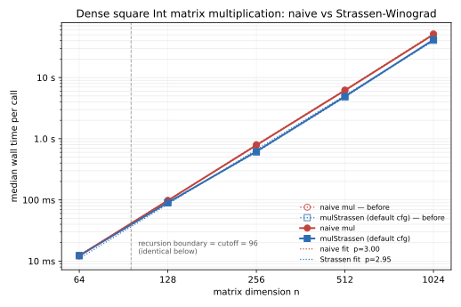

# HexMatrix Performance Report

`HexMatrix` is the dense base of the matrix family (constructors, accessors,
vector helpers, dot product, dense matrix algebra, elementary row/column
operations, submatrix, Gram, Strassen-Winograd multiplication). The
determinant, Bareiss, and row-reduction Phase-4 surfaces live in
`reports/hex-determinant-performance.md`,
`reports/hex-bareiss-performance.md`, and
`reports/hex-row-reduce-performance.md`.

## Bench Targets

- `Hex.MatrixBench.runSquareMulChecksum`: `n * n * n`
- `Hex.MatrixBench.runSquareMulStrassenChecksum`: `7 ^ Nat.log2 n`
  (on the power-of-two rungs both drivers use, this `Nat`-valued model equals
  `n^{log₂ 7}` exactly)
- `Hex.MatrixBench.runStrassenCut32` / `Cut64` / `Cut96` / `Cut128` / `Cut256`:
  `7 ^ Nat.log2 n` (the cutoff sweep behind the shipped
  `strassenDefault.cutoff`)

The dense base surfaces (multiplication, row operations on the structural
`Vector` / `Array` primitives) have no named external comparator: they declare
absence with the `structural-layer` reason per
`SPEC/Libraries/hex-matrix.md §"External comparators"`. The Strassen driver
declares the same `structural-layer` absence — it measures the multiplication
surface already covered above, and its baseline is the internal naive `mul`.
Its headline deliverables are the measured crossover cutoff and the speedup at
the largest benched dimension, below.

## Verdicts

Multiplication scaling measured on `chungus2` (AMD EPYC 9455, Linux, Lean
toolchain `4.32.0-rc1`), row-of-rows `Vector (Vector R m) n` backing, at
monorepo commit `cf35f23a` plus the measured-cutoff change under review.
Exports: `reports/bench-results/hex-matrix-mul-scaling-chungus2.json` and
`reports/bench-results/hex-matrix-strassen-cutoff-chungus2.json`.

- `Hex.MatrixBench.runSquareMulChecksum`
  - Command: `hexmatrix_bench compare Hex.MatrixBench.runSquareMulChecksum
    Hex.MatrixBench.runSquareMulStrassenChecksum --outer-trials 3
    --max-seconds-per-call 120 --export-file
    reports/bench-results/hex-matrix-mul-scaling-chungus2.json`
  - Input family: `dense-square-multiplication`; deterministic salts `17` and
    `43`; parameters `64, 128, 256, 512, 1024`.
  - Per-call medians: `12.3 ms`, `97.7 ms`, `800.7 ms`, `6.251 s`, `51.750 s`.
  - Verdict: consistent with declared complexity.
- `Hex.MatrixBench.runSquareMulStrassenChecksum`
  - Same command, export, fixtures, and parameters.
  - Input family: `strassen-crossover-scaling`.
  - Per-call medians: `12.3 ms`, `89.6 ms`, `603.6 ms`, `4.786 s`, `40.487 s`.
  - Verdict: consistent with declared complexity.

Smoke wiring was also checked with `lake exe hexmatrix_bench list` and
`lake exe hexmatrix_bench verify` (7 registrations).

## Strassen crossover and scaling

### Measured cutoff

`strassenDefault.cutoff = 96`, measured by the cutoff sweep
(`hexmatrix_bench compare Hex.MatrixBench.runSquareMulChecksum
Hex.MatrixBench.runStrassenCut{32,64,96,128,256} --outer-trials 3
--max-seconds-per-call 40 --export-file
reports/bench-results/hex-matrix-strassen-cutoff-chungus2.json`). Per-call
medians in ms (3 outer trials):

| target (leaf class) | n=64 | n=128 | n=256 | n=512 |
|---|---:|---:|---:|---:|
| naive `mul` | 12.26 | 96.49 | 776.74 | 6210.28 |
| `Cut32` (leaf 16) | 12.88 | 109.42 | 785.29 | 6067.95 |
| `Cut64` (leaf 32) | 10.95 | 91.55 | 666.72 | 5274.88 |
| `Cut96` (leaf 64) | 12.19 | 89.78 | 604.52 | 4782.67 |
| `Cut128` (leaf 64) | 12.20 | 89.54 | 605.54 | 4790.35 |
| `Cut256` (leaf 128) | 12.31 | 96.63 | 609.80 | 4578.79 |

On power-of-two dimensions every cutoff in `(64, 128]` produces the same
recursion (naive leaves at `64×64`), which the `Cut96` ≡ `Cut128` columns
confirm within noise. Recursing one level deeper (`Cut64`, `32×32` leaves)
loses ~10% at `n ≥ 256`; a `16×16` leaf (`Cut32`) loses to plain naive at
small `n`. Stopping a level earlier (`Cut256`, `128×128` leaves) is
essentially tied at `n ≥ 256` (marginally ahead at `n = 512`, behind at
`n = 128` where it never splits). `96` is the shipped value: `64×64` naive
leaves on power-of-two blocks, with Strassen coverage extending to
non-power-of-two blocks in `[96, 128)`. The crossover is
representation-dependent (row-of-rows backing pays quadrant materialization
and stride/cache overhead); the flat-backing follow-up re-measures it on this
same bench.

### Scaling figure and fitted exponents

Generated by `scripts/plots/hex-matrix-mul-scaling.py` from the committed
scaling export; OLS power-law fits on `(log n, log t)` over the asymptotic
window `n ∈ [128, 1024]` (the rungs where the default config splits, spanning
just under a decade — the widest post-crossover window the benched rungs
offer):

| method | exponent p | R² | C₃ (ns·n³) | per-call @ n=1024 |
|---|---:|---:|---:|---:|
| naive mul | 3.01 | 1.0000 | 47 | 51.750 s |
| mulStrassen (default) | 2.94 | 0.9994 | 38 | 40.487 s |

**Speedup at the largest benched dimension `n = 1024`: 1.28×** (naive
`51.750 s` / Strassen `40.487 s`); 1.30× at `n = 512`. The fitted Strassen
exponent `2.94` is visibly shallower than the naive `3.01` but sits above
`log₂ 7 ≈ 2.807`, as the SPEC anticipates for the row-of-rows backing at
these sizes (crossover transient near the cutoff plus locality overhead);
the exponent is a diagnostic, not an acceptance condition. The measured
crossover of the two series is the cutoff boundary `n = 96`: below it the
default config runs the naive base kernel (the `n = 64` rungs are tied), and
from the first splitting rung (`n = 128`) the Strassen series is strictly
faster.

## Profile

Profile captured on `carica` through the bench-timed-region filtering wrapper
(`scripts/profile/run_profile.sh ./.lake/build/bin/hexmatrix_bench <target>
<param> 5000000000`, `samply 0.13.1` at 999 Hz).

- `dense-square-multiplication`
  - Command: `scripts/profile/run_profile.sh ./.lake/build/bin/hexmatrix_bench Hex.MatrixBench.runSquareMulChecksum 160 5000000000`
  - Leaf cost: allocation/free 55.3%, Lean runtime and harness 24.7%,
    GMP big-integer arithmetic 15.1%, Lean own code 3.1%, other system
    samples 1.8%.
  - Inclusive ranking: `Hex.MatrixBench.runSquareMulChecksum` and its
    benchmark wrapper covered 100.0% of retained samples,
    `Hex.Matrix.mul` specialised for the target covered 99.1%,
    `Hex.Vector.dotProduct` covered 93.8%, and the inner dot-product fold
    covered 82.0%. The high allocator/GMP leaf cost is attributable to the
    boxed `Int` matrix multiplication surface.

The dominant inclusive costs all map to registered `HexMatrix.Bench`
targets. No unattributed dominant cost was observed.

## Concerns

None for the dense base surface.
