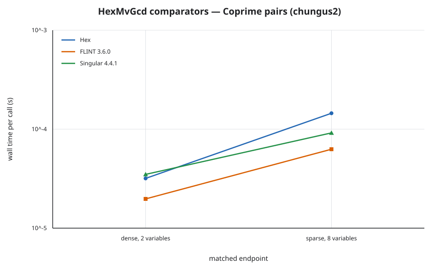
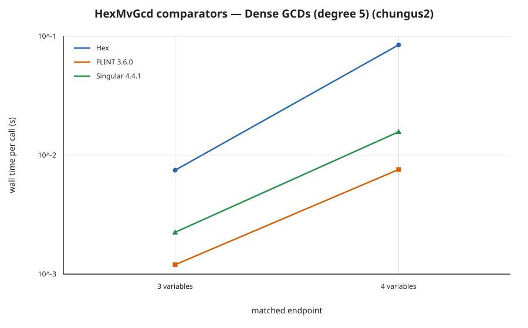
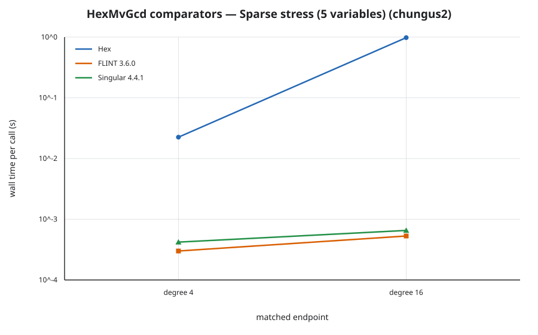
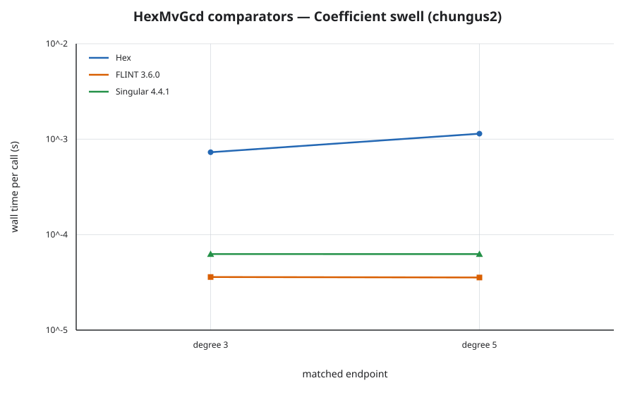
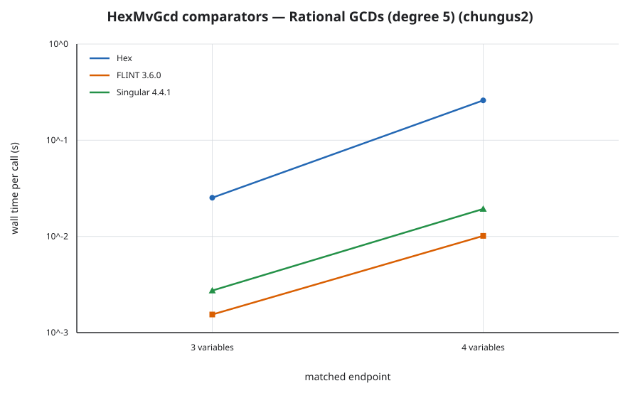
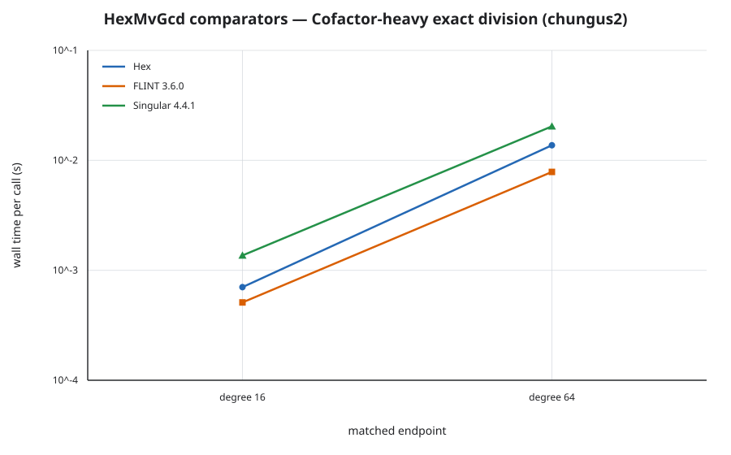

# HexMvGcd Performance Report

## Bench Targets

The Mathlib-free suite is registered in `bench/HexMvGcd/Bench.lean`, with the
route-mode targets in `bench/HexMvGcd/Matrix.lean`, matched external cases in
`bench/HexMvGcd/Comparators.lean`, and sampling handles in
`bench/HexMvGcd/Profile.lean`. Input construction is outside every timed
region. Each timed arm forces a structural checksum or returns a canonical
term list whose complete hash is checked by lean-bench.

The following registrations select **mode 1**, with the independently derived
family models adjacent to their registrations:

| target | operation | declared model |
|---|---|---|
| `runMonoContent` | monomial content of an `n`-term support | `n` |
| `runContent` | coefficient content | `n` |
| `runPrimPart` | primitive part | `n` |
| `runScalarContent` | scalar content | `n` |
| `runPolyNormalize` | canonical unit normalization | `n` |
| `runPolyIsUnit` | unit recognition plus support-size observation | `n` |
| `runToUnivariate` | recursive-view construction | `n * log2 (n + 1)` |
| `runCofactor` | exact division by a three-term divisor | `n * n * log2 (n + 1)` |

The route-dependent operations select **mode 3**. `maxSecondsPerCall` remains
only a child-process safety cap. Each timed function separately measures its
body with `IO.monoNanosNow` and raises an explicit budget-overrun error on a
ceiling violation; expected hashes independently enforce the result.

| target | operation / canonical hard input | body budget |
|---|---|---:|
| `runContentInFixed` | recursive named content, `prepPublic 2` | 10 ms |
| `runPrimPartInFixed` | recursive primitive part, `prepPublic 2` | 15 ms |
| `runGcdFixed` | public integer gcd, `prepPublic 2` | 30 ms |
| `runCofactorsFixed` | public cofactor pair, `prepPublic 2` | 60 ms |
| `runIsCoprimeFixed` | exact coprimality decision, `prepPublic 2` | 35 ms |
| `runGcdListFixed` | three-input gcd fold, `prepPublic 2` | 60 ms |
| `runLcmFixed` | gcd plus reconstructed product, `prepPublic 2` | 35 ms |
| `runSqfDecompFixed` | Yun decomposition, `prepPublic 2` | 1 s |
| `runRadicalFixed` | derivative gcd fold, `prepPublic 2` | 1 s |
| `runIsSquarefreeFixed` | derivative coprimality decision, `prepPublic 2` | 1 s |
| `Matrix.runDenseCoprime8` | genuine route-1 dense arity-8 pair | 2 s |
| `Matrix.runSparseCoprime8` | genuine route-1 sparse arity-8 degree-128 pair | 2 s |
| `Matrix.runDenseGcd5d5` | Brown interpolation, arity 5 / degree 5 | 50 s |
| `Matrix.runSparseStress5d16` | complete public sparse-gap gcd | 4 s |
| `runSwell5` | degree-5 extended PRS | 10 ms |
| `Matrix.runRationalGcd5d5` | rational lift, arity 5 / degree 5 | 10 s |
| `Matrix.runSquarefree3m1to5` | Yun levels 1 through 5 in arity 3 | 8 s |

The ordered-rule attempts rule out stronger modes operation by operation:

- The SPEC gives `contentIn`, the dispatcher, Brown, rational lifting, Yun,
  and the PRS fallback in probe counts. It explicitly omits each probe's
  image-gcd, interpolation, CRT, coefficient, and replay costs, so those counts
  do not derive a tight wall model.
- The old coprime arity schedule was not a route-1 experiment: both constructors
  returned `(f, f + 1)`, and the one-step-remainder prepass discharged every
  case before route 1. The replacement canonical inputs are lazily checked
  after structural reduction to bypass that prepass, produce a checker-accepted
  route-1 certificate, and restore it to the original pair before the timed
  public `gcd` call.
- The attempted dense integer shapes `3d5, 3d10, 3d20, 4d5, 5d5`, rational
  analogues, sparse degree/arity endpoints, squarefree multiplicity patterns,
  and PRS degrees all change several independent costs at once. They cannot
  support a one-parameter declaration read off their timings. In particular,
  the old degree-4096 sparse rows returned zero after one bounded Brown image;
  they measured a decline protocol rather than a completed gcd and are removed.
- Mode 2 is unavailable for every one of these targets: neither the SPEC nor a
  cited published result bounds the complete implementation phase which the
  profiles show dominating. A probe-count citation for work below the image gcd
  or PRS would not meet the dominant-phase rule.

Consequently, asymptotic regression detection has been given up for each
mode-3 operation in favor of its canonical absolute ceiling. The attempted
grids still cover the declared arity, degree, and multiplicity ranges; mode 3
retains the hardest completed point observed in each family rather than
misrepresenting that multi-axis grid as a scalar model. The exception is the
old sparse degree-4096 decline, which remains attempt evidence only; the
canonical sparse gate instead completes the advertised public gcd.

The existing FLINT and Singular values do not supply meaningful ceilings:
both tools dispatch to tuned and sparse algorithms outside this SPEC, and the
old coprime comparator endpoints exercise Hex's one-step-remainder prepass
rather than its modular route. Their rows therefore remain informational
semantic and process-protocol anchors. Measured native baselines plus stated
margins are the applicable mode-3 fallback.

The fixed `runDivExactFixed`, `runCoprimeFamilyFixed`, `runDenseFixed`,
`runSparseFixed`, `runRationalFixed`, and `runSquarefreeFixed` rows are limited
expected-hash smoke anchors. The FLINT/Singular registrations are comparator
and process-protocol anchors. None of those rows is used as performance
coverage.

Every external-comparator family has two matched endpoints and three arms:
Hex, **FLINT fmpz_mpoly and fmpq_mpoly via python-flint**, and
**Singular gcd, quotient, and factorize**. All 42 registrations pin the same
semantic hash per endpoint. Integer and rational GCD, exact division, and squarefree
decomposition therefore compare like outputs even where the systems choose
different algorithms.

## Verdicts

The native scientific measurements used clean commit
`9f668741293267bd9bad3e84ab294b425dbbe9f3` on `chungus2` (AMD EPYC 9455
48-Core Processor, x86-64 Linux), Lean `4.34.0-rc2`, and lean-bench `0.1.0`.
The parametric command was:

```sh
.lake/build/bin/hexmvgcd_bench run \
  Hex.MvGcdBench.runMonoContent Hex.MvGcdBench.runContent \
  Hex.MvGcdBench.runPrimPart Hex.MvGcdBench.runScalarContent \
  Hex.MvGcdBench.runPolyNormalize Hex.MvGcdBench.runPolyIsUnit \
  Hex.MvGcdBench.runToUnivariate Hex.MvGcdBench.runCofactor \
  --outer-trials 3 \
  --export-file reports/bench-results/hex-mv-gcd-parametric-9f668741-chungus2.json
```

The export has SHA-256
`26f1abd998600b65d021faaece472aecbada993c4a4e54e73d145985d15c104b`.
Every target is consistent with its declared complexity, and every successful
rung has a stable result hash.

| target | successful rungs | first → last median | residual slope β | normalized cost | verdict |
|---|---:|---:|---:|---:|---|
| `runMonoContent` | 1,024…32,768 | 0.040836 → 1.331567 ms | +0.017 | 39.073…40.816 | consistent |
| `runContent` | 1,024…32,768 | 0.087049 → 2.807116 ms | +0.009 | 83.867…86.923 | consistent |
| `runPrimPart` | 1,024…32,768 | 0.130134 → 4.303801 ms | +0.014 | 127.107…132.692 | consistent |
| `runScalarContent` | 1,024…32,768 | 0.086847 → 2.803139 ms | +0.006 | 84.137…86.528 | consistent |
| `runPolyNormalize` | 1,024…32,768 | 0.570747 → 28.437856 ms | +0.118 | 628.975…867.854 | consistent |
| `runPolyIsUnit` | 1,024…32,768 | 0.013548 → 0.460737 ms | +0.036 | 12.969…14.273 | consistent |
| `runToUnivariate` | 1,024…32,768 | 0.074391 → 2.530061 ms | −0.087 | 5.147…6.642 | consistent |
| `runCofactor` | 16…128 | 0.681820 → 60.192990 ms | −0.110 | 524.841…665.840 | consistent |

The old 31-row clean export remains the attempted-schedule record:

```sh
.lake/build/bin/hexmvgcd_bench run --filter Hex.MvGcdBench.Matrix \
  --export-file reports/bench-results/hex-mv-gcd-native-9f668741-chungus2.json
```

Its 31 results have SHA-256
`db83de71181514f5d1753f063ddc00a4f14fa744bfe6ac22369faf6777b328dd`;
all expected hashes matched. These timings record the mode-selection attempts
summarized above; they are not treated as performance verdicts.

| family | shape | median |
|---|---|---:|
| `coprime-pairs`, dense | arity 2 / 3 / 4 / 5 / 6 / 7 / 8 | 0.031529 / 0.076255 / 0.194593 / 0.510707 / 1.316512 / 3.389256 / 8.796764 ms |
| `coprime-pairs`, sparse | arity 2 / 3 / 4 / 5 / 6 / 7 / 8 | 0.023896 / 0.034914 / 0.050569 / 0.069721 / 0.090873 / 0.115566 / 0.145886 ms |
| `dense-gcds` | 3d5 / 3d10 / 3d20 / 4d5 / 5d5 | 77.614 / 579.806 / 3,235.495 / 1,372.302 / 11,904.753 ms |
| `sparse-stress` | 5d4096 / 8d4096 / 12d4096 | 0.846785 / 1.425774 / 5.224447 ms |
| `rational` | 3d5 / 3d10 / 3d20 / 4d5 / 5d5 | 24.712 / 184.659 / 1,559.791 / 255.569 / 2,355.822 ms |
| `squarefree` | 2m1 / 3m1-to-5 / 4m7 / 5m2357 | 0.180261 / 1,715.168 / 90.370 / 119.607 ms |

The old bounded sparse probes all returned zero after a single Brown image.
Because they did not complete the advertised gcd operation, the replacement
suite removes them rather than treating a fast decline as coverage.

The clean mode-3 export used commit
`d28067003e663cee510aec078663eb2c374e055b` on the same host and toolchain:

```sh
.lake/build/bin/hexmvgcd_bench run \
  Hex.MvGcdBench.runContentInFixed \
  Hex.MvGcdBench.runPrimPartInFixed \
  Hex.MvGcdBench.runGcdFixed \
  Hex.MvGcdBench.runCofactorsFixed \
  Hex.MvGcdBench.runIsCoprimeFixed \
  Hex.MvGcdBench.runGcdListFixed \
  Hex.MvGcdBench.runLcmFixed \
  Hex.MvGcdBench.runSqfDecompFixed \
  Hex.MvGcdBench.runRadicalFixed \
  Hex.MvGcdBench.runIsSquarefreeFixed \
  Hex.MvGcdBench.Matrix.runDenseCoprime8 \
  Hex.MvGcdBench.Matrix.runSparseCoprime8 \
  Hex.MvGcdBench.Matrix.runDenseGcd5d5 \
  Hex.MvGcdBench.Matrix.runSparseStress5d16 \
  Hex.MvGcdBench.runSwell5 \
  Hex.MvGcdBench.Matrix.runRationalGcd5d5 \
  Hex.MvGcdBench.Matrix.runSquarefree3m1to5 \
  --export-file /tmp/hex-mv-gcd-mode3-d2806700-chungus2.json
```

The stored 17-result export is
`reports/bench-results/hex-mv-gcd-mode3-d2806700-chungus2.json`, with SHA-256
`1d07e00a2a955b0e96e308d211e7f22e429498ece04238f6d565e49452daa680`.
Its environment records `git_dirty = false`; every repeat completed, every
repeat hash agreed, and all 17 expected hashes matched.

| target | median | body budget |
|---|---:|---:|
| `runContentInFixed` | 0.571 ms | 10 ms |
| `runPrimPartInFixed` | 0.701 ms | 15 ms |
| `runGcdFixed` | 1.646 ms | 30 ms |
| `runCofactorsFixed` | 1.657 ms | 60 ms |
| `runIsCoprimeFixed` | 1.707 ms | 35 ms |
| `runGcdListFixed` | 2.609 ms | 60 ms |
| `runLcmFixed` | 1.725 ms | 35 ms |
| `runSqfDecompFixed` | 132.309 ms | 1 s |
| `runRadicalFixed` | 130.329 ms | 1 s |
| `runIsSquarefreeFixed` | 135.299 ms | 1 s |
| `Matrix.runDenseCoprime8` | 519.969 ms | 2 s |
| `Matrix.runSparseCoprime8` | 488.527 ms | 2 s |
| `Matrix.runDenseGcd5d5` | 21.723 s | 50 s |
| `Matrix.runSparseStress5d16` | 1.861 s | 4 s |
| `runSwell5` | 1.206 ms | 10 ms |
| `Matrix.runRationalGcd5d5` | 4.679 s | 10 s |
| `Matrix.runSquarefree3m1to5` | 3.222 s | 8 s |

The table reports lean-bench's whole-runner medians. Input preparation occurs
before the internal body stopwatch, so these values conservatively include
small runner overhead while the named ceiling applies only to the operation.

## Comparator Ratios

The matched run used the same clean commit and host, python-flint `0.9.0`
with FLINT `3.6.0`, and Singular `4.4.1`:

```sh
HEX_FLINT_BENCH_PYTHON=/tmp/hex-mvgcd-flint-venv/bin/python \
HEX_SINGULAR_COMMAND=/nix/store/kzxqrr5bhcwmzhg0jmb6bxs9fxnyznlv-singular-4.4.1/bin/Singular \
  .lake/build/bin/hexmvgcd_bench run --tag mv-gcd-comparator \
  --export-file reports/bench-results/hex-mv-gcd-comparators-9f668741-chungus2.json
```

The 42-result export has SHA-256
`cbbb9efcbc237d1eb31c9ed5342e0d579dae9e5b62f05bc9b0aa9d4da4ec364d`.
All repeats agreed, all expected hashes matched, and no call hit the ten-second
comparator cap. A separate export at
`reports/bench-results/hex-mv-gcd-overhead-9f668741-chungus2.json` has SHA-256
`69a0bbb6479b3d3106775366f6263ee1be1aa0c76cb6d919588d9a1e920a6e81`.
The persistent empty-call medians are 6.202 µs for FLINT and 11.118 µs for
Singular. Both are below 50% of even their fastest comparator point, so every
ratio below is eligible. Ratios are Hex/comparator; adjusted ratios subtract
that comparator's empty-call median first.

| family | endpoint | Hex | comparator | comparator time | raw ratio | adjusted ratio |
|---|---|---:|---|---:|---:|---:|
| `coprime-pairs` | dense 2 | 0.031819 ms | FLINT | 0.019753 ms | 1.611× | 2.348× |
| `coprime-pairs` | dense 2 | 0.031819 ms | Singular | 0.034955 ms | 0.910× | 1.335× |
| `coprime-pairs` | sparse 8 | 0.144887 ms | FLINT | 0.062741 ms | 2.309× | 2.563× |
| `coprime-pairs` | sparse 8 | 0.144887 ms | Singular | 0.091760 ms | 1.579× | 1.797× |
| `dense-gcds` | 3d5 | 7.481040 ms | FLINT | 1.200338 ms | 6.232× | 6.265× |
| `dense-gcds` | 3d5 | 7.481040 ms | Singular | 2.249339 ms | 3.326× | 3.342× |
| `dense-gcds` | 4d5 | 84.717797 ms | FLINT | 7.584241 ms | 11.170× | 11.179× |
| `dense-gcds` | 4d5 | 84.717797 ms | Singular | 15.734147 ms | 5.384× | 5.388× |
| `sparse-stress` | 5d4 | 22.483131 ms | FLINT | 0.299943 ms | 74.958× | 76.541× |
| `sparse-stress` | 5d4 | 22.483131 ms | Singular | 0.420153 ms | 53.512× | 54.966× |
| `sparse-stress` | 5d16 | 979.165697 ms | FLINT | 0.529949 ms | 1,847.660× | 1,869.539× |
| `sparse-stress` | 5d16 | 979.165697 ms | Singular | 0.654791 ms | 1,495.387× | 1,521.216× |
| `swell` | degree 3 | 0.730383 ms | FLINT | 0.035981 ms | 20.299× | 24.527× |
| `swell` | degree 3 | 0.730383 ms | Singular | 0.062626 ms | 11.663× | 14.180× |
| `swell` | degree 5 | 1.142088 ms | FLINT | 0.035581 ms | 32.098× | 38.874× |
| `swell` | degree 5 | 1.142088 ms | Singular | 0.062602 ms | 18.244× | 22.183× |
| `rational` | 3d5 | 25.267906 ms | FLINT | 1.543001 ms | 16.376× | 16.442× |
| `rational` | 3d5 | 25.267906 ms | Singular | 2.736889 ms | 9.232× | 9.270× |
| `rational` | 4d5 | 259.773851 ms | FLINT | 10.134090 ms | 25.634× | 25.649× |
| `rational` | 4d5 | 259.773851 ms | Singular | 19.328147 ms | 13.440× | 13.448× |
| `squarefree` | 2m1 | 0.179964 ms | FLINT | 0.015555 ms | 11.570× | 19.241× |
| `squarefree` | 2m1 | 0.179964 ms | Singular | 0.028192 ms | 6.384× | 10.540× |
| `squarefree` | 4m7 | 90.772275 ms | FLINT | 0.513391 ms | 176.809× | 178.971× |
| `squarefree` | 4m7 | 90.772275 ms | Singular | 1.334308 ms | 68.029× | 68.601× |
| `cofactor-heavy` | degree 16 | 0.702746 ms | FLINT | 0.510176 ms | 1.377× | 1.394× |
| `cofactor-heavy` | degree 16 | 0.702746 ms | Singular | 1.365008 ms | 0.515× | 0.519× |
| `cofactor-heavy` | degree 64 | 13.713890 ms | FLINT | 7.846452 ms | 1.748× | 1.749× |
| `cofactor-heavy` | degree 64 | 13.713890 ms | Singular | 20.382051 ms | 0.673× | 0.673× |

The old coprime comparator endpoints are now explicitly limited evidence:
because `(f, f + 1)` takes Hex's one-step-remainder prepass, their largest
adjusted ratio of 2.563× does not measure the modular coprimality route. The
new native route-1 gates establish the operation budget, but no matched
external rerun is claimed here. The sparse, squarefree, swell, rational, and
old coprime ratios remain informational and expose representation, protocol,
and route differences rather than Phase-4 ceilings.

The required comparator-runtime plots are generated by
`scripts/plots/hex-mv-gcd-comparator.py`:














## Profile

One representative Hex case per family was captured from clean commit
`37eb7686df31622eca346ee20bc9a70f44d5d8e5` on the same host and toolchain,
using lean-bench-samply commit
`9356baa2f5757ee40320a897bd284914d5bb9f5e`, samply `0.13.1`, and a 999 Hz
rate. The one-point `Profile` registrations run the same prepared inputs and
core operations as the Hex comparator arms, forcing results with the native
matrix checksums; their synthetic parameter has a constant model and makes no
scaling claim. The command form was:

```sh
LEAN_BENCH_SAMPLY_HOME=/tmp/lean-bench-samply.SDVVOD/repo \
  scripts/profile/run_profile.sh \
  ./.lake/build/bin/hexmvgcd_bench \
  Hex.MvGcdBench.Profile.TARGET 0 3000000000
```

The targets were `runCoprime`, `runDense`, `runSparse`, `runSwell`,
`runRational`, `runSquarefree`, and `runCofactor`. Raw filtered profiles and
symbol sidecars remain under `/tmp` and are not committed. The committed
analytical summary is
`reports/bench-results/hex-mv-gcd-sampling-profiles.json`, SHA-256
`167ad76b31fb882ceb2ccb43454fac219995630fa3397c542c347c722f351075`.

| family | own code | GMP | allocation/free | Lean runtime | other |
|---|---:|---:|---:|---:|---:|
| `coprime-pairs` | 4.94% | 0.32% | 40.80% | 38.98% | 14.97% |
| `dense-gcds` | 5.14% | 0.29% | 42.54% | 36.96% | 15.07% |
| `sparse-stress` | 13.36% | 3.64% | 34.29% | 29.40% | 19.30% |
| `swell` | 8.39% | 1.28% | 39.44% | 31.35% | 19.55% |
| `rational` | 4.72% | 2.29% | 43.10% | 35.43% | 14.46% |
| `squarefree` | 5.95% | 21.45% | 29.27% | 31.96% | 11.37% |
| `cofactor-heavy` | 5.27% | 0.00% | 43.21% | 32.03% | 19.48% |

Inclusive attribution confirms that every profile is inside its registered
operation. The coprime and dense profiles spend 100.0% and 98.9% respectively
under `gcd`/`gcdCertWith`; the sparse profile spends 99.8% under
`intBrownCert?` and 98.4% under `brownCandidate?`; the swell profile spends
62.1% under `intHeuristicLoop` and 32.9% under the terminal subresultant path;
the rational profile spends 76.7% under `ratConcreteProposal`; the squarefree
profile spends 82.4% under `sqfStep`; and the cofactor-heavy profile spends
97.5% under `divExactAux`. Allocation and runtime traversal dominate leaf
samples for most routes, while squarefree uniquely exposes substantial GMP
coefficient work.

All filtering runs passed confidence and the ±5 ms sensitivity test:

| family | residual | timed duration | retained / rejected | other-thread noise |
|---|---:|---:|---:|---:|
| `coprime-pairs` | 0.872 ms | 2,542.352 ms | 2,532 / 7 | 0 |
| `dense-gcds` | 0.729 ms | 2,801.054 ms | 2,800 / 13 | 0 |
| `sparse-stress` | 0.522 ms | 2,897.633 ms | 2,881 / 7 | 0 |
| `swell` | 1.503 ms | 2,359.271 ms | 2,348 / 8 | 0 |
| `rational` | 0.806 ms | 2,271.768 ms | 2,269 / 77 | 0 |
| `squarefree` | 0.498 ms | 3,052.728 ms | 3,044 / 9 | 0 |
| `cofactor-heavy` | 0.672 ms | 1,747.005 ms | 1,745 / 62 | 0 |

No dominant inclusive cost lies outside the corresponding registered target.

## Concerns

None in HexMvGcd's own performance coverage. `libraries.yml` remains at phase
3 because phase-4 promotion is dependency-coupled: `HexMvPoly`, `HexPoly`, and
`HexPolyFp` are still below phase 4. Re-promotion must wait for those upstream
entries, as reported by `scripts/status.py`.
