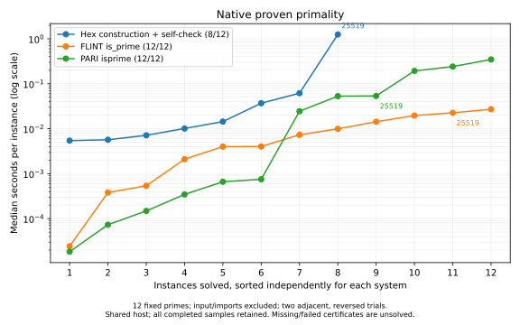

# Reusable Curve25519 certificates

The opt-in construction profile finds a checked certificate for `2^255 - 19`
with three non-leaf nodes, six table leaves, and eight factor entries. The
reference certificate in PR #10267 has five non-leaf nodes, six table leaves,
and ten entries. The generated certificate uses two cube-root nodes and takes
29 semantic search attempts without advancing `Rand.ofSeed n`.

The complete suggestion is pinned in
`conformance/HexPrimality/ConstructionConformance.lean`. Its replacement is
795 UTF-8 bytes, including whitespace. The applied proof in
`conformance/HexPrimality/Curve25519Replay.lean` imports `HexPrimality.Cert`
only. Both replay and full-tactic probe oleans are 7,568 bytes; the literal-only
probe olean is 4,736 bytes. These are whole-module artifact sizes, including
metadata, rather than serialized certificate sizes.

## Native work

The three new benchmark registrations are fixed mode-3 targets: one concrete
certificate shape and one required enumeration endpoint do not form a scaling
family. Each has five repeats, an expected result hash, and a five-second
operational deadline. The existing bit-size families remain registered.

| Operation | Inherited-affinity median | Pinned median | Pinned range |
|---|---:|---:|---:|
| Construction, including final compiled self-check | 722.681 ms | 1,771 ms | 1,156–2,216 ms |
| Compiled replay of the exact literal | 0.532 ms | 1.279 ms | 1.264–1.418 ms |
| `primesBelow 524289` | 253.860 ms | 573.519 ms | 569.619–612.063 ms |

The enumeration returns 43,390 primes, ending at 524287. The Lean stage-one
boundary test removes the table factors and the earlier factor 253947789517
from the 225-bit child's predecessor. Base two then reports `noFactor` at
262144 and factor 31757755568855353 at 524288. Each call counts one attempt
and preserves the supplied random state.

Both native runs are retained: the first used inherited host affinity, and
one follow-up used automatic CPU placement. All 30 completed repeat samples
appear in `hex-primality-construction-native-issue-10268.json` and
`hex-primality-construction-native-pinned-issue-10268.json` under
`reports/bench-results/`. The latter records its CPU placement. Host activity
is context, and does not reject any sample.

## Fresh-module phases and certificate comparison

`scripts/bench/primality_construction_sweep.py` measures seven adjacent pairs
in four blocks, alternating AB/BA order. It pins all arms to automatically
selected CPU 3 on the shared `chungus2` host, using Lean 4.34.0-rc2. The 56
completed samples, load observations, source hashes, source/olean sizes, build
output, and measured source hashes are retained in
`reports/bench-results/hex-primality-construction-issue-10268.json`.
The run overlaps ordinary repository builds; those observations remain in the
record. Each arm removes its own olean and runs `lake build`, with dependencies
prepared beforehand.

| Component pair | Arm medians | Median adjacent difference |
|---|---:|---:|
| Import baseline → input elaboration | 2.756 → 2.493 s | 0.103 s |
| Input → compiled certificate search | 2.542 → 3.495 s | 0.964 s |
| Input → certificate literal elaboration | 2.938 → 2.845 s | −0.114 s |
| Literal → literal elaboration and rendering | 3.396 → 3.002 s | −0.141 s |
| Literal → kernel replay | 3.376 → 16.469 s | 13.092 s |
| Import baseline → complete `primality?` | 3.406 → 18.002 s | 14.596 s |

The differences for input, literal, and rendering do not resolve their small
incremental costs above fresh-module and host variability. Negative differences
are retained observations, not negative execution costs. Search, replay, and
complete-invocation costs are separately visible. No quiet-host selection or
retry-until-clean procedure is used.

The separate adjacent certificate comparison uses the literal from PR #10267
as its reference, replayed through the same unchanged checker and toolchain:

| Block | Order | Reference | Generated |
|---|---|---:|---:|
| 0 | reference/generated | 19.654 s | 12.896 s |
| 1 | generated/reference | 29.852 s | 19.642 s |
| 2 | reference/generated | 45.358 s | 17.548 s |
| 3 | generated/reference | 10.856 s | 8.394 s |

The generated tree is smaller and replays faster in all four adjacent pairs.
These host-specific measurements support selecting it as the deterministic
fixture. The earlier 25-second observation in PR #10267 is contextual only.
The reference and generated replay modules occupy 1,021 and 1,189 source
bytes respectively; the generated source spells out constructor namespaces,
while the reference uses anonymous constructor notation. Both replay oleans
occupy 7,568 bytes.

## Replay attribution and checker choices

The checker is unchanged. A `samply record` capture of a fresh checker-only
literal build profiles kernel replay, rather than the much faster compiled
checker. Its busiest Lean worker contains 15,588 samples. The symbolized
summary and raw profile hash are in
`reports/bench-results/hex-primality-replay-profile-issue-10268.json`.
Inclusive kernel weak-head reduction appears in 85.74% of those samples;
allocation accounts for 62.55% of leaf samples. The profile is scoped to that
worker and is not a whole-process elapsed-time decomposition.

The executable checker exposes three relevant opportunities:

- **Repeated Fermat legs:** eight factor entries call `checkWitness`, hence
  eight Fermat exponentiations and eight reduced-exponent computations. There
  are only four distinct node/base pairs. Caching Fermat results by node/base
  could remove four repeated Fermat legs; any cache would need to preserve
  soundness for arbitrary input certificates.
- **Shared power ladders:** the 16 independent exponents have 2,376 binary
  squaring positions in total (`bitLength exponent - 1`). Taking one ladder
  per node/base would require 597 positions. This is arithmetic work counting,
  not a predicted kernel speedup: storing and reading a ladder adds terms and
  allocation, which the profile identifies as a substantial cost.
- **Unneeded children:** recursive subset selection removes two construction
  nodes and two factor entries from the reference shape. It checks table-based
  child-cost estimates before recursively certifying any candidate subset.
  This reduction already improves the paired replay measurements.

The smaller tree meets the construction and replay objective without changing
the checker representation. Grouped witnesses, Fermat caching, and shared
ladders require their own representation-level comparison before adoption;
the compiled arithmetic count alone does not establish their kernel cost.

## Reproduction

```sh
lake build HexPrimalityConstructionProbe hexprimality_bench
python3 scripts/bench/primality_construction_sweep.py --blocks 4 \
  --output /tmp/curve25519-phases.json
cpu=$(python3 scripts/bench/idle_core.py)
taskset -c "$cpu" .lake/build/bin/hexprimality_bench run \
  Hex.PrimalityBench.runConstruction Hex.PrimalityBench.runCurveChecker \
  Hex.PrimalityBench.runRuntimePrimes --export-file /tmp/curve25519-native.json
```

The ordinary tactic's budget and the ordinary integer-factorizer's 9999 smooth
ladder remain unchanged. Conformance covers those existing exact attempt and
random-state contracts alongside the new construction fixtures.

## Comparison with FLINT, PARI/GP, and PrimeCert

The native corpus consists of the existing six exact bit-family witnesses
(31, 61, 123, 256, 511, 512 bits) and six named field primes: Curve25519,
secp256k1, NIST P-256, NIST P-384, Curve448, and NIST P-521. This intentionally
small, structured corpus measures these cases; it does not estimate success
rates on random primes. The kernel corpus contains the same six family
witnesses plus Curve25519 and Curve448, for which the pinned PrimeCert project
already supplies certificates. No external factors are provided to Hex.

Native comparisons call `Construction.run`, FLINT `fmpz.is_prime`, and PARI
`isprime`. All three attempt proven primality; these are not probable-prime
screening timings. The native intervals exclude imports, input conversion,
output formatting, and process startup. Hex includes its final compiled
self-check. FLINT and PARI return native decisions, not Lean proof terms.

Kernel comparisons build fresh modules through `lake build`, including
certificate literal elaboration, kernel checking, import, and Lake overhead.
Adjacent baseline modules are retained to expose that overhead; cactus curves
use the absolute replay build time, not noisy baseline-subtracted values.
PrimeCert receives supplied certificates; Hex replays exactly the literal
found by the measured construction. Search is excluded from both replay arms.
For Curve448, inability to construct a Hex certificate means no Hex replay
sample. This says nothing about whether a separately supplied certificate
could be replayed by the Hex checker.

Both phases use two trial-major blocks on an automatically selected CPU,
with adjacent systems in forward/reverse order. The kernel baseline/replay
arms also reverse. Every completed sample and timeout is retained. A
60-second process timeout is an operational limit, not a scientific budget;
for native Hex it includes the surrounding build, and only successful inner
native intervals enter the native cactus. An exhausted result is unsolved,
even when it returns quickly. A case enters a curve only when both trials
succeed. The plotted value is their median. These are shared-host observations,
not universal performance ratios.

The initial runner placed a pure Hex call between clock reads without forcing
it; Lean scheduled that call after the stop clock. Those completed records
are retained in `hex-primality-cactus-clock-placement-issue-10268.json`, with
its invalid Hex inner timings explicitly marked. The corrected runner forces
both construction and compiled checking through an `IO.Ref` before reading
the stop clock. Only the corrected run supplies the figures.

Parameter references: [RFC 7748](https://www.rfc-editor.org/rfc/rfc7748.html),
[NIST SP 800-186](https://csrc.nist.gov/pubs/sp/800/186/final), and
[SEC 2](https://www.secg.org/sec2-v2.pdf).
Comparator APIs: [FLINT integers](https://flintlib.org/doc/fmpz.html),
[PARI arithmetic functions](https://pari.math.u-bordeaux.fr/dochtml/ref/Arithmetic_functions.html),
and [PrimeCert](https://github.com/b-mehta/PrimeCert).

The corrected raw record is
`reports/bench-results/hex-primality-cactus-issue-10268.json`. It contains
72 native samples and 62 kernel/baseline records (including two missing Hex
certificates). The host is `chungus2`, pinned to CPU 2. Hex uses Lean
4.34.0-rc2 at commit `5a7984536b168715e99d454e2d95153f0b3c5d4c`, with the
working source hashes recorded in the file. PrimeCert uses Lean 4.33.0 at
`7d3a2de13bb08f111a95203634f9ea52e50e246e`. Native versions are
python-flint 0.9.0 / FLINT 3.6.0 and PARI 2.17.3.

| Input | Hex construction | FLINT | PARI |
|---|---:|---:|---:|
| family-31 | 5.678 ms | 0.381 ms | 0.018 ms |
| family-61 | 5.435 ms | 0.024 ms | 0.073 ms |
| family-123 | 7.136 ms | 0.538 ms | 0.148 ms |
| family-256 | 10.112 ms | 2.101 ms | 0.345 ms |
| family-511 | 14.404 ms | 4.026 ms | 0.661 ms |
| family-512 | 37.002 ms | 3.997 ms | 0.749 ms |
| Curve25519 | 1249.169 ms | 22.581 ms | 53.586 ms |
| secp256k1 | exhausted | 27.134 ms | 53.001 ms |
| P-256 | 61.757 ms | 7.337 ms | 24.511 ms |
| P-384 | exhausted | 19.666 ms | 193.317 ms |
| Curve448 | exhausted | 14.290 ms | 241.078 ms |
| P-521 | above bit limit | 9.939 ms | 347.304 ms |



| Input | Hex fresh replay | PrimeCert fresh replay |
|---|---:|---:|
| family-31 | 1.722 s | 1.411 s |
| family-61 | 1.609 s | 1.402 s |
| family-123 | 1.655 s | 1.477 s |
| family-256 | 1.698 s | 1.407 s |
| family-511 | 1.749 s | 1.409 s |
| family-512 | 1.830 s | 1.408 s |
| Curve25519 | 5.107 s | 1.419 s |
| Curve448 | no generated certificate | 1.510 s |


Curve25519 hex replay takes 5.115 / 5.099 s.
Subtracting the adjacent baselines gives 4.204 / 4.198 s.
Curve25519 primecert replay takes 1.410 / 1.429 s.
Subtracting the adjacent baselines gives 0.010 / 0.024 s.
These are two shared-host samples on different toolchain versions, not a
universal ratio for isolated kernel work. Every completed sample is retained.

The hex native Curve25519 median is 1249.169 ms.
The flint native Curve25519 median is 22.581 ms.
The pari native Curve25519 median is 53.586 ms.
The compiled check of the already generated literal takes 0.892 ms;
this is not kernel replay.

The construction profile succeeds on eight of the twelve inputs. It handles
P-256 and the structured 511/512-bit family witnesses, but exhausts on
secp256k1, P-384, and Curve448, and rejects P-521 at the 512-bit limit.
FLINT and PARI solve all twelve. PrimeCert replays all eight supplied
certificates in the kernel corpus, including Curve448. Automated reach and
checking a supplied certificate are distinct capabilities.

Reproduce with a Python environment providing `python-flint`, `cypari2`,
and `matplotlib`, and a PrimeCert checkout at the revision above:

```sh
lake build HexPrimality.Elab
(cd /path/to/PrimeCert && lake build PrimeCert)
python3 scripts/bench/primality_cactus.py \
  --primecert-checkout /path/to/PrimeCert --blocks 2 --timeout 60 \
  --output /tmp/primality-cactus.json
python3 scripts/plots/hexprimality-cactus.py /tmp/primality-cactus.json
```

The driver creates temporary modules in the registered construction-probe
namespace and the comparator checkout, builds through Lake, and removes its
sources on exit. Every generated replay source is stored in the raw record.


## Ordinary smooth-search cost

The verified sieve replaces a committed-table read at every stage-one call.
An adjacent AB/BA comparison of the existing integer-factor bench targets,
with three repeats per arm and all 36 samples retained, quantifies that cost:

| Existing target | Table source, arm medians | Runtime sieve, arm medians |
|---|---:|---:|
| `runPMinusOneBatch` | 10.898 / 10.967 ms | 15.947 / 15.959 ms |
| `runEcm48` (word backend) | 56.644 / 56.825 µs | 129.444 / 129.103 µs |
| `runEcmBatch` (word and natural backends) | 12.926 / 12.968 ms | 13.222 / 13.302 ms |

This is a measured regression, especially for the small word-backend call;
the complete ECM batch increases by about 0.3 ms. The ordinary policy's
attempt caps, random draws, and result hashes remain unchanged, and these
calls remain well within the existing 20 ms word-call and 100 ms batch
operational limits. This implementation accepts the enumeration cost for the
verified, bound-independent source. Preparing a stage's prime list once for
multiple bases or curves is a possible further optimization; it is not
implemented here.

The raw exports, source hashes, load observations, and complete command
output are in `reports/bench-results/hex-primality-smooth-comparison-issue-10268.json`.
The baseline is `2cdae5553b305a6ff5857ebffdfa5ed3636fdf5d`, the host is
`chungus2`, and the automatically selected CPU is 3. Each arm runs:

```sh
hexintfactor_bench run Hex.IntFactorBench.runPMinusOneBatch \
  Hex.IntFactorBench.runEcm48 Hex.IntFactorBench.runEcmBatch \
  --repeats 3 --export-file /tmp/smooth-arm.json
```

The `verify` smoke path performs an in-process call and checks its result hash;
it does not enforce `maxSecondsPerCall`. The construction target's five-second
cap applies to timed benchmark runs, so it does not introduce that CI timeout
risk. The public `primesIn` implementation was not compared with the runtime
sieve in this work and remains unchanged.

## Construction resource and proof checks

The profile has a shared 1024-attempt limit. Each factor call receives its
remaining allowance; recursive calls and witnesses share that allowance, and
successful children are reused across a node's candidate subsets. An explicit
29-attempt limit accepts the exact Curve25519 fixture; 28 attempts exhausts.
Separate diagnostics pin input-size rejection and a one-attempt construction
exhaustion. A randomized one-attempt case also checks the exact advanced
`Rand`. The original comparison before this limit was added is retained in
`hex-primality-cactus-before-attempt-cap-issue-10268.json`.

The generated P-256 certificate was additionally pasted into a checker-only
module and accepted by the kernel. Its exact source, successful build output,
and permitted axiom list are retained in
`reports/bench-results/hex-primality-p256-replay-issue-10268.json`.
