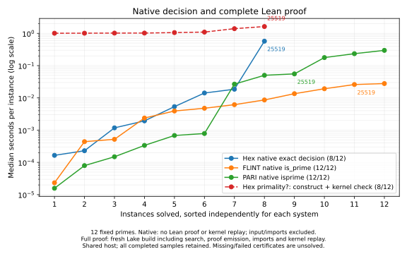
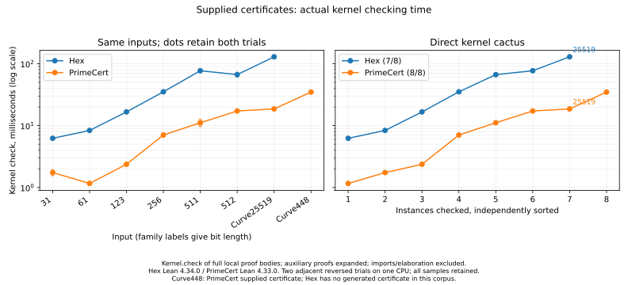
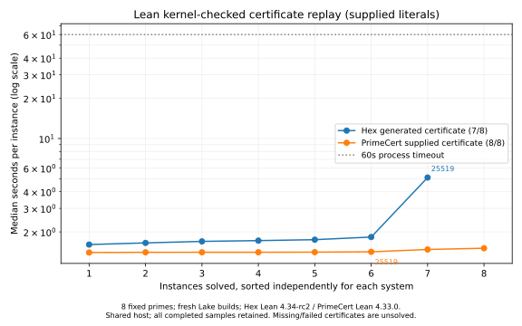

# Reusable Curve25519 certificates

For the current fixed-window PrimeCert comparison and cube-root checker
measurements, see [the replay attribution](hex-primality-replay-attribution.md).
The implementation and timing snapshots below document the construction study.

The opt-in construction profile finds a checked certificate for `2^255 - 19`
with three non-leaf nodes, six table leaves, and eight factor entries. The
reference certificate in PR #10267 has five non-leaf nodes, six table leaves,
and ten entries. The generated certificate uses two cube-root nodes and takes
29 semantic search attempts without advancing `Rand.ofSeed n`.

The complete suggestion is pinned in
`conformance/HexPrimality/ConstructionConformance.lean`. Its replacement is
795 UTF-8 bytes, including whitespace. The applied proof in
`conformance/HexPrimality/Curve25519Replay.lean` imports `HexPrimality.Cert`
only. Both replay and full-tactic probe oleans are 7,568 bytes; the literal-only
probe olean is 4,736 bytes. These are whole-module artifact sizes, including
metadata, rather than serialized certificate sizes.

## Performance changes

Kernel replay uses the already verified final sieve bitset for table leaves.
The public lookup is proved equal to the previous binary search at every
input; a `@[csimp]` theorem retains that binary search in compiled code.
The committed table, accepted certificates, certificate literal, factor
selection, witness work, attempt counts, and random-state contract are unchanged.

Compiled sieve readback extracts 64 candidate bits at a time. Its equality
with the original one-bit scan is proved for every bitset, starting index,
and count, preserving the exact ordered list. This removes most repeated
large-integer copying during runtime prime enumeration.

The adjacent comparison uses the same CPU and toolchain, with old/new arms
reversed in the second block. Old is commit `6bfa5b232`; new is `756e1aa33`.
Every completed sample is in
`reports/bench-results/hex-primality-performance-pair-issue-10268.json`.

| Curve25519 operation | Old, block 1 / 2 | New, block 1 / 2 |
|---|---:|---:|
| Tactic search and self-check (`#eval` interpreter) | 0.954 / 1.344 s | 0.631 / 0.582 s |
| Supplied-literal replay, fresh build | 6.313 / 6.706 s | 1.143 / 1.404 s |
| Complete `primality?`, fresh build | 7.008 / 10.414 s | 2.168 / 2.292 s |

A separate native-executable comparison uses the same `PolicyProbe` frontend
built against the two production-library versions. It measures construction
and self-check at 706.622 / 691.329 ms before and 414.955 / 419.664 ms after.
The raw record is `hex-primality-native-performance-pair-issue-10268.json`,
including source and executable hashes. The baseline checkout has only the
measurement frontend added; its production code remains at `6bfa5b232`.
The earlier search row is Lean interpreter execution, which is the tactic's
current execution regime, not a native-executable measurement.

Both complete builds use the original `2 ^ 255 - 19` goal expression.
The refreshed twelve-input cactus sweep below uses numerals and includes
separate input/import baselines. Its Curve25519 complete-build median is
1.628 s. These absolute shared-host observations are not interchangeable
with isolated kernel time; the paired measurements establish the before/after
improvement without subtracting separately collected samples.

## Construction and replay measurements before lookup optimization

The measurements in the next three subsections predate the lookup/readback
changes. They document construction reach, certificate minimization, and the
initial profile; the paired comparison above and refreshed cactus data below
measure the optimized implementation. All earlier records remain available.

### Native work

The three new benchmark registrations are fixed mode-3 targets: one concrete
certificate shape and one required enumeration endpoint do not form a scaling
family. Each has five repeats, an expected result hash, and a five-second
operational deadline. The existing bit-size families remain registered.

| Operation | Inherited-affinity median | Pinned median | Pinned range |
|---|---:|---:|---:|
| Construction, including final compiled self-check | 722.681 ms | 1,771 ms | 1,156–2,216 ms |
| Compiled replay of the exact literal | 0.532 ms | 1.279 ms | 1.264–1.418 ms |
| `primesBelow 524289` | 253.860 ms | 573.519 ms | 569.619–612.063 ms |

The enumeration returns 43,390 primes, ending at 524287. The Lean stage-one
boundary test removes the table factors and the earlier factor 253947789517
from the 225-bit child's predecessor. Base two then reports `noFactor` at
262144 and factor 31757755568855353 at 524288. Each call counts one attempt
and preserves the supplied random state.

Both native runs are retained: the first used inherited host affinity, and
one follow-up used automatic CPU placement. All 30 completed repeat samples
appear in `hex-primality-construction-native-issue-10268.json` and
`hex-primality-construction-native-pinned-issue-10268.json` under
`reports/bench-results/`. The latter records its CPU placement. Host activity
is context, and does not reject any sample.

### Fresh-module phases and certificate comparison

`scripts/bench/primality_construction_sweep.py` measures seven adjacent pairs
in four blocks, alternating AB/BA order. It pins all arms to automatically
selected CPU 3 on the shared `chungus2` host, using Lean 4.34.0-rc2. The 56
completed samples, load observations, source hashes, source/olean sizes, build
output, and measured source hashes are retained in
`reports/bench-results/hex-primality-construction-issue-10268.json`.
The run overlaps ordinary repository builds; those observations remain in the
record. Each arm removes its own olean and runs `lake build`, with dependencies
prepared beforehand.

| Component pair | Arm medians | Median adjacent difference |
|---|---:|---:|
| Import baseline → input elaboration | 2.756 → 2.493 s | 0.103 s |
| Input → interpreted certificate search | 2.542 → 3.495 s | 0.964 s |
| Input → certificate literal elaboration | 2.938 → 2.845 s | −0.114 s |
| Literal → literal elaboration and rendering | 3.396 → 3.002 s | −0.141 s |
| Literal → kernel replay | 3.376 → 16.469 s | 13.092 s |
| Import baseline → complete `primality?` | 3.406 → 18.002 s | 14.596 s |

The differences for input, literal, and rendering do not resolve their small
incremental costs above fresh-module and host variability. Negative differences
are retained observations, not negative execution costs. Search, replay, and
complete-invocation costs are separately visible. No quiet-host selection or
retry-until-clean procedure is used.

The separate adjacent certificate comparison uses the literal from PR #10267
as its reference, replayed through the same unchanged checker and toolchain:

| Block | Order | Reference | Generated |
|---|---|---:|---:|
| 0 | reference/generated | 19.654 s | 12.896 s |
| 1 | generated/reference | 29.852 s | 19.642 s |
| 2 | reference/generated | 45.358 s | 17.548 s |
| 3 | generated/reference | 10.856 s | 8.394 s |

The generated tree is smaller and replays faster in all four adjacent pairs.
These host-specific measurements support selecting it as the deterministic
fixture. The earlier 25-second observation in PR #10267 is contextual only.
The reference and generated replay modules occupy 1,021 and 1,189 source
bytes respectively; the generated source spells out constructor namespaces,
while the reference uses anonymous constructor notation. Both replay oleans
occupy 7,568 bytes.

### Replay attribution and checker choices

Before the lookup optimization, a `samply record` capture of a fresh checker-only
literal build profiles kernel replay, rather than the much faster compiled
checker. Its busiest Lean worker contains 15,588 samples. The symbolized
summary and raw profile hash are in
`reports/bench-results/hex-primality-replay-profile-issue-10268.json`.
Inclusive kernel weak-head reduction appears in 85.74% of those samples;
allocation accounts for 62.55% of leaf samples. The profile is scoped to that
worker and is not a whole-process elapsed-time decomposition.

The executable checker exposes three relevant opportunities:

- **Repeated Fermat legs:** eight factor entries call `checkWitness`, hence
  eight Fermat exponentiations and eight reduced-exponent computations. There
  are only four distinct node/base pairs. Caching Fermat results by node/base
  could remove four repeated Fermat legs; any cache would need to preserve
  soundness for arbitrary input certificates.
- **Shared power ladders:** the 16 independent exponents have 2,376 binary
  squaring positions in total (`bitLength exponent - 1`). Taking one ladder
  per node/base would require 597 positions. This is arithmetic work counting,
  not a predicted kernel speedup: storing and reading a ladder adds terms and
  allocation, which the profile identifies as a substantial cost.
- **Unneeded children:** recursive subset selection removes two construction
  nodes and two factor entries from the reference shape. It checks table-based
  child-cost estimates before recursively certifying any candidate subset.
  This reduction already improves the paired replay measurements.

The isolated kernel diagnostic instead identifies table lookup as the main
cost: the old lookup of 57467 took 14.023 / 12.026 s including a fresh build,
while single modular exponentiations were near their 2.613 / 1.752 s baseline.
Those records, including experimental raw-recursion alternatives, are in
`hex-primality-kernel-diagnostic-issue-10268.json`. The table comparison in
`hex-primality-table-replay-issue-10268.json` then measures old/new lookup at
11.956 / 2.271 s and 11.086 / 1.973 s; complete Boolean certificate replay
falls from 13.446 to 2.542 s and from 9.663 to 1.862 s. Both arms use the same
certificate and arithmetic, changing only the table-leaf lookup.

The interpreted readback comparison in `hex-primality-readback-issue-10268.json`
measures old/new intervals of 308.009 / 67.497 ms and 322.971 / 52.411 ms
at bound 524289. Both return 43,388 represented primes, ending at 524287;
`primesBelow` adds 2 and 3. `primality_readback.py` forces the computed list
through `IO.Ref` before stopping the clock, in a non-inlined measurement
function. Two initial diagnostic compilation errors are retained separately.
The sieve-only timings in `hex-primality-sieve-profile-issue-10268.json` are
explicitly invalid: the pure sieve call was shared with its prepared state
before the timer. They support no performance claim.

Grouped witnesses, cached Fermat legs, and shared power ladders remain
possible arithmetic improvements. The measured table bottleneck is addressed
without changing the certificate representation or Pocklington witness checks.

A representative profile of the optimized native executable identifies the
remaining construction cost. Of 366 samples containing the construction
entry point, 298 include Pollard `p - 1`'s `raiseSmooth`, and 63 include
`primesBelow`. Modular exponentiation accounts for 291 samples, with substantial
allocation, copying, and integer remainder work. These inclusive counts overlap;
they identify a native search bottleneck rather than kernel replay cost.
The executable matches the native cactus record exactly. The raw profile,
symbols, command, and counts are retained in
`hex-primality-native-profile-issue-10268.json.gz`, its `.syms.json` sidecar,
and `hex-primality-native-profile-summary-issue-10268.json`. This single profile
uses inherited affinity and overlaps a local build; it is attribution evidence,
not another before/after latency comparison.

## Reproduction

```sh
lake build HexPrimalityConstructionProbe hexprimality_bench
python3 scripts/bench/primality_construction_sweep.py --blocks 4 \
  --output /tmp/curve25519-phases.json
cpu=$(python3 scripts/bench/idle_core.py)
taskset -c "$cpu" .lake/build/bin/hexprimality_bench run \
  Hex.PrimalityBench.runConstruction Hex.PrimalityBench.runCurveChecker \
  Hex.PrimalityBench.runRuntimePrimes --export-file /tmp/curve25519-native.json
```

The ordinary tactic's budget and the ordinary integer-factorizer's 9999 smooth
ladder remain unchanged. Conformance covers those existing exact attempt and
random-state contracts alongside the new construction fixtures.

## Comparison with FLINT, PARI/GP, and PrimeCert

The native and complete-proof corpus consists of six exact bit-family
witnesses (31, 61, 123, 256, 511, 512 bits) and six named field primes:
Curve25519, secp256k1, NIST P-256, P-384, Curve448, and P-521. The
supplied-certificate replay corpus uses the six family witnesses plus
Curve25519 and Curve448, for which the pinned PrimeCert project supplies
certificates. Hex receives no external factors or certificates.

Native calls are `Construction.run` in the lake-built
`hexprimality_policy_probe construction N` executable, FLINT `fmpz.is_prime`, and PARI
`isprime`. They attempt exact positive primality decisions, not probable-prime
screening. The native intervals exclude imports, input conversion, output
formatting, and process startup. Hex constructs a Pocklington certificate
internally and includes its final compiled self-check. This is machine code,
not a `#eval` interpreter timing. It emits no Lean
proof and performs no kernel replay in that interval. FLINT and PARI use
their native decision algorithms. See the primary API documentation for
[FLINT](https://flintlib.org/doc/fmpz.html) and
[PARI](https://pari.math.u-bordeaux.fr/dochtml/ref/Arithmetic_functions.html).

The complete `primality?` curve starts from the same input numeral, without
factors or certificates. It includes a fresh Lake build, imports, input
elaboration, certificate construction, suggestion rendering, proof emission,
and kernel checking. The supplied-certificate replay plot excludes search
and includes imports, literal elaboration, and kernel checking. PrimeCert
receives its supplied certificates; Hex replays its exact generated literals.
Inability to construct a Curve448 certificate means no Hex replay sample,
without claiming that no supplied certificate could be checked.

Each phase uses two trial-major blocks on one automatically selected CPU,
with adjacent systems in forward/reverse order. Baseline/replay and
baseline/complete arms also reverse. Every completed sample and timeout is
retained. Native and complete builds are separate sweeps, so their difference
is not a paired estimate of kernel cost. The 60-second process timeout is an
operational limit, not a scientific budget. For native Hex it includes the
surrounding build; the native curve uses only successful inner intervals.
A case enters a curve only if both trials succeed. Exhaustion, missing
certificates, and timeouts are unsolved even when they return quickly.
Plotted values are medians, independently sorted for each implementation.

Inputs are traceable to [RFC 7748](https://www.rfc-editor.org/rfc/rfc7748.html),
[NIST SP 800-186](https://csrc.nist.gov/pubs/sp/800/186/final),
[SEC 2](https://www.secg.org/sec2-v2.pdf), and
[PrimeCert](https://github.com/b-mehta/PrimeCert).

### Native decision and complete certificate construction/checking



| Input | Hex native | FLINT native | PARI native | Hex complete build |
|---|---:|---:|---:|---:|
| family-31 | 0.165 ms | 0.439 ms | 0.016 ms | 1.058 s |
| family-61 | 0.230 ms | 0.023 ms | 0.079 ms | 1.097 s |
| family-123 | 1.176 ms | 0.519 ms | 0.149 ms | 1.020 s |
| family-256 | 1.938 ms | 2.371 ms | 0.336 ms | 1.022 s |
| family-511 | 5.358 ms | 3.921 ms | 0.682 ms | 1.010 s |
| family-512 | 18.550 ms | 4.771 ms | 0.786 ms | 1.013 s |
| Curve25519 | 572.712 ms | 25.942 ms | 55.404 ms | 1.628 s |
| secp256k1 | exhausted | 27.786 ms | 50.136 ms | exhausted |
| P-256 | 14.172 ms | 6.163 ms | 26.703 ms | 1.399 s |
| P-384 | exhausted | 19.202 ms | 177.670 ms | exhausted |
| Curve448 | exhausted | 13.488 ms | 234.772 ms | exhausted |
| P-521 | above bit limit | 8.625 ms | 297.372 ms | above bit limit |

The plotted record is
`reports/bench-results/hex-primality-cactus-native-executable-issue-10268.json`.
It contains 72 native samples and reuses the 62 kernel/baseline and 48
complete/baseline records from
`hex-primality-end-to-end-optimized-issue-10268.json`. Every successful native
certificate is checked against that record's exact generated certificate
before proof rows are reused. The production implementation is unchanged
apart from comments; the native measurement frontend is new. All records
include probe sources or hashes, output, and source/olean sizes where relevant.
Hex uses Lean 4.34.0-rc2; the native record includes the executable hash and
source hashes. The proof rows are from `756e1aa33`. PrimeCert uses Lean 4.33.0
at `7d3a2de13bb08f111a95203634f9ea52e50e246e`. Native versions are
FLINT 3.6.0 / python-flint 0.9.0 and PARI 2.17.3.
The native sweep uses CPU 1, replay uses CPU 14, and complete builds use CPU 3.
Native checking of the already generated Curve25519 certificate takes
0.756 ms median and is distinct from kernel replay. The replay probe source
is 1,041 bytes with a 5,432-byte olean; the complete-tactic probe is 217 bytes
with a 4,064-byte olean. The emitted certificate literal and suggestion are
unchanged; the raw records include sizes for every completed build.

Earlier files with a `native` field generated Hex observations through
`#eval`; those Hex rows measure the Lean interpreter. Their metadata now
states this explicitly. They remain useful tactic-search observations but
are excluded from the native-executable curve. This distinction applies to
`hex-primality-cactus-optimized-issue-10268.json` and the older cactus files;
it does not apply to the original standalone mode-3 benchmark executable.

Curve25519 complete builds from the numeral took 1.657 / 1.600 seconds.
The original expression is measured separately in the paired comparison
above. This fixed, structured corpus is not a success-rate estimate for
random industrial primes: Hex solves eight of twelve, including P-256 and
the structured 511/512-bit family. It exhausts on secp256k1, P-384, and
Curve448; P-521 exceeds its 512-bit ceiling. FLINT and PARI solve all twelve.

### Supplied-certificate replay

All measurements in this section, including arithmetic attribution and fresh
builds, use the checker before windowed arithmetic. Current complete-proof
results and the current comparison plot are in the
[windowed replay report](hex-primality-windowed-replay.md).

#### Direct kernel checking before windowed arithmetic



| Input | Hex kernel | PrimeCert kernel |
|---|---:|---:|
| family-31 | 6.23 ms | 1.74 ms |
| family-61 | 8.35 ms | 1.16 ms |
| family-123 | 16.63 ms | 2.37 ms |
| family-256 | 35.10 ms | 7.04 ms |
| family-511 | 76.86 ms | 11.11 ms |
| family-512 | 66.47 ms | 17.21 ms |
| Curve25519 | 128.93 ms | 18.58 ms |
| Curve448 | no generated certificate | 34.76 ms |

These central values are means of two samples (also their medians), timing
`Lean.Kernel.check` directly after imports and proof elaboration. They measure
warm in-process rechecks, each with a fresh kernel checker and its own reduction
caches. Pending asynchronous elaboration-time checks are explicitly drained
before the timer. Each call checks the full proof body against its declared goal
using an identity application. Every local definition and auxiliary theorem
is recursively expanded before the clock starts; the probe refuses to time
a proof with remaining local dependencies. In particular, Lean extracts
`decide +kernel` into an auxiliary theorem: timing only the outer proof would
skip that computation. Imported library theorems remain dependencies in both
systems. A deliberately false Boolean equality must be rejected by the same
kernel entry point before each timed call. A second control corrupts the
subject literal in the real proof and requires rejection against the original
goal. Neither control is included in the measured interval.

The two trial-major blocks use adjacent systems in reversed order on CPU 2.
Curve25519 takes 128.47 / 129.39 ms for Hex and 18.67 / 18.49 ms for PrimeCert:
PrimeCert is about 6.9 times faster in this direct replay comparison. Across
the seven shared inputs, its observed advantage ranges from 3.6 to 7.2 times.
Hex uses Lean 4.34.0 and PrimeCert uses Lean 4.33.0; these compare the pinned
implementations, not two checker algorithms on an identical kernel version.
The certificates also differ. This measurement excludes certificate search
and does not imply a PrimeCert construction-time comparison.

The kernel cost grows substantially across these inputs. The nearly flat
complete-build and fresh-replay curves below are dominated by startup and
imports for the easier certificates; they are not evidence of constant-time
kernel verification. Cactus ranks also sort each system independently and
are not input bit lengths. The direct chart therefore includes a panel with
the same input on each horizontal position.

`scripts/bench/primality_kernel_direct.py` records all 30 completed checks,
the missing Hex Curve448 certificate, full probe sources, toolchains,
dependencies, and build output in
`hex-primality-direct-kernel-checked-issue-10268.json`. The initial direct run
remains in `hex-primality-direct-kernel-issue-10268.json`; its Curve25519 means
were 130.76 / 19.27 ms. The diagnostic record separately
retains the invalid outer-proof-only pilot and rejected incomplete expansions;
none enter the comparison. Reproduce with:

```sh
python3 scripts/bench/primality_kernel_direct.py \
  reports/bench-results/hex-primality-cactus-native-executable-issue-10268.json \
  --primecert-checkout /path/to/PrimeCert --output /tmp/direct-kernel.json
python3 scripts/plots/hexprimality-cactus.py \
  reports/bench-results/hex-primality-cactus-native-executable-issue-10268.json \
  --direct-kernel /tmp/direct-kernel.json
```

#### Kernel arithmetic attribution

The isolated expression `2^(p-1) mod p`, with `p = 2^255 - 19`, separates
arithmetic representation from certificate shape. All three Hex arms run in
the same toolchain and compute the same value:

| Kernel powering loop | Mean of two samples |
|---|---:|
| Hex bit-scanning `powModNat` (now `powModBits`) | 11.94 ms |
| Same bit-scanning algorithm, explicit `Nat.rec` / `Bool.rec` | 6.37 ms |
| PrimeCert-style division loop, explicit recursors | 2.02 ms |
| Identical division loop on PrimeCert's Lean 4.33.0 | 2.07 ms |

The ordinary recursive Hex definition introduces reduction overhead beyond
the arithmetic itself. Explicit recursors remove about half of this test's
cost; dividing the remaining exponent by two instead of indexing its bits
reduces it further. Both algorithms perform repeated squaring. The isolated
5.9-fold improvement is close to the full-proof gap, supporting arithmetic
encoding as a major cause, without assigning an exact fraction of total
replay time to it. The identical division loop differs by about 3% between
the two toolchains in this calibration; that observation does not bound
every possible difference between kernel versions.

Hex's checker also repeats Fermat checks for factor entries sharing a base,
whereas PrimeCert groups them at each node. This is another potential cost;
the arithmetic experiment does not isolate it, and repeated expressions may
benefit from the kernel's per-checker reduction cache. The results do not
justify attributing the entire remaining gap to redundant exponentiations.

The eight completed adjacent, reversed samples and exact sources are in
`hex-primality-kernel-power-comparison-issue-10268.json`. The experimental
division loop follows PrimeCert's `powModK`, whose file carries an Apache 2.0
notice and whose root license is MIT. The complete notices are retained in
`HexArith/Montgomery/Context.lean`. This run measured a benchmark definition. Reproduce by adding
`--powers` to the direct-kernel runner above and choosing a new output path.

The kernel-visible definition from
[lean4#13490](https://github.com/leanprover/lean4/pull/13490), commit
`86704eea9a8cf46d7f20f4eb2c293cdaae7ac2d7`, is a separate diagnostic arm.
Replaying that definition on Lean 4.34.0 takes 15.24 / 15.13 ms for the same
expression, alongside 11.90 / 11.87 ms for the bit-scanning Hex checker and 1.98 / 1.98 ms for
the explicit division loop. All ten completed samples are in
`hex-primality-upstream-kernel-power-issue-10268.json`; add `--upstream-power`
to reproduce. This copies the kernel definition without its extern and does
not measure Lean 4.35.0 or native `mpz_powm`. The upstream GMP-backed runtime
operation targets the compiled search bottleneck; kernel replay still reduces
the Lean definition. An eventual adapter must also preserve Hex's zero-modulus
result of zero, whereas `Nat.powMod b e 0` returns `b ^ e`.

#### Fresh builds including imports



| Input | Hex fresh replay | PrimeCert fresh replay |
|---|---:|---:|
| family-31 | 1.099 s | 1.643 s |
| family-61 | 1.791 s | 2.655 s |
| family-123 | 1.179 s | 2.370 s |
| family-256 | 1.344 s | 1.742 s |
| family-511 | 1.172 s | 1.654 s |
| family-512 | 1.025 s | 1.453 s |
| Curve25519 | 1.104 s | 1.468 s |
| Curve448 | no generated certificate | 1.504 s |

These fresh-build times include different import and Lake overheads and
use different Lean versions. They do not establish an isolated-kernel speed
ranking. Curve25519 Hex replay takes 1.093 / 1.114 seconds, with adjacent
baselines of 0.901 / 0.896 seconds: differences of 0.192 / 0.218 seconds.
PrimeCert replay takes 1.395 / 1.541 seconds, with baselines of 1.399 / 1.438
seconds: differences of -0.004 / 0.103 seconds. The negative difference
illustrates the noise at this scale; no negative kernel time or precise
kernel speed ratio is claimed. All completed samples are retained.

The pre-optimization records remain in
`hex-primality-cactus-issue-10268.json` and
`hex-primality-end-to-end-cactus-issue-10268.json`, alongside the earlier
`hex-primality-cactus-before-attempt-cap-issue-10268.json`.
The initial `hex-primality-cactus-clock-placement-issue-10268.json` is an
explicitly invalid clock-placement diagnostic: a pure Hex computation
floated past the timer. It is retained and excluded from the curves.

Reproduce using Python environments providing `python-flint`, `cypari2`,
and `matplotlib`, and a PrimeCert checkout at the revision above:

```sh
lake build HexPrimality.Elab
(cd /path/to/PrimeCert && lake build PrimeCert)
python3 scripts/bench/primality_cactus.py \
  --primecert-checkout /path/to/PrimeCert --blocks 2 --timeout 60 \
  --output /tmp/primality-cactus.json
python3 scripts/bench/primality_end_to_end.py /tmp/primality-cactus.json \
  --output /tmp/primality-end-to-end.json
python3 scripts/plots/hexprimality-cactus.py /tmp/primality-end-to-end.json
```

The old/new workflow comparison uses two already built checkouts:

```sh
python3 scripts/bench/primality_performance_pair.py \
  --baseline /path/to/checkout-at-6bfa5b232 \
  --output /tmp/primality-performance-pair.json
# For native execution, build the same measurement frontend in both checkouts:
cp bench/HexPrimality/PolicyProbe.lean \
  /path/to/checkout-at-6bfa5b232/bench/HexPrimality/PolicyProbe.lean
(cd /path/to/checkout-at-6bfa5b232 && lake build hexprimality_policy_probe)
lake build hexprimality_policy_probe
python3 scripts/bench/primality_performance_pair.py --native-only \
  --baseline /path/to/checkout-at-6bfa5b232 \
  --output /tmp/primality-native-pair.json
```

The drivers create temporary modules in registered probe namespaces, build
through Lake, and remove their sources on exit. Every generated source is
stored in its raw record. `primality_table_replay.py` and
`primality_readback.py` reproduce the focused lookup and readback comparisons.
Each accepts `--output /tmp/result.json` and refuses to overwrite a retained record.

## Ordinary smooth-search cost

This comparison predates chunked readback. It measures the runtime-sieve
source against the original committed-table source; its completed samples
remain part of the construction-policy evidence.

The verified sieve replaces a committed-table read at every stage-one call.
An adjacent AB/BA comparison of the existing integer-factor bench targets,
with three repeats per arm and all 36 samples retained, quantifies that cost:

| Existing target | Table source, arm medians | Runtime sieve, arm medians |
|---|---:|---:|
| `runPMinusOneBatch` | 10.898 / 10.967 ms | 15.947 / 15.959 ms |
| `runEcm48` (word backend) | 56.644 / 56.825 µs | 129.444 / 129.103 µs |
| `runEcmBatch` (word and natural backends) | 12.926 / 12.968 ms | 13.222 / 13.302 ms |

This is a measured regression, especially for the small word-backend call;
the complete ECM batch increases by about 0.3 ms. The ordinary policy's
attempt caps, random draws, and result hashes remain unchanged, and these
calls remain well within the existing 20 ms word-call and 100 ms batch
operational limits. This implementation accepts the enumeration cost for the
verified, bound-independent source. Preparing a stage's prime list once for
multiple bases or curves is a possible further optimization; it is not
implemented here.

The raw exports, source hashes, load observations, and complete command
output are in `reports/bench-results/hex-primality-smooth-comparison-issue-10268.json`.
The baseline is `2cdae5553b305a6ff5857ebffdfa5ed3636fdf5d`, the host is
`chungus2`, and the automatically selected CPU is 3. Each arm runs:

```sh
hexintfactor_bench run Hex.IntFactorBench.runPMinusOneBatch \
  Hex.IntFactorBench.runEcm48 Hex.IntFactorBench.runEcmBatch \
  --repeats 3 --export-file /tmp/smooth-arm.json
```

The `verify` smoke path performs an in-process call and checks its result hash;
it does not enforce `maxSecondsPerCall`. The construction target's five-second
cap applies to timed benchmark runs, so it does not introduce that CI timeout
risk. The public `primesIn` implementation was not compared with the runtime
sieve in this work and remains unchanged.

## Construction resource and proof checks

The profile has a shared 1024-attempt limit. Each factor call receives its
remaining allowance; recursive calls and witnesses share that allowance, and
successful children are reused across a node's candidate subsets. An explicit
29-attempt limit accepts the exact Curve25519 fixture; 28 attempts exhausts.
Separate diagnostics pin input-size rejection and a one-attempt construction
exhaustion. A randomized one-attempt case also checks the exact advanced
`Rand`. The original comparison before this limit was added is retained in
`hex-primality-cactus-before-attempt-cap-issue-10268.json`.

The generated P-256 certificate was additionally pasted into a checker-only
module and accepted by the kernel. Its exact source, successful build output,
and permitted axiom list are retained in
`reports/bench-results/hex-primality-p256-replay-issue-10268.json`.
