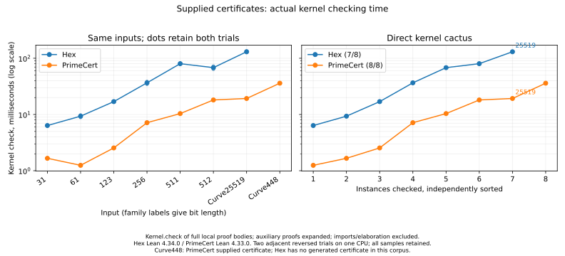

# Primality certificate replay

Hex checks all eight supplied certificates faster than PrimeCert in this
comparison, including every one of the 32 adjacent pairs. Curve25519 takes
**5.18 ms versus 14.42 ms**; Curve448 takes **10.17 ms versus 35.21 ms**.
The margins range from **1.11× to 3.46×**. These are observations on a shared
host, with a small, structured corpus.

PrimeCert uses compact certificates with the same selected Pocklington factors
as Hex, including its certified sieve API for table leaves above 997.
Curve448 is a supplied-certificate comparison: Hex's automatic construction
profile still exhausts on its root factorization.

## Complete-proof measurements

| Input | Hex kernel (ms) | PrimeCert kernel (ms) | PrimeCert / Hex |
|---|---:|---:|---:|
| family-31 | 0.524 | 0.579 | 1.11× |
| family-61 | 0.470 | 0.774 | 1.65× |
| family-123 | 0.731 | 1.553 | 2.12× |
| family-256 | 1.244 | 3.234 | 2.60× |
| family-511 | 2.627 | 6.731 | 2.56× |
| family-512 | 3.132 | 10.033 | 3.20× |
| Curve25519 | 5.178 | 14.419 | 2.78× |
| Curve448 | 10.166 | 35.211 | 3.46× |

Each figure is the median of four samples. The runner automatically selects a
CPU, alternates adjacent Hex/PrimeCert and PrimeCert/Hex pairs, and retains
every completed sample with host load, complete source, hashes, toolchains,
and implementation diffs. The
[complete record](bench-results/hex-primality-small-replay/hex-compact-primecert-sieve-kernel.json)
contains all 64 checks. No sample was discarded or unchanged run repeated.

Both systems check complete local proof bodies after expanding local auxiliary
definitions and opaque theorems. Each timed call creates a fresh kernel checker
and verifies the proof against its declared goal; pending asynchronous checks
are drained beforehand. False-equality and corrupted-subject controls must fail.
A further Hex control changes only a witness base to zero, preserving the
subjects and factor product; all 32 instances reject it.
Imports, construction, literal elaboration, and auxiliary expansion are outside
this timer. Imported library theorems remain dependencies in both systems.

Hex uses Lean 4.34.0; the unmodified PrimeCert checkout is commit `7d3a2de`,
using its pinned Lean 4.33.0. These are complete-package measurements, not an
isolated comparison on an identical kernel. The earlier
[identical `powDiv` calibration](bench-results/hex-primality-kernel-power-comparison-issue-10268.json)
measured 2.02 and 2.07 ms on those kernels; this calibrates that computation,
not every possible version difference. Native decision and complete fresh
builds are measured separately in the
[construction report](hex-primality-construction.md); its timings predate these
kernel improvements.



## Acknowledgements

The kernel accumulator adapts Bhavik Mehta's `powModK` in PrimeCert, developed
with help from Joachim Breitner. PrimeCert's Pocklington implementation and
certificate framework also reflect substantial work by Kenny Lau. The
comparison uses their public implementations and keeps their source notices.

## Why replay is faster

- `HexArith.powModNat` uses direct recursors and fixed windows: six bits through
  `2^64`, four through `2^512`, three through `2^1024`, and narrower windows or
  a binary accumulator above that. The larger-input policy follows
  [lean4#15167](https://github.com/leanprover/lean4/pull/15167). The six-bit
  small-modulus policy is supported by the retained small-window experiments,
  including separate bases `2`, `97`, and `n - 2` in
  [the held-out window profile](bench-results/hex-primality-small-replay/hex-small-window-heldout-profile.json).
  The submillisecond 31-bit certificate also measures substantial checker
  overhead; the window profile isolates the arithmetic choice. The certificate corpus does
  not independently measure the policy above 512 bits.
- `boundedPowMul` checks powers of two by shifting the bound before constructing
  the shifted accumulator. Other powers keep early bounded multiplication.
  The new definition equals the original loop for every input.
- `pockProduct` combines positive factor powers using zero as an overflow
  sentinel. Exponent-one factors need one multiplication and a bound check.
  Its equivalence with `certProduct` requires positive subjects; the parent
  checks that condition first and cannot accept the zero sentinel. Large
  exponents still abort without constructing their full powers.
- Table lookups and arithmetic comparisons use primitive Nat operations.
  Subject ordering uses a direct list fold, and certificate traversal uses
  `PrimeCert.rec` rather than generated course-of-values recursion.
- `checkWitnesses` shares the Fermat leg for adjacent equal bases. The first
  entry always computes it; a changed base starts a new group. The equality
  with independent per-entry checks is proved for every input, including
  degenerate moduli and malformed factor entries.

The public checkers retain their accepted results. Their kernel specifications
are `noncomputable`; proved `@[csimp]` equalities redirect compiled calls to
the runtime twins. Compiled modular arithmetic
still uses Montgomery dispatch and the original Nat fallback; compiled bounded
multiplication and certificate traversal keep their original algorithms. Search
budgets, witnesses, and the exact Curve25519 suggestion remain unchanged. This
is a kernel-replay improvement, not a claim of faster native construction.

## Large-modulus powering

The kernel policy also uses two-bit windows for all reduced bases through
`2^2048`, and one-bit windows for small bases above `2^4096` without an
exponent-length cutoff. This matches the current policy in draft lean4#15167.
The certificate comparison above only reaches 512 bits, so the larger
branches have a separate modular-power comparison on Lean 4.34.0:

| Input | Previous policy (ms) | Current policy (ms) |
|---|---:|---:|
| 1536-bit modulus, full-size base, dense exponent | 32.408 | 19.910 |
| 1536-bit modulus, full-size base, mixed exponent | 29.957 | 16.853 |
| 2048-bit modulus, full-size base, dense exponent | 49.218 | 33.507 |
| 2048-bit modulus, full-size base, mixed exponent | 45.190 | 27.605 |
| 8192-bit modulus, base 2, exponent 17 | 0.174 | 0.122 |
| 8192-bit modulus, base 2, exponent 65537 | 0.371 | 0.312 |
| 8192-bit modulus, base 2, exponent `2^63 + 12345` | 1.892 | 1.721 |
| 512-bit control, unchanged dispatch | 2.084 | 2.019 |

These are medians of four adjacent, alternating-order pairs on the shared
host. All 64 kernel checks and both arms' incorrect-result controls passed.
Input construction, references, uniform preparation, and imports are outside
the timer. The previous policy is copied into a separate definition and uses
the same verified loop workers as the current implementation. The
[complete record](bench-results/hex-primality-final-tuning.json) retains every
sample, the generated source, inputs, source hashes, and host context. To
reproduce it, write its `source` to the module path in `command`, set
`HEX_TUNING_SAMPLES` to a new CSV path, and build that module with Lake; select
a CPU automatically as in the other reproduction scripts. An
[import setup failure](bench-results/hex-primality-final-tuning-setup-failure.json)
has no completed timing samples and is retained separately.

This Hex comparison does not measure large-base, short-exponent inputs in the
new two-bit range. The upstream [tuning experiment](https://gist.github.com/kim-em/684d41610eff65c2c3bd410ab89627fc/67c8ba6b1761acd670634f5bf29ecb5964e627e9)
includes short exponents in its calibration corpus.

The compiled runtime, construction budgets, and Curve25519 suggestion remain
unchanged. The local kernel loops are scheduled for removal when Hex upgrades
to Lean `v4.36.0-rc1`, after confirming that lean4#15167 is included. The
replacement must retain Hex's modulus-zero result and its compiler rewrite to
the existing runtime implementation.

## Supplied certificates and coverage

The [compact PrimeCert sources](bench-results/hex-primality-compact-primecert/)
use Hex's selected factor subsets and deterministic small common witnesses.
PrimeCert's `small` method uses imported proofs through 997. Its separate
`PrimeCert.SieveBase` and `PrimeCert.Meta.SieveLookup` modules supply a certified
sieve through one million. The comparator imports them and uses `sieve` for
larger Hex table leaves. Every generated source was built in the unmodified
PrimeCert checkout before timing.

The earlier [Pocklington-leaf comparison](bench-results/hex-primality-small-replay/hex-compact-primecert-six-bit-kernel.json)
measured PrimeCert at 13.98 ms for Curve25519 and 34.11 ms for Curve448;
that alternative was slightly faster than its sieve lookups, and Hex won all
eight inputs there too. Both complete records remain available; their samples
are not pooled. The translator's `--no-sieve` option reproduces that earlier
certificate strategy.

The standalone [Hex Curve448 fixture](../conformance/HexPrimality/Curve448Replay.lean)
imports only `HexPrimality.Cert`. Its construction used supplied root factors
`2`, `641`, `1469495262398780123809`, and `167773885276849215533569`; the normal
bounded construction route handled recursive children and self-checked the
result after 29 semantic attempts. The
[supplied-factor construction record](bench-results/hex-primality-small-replay/hex-curve448-supply.json)
retains the generator and output. Supplying this root factorization does not
increase the automatic construction coverage reported in the manual.

## Standalone Hex fixtures

Source sizes include the complete checker-only proof module. Olean sizes are
the sum of `.olean`, `.olean.private`, and `.olean.server` files when present,
including the pinned axiom diagnostic. Curve25519 uses the legacy file format
and Curve448 uses `module`; these totals identify artifacts rather than compare
certificate compactness.

| Fixture | Non-leaf nodes | Table leaves | Factor entries | Source bytes | Olean bytes (total) |
|---|---:|---:|---:|---:|---:|
| Curve25519 | 3 | 6 | 8 | 1318 | 15256 |
| Curve448 | 4 | 9 | 12 | 1845 | 81720 |

[Artifact hashes and sizes](bench-results/hex-primality-small-replay/fixture-sizes.json)
make the measured fixtures identifiable.

## Reproduction

Prepare the compact PrimeCert sources:

```sh
python scripts/bench/primality_primecert_sources.py \
  reports/bench-results/hex-primality-small-replay/hex-primitive-all-certificate-kernel.json \
  /tmp/compact-primecert
```

Then run the complete comparison (Bash):

```sh
args=()
for source in /tmp/compact-primecert/*.lean; do
  name=${source##*/}
  args+=(--primecert-supplied "${name%.lean}=$source")
done
python scripts/bench/primality_kernel_direct.py \
  reports/bench-results/hex-primality-cactus-native-executable-issue-10268.json \
  --primecert-checkout /path/to/PrimeCert \
  --hex-supplied Curve448=conformance/HexPrimality/Curve448Replay.lean \
  "${args[@]}" --output /tmp/primality-kernel.json --blocks 4
```

The translator is offline benchmark preparation, not part of Hex's construction
route. The Lean build and kernel check validate its untrusted output.

## Retained experiments

All small-checker and tuning records are in
[hex-primality-small-replay](bench-results/hex-primality-small-replay/).
The index identifies failed prototype builds separately; their output is retained
but does not support performance claims. Attribution probes repeatedly check
individual components and are not substitutes for the complete-proof comparison.

Earlier [window-only](bench-results/hex-primality-window-kernel.json),
[window-and-product](bench-results/hex-primality-window-product-kernel.json), and
[base-aware](bench-results/hex-primality-base-aware-combined-kernel.json)
experiments remain available. Their PrimeCert certificates were larger, and
Curve448 was missing from Hex. The base-aware record retains both original
runs, including the slow Curve25519 sample and its one unchanged repeat.
Those historical observations are not pooled with the new implementation or
with the compact PrimeCert comparator.

## Validation

- `lake build`: the full repository and revised manual pass, including the new upstream library.
- Kernel conformance covers every window cutoff, large exponents and bases,
  checked shifts, malformed and overflowing products, initial/repeated/changed
  witness bases, degenerate moduli, exact construction suggestions, and
  checker-only Curve25519/Curve448 proofs.
- Existing HexArith, HexPrimality, and HexIntFactor benchmark verification
  passes within the wrapper's budget (18 seconds on this host).
- The existing HexPrimality oracle freshly emits and checks all 64 cases with
  PARI/FLINT and the independent certificate checker, with no failures.
