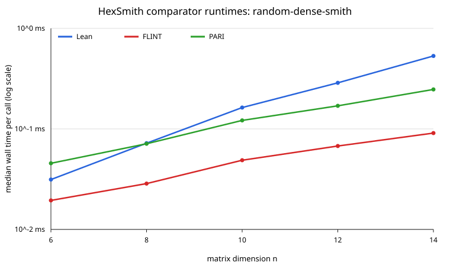
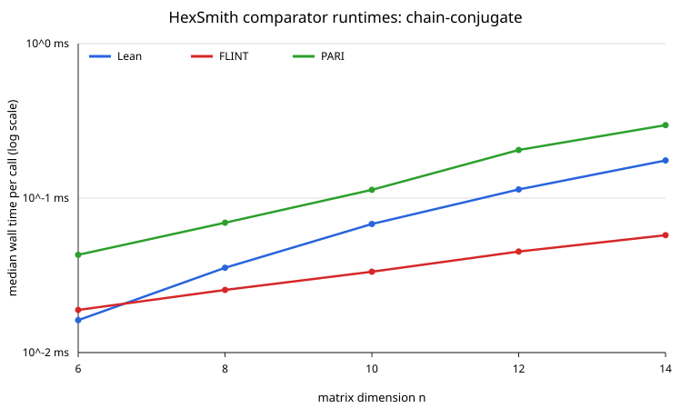
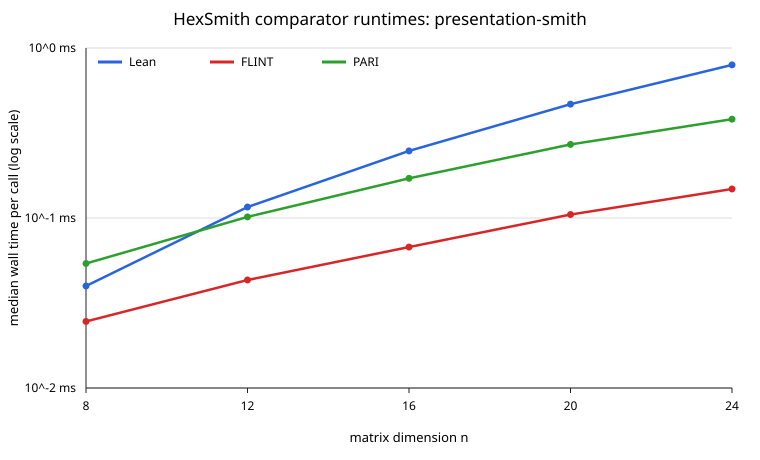

# HexSmith Performance Report

## Bench targets

The compiled Mathlib-free driver is `bench/HexSmith/Bench.lean`. Its adjacent
cost derivations register these parametric targets; the expressions below are
copied from the registration sites.

| target | input and public surface | declared complexity |
|---|---|---|
| `runDense` | square `snf` | `n ^ 3` |
| `runDenseTall` | 2:1 tall `snf` | `n ^ 3` |
| `runDenseWide` | 1:2 wide `snf` | `n ^ 3` |
| `runDenseDeficient` | rank-deficient square `snf` | `n ^ 3` |
| `runChain` | full-rank chain-conjugate `snf` | `n ^ 3` |
| `runChainDeficient` | rank-deficient chain-conjugate `snf` | `n ^ 3` |
| `runPresentation` | square presentation `snf` | `n ^ 3` |
| `runPresentationWide` | wide presentation `snf` | `n ^ 3` |
| `runRank` | `snfRank` | `n ^ 3` |
| `runInvariantFactors` | `invariantFactors` | `n ^ 3` |
| `runData` | transform-producing `snfData` | `n ^ 3` |
| `runSmithBasis` | executable `smithBasis` | `n ^ 3` |
| `runAbelianStructure` | presentation `abelianStructure` | `n ^ 3` |
| `runShape` | prepared-certificate `isSNFShape` | `n` |
| `runCert` | prepared-certificate `snfCert` | `n ^ 2` |
| `runDiagonal` | form-only `snfDiagonal` | `n ^ 2` |
| `runDiagonalGeneral` | general `snf` on the same diagonal | `n ^ 3` |
| `runDiagonalData` | transform-producing `snfDiagonalData` | `n ^ 3` |

The fixed registrations cover Lean, FLINT, and PARI on five common-domain
rungs for each declared family: dense and chain-conjugate dimensions
`#[6, 8, 10, 12, 14]`, and presentation dimensions
`#[8, 12, 16, 20, 24]`. `runFlintOverhead` and `runPariOverhead` are no-work
persistent-driver calibration targets. Every fixed target has an expected
hash obtained from the independent external result. `detDivisor` is the
SPEC's noncomputable uniqueness surface, whose direct minor enumeration is
exponential; it deliberately has no runtime registration.

The deterministic constructor salts are the literal constants in
`bench/HexSmith/Bench.lean`: dense shapes use `11`, `23`, `37`, and `47`;
chain-conjugate row and column operations use `73` and `97`; presentation
entries are a fixed sparse recurrence and have no random seed.

## Verdicts

The scientific run used source commit
`2746306efc1239b7a2cab87e688ddee311257003`, Lean 4.34.0-rc2, LeanBench
0.1.0, and warm-cache compiled execution on `chungus2` (Linux 6.12.100,
x86-64, AMD EPYC 9455 48-Core Processor, 96 logical CPUs). Each registration
used its committed ladder, three outer trials, a 100 ms inner target, a 1.0
spawn-floor multiplier, a 10 s per-call ceiling, and the registration's
committed warmup fraction:

```sh
lake exe hexsmith_bench run \
  Hex.SmithBench.runDense Hex.SmithBench.runDenseTall \
  Hex.SmithBench.runDenseWide Hex.SmithBench.runDenseDeficient \
  Hex.SmithBench.runChain Hex.SmithBench.runChainDeficient \
  Hex.SmithBench.runPresentation Hex.SmithBench.runPresentationWide \
  Hex.SmithBench.runRank Hex.SmithBench.runInvariantFactors \
  Hex.SmithBench.runData Hex.SmithBench.runSmithBasis \
  Hex.SmithBench.runAbelianStructure Hex.SmithBench.runShape \
  Hex.SmithBench.runCert Hex.SmithBench.runDiagonal \
  Hex.SmithBench.runDiagonalGeneral Hex.SmithBench.runDiagonalData \
  --export-file reports/bench-results/hex-smith-phase4-scientific.json
```

The committed export is
`reports/bench-results/hex-smith-phase4-scientific.json`, SHA-256
`a6ec010b4adaa21ff09a41a1caae19889fb6cbe91c45ece3a29e30782964ae4f`.
Every rung cleared the signal filter and every target was consistent with its
declared complexity:

| target | ladder | verdict details |
|---|---|---|
| `runDense` | 4, 6, 8, 10, 12, 14 | consistent; `cMin=144.722`, `cMax=182.384` |
| `runDenseTall` | 3, 4, 5, 6, 8, 10 | consistent; `cMin=345.545`, `cMax=490.888` |
| `runDenseWide` | 3, 4, 5, 6, 8, 10 | consistent; `cMin=292.376`, `cMax=388.543` |
| `runDenseDeficient` | 4, 6, 8, 10, 12, 14 | consistent; `cMin=66.164`, `cMax=95.035` |
| `runChain` | 4, 6, 8, 10, 12, 14 | consistent; `cMin=63.953`, `cMax=74.858` |
| `runChainDeficient` | 4, 6, 8, 10, 12, 14 | consistent; `cMin=54.204`, `cMax=68.982` |
| `runPresentation` | 16, 24, 32, 48, 64, 96 | consistent; `beta=-0.101` |
| `runPresentationWide` | 16, 24, 32, 48, 64, 96 | consistent; `beta=-0.120` |
| `runRank` | 4, 6, 8, 10, 12, 14 | consistent; `cMin=141.694`, `cMax=181.895` |
| `runInvariantFactors` | 4, 6, 8, 10, 12, 14 | consistent; `cMin=141.483`, `cMax=181.643` |
| `runData` | 4, 6, 8, 10, 12 | consistent; `cMin=249.693`, `cMax=356.537` |
| `runSmithBasis` | 4, 6, 8, 10, 12 | consistent; `cMin=402.693`, `cMax=568.100` |
| `runAbelianStructure` | 16, 24, 32, 48, 64, 96 | consistent; `beta=-0.118` |
| `runShape` | 32, 64, 128, 256, 512, 1024 | consistent; `beta=-0.013` |
| `runCert` | 16, 24, 32, 48, 64, 96 | consistent; `cMin=923.803`, `cMax=996.438` |
| `runDiagonal` | 8, 12, 16, 24, 32, 48, 64 | consistent; `beta=-0.123` |
| `runDiagonalGeneral` | 8, 12, 16, 24, 32, 48, 64 | consistent; `beta=-0.055` |
| `runDiagonalData` | 16, 24, 32, 48, 64, 96, 128 | consistent; `cMin=16.223`, `cMax=19.017` |

The internal paired medians in that same export answer the two route-cost
questions. `snfData / snf` rises from 1.494x at `n=4` through 1.721x,
1.792x, and 2.164x to 2.176x at `n=12`. On common diagonal rungs
`n=16,24,32,48,64`, general `snf / snfDiagonal` is respectively
26.622x, 41.731x, 57.803x, 89.429x, and 118.961x; the advantage grows
strongly, proving that the diagonal route bypasses elimination.
`snfDiagonalData / snfDiagonal` is 15.500x, 20.836x, 26.139x, 35.951x,
and 45.764x on those rungs, exposing transform accumulation separately.

The untimed coefficient-growth command was:

```sh
lake exe hexsmith_bench growth \
  > reports/bench-results/hex-smith-phase4-growth.csv
```

Its committed output has SHA-256
`f9a17266194c37a3221cc2124b4c80391fec1f435d6b422861c66542f769a109`.
At `n=12`, peak/output bit widths were 1080/103 for dense square,
857/1 for tall, 1917/1 for wide, and 202/1 for rank-deficient inputs;
chain-conjugate square and rank-deficient inputs were 19/13 and 17/10.
The presentation ladder reached 104/104 bits for square `n=24` and 53/1
for wide `n=24`. The full curve for every preceding rung is in the CSV.

The dense family confirms that the classical pivot loop can grow entries
substantially, but its controlled wall-clock ladders remain stable and
consistent with the declared cubic matrix-update model. That evidence does
not justify adding Kannan--Bachem now. Iliopoulos is also not selected: its
nonsingular-square diagonal-output domain would not serve the required
rectangular, rank-deficient, transform, system, or presentation surfaces.
Presentation growth is modest and the downstream-wide `n=96` route remains
consistent with its declared dense cubic model, so a sparse Smith algorithm
is not a release requirement; it remains future work if downstream sizes make
the measured dense path inadequate.

## Comparator ratios

The registry's exact comparator names are `FLINT fmpz_mat_snf via python-flint`
and `PARI matsnf via cypari2`. FLINT uses python-flint 0.9.0 / FLINT 0.9.0;
PARI uses cypari2 2.2.4 / PARI 2.17.3. Both are informational comparators with
different tuned dispatch policies. The fixed run used five measured repeats
per target and the persistent JSON-line drivers:

```sh
nix-shell -p python313Packages.cypari2 python313Packages.cysignals pari --run '
  export HEX_FLINT_BENCH_PYTHON=/tmp/hexsmith-py/bin/python
  export HEX_PARI_BENCH_PYTHON=/tmp/hexsmith-py/bin/python
  fixed=$(lake exe hexsmith_bench list | awk '\''/\[fixed\]/ {print $1}'\'')
  lake exe hexsmith_bench run $fixed \
    --export-file reports/bench-results/hex-smith-phase4-comparators.json
'
```

The committed 47-target export is
`reports/bench-results/hex-smith-phase4-comparators.json`, SHA-256
`e7761db04969ff47be676e9d6c12a2e66bcaebfed81c01436896dbf01ce348bb`.
All repeats matched their expected hashes. `compare` was also run for each of
the 15 triples by replacing `SPEC` below with every suffix in
`{Dense6,Dense8,Dense10,Dense12,Dense14,Chain6,Chain8,Chain10,Chain12,
Chain14,Presentation8,Presentation12,Presentation16,Presentation20,
Presentation24}`; all 15 reported output agreement:

```sh
lake exe hexsmith_bench compare \
  Hex.SmithBench.runHexSPEC Hex.SmithBench.runFlintSPEC \
  Hex.SmithBench.runPariSPEC
```

The no-work medians were 7.139 us for FLINT and 7.096 us for PARI. All
15 rungs are eligible: each external median is at least twice its own
overhead and every per-call median is below 1 s. Tables give raw and
overhead-adjusted `external / Hex` ratios; subtraction removes only the
constant request/reply floor, so input encoding and external matrix
construction remain charged to the comparator.

### Random dense Smith

| n | Hex | FLINT | PARI | canonical hash | FLINT raw / adjusted | PARI raw / adjusted |
|---:|---:|---:|---:|---|---:|---:|
| 6 | 31.346 us | 19.440 us | 45.506 us | `0xf04520317df0def8` | 0.620x / 0.392x | 1.452x / 1.225x |
| 8 | 72.111 us | 28.574 us | 71.167 us | `0xe4073bf661a3c59a` | 0.396x / 0.297x | 0.987x / 0.889x |
| 10 | 163.096 us | 48.805 us | 121.510 us | `0xf68ae7878c8af87b` | 0.299x / 0.255x | 0.745x / 0.702x |
| 12 | 287.318 us | 67.580 us | 169.683 us | `0x5e971675ada9d783` | 0.235x / 0.210x | 0.591x / 0.566x |
| 14 | 531.633 us | 90.889 us | 246.979 us | `0x699fd5ab6f700da0` | 0.171x / 0.158x | 0.465x / 0.451x |

Both adjusted ratios decline monotonically. At the top rung FLINT is about
6.3x faster and PARI about 2.2x faster. This expected informational divergence
is consistent with tuned external dispatch versus the classical Lean pivot
loop and is not a gating Concern.



### Chain conjugate

| n | Hex | FLINT | PARI | canonical hash | FLINT raw / adjusted | PARI raw / adjusted |
|---:|---:|---:|---:|---|---:|---:|
| 6 | 16.210 us | 18.881 us | 42.941 us | `0x1e5b9e22113b8d71` | 1.165x / 0.724x | 2.649x / 2.211x |
| 8 | 35.404 us | 25.442 us | 69.299 us | `0xb3713c08af9eb87c` | 0.719x / 0.517x | 1.957x / 1.757x |
| 10 | 67.986 us | 33.376 us | 113.114 us | `0xefcb83d9d11c9839` | 0.491x / 0.386x | 1.664x / 1.559x |
| 12 | 113.756 us | 45.092 us | 204.891 us | `0x239317e249e653d3` | 0.396x / 0.334x | 1.801x / 1.739x |
| 14 | 175.284 us | 57.535 us | 296.744 us | `0x049888f934ad3581` | 0.328x / 0.288x | 1.693x / 1.652x |

FLINT's adjusted ratio falls steadily to 0.288x. PARI remains slower than Hex
throughout the adjusted ladder, settling near 1.65--1.75x after `n=8`; the
small reversal at `n=12` is a local constant-factor variation rather than a
change in the overall plateau. Neither informational comparator imposes a
threshold.



### Presentation Smith

| n | Hex | FLINT | PARI | canonical hash | FLINT raw / adjusted | PARI raw / adjusted |
|---:|---:|---:|---:|---|---:|---:|
| 8 | 39.816 us | 24.629 us | 54.000 us | `0x82b42ad65a90f9be` | 0.619x / 0.439x | 1.356x / 1.178x |
| 12 | 116.039 us | 43.189 us | 101.532 us | `0xfc1472e454f53028` | 0.372x / 0.311x | 0.875x / 0.814x |
| 16 | 248.113 us | 67.483 us | 171.184 us | `0x47ef2f14529c425f` | 0.272x / 0.243x | 0.690x / 0.661x |
| 20 | 467.417 us | 104.805 us | 270.881 us | `0x032c9800f08ccd0d` | 0.224x / 0.209x | 0.580x / 0.564x |
| 24 | 795.734 us | 148.168 us | 381.420 us | `0xb281650658ac39a7` | 0.186x / 0.177x | 0.479x / 0.470x |

Both adjusted ratios decline monotonically over the five-rung eligible range;
at `n=24`, FLINT is about 5.7x faster and PARI about 2.1x faster. The trend is
expected for the dense classical route against separately tuned external
implementations and is informational.



## Profile

One representative case was sampled for every `libraries.yml` input family.
The presentation-wide case is the downstream-realistic hot path and belongs
to the family with the worst top-rung comparator gap. All profiles used source
commit `2746306efc1239b7a2cab87e688ddee311257003`, the same host and LeanBench
environment as the scientific run, samply 0.13.1 at 999 Hz, and this command
shape:

```sh
LEAN_BENCH_SAMPLY_HOME=/tmp/lean-bench-samply \
  scripts/profile/run_profile.sh .lake/build/bin/hexsmith_bench TARGET PARAM 5000000000
```

Raw filtered profiles are developer-local under `/tmp` and are not committed,
as required by `SPEC/profiling.md`. Percentages below are derived by
`scripts/profile/summarize_profile.py --thread hexsmith_bench`; the four
required leaf categories classify at least 99.59% of every profile.

### Random dense Smith

`TARGET=Hex.SmithBench.runDense`, `PARAM=14`, seed/salt 11. The filtered
profile `/tmp/hex-profile-runDense-14.json.gz` retained 4129 samples. Leaf
cost was allocation/free 43.01%, GMP 16.23%, Lean runtime 35.19%, Hex own code
5.45%, and other 0.12%.

| inclusive Hex function | share |
|---|---:|
| `Hex.SmithBench.runDense` | 96.83% |
| `Hex.Matrix.snf` | 96.20% |
| `Hex.Matrix.Smith.runFuel` | 96.17% |
| `Hex.Matrix.Smith.reduceFuel` | 75.30% |
| `Hex.Matrix.Smith.clearColumn` | 33.64% |
| `Hex.Matrix.Smith.clearRow` | 15.91% |
| `Hex.Matrix.Smith.findBad?` | 14.87% |

This is the registered dense form-only route. Reduction and row/column
clearing dominate, while GMP and allocation reflect the measured growth of
intermediate integer entries.

```text
calibration residual: 0.902 ms (limit 5 ms)
total timed: 4139.9 ms
retained samples: 4129 (8 rejected outside windows)
sensitivity +/-5 ms: passed
confidence: passed
```

### Chain conjugate

`TARGET=Hex.SmithBench.runChain`, `PARAM=14`, deterministic conjugation salts
73 and 97. `/tmp/hex-profile-runChain-14.json.gz` retained 2922 samples. Leaf
cost was allocation/free 35.69%, GMP 0.00%, Lean runtime 58.80%, Hex own code
5.10%, and other 0.41%.

| inclusive Hex function | share |
|---|---:|
| `Hex.SmithBench.runChain` | 100.00% |
| `Hex.Matrix.snf` | 98.53% |
| `Hex.Matrix.Smith.runFuel` | 98.53% |
| `Hex.Matrix.Smith.reduceFuel` | 59.82% |
| `Hex.Matrix.Smith.findBad?` | 38.36% |
| `Hex.Matrix.Smith.findPivot?` | 34.80% |
| `Hex.Matrix.Smith.clearColumn` | 10.03% |

The registered chain route dominates. Its small coefficients make runtime
dispatch, scanning, and allocation more visible than GMP arithmetic; pivot and
divisibility searches are the main inclusive subpaths.

```text
calibration residual: 1.202 ms (limit 5 ms)
total timed: 2935.5 ms
retained samples: 2922 (9 rejected outside windows)
sensitivity +/-5 ms: passed
confidence: passed
```

### Presentation Smith

`TARGET=Hex.SmithBench.runPresentationWide`, `PARAM=96`, fixed sparse
recurrence with no random seed. `/tmp/hex-profile-runPresentationWide-96.json.gz`
retained 2887 samples. Leaf cost was allocation/free 36.02%, GMP 0.48%, Lean
runtime 62.80%, Hex own code 0.59%, and other 0.10%.

| inclusive Hex function | share |
|---|---:|
| `Hex.SmithBench.runPresentationWide` | 99.97% |
| `Hex.Matrix.snf` | 99.69% |
| `Hex.Matrix.Smith.runFuel` | 99.69% |
| `Hex.Matrix.Smith.reduceFuel` | 54.10% |
| `Hex.Matrix.Smith.findBad?` | 50.68% |
| `Hex.Matrix.Smith.findPivot?` | 44.41% |

The downstream presentation target is directly responsible for the profile.
The sparse input is deliberately routed through the dense v1 engine; repeated
trailing-block scans, not an unregistered preprocessing step, dominate.

```text
calibration residual: 0.600 ms (limit 5 ms)
total timed: 2902.2 ms
retained samples: 2887 (9 rejected outside windows)
sensitivity +/-5 ms: passed
confidence: passed
```

No dominant inclusive cost in any family lies outside a registered target.
`HexSmithMathlib` is a `correspondence-only-layer`: it performs no independent
runtime computation and names `HexSmith` as its Phase-4 performance owner, so
it has no synthetic benchmark or separate report.

## Concerns

None.
