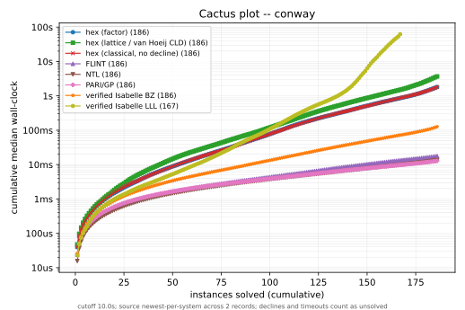

# Cross-system Berlekamp–Zassenhaus factorization sweep

This report documents the re-runnable cross-system factorization benchmark suite
(issue #8545): a publication-quality comparison of hex against FLINT, NTL,
PARI/GP, and two verified Isabelle/AFP factorizers over a multi-family
polynomial corpus, with durable records and cumulative-time ("cactus") charts.

The suite is **explicitly not CI**. No workflow under `.github/workflows/` runs
it; sweeps run manually on dedicated hardware (carica) and their records are
committed. See the
[SPEC/benchmarking.md § Cross-system comparator sweeps](../SPEC/benchmarking.md)
addendum for how this sits beside the one-harness rule: the sweep is a
comparator, not a parallel harness for hex-internal claims.

> **Changing a hex factor path?** Re-measure the hex entries and refresh these
> charts, then show them to the requester — the external comparators do not need
> re-running (the plotter merges records newest-per-system). The exact commands
> and when a full re-measure is required are in
> [`HexBerlekampZassenhaus/SPEC/hex-berlekamp-zassenhaus.md` § Cross-system sweep
> charts](../HexBerlekampZassenhaus/SPEC/hex-berlekamp-zassenhaus.md) and under
> [Reproducing](#reproducing) below.

## Systems

Every measured system runs as a warm persistent process speaking one line
protocol — request `{"coeffs":[...]}` (integer coefficients, ascending degree),
reply `{"ok":true,"result":{"scalar":s,"factors":[{"coeffs":[...],
"multiplicity":m},...]}}`, a decline reply `{"ok":true,"result":null}`, or an
error `{"ok":false,"error":...}`. A decline is counted as unsolved, deliberately
not distinguished from a timeout.

| curve | system | reconstruction | driver |
| --- | --- | --- | --- |
| `hex-factor` | hex | production cost-based hybrid | `hexbz_factor_service --entry factor` |
| `hex-lattice` | hex | van Hoeij CLD knapsack (lattice tier) | `--entry factorLattice` |
| `hex-fast` | hex | proof-facing fast path | `--entry factorFast` |
| `hex-classical-nodecline` | hex | classical recombination to completion/cutoff | `--entry factorClassicalNoDecline` |
| `flint` | FLINT | `fmpz_poly.factor` | `bz_flint_service.py` |
| `ntl` | NTL | `ZZXFactoring` | `bz_ntl_service.cc` |
| `pari` | PARI/GP | `factor` | `bz_pari_service.py` |
| `isabelle-bz` | verified Isabelle | exponential subset recombination | AFP `Berlekamp_Zassenhaus`, `setup_bz_isabelle.sh` |
| `isabelle-lll` | verified Isabelle | polynomial-time direct-LLL | AFP `LLL_Factorization`, `setup_bz_lll_isabelle.sh` |

**Why two verified Isabelle systems.** hex, Isabelle's `Berlekamp_Zassenhaus`,
and Isabelle's `LLL_Factorization` share the same modular front end (Berlekamp
mod p + Hensel lift) and differ only in reconstruction: BZ does exponential
subset recombination; `LLL_Factorization` finds each factor as a short lattice
vector in polynomial time; hex is the van Hoeij CLD knapsack recombination, also
polynomial but over a small lattice (dimension = number of modular factors).
Comparing only against exponential BZ makes "hex beats verified Isabelle" a soft
claim (polynomial beats exponential); adding the verified polynomial-time
`LLL_Factorization` turns it into a verified-poly-vs-verified-poly comparison
isolating the knapsack advantage over direct-LLL.

**The `factorClassicalNoDecline` curve.** Production `factor` declines a
hopeless classical recombination early and routes to the lattice tier. The
`factorClassicalNoDecline` entry (library additions `scaledRecombinationFull` /
`classicalCoreFactorsToCompletion` / `factorClassicalNoDecline`, reusing the
proven recombination loops with the #8530 level-aware tightening removed) instead
runs the full subset enumeration to completion or the wall-clock cutoff. Its
answers are correct where it terminates; where it does not, it times out. This
makes the classical exponential wall visible on the same charts. Production
`factor` and the CI-gated Mathlib proofs are untouched.

### isabelle-lll build spike — passed

The build spike (issue #8545) is confirmed on carica: the AFP `LLL_Factorization`
session builds and code-exports to Haskell, the export theory
`scripts/oracle/bz-lll-isabelle/Hex_LLL_Factor_Export.thy` compiles, and the
built `lll_isabelle` driver agrees with hex, FLINT, NTL and `isabelle-bz` on
every cross-checked instance. The AFP bundles the verified direct-LLL
reconstruction as `one_lattice_LLL_factorization :: int_poly_factorization_algorithm`
(a `typedef` pairing the algorithm with its soundness proof), and
`factorize_int_poly_generic` takes that bundle; the correct composition is
`factorize_int_poly_generic one_lattice_LLL_factorization`, mirroring BZ's
`factorize_int_poly_generic berlekamp_zassenhaus_factorization_algorithm`. Both
Isabelle drivers contribute curves to the recorded sweep below.

## Methodology

- **Corpus.** `bench/corpus/hexbz-factor-corpus.jsonl`, generated deterministically
  by `scripts/bench/gen_factor_corpus.py` (regenerates byte-identically). 391
  instances across 11 families (cyclotomic, cyclotomic-products, swinnerton-dyer,
  sd-products, chebyshev, legendre, laguerre, wilkinson, random-products,
  hoeij-zimmermann, conway), degrees 1–1030. Each record carries
  `expectedFactorDegrees` where known and a deterministic `combined` flag (mix
  doctrine).
- **Conway family (irreducible over ℤ, two-axis).** The `conway` family
  (issue #8557) lifts every entry of the committed Lübeck Conway cache
  (`scripts/oracle/luebeck_conway_cache.json`) to a monic integer polynomial,
  taking the ascending 𝔽_p coefficients (non-negative representatives `0..p-1`)
  verbatim. Each `C_{p,n}` is monic and irreducible over 𝔽_p, and a monic integer
  polynomial irreducible modulo a prime is irreducible over ℤ (its degree is
  preserved because it is monic), so every lift has `expectedFactorDegrees = [n]`.
  This is the recombination worst case (like Swinnerton-Dyer), but the tables
  sweep two axes at once: degree grows with `n` (small primes `p ∈ {2,3,5,7}`, up
  to degree 40) and coefficient height grows with `p` (a lift has height up to
  `p − 1`, so high primes `p ∈ {11,13,97,521,65537}` at low degree load the height
  axis). It also probes hex's own prime selection: if the reducer picks `p`
  itself, `C_{p,n}` is irreducible mod `p` and irreducibility is immediate;
  modulo any other prime it is the full recombination worst case. The 186 lifts
  were confirmed irreducible over ℤ by the sweep's own FLINT/PARI cross-check
  before the labels were trusted.
- **Per-call overhead.** Each system is timed on a trivial input (`x - 1`) over
  21 calls; the median is recorded in the sweep `config` block, per the
  [external-comparator overhead clause](../SPEC/benchmarking.md).
- **Repeats policy.** Median-of-5 when the first real call is under 1 s, single
  call otherwise. Timings are `perf_counter_ns` wall-clock.
- **Cutoff.** Default 10 s per call, parameterized (`--cutoff`) so 60 s / 300 s
  sweeps can be recorded later; each record carries its cutoff so sweeps at
  different cutoffs coexist. On timeout the process is killed, the abandonment
  recorded as `timeout`, and the process respawned.
- **Monotonic early termination.** For the difficulty-monotonic families
  (swinnerton-dyer, sd-products, hoeij-zimmermann, conway) the sweep, by default,
  stops a system after `--early-terminate-run` consecutive timeouts (default 3,
  degree-ordered) and records the remaining higher-degree instances as timeouts
  without running them (`early_terminated: true`, counted as unsolved exactly
  like a real timeout). A solve resets the run counter. For a strictly monotonic
  family this is result-preserving up to at most `run − 1` extra timeouts. For
  conway it is a deliberate approximation — a lifted Conway polynomial is *not*
  strictly monotonic in degree (the reducer's prime choice varies, so
  `factorFast` can time out on C_{2,12} yet solve C_{2,16} in milliseconds), and
  the consecutive-run threshold is what keeps it honest: an isolated prime-lucky
  solve resets the counter and survives, only a long unbroken run of timeouts is
  cut. The committed baseline record below was collected full-fidelity
  (`--no-early-terminate`), so its conway curves include every prime-lucky
  high-degree solve; default runs trade a few such solves for a much shorter
  wall-clock.
- **Statuses.** `ok | declined | timeout | error` — failures are always recorded,
  never dropped.
- **Differential correctness.** Per instance, the factor degree multiset is
  cross-checked against `expectedFactorDegrees` where present and pairwise across
  every system that answered; a mismatch fails the sweep. The sweep therefore
  doubles as a differential-correctness test of hex against the other
  implementations.
- **Mix doctrine.** The `combined` flag caps every family at an equal count
  (spread across its degree range) so the combined cactus plot is a balanced
  mixture rather than dominated by the largest family. Per-family plots use all
  instances.

## Charts

Per system, the cactus plot sorts its solved instances by median runtime and
plots cumulative time (log y) against the number of instances solved (x); a curve
ends at that system's solved count. One SVG per family plus the combined mixture,
regenerated deterministically by `scripts/plots/hexbz-cactus.py` from the
committed sweep JSON.




Per-family figures for the remaining families
(`hexbz-cactus-<family>.svg`, `hexbz-runtime-degree-<family>.svg`) are published
alongside these under `reports/figures/`.

## Recorded sweeps

### carica, 10 s cutoff (2026-07-03, with conway)

- **Artifact:** `reports/bench-results/hexbz-factor-sweep-bc958d84-carica.json`
  SHA-256 `5359fadc55573ea0427827d03248b18a43dbf74d9ce7da25bdd2133776f9af95`
- **Command:**
  `python3 scripts/bench/factor_sweep.py --systems hex-factor,hex-lattice,hex-fast,hex-classical-nodecline,flint,ntl,pari,isabelle-bz,isabelle-lll --cutoff 10 --no-early-terminate --skip-unavailable`
  (full-fidelity: no monotonic early termination, so the conway curves include
  every prime-lucky high-degree solve)
- **Corpus:** `bench/corpus/hexbz-factor-corpus.jsonl`
  SHA-256 `0ef7574769d9161d8e3bda3b8c193b05191d75b4b473279520db4513e533b2df` (391 instances)
- **Env:** host carica, commit `bc958d84` (working tree ahead of it by this
  branch's corpus regeneration; the corpus SHA above is the reproducible pin),
  toolchain `leanprover/lean4:v4.32.0-rc1`, arm64, 24 cores, 2026-07-03T08:22:20Z;
  AFP release `afp-2026-05-29` for both Isabelle systems.
- **Cross-check:** all nine answering systems agree — hex's factor degree
  multisets match FLINT, NTL, PARI/GP, verified Isabelle BZ and verified Isabelle
  LLL on every instance any two solved (differential correctness across 391
  instances, six independent implementations). In particular every one of the
  186 lifted Conway polynomials is confirmed a single irreducible factor of
  degree `n` by every system that solved it.

| system | ok | timeout | declined | error | overhead (µs) |
| --- | ---: | ---: | ---: | ---: | ---: |
| hex-factor | 366 | 25 | 0 | 0 | 35.8 |
| hex-lattice | 363 | 28 | 0 | 0 | 49.0 |
| hex-fast | 198 | 137 | 56 | 0 | 51.0 |
| hex-classical-nodecline | 366 | 25 | 0 | 0 | 50.7 |
| flint | 390 | 1 | 0 | 0 | 30.4 |
| ntl | 390 | 1 | 0 | 0 | 13.4 |
| pari&nbsp;† | 390 | 1 | 0 | 0 | 32.8 |
| isabelle-bz | 370 | 21 | 0 | 0 | 19.5 |
| isabelle-lll | 309 | 82 | 0 | 0 | 17.2 |

† PARI/GP is measured in the companion record below (same corpus SHA and 10 s
cutoff, with the auto-growing-stack driver from #8558); the plotter merges it
into every chart newest-per-system, so its row sits in this table while its
curve is added to every plot.

The C-implementation ceiling (FLINT, NTL, PARI) solves 390/391, all missing only
`hoeij_S9` (Swinnerton-Dyer SD₉, degree 512) at the 10 s cutoff.

**Conway — the prime-selection probe.** All 186 lifted Conway polynomials are
irreducible over ℤ, so this family is a pure recombination stress test. Yet
`hex-factor`, `hex-lattice`, `hex-classical-nodecline`, FLINT, NTL, PARI and
verified `isabelle-bz` each solve **all 186** — because a monic polynomial that
stays irreducible modulo a well-chosen prime is proved irreducible immediately,
with no recombination at all. The family therefore does not stress recombination
so much as *prime selection*: it separates the paths with adaptive prime choice
(everything above) from the two that lack it. `hex-fast`, the proof-facing path
whose bounded prime search can exhaust before finding a prime that keeps the
polynomial irreducible, solves only **82/186** — and, tellingly, its solves are
spread across every degree 1–40, not a clean low-degree prefix: it times out on
`C_{2,12}` yet solves `C_{2,16}` in milliseconds, because difficulty here tracks
the *prime choice*, not the degree. `isabelle-lll`, whose full-degree direct-LLL
lattice grows expensive with degree independently of the modular factor count,
solves **167/186**, timing out on the higher-degree small-prime lifts. This
non-monotonicity is exactly why the sweep's monotonic early termination treats
conway with a consecutive-timeout threshold rather than stopping at the first
timeout (see Methodology).

**The verified-vs-verified headline is the point of the two Isabelle curves.**
On the corpus as a whole the counts are close (hex-factor 366, isabelle-bz 370,
hex-lattice 363, isabelle-lll 309), because the mixture is dominated by easy
instances where exponential recombination is cheap. The interesting signal is
where the reconstruction actually matters — the lattice-stress families, by
maximum degree solved:

| family | hex-lattice | isabelle-bz | isabelle-lll | flint | pari |
| --- | ---: | ---: | ---: | ---: | ---: |
| swinnerton-dyer | **64** | 32 | 16 | 128 | 128 |
| sd-products | **56** | 42 | 16 | 128 | 128 |

On Swinnerton-Dyer, hex's van Hoeij CLD lattice tier reaches degree 64 —
double the reach of verified exponential BZ (32) and four times that of verified
direct-LLL (16). `isabelle-lll` (the full-degree direct-LLL lattice) is the
slowest verified system on every hard family and across the corpus (309/391,
82 timeouts), matching the literature: a full-degree lattice with large entries
is notoriously slow in practice. hex's small knapsack lattice (dimension = number
of modular factors) is the advantage this comparison isolates. On irreducible
cyclotomics the picture inverts — exponential `isabelle-bz` confirms
irreducibility fastest among the verified systems (reaching degree 1030) — an
honest, family-dependent result.

The `hex-classical-nodecline` curve runs the classical recombination to
completion or cutoff with the level-aware early decline disabled, so its 25
timeouts are the classical exponential wall made visible on the same charts (it
never declines — 0 declined — it either completes correctly or times out).
`hex-fast` (the proof-facing path) is the weakest hex tier here. PARI/GP sits
with FLINT and NTL at the C-implementation ceiling — 390/391 overall, reaching
Swinnerton-Dyer and sd-products degree 128 (double hex-lattice's 64, and far
past both verified Isabelle systems). Longer-cutoff (60 s / 300 s) sweeps record
alongside this one, each carrying its own cutoff; the only instance no system
solves at 10 s is `hoeij_S9` (degree 512), and the hardest hoeij-zimmermann
entries fall only to the three C libraries (FLINT, NTL, PARI) — the natural
target for those longer sweeps.

### carica, 10 s cutoff — PARI/GP refresh (2026-07-03)

- **Artifact:** `reports/bench-results/hexbz-factor-sweep-2ad0b2fe-carica.json`
  SHA-256 `110ca4163382266e21adb125130c975662ed75d4dbb7a85278c3f2d94aa09a0b`
- **Command:**
  `python3 scripts/bench/factor_sweep.py --systems pari --cutoff 10 --no-early-terminate --skip-unavailable`
- **Corpus:** `bench/corpus/hexbz-factor-corpus.jsonl`
  SHA-256 `0ef7574769d9161d8e3bda3b8c193b05191d75b4b473279520db4513e533b2df` (391 instances) —
  identical to the full-board record above, so the two merge cleanly.
- **Why a companion record.** The full-board record above measured PARI with the
  pre-#8558 8 MB-stack driver, which errors (rather than factoring) on the two
  largest hoeij instances. This single-system record re-measures PARI with the
  merged auto-growing-stack driver (`cypari2.Pari(size, sizemax)`), which solves
  `hoeij_F630` (degree 630) and leaves only `hoeij_S9` (degree 512) unsolved at
  10 s: 390/391, no errors. The plotter takes the newest measurement of each
  system (guarded by a matching corpus SHA), so this record supplies PARI's curve
  to every chart while the other eight systems carry over from the full-board
  record — the single-system workflow documented under [Reproducing](#reproducing).

## Reproducing

> **Run only the systems that changed — never the whole board.** The plotter
> merges records **newest-per-system** (guarded by a matching corpus SHA), so
> every chart is assembled from whichever record measured each system most
> recently. To add a new comparator or refresh one that changed, run
> `--systems <that-one>` and commit the small record next to the baseline; its
> curve slots into every chart and the other systems carry over untouched. Do
> **not** re-run the expensive external comparators to "add" one — re-running
> FLINT/NTL/PARI wastes an afternoon and the two Isabelle setups rebuild AFP
> session heaps (many minutes each) for no benefit. Full-board runs are for the
> first-ever record on a host or a corpus change, not for incremental additions.

```
# Regenerate the corpus (byte-identical) and confirm:
python3 scripts/bench/gen_factor_corpus.py
python3 scripts/bench/gen_factor_corpus.py --check

# First-ever record on a host (or after a corpus change): run every available
# system at the 10 s cutoff. This is the ONLY time you run the whole board.
python3 scripts/bench/factor_sweep.py --cutoff 10 --skip-unavailable

# Regenerate the charts (default: merge every committed record, newest-per-system):
python3 scripts/plots/hexbz-cactus.py
```

### Adding or refreshing one system — the common case

Each sweep writes a permanent, timestamped record naming every system and its
version. Because the merge is newest-per-system, adding a comparator (e.g.
bringing PARI onto the charts once `cypari2` is installed) or re-measuring the
hex entries after a factor-path change is a **single-system** run against the
same corpus at the same cutoff — the other curves come from the committed
baseline automatically:

```
# Add one external comparator (PARI/GP shown; same shape for any single system):
python3 scripts/bench/factor_sweep.py --systems pari --cutoff 10 --skip-unavailable

# Re-measure just the hex entries as they evolve:
python3 scripts/bench/factor_sweep.py \
    --systems hex-factor,hex-lattice,hex-fast,hex-classical-nodecline \
    --cutoff 10 --skip-unavailable

# Regenerate charts: the fresh record wins for the systems it measured, and every
# other curve carries over from the committed baseline it was last measured in
# (newest measurement per system, guarded by a matching corpus SHA):
python3 scripts/plots/hexbz-cactus.py
```

A single-system record still cross-checks that system's factor-degree multisets
against `expectedFactorDegrees` (present on 384/391 instances), which is the same
oracle every other system was validated against — so a green single-system run is
the differential-correctness check for the system you added, without re-running
the rest. The plotter prints a per-system provenance line (record timestamp and
cutoff) so a mixed-time chart is honest about which curves are fresh; merging
records over different corpora is refused. Keep the cutoff identical across the
records you merge, or the solved-counts are not comparable (the subtitle flags a
mixed cutoff). Commit the fresh record alongside the baseline; both coexist under
`reports/bench-results/`.
