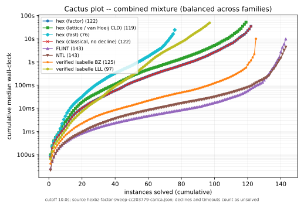
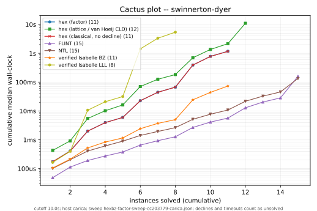
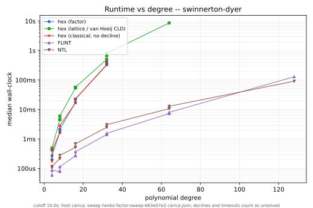
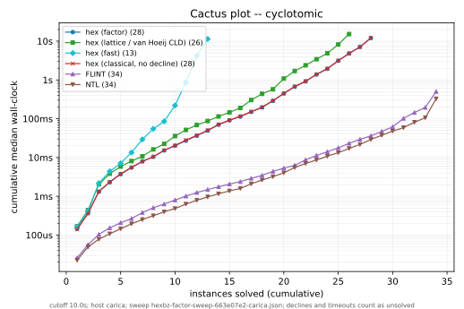

# Cross-system Berlekamp–Zassenhaus factorization sweep

This report documents the re-runnable cross-system factorization benchmark suite
(issue #8545): a publication-quality comparison of hex against FLINT, NTL,
PARI/GP, and two verified Isabelle/AFP factorizers over a multi-family
polynomial corpus, with durable records and cumulative-time ("cactus") charts.

The suite is **explicitly not CI**. No workflow under `.github/workflows/` runs
it; sweeps run manually on dedicated hardware (carica) and their records are
committed. See the
[SPEC/benchmarking.md § Cross-system comparator sweeps](../SPEC/benchmarking.md)
addendum for how this sits beside the one-harness rule: the sweep is a
comparator, not a parallel harness for hex-internal claims.

## Systems

Every measured system runs as a warm persistent process speaking one line
protocol — request `{"coeffs":[...]}` (integer coefficients, ascending degree),
reply `{"ok":true,"result":{"scalar":s,"factors":[{"coeffs":[...],
"multiplicity":m},...]}}`, a decline reply `{"ok":true,"result":null}`, or an
error `{"ok":false,"error":...}`. A decline is counted as unsolved, deliberately
not distinguished from a timeout.

| curve | system | reconstruction | driver |
| --- | --- | --- | --- |
| `hex-factor` | hex | production cost-based hybrid | `hexbz_factor_service --entry factor` |
| `hex-lattice` | hex | van Hoeij CLD knapsack (lattice tier) | `--entry factorLattice` |
| `hex-fast` | hex | proof-facing fast path | `--entry factorFast` |
| `hex-classical-nodecline` | hex | classical recombination to completion/cutoff | `--entry factorClassicalNoDecline` |
| `flint` | FLINT | `fmpz_poly.factor` | `bz_flint_service.py` |
| `ntl` | NTL | `ZZXFactoring` | `bz_ntl_service.cc` |
| `pari` | PARI/GP | `factor` | `bz_pari_service.py` |
| `isabelle-bz` | verified Isabelle | exponential subset recombination | AFP `Berlekamp_Zassenhaus`, `setup_bz_isabelle.sh` |
| `isabelle-lll` | verified Isabelle | polynomial-time direct-LLL | AFP `LLL_Factorization`, `setup_bz_lll_isabelle.sh` |

**Why two verified Isabelle systems.** hex, Isabelle's `Berlekamp_Zassenhaus`,
and Isabelle's `LLL_Factorization` share the same modular front end (Berlekamp
mod p + Hensel lift) and differ only in reconstruction: BZ does exponential
subset recombination; `LLL_Factorization` finds each factor as a short lattice
vector in polynomial time; hex is the van Hoeij CLD knapsack recombination, also
polynomial but over a small lattice (dimension = number of modular factors).
Comparing only against exponential BZ makes "hex beats verified Isabelle" a soft
claim (polynomial beats exponential); adding the verified polynomial-time
`LLL_Factorization` turns it into a verified-poly-vs-verified-poly comparison
isolating the knapsack advantage over direct-LLL.

**The `factorClassicalNoDecline` curve.** Production `factor` declines a
hopeless classical recombination early and routes to the lattice tier. The
`factorClassicalNoDecline` entry (library additions `scaledRecombinationFull` /
`classicalCoreFactorsToCompletion` / `factorClassicalNoDecline`, reusing the
proven recombination loops with the #8530 level-aware tightening removed) instead
runs the full subset enumeration to completion or the wall-clock cutoff. Its
answers are correct where it terminates; where it does not, it times out. This
makes the classical exponential wall visible on the same charts. Production
`factor` and the CI-gated Mathlib proofs are untouched.

### isabelle-lll build spike

`isabelle-lll` is gated behind a build spike on carica (issue #8545). Before it
contributes a curve, confirm that the AFP `LLL_Factorization` session builds and
code-exports to Haskell here, and that the export theory
`scripts/oracle/bz-lll-isabelle/Hex_LLL_Factor_Export.thy` composes the shared
content + square-free front end with `LLL_factorization` (the expected combinator
is `factorize_int_poly_generic LLL_factorization`; adjust against the AFP source
if the release names the reconstruction hook differently). If the spike fails,
`isabelle-lll` is dropped and the suite ships with the other systems; the
verified-poly-vs-verified-poly framing softens accordingly.

## Methodology

- **Corpus.** `bench/corpus/hexbz-factor-corpus.jsonl`, generated deterministically
  by `scripts/bench/gen_factor_corpus.py` (regenerates byte-identically). 205
  instances across 10 families (cyclotomic, cyclotomic-products, swinnerton-dyer,
  sd-products, chebyshev, legendre, laguerre, wilkinson, random-products,
  hoeij-zimmermann), degrees 3–1030. Each record carries `expectedFactorDegrees`
  where known and a deterministic `combined` flag (mix doctrine).
- **Per-call overhead.** Each system is timed on a trivial input (`x - 1`) over
  21 calls; the median is recorded in the sweep `config` block, per the
  [external-comparator overhead clause](../SPEC/benchmarking.md).
- **Repeats policy.** Median-of-5 when the first real call is under 1 s, single
  call otherwise. Timings are `perf_counter_ns` wall-clock.
- **Cutoff.** Default 10 s per call, parameterized (`--cutoff`) so 60 s / 300 s
  sweeps can be recorded later; each record carries its cutoff so sweeps at
  different cutoffs coexist. On timeout the process is killed, the abandonment
  recorded as `timeout`, and the process respawned.
- **Statuses.** `ok | declined | timeout | error` — failures are always recorded,
  never dropped.
- **Differential correctness.** Per instance, the factor degree multiset is
  cross-checked against `expectedFactorDegrees` where present and pairwise across
  every system that answered; a mismatch fails the sweep. The sweep therefore
  doubles as a differential-correctness test of hex against the other
  implementations.
- **Mix doctrine.** The `combined` flag caps every family at an equal count
  (spread across its degree range) so the combined cactus plot is a balanced
  mixture rather than dominated by the largest family. Per-family plots use all
  instances.

## Charts

Per system, the cactus plot sorts its solved instances by median runtime and
plots cumulative time (log y) against the number of instances solved (x); a curve
ends at that system's solved count. One SVG per family plus the combined mixture,
regenerated deterministically by `scripts/plots/hexbz-cactus.py` from the
committed sweep JSON.









Per-family figures for the remaining families
(`hexbz-cactus-<family>.svg`, `hexbz-runtime-degree-<family>.svg`) are published
alongside these under `reports/figures/`.

## Recorded sweeps

### carica, 10 s cutoff (2026-07-03)

- **Artifact:** `reports/bench-results/hexbz-factor-sweep-663e07e2-carica.json`
  SHA-256 `c98c1fa185f7b3a8d1778413efeb58be907c5b05eba8193cc7426f3edb3e3dbb`
- **Command:**
  `python3 scripts/bench/factor_sweep.py --systems hex-factor,hex-lattice,hex-fast,hex-classical-nodecline,flint,ntl --cutoff 10 --skip-unavailable`
- **Corpus:** `bench/corpus/hexbz-factor-corpus.jsonl`
  SHA-256 `02155334449b001b6cf86a3859e7f4fae5a812a2c6810935bebb73163d76e830` (205 instances)
- **Env:** host carica, commit `663e07e2` (clean), toolchain
  `leanprover/lean4:v4.32.0-rc1`, arm64, 24 cores, 2026-07-03T01:35:14Z
- **Cross-check:** all answering systems agree — hex's factor degree multisets
  match FLINT and NTL on every instance all three solved (differential
  correctness across 205 instances).

| system | ok | timeout | declined | overhead (µs) |
| --- | ---: | ---: | ---: | ---: |
| hex-factor | 180 | 25 | 0 | 44.0 |
| hex-lattice | 177 | 28 | 0 | 48.0 |
| hex-fast | 114 | 76 | 15 | 49.5 |
| hex-classical-nodecline | 180 | 25 | 0 | 42.4 |
| flint | 204 | 1 | 0 | 17.2 |
| ntl | 204 | 1 | 0 | 12.6 |

The C-implementation ceiling (FLINT, NTL) solves 204/205, missing only
`hoeij_S9` (Swinnerton-Dyer SD₉, degree 512) at the 10 s cutoff. hex's
production `factor` solves 180; its 25 unsolved are high-degree cyclotomics
(degree ≥ 100) that need a longer cutoff. The `hex-classical-nodecline` curve
runs the classical recombination to completion or cutoff with the level-aware
early decline disabled, so its 25 timeouts are the classical exponential wall
made visible on the same charts (it never declines — 0 declined — it either
completes correctly or times out). `hex-fast` (the proof-facing path) is the
weakest hex tier here, declining 15 and timing out on 76.

This local run covers the systems available on carica; PARI/GP and the two
verified Isabelle/AFP factorizers (`isabelle-bz`, `isabelle-lll`) are added by
re-running with those systems once their drivers are set up (the isabelle-lll
build spike gates its inclusion — see above). Longer-cutoff (60 s / 300 s)
sweeps record alongside this one, each carrying its own cutoff.

## Reproducing

```
# Regenerate the corpus (byte-identical) and confirm:
python3 scripts/bench/gen_factor_corpus.py
python3 scripts/bench/gen_factor_corpus.py --check

# Run a sweep (all locally available systems), 10 s cutoff:
python3 scripts/bench/factor_sweep.py --cutoff 10 --skip-unavailable

# Regenerate the charts from a committed record:
python3 scripts/plots/hexbz-cactus.py --sweep reports/bench-results/<record>.json
```
