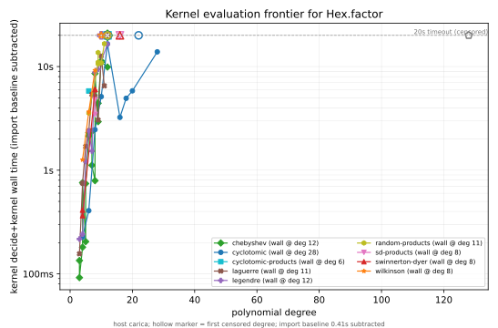

# Kernel-evaluation cost of `Hex.factor` (`decide +kernel`)

With `native_decide` banned, the trusted way to run a hex computation inside a
proof is **kernel reduction** (`decide +kernel`). This report measures that cost
for the factorization algorithm directly: how long the Lean kernel takes to
evaluate `Hex.factor` on each corpus instance, and at what size it stops being
viable.

This is the interim, generator-free half of the `decide +kernel` trusted-checking
curve requested on issue #8545. The full curve (kernel-check an irreducibility
*certificate* per factor) waits on the compiled certificate generators of
[#8552](https://github.com/kim-em/hex-dev/issues/8552); the architecture there is
compiled `factor` + compiled certificate construction, with the kernel only
checking (a) the factors multiply back to the input and (b) each certificate.
This report is the "(a)-shaped" measurement plus the raw cost of running `factor`
itself in the kernel.

Like the cross-system sweep, this is a diagnostic comparator run, **not CI**
(see [SPEC/benchmarking.md § Cross-system comparator sweeps](../SPEC/benchmarking.md)):
it measures the kernel, not a hex-internal performance claim.

## Method

`scripts/bench/kernel_factor_sweep.py`, per corpus instance:

1. Run the *compiled* `Hex.factor` (via the warm `hexbz_factor_service`) to get
   hex's exact `Factorization`.
2. Generate `example : Hex.factor <f> = <that factorization> := by decide +kernel`
   and time a fresh `lean` invocation checking it. Forcing the full equality
   (not just the factor count) makes the kernel normalize every factor
   coefficient, so the wall time is honest end-to-end kernel evaluation — and it
   double-checks that kernel reduction agrees with compiled evaluation on every
   solved instance.

A fixed per-invocation **import baseline** (loading `HexBerlekampZassenhaus.Basic`)
is measured once and subtracted to report marginal kernel time. Limits:
`maxHeartbeats 0` (disabled, so the wall-clock `--timeout` is the sole cutoff)
and a raised `maxRecDepth`. Instances over the timeout are **censored** (status
`timeout`), which on a frontier chart reads as the curve stopping. Each family is
swept in ascending degree and abandoned after 3 consecutive censored points (the
wall has been passed).

Feasibility note: the `factor` call graph has **no `partial def`** (which would
be kernel-opaque), and although it contains 15 well-founded recursions
(`termination_by`, normally reluctant to kernel-reduce), they *do* reduce in
practice. `UInt64`/`ZMod64` arithmetic reduces fine in the kernel (GMP-backed
`Nat` literal reduction), so the finite-field inner loops are not a wall.

## Frontier

<!-- KERNEL-FACTOR-FRONTIER -->



## Reproducing

```
# Frontier probe (fast: low degree cap, tight timeout):
python3 scripts/bench/kernel_factor_sweep.py --max-degree 24 --timeout 40

# Canonical run (all families, ascending degree, early-stop at the wall):
python3 scripts/bench/kernel_factor_sweep.py --timeout 30 --stop-family-after 3

# Chart:
python3 scripts/plots/hexbz-kernel-frontier.py --record reports/bench-results/<record>.json
```
