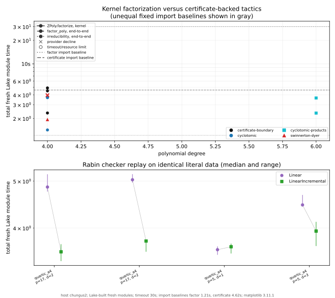

# `ZPoly.factorize` versus certificate-backed factor tactics

This diagnostic compares two trusted-checking shapes for integer polynomial
factorization:

- direct kernel evaluation of `Hex.ZPoly.factorize` against the exact result of
  the compiled factorizer;
- the current `factor_poly` and `irreducibility` tactics, which perform compiled
  search at elaboration time and leave the kernel reified literal witnesses and
  certificates to check.

The committed record is a four-input validation sample, not a full frontier
campaign.  It proves all required paths work on the current provider stack: a
free modular witness, a reducible complete factorization, a multi-prime
certificate, and a clean Swinnerton–Dyer provider decline.  A full corpus run is
still required before claiming a degree/family crossover.

This is a manual diagnostic, not a phase-gating benchmark or CI target.  The
sample validates measurement coverage; only a controlled full-corpus run can
support a performance frontier claim.

## Method and timing labels

For each selected corpus row,
[`kernel_factor_sweep.py`](../scripts/bench/kernel_factor_sweep.py) asks the
warm `hexbz_factor_service` for the exact compiled factorization, then runs
fresh modules through `lake lean`:

1. `Hex.ZPoly.factorize f = <compiled Factorization> := by decide +kernel`;
2. `Hex.ZPoly.Factored f := factor_poly f`;
3. `Hex.ZPoly.Irreducible f := by irreducibility`, only when corpus degree
   metadata and the compiled factorization show that the input itself has unit
   content and one full-degree factor.

The `factor_poly` and `irreducibility` numbers are **end-to-end fresh-module
times**.  They include compiled factor/certificate construction, elaboration,
reification, and kernel checking; they are not kernel-only times.  The record
also carries median import-only baselines for the Mathlib-free factor module
and the certificate umbrella.  Since Lake dependency checking and host cache
state vary between invocations, the report uses total time for the small
sample.  The signed `baseline_delta_nanos` fields are total minus the matching
median import baseline.  They still include parsing, literal elaboration,
instance synthesis, and kernel checking; they are neither pure kernel time nor
clamped to zero when measurement noise makes the delta negative.

For every multi-prime witness an untimed preparation module serializes each
nested Rabin factor and certificate.  The harness verifies both checker shapes
accept it in compiled code, then emits paired modules containing identical
imports and literal data.  Each checker runs three times, with execution order
alternated by case and repeat; the record reports the median and range.  The
only source difference within each pair is
`checkIrreducibilityCertificateLinear` versus
`checkIrreducibilityCertificateLinearIncremental`.  A checker returning false
is an implementation error; timeout and kernel resource limits remain
censored measurements.

Statuses are distinct: `ok`, `provider-decline`, `timeout`, `maxRecDepth`,
`maxHeartbeats`, and unexpected `error`.  Plain-provider decline is coverage
data and marks the boundary at which the bang tactics must use kernel
factorizer replay.

## Validation sample

Record:
[`hexbz-kernel-factor-03b05622-chungus2.json`](bench-results/hexbz-kernel-factor-03b05622-chungus2.json),
SHA-256 `5b58a5fe9c1eb73d4c15ec9b346039402501c6446f9ddcf0e0d351038cbf2cf2`.
The commit/host-qualified name follows the durable-record convention; the
prior schema-1 frontier record remains available in repository history rather
than being relabelled as a current-surface measurement.
The run used Lean `v4.32.0-rc1` on `chungus2` (Linux x86-64), clean commit
`03b05622`, a 30 s per-module timeout, `maxRecDepth = 100000`, and disabled
heartbeats.  Median import baselines were 1.32 s for the direct factor module
and 5.44 s for the certificate-umbrella module.  The corpus hash is
`619913904240834c912489e6cc23ba136e8cc5ebf0ea95f83397e0682387284d`.

| input | role | direct kernel total | `factor_poly` total | `irreducibility` total | witness coverage |
| --- | --- | ---: | ---: | ---: | --- |
| `cyclo_phi5` | irreducible/free | 1.65 s | 4.40 s | 4.00 s | free mod-p, `p = 2` |
| `xpow6_minus1` | reducible | 3.11 s | 4.33 s | not applicable | two free linear and two free mod-p factors |
| `quartic_a4` | irreducible/multi-prime | 2.34 s | 4.48 s | 5.14 s | primes 17 and 5, two degree obstructions |
| `sd2` | expected boundary decline | 2.14 s | decline at 4.56 s | decline at 5.05 s | outside free, Eisenstein, and multi-prime languages |

The direct kernel path remains viable on every sampled degree-4/6 input.  The
certificate path succeeds on all three inputs within its language and declines
cleanly on `sd2`; there are no timeouts, kernel limit failures, or unexpected
errors.  This sample is too small to locate the direct-factorization wall or a
certificate crossover.  Those are outputs of the full command below, rather
than claims inferred from low-degree startup-dominated points.  The figure
therefore plots total time and draws the unequal 1.32 s and 5.44 s import
baselines explicitly; vertical separation between methods is not by itself an
algorithmic-cost comparison.

## Witness-class and decline boundary

The successful factors exercise three provider classes:

| witness class | distinct factors | sample inputs |
| --- | ---: | --- |
| free linear | 2 | `xpow6_minus1` |
| free mod-p | 3 | `cyclo_phi5`, `xpow6_minus1` |
| multi-prime degree obstruction | 1 | `quartic_a4` |
| provider decline | 1 | `sd2` |

The appended `quartic_a4` corpus row is the current multi-prime regression
case: its `{1,3}` and `{2,2}` modular splittings jointly obstruct every proper
integer factor degree, while no single-prime or small-shift Eisenstein witness
exists.  `sd2 = x^4 - 10x^2 + 1` remains deliberately present: every plain
provider declines, so `factor_poly!` or `irreducibility!` must re-run the
factorizer in the kernel for this small balanced input.

## Linear versus incremental Rabin replay

The A4 certificate contains four nested Rabin cases.  Each pair below has the
same literal-data SHA-256 in the JSON record.  Values are median total
fresh-module seconds with the three-sample range in parentheses.  Delta ratios
use the signed median-total-minus-5.44 s-import-baseline fields, which still
include literal elaboration and kernel type checking.  All four deltas are
below baseline in this run: host/cache noise is larger than that derived
signal, which does not mean zero checker work.

| prime | modular factor degree | Linear total | Incremental total | total ratio | baseline-delta ratio |
| ---: | ---: | ---: | ---: | ---: | ---: |
| 17 | 2 | 4.17 s (3.96–4.80) | 2.96 s (2.85–5.10) | 1.41x | below baseline |
| 17 | 2 | 3.99 s (3.86–4.09) | 3.00 s (2.98–3.12) | 1.33x | below baseline |
| 5 | 1 | 3.84 s (2.94–5.02) | 3.52 s (3.41–4.80) | 1.09x | below baseline |
| 5 | 3 | 5.07 s (4.77–5.10) | 4.12 s (4.07–4.23) | 1.23x | below baseline |

The incremental checker has lower median time in all four pairs, with disjoint
ranges on the second `p = 17`, degree-2 case and the `p = 5`, degree-3 case.
The other two ranges overlap.  This is consistent with the incremental
checker's `O(n·p)` work versus the linear checker's `O(Σ p^k)`, but it is not a
general asymptotic measurement because both modules still elaborate and
kernel-check the same literal certificate.  The production certificate path
already uses the incremental checker; this series provides focused empirical
support for that choice against the legacy replay shape.



## Reproducing

```bash
lake build hexbz_factor_service HexBerlekampZassenhausMathlib

# Required-path validation sample.
python3 scripts/bench/kernel_factor_sweep.py \
  --name cyclo_phi5 --name xpow6_minus1 \
  --name quartic_a4 --name sd2 \
  --timeout 30 --rabin-repeats 3 \
  --output reports/bench-results/hexbz-kernel-factor-03b05622-chungus2.json

# Full frontier and coverage campaign. Certificate tactics continue after the
# direct kernel curve reaches its per-family frontier.
python3 scripts/bench/kernel_factor_sweep.py --timeout 60

uv run --with 'matplotlib==3.11.1' \
  python3 scripts/plots/hexbz-kernel-frontier.py \
  --record reports/bench-results/hexbz-kernel-factor-03b05622-chungus2.json
```
