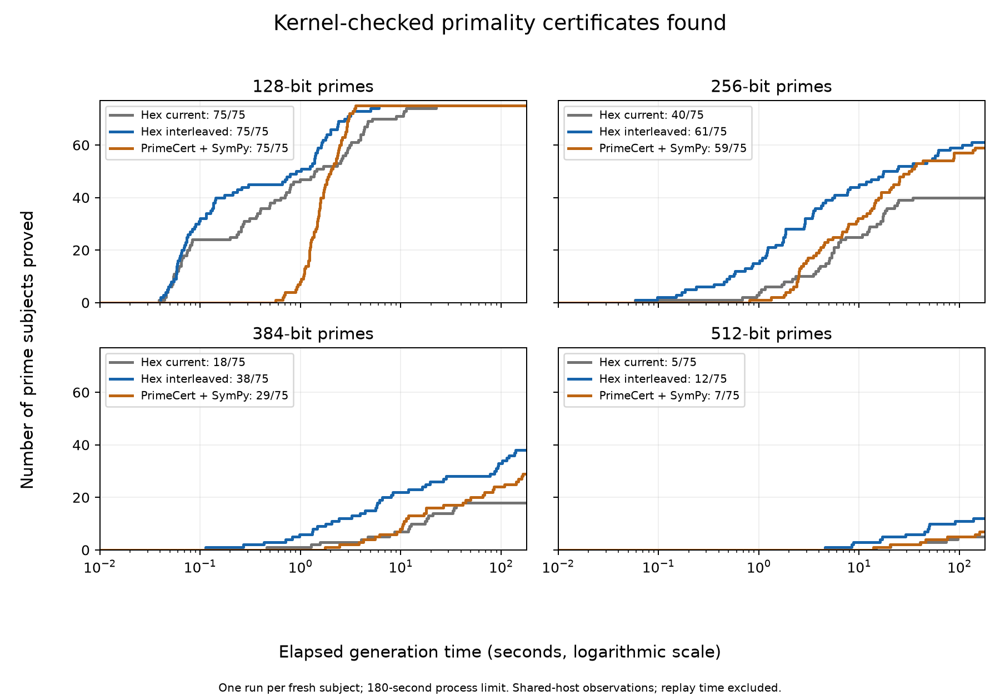

# Interleaved factor search on independent prime subjects

The corrected native Pocklington search proves **186 of 300 fresh primes**
under a 180-second process limit, compared with **138 for current Hex** and
**170 for PrimeCert + SymPy**. Every successful output passes Lean kernel replay.
The experiment also removes the earlier Curve25519 regression and substantially
improves three larger standard field-prime timings. Production defaults remain
unchanged.

Pocklington proves that n is prime using enough certified prime factors of
n−1 and modular identities. These experiments improve the search for those
factors, using Pollard p−1 and elliptic-curve factorization (ECM). The resulting
primality certificates still use Pocklington; this is separate from ECPP.

The `interleaved` experimental policy restores the longer Pollard p−1 searches
that the `balanced` policy omitted. For composite residuals of at most 192 bits,
it tries bounds 262144 and 524288 before ECM. For larger residuals, it tries
eight random ECM curves first, then those p−1 bounds, then the remaining 42
curves of the first round, the existing fixed-parameter round, and the larger
random round. The two parts of the first ECM round share their prepared tables.
Charged factoring attempts share the existing 1024-attempt construction
allowance. Attempts at different bounds have different costs; elapsed process
time supplies the performance measurement. A long search returns one proper
divisor; both pieces stay on the worklist. A failed long
search is remembered by all descendants: for its fixed exponent E, an ancestor
gcd of 1 or the whole ancestor gives a gcd of 1 or the whole divisor on each
descendant. Repeating that search cannot help. A successful split currently
restarts the ladder on its children; reusing the failed prefix is a remaining
optimization, with repeated factors requiring care. No production policy or
public tactic changes.

Curve25519 explains why the larger p−1 bounds matter: proving its primality
requires a recursive prime whose predecessor has factor 31757755568855353.
That factor's predecessor is
`2^3 * 3 * 31 * 107 * 223 * 4153 * 430751`. The existing stage-1 bound 524288
finds it; the shortened ladder ending at 32768 does not. The interleaved policy
finds the same frozen certificate without ECM. CI checks the exact certificate,
its attempt accounting, and factor reconstruction under small resource limits.
ECM's expensive schedules already allocate lazily in the shared implementation;
creating a prepared handle does not enumerate primes.

## Corpus and comparison protocol

`corpus-v3.json` contains 400 independently generated prime subjects: 100 each
at 128, 256, 384 and 512 bits. The first 25 indices of each size are tuning
subjects; the other 75 are validation subjects. SHAKE256 of a fixed domain,
size, index and rejection counter determines each odd candidate. Selection
uses rejection sampling rather than rounding to the next prime. PARI 2.17.3's
unconditional `isprime` verifies every accepted subject. The file includes the
complete generator source and PARI version. Hash-derived candidates are
reproducible; no ideal randomness claim is made.

`corpus-v4.json` supplies a second, disjoint set of 400 subjects using the same
rule and a different domain. The corrected policy is measured on its 300
validation subjects; its 100 tuning subjects remain unused. The original
400-subject run is retained in full, including its policy's repeated failed
searches and discarded recursive factor work. Those defects affect cost and
coverage, not checker soundness. Results from those two policy versions are
reported separately. In total, 700 distinct hash-derived subjects were measured.

Validation reproduces each selected subject and checks exact Miller–Rabin
compositeness witnesses for every earlier rejected candidate. It cannot skip an
earlier prime and choose a more favorable later subject. The accepted subjects'
primality is attested by the independent PARI generator; each successful proof
reported here additionally passes Lean kernel replay.

Generation supplies no predecessor factors, witnesses or certificates. No
factor-search policy runs while choosing subjects. The corpus is frozen before
measurement. The candidate's source and executable are frozen before validation;
validation outcomes do not select bounds or schedules for this version.

The offline runner accepts `--corpus` and `--split`. Every subject/profile pair
receives the same 180-second process limit. Profiles run adjacent on one automatically leased
CPU; order reverses across subjects and across timing trials. Executables are
copied and hash-checked before each native sample. The corrected runs also freeze
and hash-check the exact unmodified PrimeCert Python generator. Completed
samples, exhaustion, errors and timeouts all remain in the report. Host activity
is recorded context.
The four-block standard-field comparison supplies repeated paired timings;
the one-trial random-prime sweep measures bounded coverage. Generation excludes
Lean elaboration and kernel replay. PrimeCert generation includes its ordinary
Python/SymPy startup and uses the unmodified pinned upstream generator.

The replay script links every positive sample to its exact generated term.
Hex literals become probes under
`bench/HexPrimalityMathlib/ProofProbe/FactorCorpus/`, built by the existing
`HexPrimalityMathlibProofProbe` CI target. PrimeCert terms are built separately
against their pinned upstream environment. Both routes guard their theorem
axioms to `propext`, `Classical.choice` and `Quot.sound`.

Reproduce corpus generation with:

```sh
python3 scripts/bench/primality_factor_corpus.py --gp /path/to/gp --output /tmp/corpus.json
```

Add `--domain hex-pocklington-corpus/v2` to reproduce the second corpus.

The corrected comparison uses a subject-derived Hex seed. It does not measure
variation over seeds. The baseline runs the current core-first dispatch followed
by its registered-provider retry; the experiment runs one combined-provider
pass. The result compares complete policies, including their different
preliminary factoring, stopping conditions and dispatch. It does not isolate
ECM interleaving, and registering this provider as a fallback would not reproduce
these timings. Production selection still needs multiple seeds and the actual
proposed public-tactic dispatch.

PrimeCert is unmodified commit
`0803c2f6bd289c09704c7d352bb8fcf770cbb9b2`, using SymPy 1.14.0. Its literal
proofs replay on its pinned Lean 4.33.0 and Mathlib; Hex uses Lean 4.35.0-rc3.
PrimeCert's repeated Python/SymPy subprocess startup is included in generation.
The common outer limit stops the process group at 180 seconds, before the
generator's longer internal GNU `factor` fallback timeout. Dependency builds
and kernel replay are outside the measured interval.

Reproduce a validation sweep with:

```sh
python3 scripts/bench/primality_factor_experiment.py \
  --corpus reports/primality/factor-policy/corpus-v4.json --split validation \
  --mode construct --profiles baseline interleaved primecert \
  --primecert /path/to/pinned/PrimeCert --jobs 16 --output /tmp/validation.json
```

## Fresh validation results

`validation-v4.json` contains one automatic run per system on each of 300 fresh
subjects, with 75 at each size. All successful outputs passed the separate Lean
kernel replay. No predecessor factors, witnesses or curves were supplied.

| Bits | Current Hex | Interleaved Hex | PrimeCert + SymPy |
| --- | --- | --- | --- |
| 128 | 75/75 | 75/75 | 75/75 |
| 256 | 40/75 | 61/75 | 59/75 |
| 384 | 18/75 | 38/75 | 29/75 |
| 512 | 5/75 | 12/75 | 7/75 |

On this cohort, the experiment proves 186 subjects, compared with 138 for
current Hex and 170 for PrimeCert + SymPy. Its coverage exceeds PrimeCert's at
256, 384 and 512 bits under the common process limit. This is bounded coverage
on these subjects, not a success probability or a general speed guarantee.



The plot includes the whole generation process, including startup and output
formatting. It excludes kernel replay. Each curve is a set of single-run
observations on the shared host; it does not replace paired repeated timings.

The successful sets differ. Five subjects proved by PrimeCert are missed by the
experimental policy; twenty-one go the other way. A timeout means the process
limit was reached; exhaustion means the finite native search returned without a
certificate. Neither establishes mathematical impossibility.

| Bits | Both interleaved Hex and PrimeCert | Hex only | PrimeCert only |
| --- | --- | --- | --- |
| 128 | 75 | 0 | 0 |
| 256 | 57 | 4 | 2 |
| 384 | 27 | 11 | 2 |
| 512 | 6 | 6 | 1 |

All outcomes remain in the data:

| Bits | Profile | Proved | Exhausted | Timeout | Error |
| --- | --- | --- | --- | --- | --- |
| 128 | baseline | 75 | 0 | 0 | 0 |
| 128 | interleaved | 75 | 0 | 0 | 0 |
| 128 | primecert | 75 | 0 | 0 | 0 |
| 256 | baseline | 40 | 35 | 0 | 0 |
| 256 | interleaved | 61 | 12 | 2 | 0 |
| 256 | primecert | 59 | 0 | 16 | 0 |
| 384 | baseline | 18 | 57 | 0 | 0 |
| 384 | interleaved | 38 | 21 | 16 | 0 |
| 384 | primecert | 29 | 0 | 46 | 0 |
| 512 | baseline | 5 | 68 | 2 | 0 |
| 512 | interleaved | 12 | 12 | 51 | 0 |
| 512 | primecert | 7 | 0 | 68 | 0 |

## Standard field-prime timings

`fields-v4.json` contains four adjacent baseline/interleaved blocks per subject,
in alternating orders. The two time columns are medians of four completed runs;
the ratio is the median of the four within-block baseline/interleaved ratios.
All subjects succeeded in both arms. Every repeated output is kernel-linked.

| Subject | Current Hex (s) | Interleaved Hex (s) | Median paired ratio |
| --- | --- | --- | --- |
| Curve25519 | 0.826 | 0.849 | 0.92 |
| secp256k1 | 37.921 | 35.575 | 1.10 |
| P-256 | 0.066 | 0.065 | 0.98 |
| P-384 | 55.438 | 2.396 | 23.14 |
| Curve448 | 32.588 | 4.978 | 7.00 |
| P-521 | 2.618 | 0.293 | 9.15 |

The earlier threefold Curve25519 regression is removed: both corrected policies
are near 0.85 seconds on this host, with an identical certificate. The paired
ratio is slightly below one; this is not evidence of a Curve25519 speedup.
P-256 is dominated by startup, and secp256k1 shows only a modest change.
P-384, Curve448 and P-521 improve substantially in these repeated comparisons.
These loaded shared-host observations retain every run. Absolute times from
older field reports should not be compared with these runs as a paired result.
The archived field reports retain a generic protocol sentence referring to the
older eight-prime corpus; their explicit case lists and commands specify the
six standard field primes used here.

## Retained preliminary policy

The original policy is preserved in `fields-v3.json`, `tuning-v3.json` and
`validation-v3.json`, with full source and executable hashes. It repeated failed
long p−1 searches after ECM splits and discarded recursive work after some long
splits. The corrected policy preserves both pieces and inherits failed-search
information. Each version's validation corpus was frozen before its results
were inspected. Their different subjects and host conditions prevent a paired
before/after comparison between versions.

| Split | Bits | Current Hex | Preliminary interleaved Hex | PrimeCert + SymPy |
| --- | --- | --- | --- | --- |
| Tuning | 128 | 25/25 | 25/25 | 25/25 |
| Tuning | 256 | 12/25 | 17/25 | 18/25 |
| Tuning | 384 | 3/25 | 7/25 | 7/25 |
| Tuning | 512 | 1/25 | 6/25 | 5/25 |
| Validation | 128 | 74/75 | 75/75 | 75/75 |
| Validation | 256 | 48/75 | 60/75 | 61/75 |
| Validation | 384 | 16/75 | 36/75 | 28/75 |
| Validation | 512 | 3/75 | 15/75 | 8/75 |

All generated successes in these retained experiments are also included in the
complete kernel replay manifest. The original three-arm field experiment has
four reversed-order trials; the corrected two-arm experiment above supplies the
adjacent paired timing comparison. No completed pilot sample is discarded.

## Exact replay and reproduction

`corpus-replay-v3.json` links all 1264 positive samples across the five new
reports to 473 distinct Hex certificate literals and 397 distinct PrimeCert
terms. All passed Lake builds with guarded axiom lists containing only
`propext`, `Classical.choice` and `Quot.sound`. The manifest records report,
source and build-log hashes, exact commands and the upstream environment. The
matching `.hex.log` and `.primecert.log` files retain the build output. These
links supplement the older experiments' replay manifests.

CI builds every generated Hex probe through `HexPrimalityMathlibProofProbe`,
requires the complete manifest, checks all positive links and both corpora, and
checks the exact regenerated Curve25519 and Curve448 certificates. Resource
tests verify reconstruction at small allowance cutoffs, retention of repeated
factors and inheritance of a failed long p−1 search.

```sh
lake build hexprimality_factor_experiment HexPrimalityMathlibProofProbe
python3 scripts/ci/check_primality_factor_replay.py
python3 -m unittest scripts/bench/test_primality_factor_corpus.py
```

For historical measurements, restore the source snapshots and dependency
revision recorded in that report. Current sources include stronger regression
tests and metadata fixes; those changes do not alter the measured policy. Run
new measurements into new output paths. To replay their exact outputs:

```sh
python3 scripts/bench/primality_factor_replay.py \
  --reports /tmp/validation.json --output /tmp/replay.json \
  --primecert /path/to/pinned/PrimeCert
```

This regenerates the corpus probe directory; keep measured reports and their
manifest together when replacing that evidence. The plot generator accepts a
complete report and its successful replay manifest:

```sh
uv run --with matplotlib python3 scripts/bench/primality_factor_plot.py \
  --report reports/primality/factor-policy/validation-v4.json \
  --manifest reports/primality/factor-policy/corpus-replay-v3.json \
  --output /tmp/coverage.png
```

## Complementary upstream cases

[PrimeCert's example certificates](https://github.com/b-mehta/PrimeCert/blob/0803c2f6bd289c09704c7d352bb8fcf770cbb9b2/PrimeCertTest/PrimeListTest.lean)
provide named examples and intermediate recursive primes.
[Math::Prime::Util's proof tests](https://github.com/danaj/Math-Prime-Util-GMP/blob/master/t/16-provableprime.t)
exercise several proving methods, but explicitly filter some subjects to remove
slow cases; they are unsuitable as the sole performance sample.
[FLINT's ECPP tests](https://github.com/flintlib/flint/blob/main/src/ecpp/test/t-prove.c)
provide a random-prime and corrupted-certificate testing pattern.
[Feitsma–Galway's pseudoprime tables](https://www.cecm.sfu.ca/Pseudoprimes/)
provide composite rejection controls, not successful-proof benchmarks.

The earlier corpus's discriminant-based “difficult” stratum describes ECPP
search, not Pocklington factorization difficulty.
